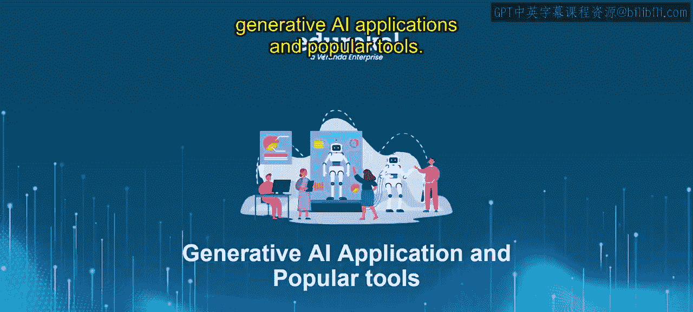
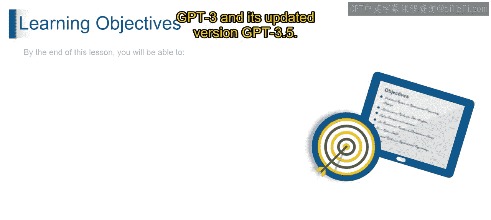

# 第二三四部分 114：使用ChatGPT API开发聊天机器人 🚀

在本节课中，我们将学习如何利用OpenAI的ChatGPT API来构建一个属于自己的聊天机器人。我们将从理解核心概念开始，逐步深入到具体的代码实现。

## 概述

生成式AI，特别是大型语言模型，正在改变我们与机器交互的方式。通过本课的学习，你将掌握使用GPT-3及其升级版GPT-3.5等前沿技术，并了解如何实际应用Rasa、Chatbot和OpenAI等强大工具。

上一节我们介绍了生成式AI的基础概念，本节中我们来看看如何将其付诸实践，开发一个功能性的聊天机器人。

## 核心概念与准备工作

要开发聊天机器人，首先需要理解API（应用程序编程接口）的概念。简单来说，API允许你的程序与OpenAI的服务器通信，发送请求并接收模型生成的响应。

核心的交互过程可以用一个简单的公式表示：

**用户输入 -> API请求 -> GPT模型处理 -> API响应 -> 机器人回复**

在开始编码前，你需要完成以下准备工作：

以下是创建聊天机器人前的必要步骤列表：

1.  **获取API密钥**：访问OpenAI平台，注册账号并创建API密钥。
2.  **安装必要库**：在Python环境中安装OpenAI的官方客户端库。命令为：`pip install openai`
3.  **设置环境变量**：将你的API密钥设置为环境变量，以确保代码安全。

完成以上步骤后，我们就可以开始编写机器人的核心逻辑了。

## 构建聊天机器人

现在，让我们进入实际的开发阶段。我们将编写一个简单的Python脚本，实现与ChatGPT模型的对话。

首先，需要导入必要的库并设置API密钥：

```python
import openai
import os

# 第二三四部分 从环境变量中读取API密钥
openai.api_key = os.getenv("OPENAI_API_KEY")
```


接下来，定义一个函数来向ChatGPT发送消息并获取回复。以下是构建对话函数的关键步骤：

以下是构建核心对话函数的具体步骤：



1.  使用`openai.ChatCompletion.create`方法发起API调用。
2.  指定使用的模型，例如`gpt-3.5-turbo`。
3.  以消息列表的形式提供对话历史和当前用户输入。
4.  处理API返回的响应，提取出模型生成的内容。

一个基础的实现代码如下：

```python
def chat_with_gpt(user_input, conversation_history=[]):
    # 将用户的新输入添加到历史记录中
    conversation_history.append({"role": "user", "content": user_input})

    # 调用ChatGPT API
    response = openai.ChatCompletion.create(
        model="gpt-3.5-turbo",
        messages=conversation_history
    )

    # 获取模型的回复
    bot_reply = response.choices[0].message.content

    # 将模型的回复也添加到历史记录中，以保持对话上下文
    conversation_history.append({"role": "assistant", "content": bot_reply})

    return bot_reply, conversation_history
```

最后，我们可以创建一个简单的循环来运行我们的聊天机器人：

```python
# 第二三四部分 初始化对话历史
history = []

print("聊天机器人已启动！输入‘退出’来结束对话。")
while True:
    user_message = input("你： ")
    if user_message.lower() == '退出':
        print("机器人： 再见！")
        break

    reply, history = chat_with_gpt(user_message, history)
    print(f"机器人： {reply}")
```

## 总结



本节课中我们一起学习了如何使用OpenAI的ChatGPT API来开发一个自定义的聊天机器人。我们从API的基本概念讲起，逐步完成了环境配置、代码编写和功能实现。你现在已经拥有了一个能够进行连续对话的智能聊天程序基础。

通过实践，你不仅加深了对GPT-3.5等模型应用的理解，也掌握了将生成式AI技术集成到实际项目中的关键技能。