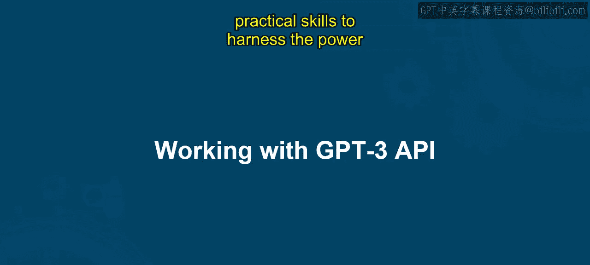
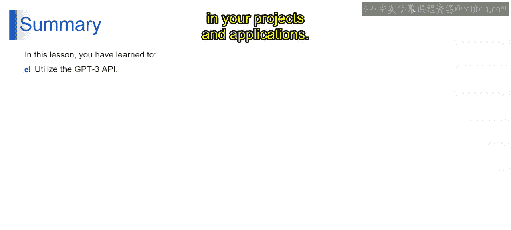

# 第二三四部分 115：使用ChatGPT API 🚀

在本节课中，我们将学习如何利用OpenAI的GPT-3.5 Turbo模型API来构建一个创意故事生成器。我们将从设置环境开始，逐步完成一个能够根据用户输入生成多个创意故事提示的Python程序。

通过本课的学习，你将掌握安全地使用API密钥、调用GPT模型以及处理其响应的核心技能。

---

欢迎来到生成式AI应用与流行工具的沉浸式学习之旅。在本课程中，你将获得宝贵的见解和实践技能，以驾驭最先进的自然语言处理技术的力量，从而革新你的应用程序。准备好开启一段沉浸式学习体验，解锁AI驱动文本生成的新可能性。

在本课结束时，你将获得有效利用GPT-3 API的专业知识，解锁为每个问题生成答案的潜力，并在你的应用程序中利用最先进语言模型的力量。




现在，让我们从一个演示开始。


在这个演示中，你将在GPT-3 API的帮助下，创建一个聊天机器人，根据给定的输入生成创意故事提示。我们使用Python编程语言，因为它语法简单且可读性强。

OpenAI软件包提供了OpenAI API的Python绑定，允许开发者直接从Python代码中轻松地与OpenAI的各种AI模型（包括GPT模型）进行交互。

指定 `openai==0.28` 确保安装此特定版本，这对于与某些代码库的兼容性或确保在不同环境中行为一致非常重要。

---

## 安全配置API密钥 🔑

上一节我们介绍了课程目标，本节中我们来看看如何安全地配置API密钥。以下是实现这一目标的关键代码步骤：

提供的代码片段展示了一种将OpenAI API集成到Python脚本中的安全方法，强调了保护敏感数据（如API密钥）的重要性。

通过导入 `os` 模块，该脚本获得了与操作系统环境变量交互的能力，它利用这一功能来安全地检索OpenAI API密钥。

这是通过 `os.getenv` 函数完成的，该函数获取名为 `OPENAI_API_KEY` 的环境变量的值。

这种方法有效地将敏感凭证与代码库分离，确保它们不会硬编码在源代码中。

这种做法不仅通过防止API密钥在版本控制系统中意外暴露来增强安全性，而且便于密钥管理和部署环境的灵活性。

此外，导入 `openai` 库使脚本能够与OpenAI的API交互，利用其强大的AI模型，同时确保API密钥（此类交互的先决条件）以安全高效的方式处理。

核心代码公式如下：
```python
import os
import openai

openai.api_key = os.getenv("OPENAI_API_KEY")
```

---

## 构建创意提示生成函数 🤖

在安全地设置了API密钥之后，我们现在可以构建核心功能。本节将定义一个Python函数，用于调用GPT-3.5 Turbo模型生成创意响应。

此代码片段定义了一个名为 `generate_creative_prompts` 的Python函数，该函数使用GPT-3.5 Turbo模型从OpenAI API生成创意响应。该函数接受一个 `prompt`（作为AI创意输入的字符串）和一个 `num_responses`（指示要生成多少个创意响应的整数）。

以下是其工作原理的逐步分解：

1.  **函数定义**：`generate_creative_prompts` 被定义为接受一个创意提示和一个指示所需响应数量的数字。
2.  **响应收集**：它初始化一个空列表 `responses` 来收集AI生成的提示。
3.  **循环生成响应**：然后函数进入一个循环，迭代 `num_responses` 次以生成请求数量的创意响应。
4.  **内部生成过程**：在循环内部，它调用 `openai.ChatCompletion.create` 函数，模型参数设置为 `gpt-3.5-turbo`，指定使用GPT-3.5 Turbo模型生成响应。`messages` 参数是一个字典列表，每个字典代表与AI对话中的一条消息。第一条消息将AI的角色设置为创意助手，第二条消息是用户提供的创意想法提示。
5.  **追加响应**：对于每次迭代，它提取生成的消息内容，去除任何前导或尾随的空白字符，并将其追加到 `responses` 列表中。
6.  **返回值**：循环完 `num_responses` 次迭代后，函数返回去除空白后的生成响应列表。

核心函数代码如下：
```python
def generate_creative_prompts(prompt, num_responses):
    responses = []
    for _ in range(num_responses):
        response = openai.ChatCompletion.create(
            model="gpt-3.5-turbo",
            messages=[
                {"role": "system", "content": "You are a creative assistant."},
                {"role": "user", "content": prompt}
            ]
        )
        idea = response.choices[0].message.content.strip()
        responses.append(idea)
    return responses
```

---

## 调用函数并展示结果 📝

我们已经构建了核心生成函数，现在需要调用它并优雅地展示结果。本节将演示如何调用函数并以清晰的格式打印输出。

最后，使用特定的提示（即“生成一个关于神秘岛屿的独特故事创意”）和请求三个响应来调用该函数。变量 `generated_story_ideas` 将保存函数返回的生成创意列表。

此处的代码旨在打印出由 `generate_creative_prompts` 函数生成的每个创意，并以其在序列中的相应数字作为前缀。

其工作原理如下：`for i, idea in enumerate(generated_story_ideas, start=1):`

这段代码启动一个循环，遍历 `generated_story_ideas`（这是前面提到的函数返回的创意提示列表）。这里使用 `enumerate` 函数来跟踪列表中每个项目的索引 `i` 和值 `idea`。通过设置 `start=1`，枚举将从1开始，而不是默认的0，这使得编号在非编程上下文中更加直观（通常列表索引从1开始）。

`print(f"Idea {i}: {idea}")`：这在每次迭代中构造一个格式化字符串，其中 `{i}` 被当前索引替换，`{idea}` 被当前创意的文本替换。然后将此格式化字符串打印到控制台。

输出结果如下：
```
Idea 1: [第一个故事创意文本]
Idea 2: [第二个故事创意文本]
Idea 3: [第三个故事创意文本]
```

这个片段对于以有组织、带编号的列表形式呈现生成的创意特别有用，使用户更容易阅读和评估每一个。演示到此结束。

---

## 课程总结 🎯

在本课中，你通过动手练习和实际示例，学会了如何利用GPT-3 API。

你掌握了使用GPT-3 API的完整流程，从获取API密钥、精心设计提示，到解释生成的文本。

你已经获得了必要的技能，可以在你的项目和应用程序中利用GPT-3的能力。



感谢你的参与，祝你在未来的项目和探索中继续发掘GPT-3的无限可能。我们将在接下来的视频中涵盖下一节内容。


