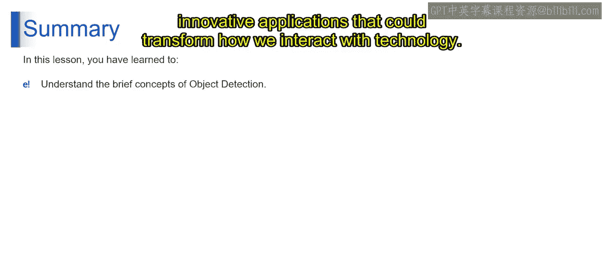

# 第二三四部分 116：什么是目标检测 👁️

在本节课中，我们将要学习目标检测这一计算机视觉核心概念。我们将了解其定义、核心任务以及面临的挑战，为后续深入学习计算机视觉和人工智能应用打下基础。

## 概述

目标检测是一项复杂的计算机视觉技术，旨在识别并定位图像或视频中的物体。它不仅仅是识别物体的存在，更重要的是知道物体是什么以及它在视觉空间中的确切位置。这项能力对于机器与周围环境交互、理解场景并最终模仿人类感知方式执行任务至关重要。

## 什么是目标检测？

目标检测的核心是开发允许机器精确检测和定位物体的算法与技术。这涉及处理海量视觉数据，并理解其中复杂的模式。无论是在拥挤的街景还是宁静的风景中，目标检测算法都致力于精确定位存在的各种物体，从最显眼的到容易被忽视的。

其核心任务可以概括为以下公式：
**目标检测 = 识别(物体类别) + 定位(边界框坐标)**

## 目标检测的挑战

上一节我们介绍了目标检测的基本概念，本节中我们来看看它面临的主要挑战。目标检测的发展之路充满挑战。物体外观的多样性、尺度的变化以及方向的差异，使得目标检测成为一个特别难以攻克的难题。这些因素增加了设计算法的复杂性，要求算法能在不同条件下既准确又高效地识别和定位物体。

以下是目标检测面临的主要挑战：
*   **外观多样性**：同一类物体可能具有不同的颜色、纹理和形状。
*   **尺度变化**：物体在图像中可能以不同的大小出现。
*   **方向差异**：物体可能被旋转或处于不同的视角。
*   **复杂背景**：物体可能被遮挡或与背景混杂。

## 总结与展望

尽管面临挑战，目标检测仍然是一个极具吸引力且激发智力的领域。它处于技术与创造力的交叉点，不仅需要技术能力，还需要深刻理解如何模仿人类视觉和认知的复杂性。

本节课中我们一起学习了目标检测的定义、核心任务及其主要挑战。理解目标检测是通往计算机视觉和人工智能更高级概念的垫脚石。它的目标是为机器配备“看见”的眼睛和“理解”的智能，为可能改变我们与技术交互方式的创新应用铺平道路。

请记住，计算机视觉和人工智能领域在不断演变，保持好奇心是释放其全部潜力的关键。我们将在接下来的视频中继续本节课程。