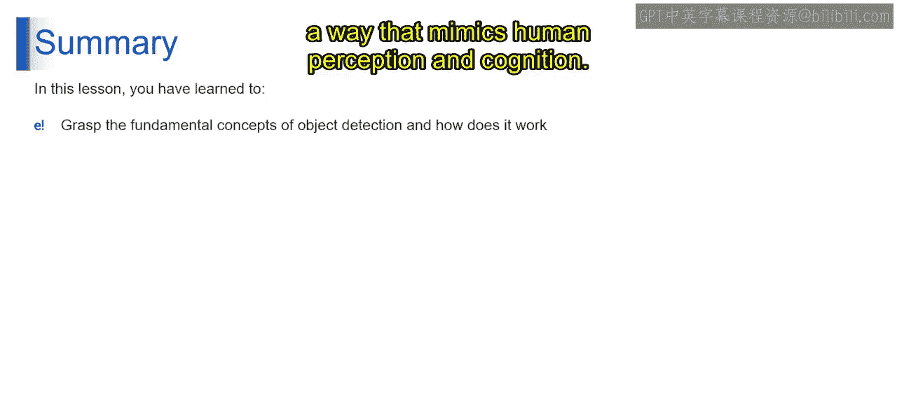

# 第二三四部分 117：目标检测的工作原理 🎯

在本节课中，我们将学习目标检测技术的基本工作原理。目标检测是计算机视觉领域的核心技术，它使机器能够识别和理解图像或视频中的物体及其位置。我们将探讨其核心概念、关键步骤以及从传统方法到深度学习的演变。

---

## 概述

目标检测是计算机视觉领域的一项关键技术，它本身是人工智能的一个专门分支，旨在赋予机器解释和理解来自世界的视觉数据的能力。这项技术不仅仅是识别数字图像或视频中是否存在物体（这项任务被称为分类），还在于精确定位它们在图像空间中的位置和范围（这个过程被称为定位）。这些任务的结合使目标检测系统能够识别单个图像或视频帧中的多个物体，并用一个指定物体空间边界的边界框或矩形轮廓来描绘每个物体。

## 核心任务

目标检测过程主要包含两个核心任务：**分类**和**定位**。

*   **分类**：识别视觉输入（如图像或视频帧）中的物体。这一步对于通过确定存在哪些物体来理解视觉数据的内容至关重要。每个物体根据其外观被分类到预定义的类别中，例如车辆、行人、动物。
*   **定位**：除了识别物体的存在，目标检测还涉及精确定位它们在视野中的确切位置。这通常通过创建**边界框**来实现，这些矩形轮廓指定了每个物体的位置和范围。空间定位可以精确理解物体相对于彼此以及整体场景布局的位置。

## 关键步骤

以下是目标检测流程中的几个关键步骤。

*   **识别感兴趣区域**：目标检测中的一项关键技术是识别**感兴趣区域**。这些是图像中可能包含物体的片段。这个初步步骤将处理集中在特定区域，减少了计算负担并提高了检测过程的效率。
*   **边界框细化**：一旦识别出感兴趣区域，进一步的分析会细化这些区域，以在实际物体周围精确定义边界框。这个细化过程涉及调整初始感兴趣区域的大小、形状和位置，以适应每个检测到的物体的轮廓，从而提高定位和分类的准确性。

## 技术演进

上一节我们介绍了目标检测的核心任务和步骤，本节中我们来看看实现这些任务的技术是如何发展的。

*   **传统基于特征的方法**：在深度学习出现之前，目标检测严重依赖于基于特征的技术。这些方法涉及手动设计和从图像中提取特征，例如边缘、角点、纹理等能指示物体的特征。
*   **深度学习方法**：目标检测的革命主要由深度学习驱动，特别是通过使用**卷积神经网络**。与传统方法不同，深度学习自动化了特征提取过程，通过在大型标注数据集上进行训练，直接从数据中学习最优特征。这导致在各种目标检测任务中的准确性和鲁棒性得到显著提高。

## 总结

本节课中我们一起学习了目标检测的迷人世界。我们了解了它的基本概念、它与机器学习和生成式AI的集成，以及使其成为可能的技术。目标检测不仅仅是识别物体，它关乎理解上下文、解释场景，并以模仿人类感知和认知的方式理解视觉世界。当你继续探索人工智能、机器学习和计算机视觉的前沿时，请记住，理解目标检测是朝着构建智能系统迈出的重要一步，这些系统能够以复杂而有意义的方式观察、理解并与周围世界互动。