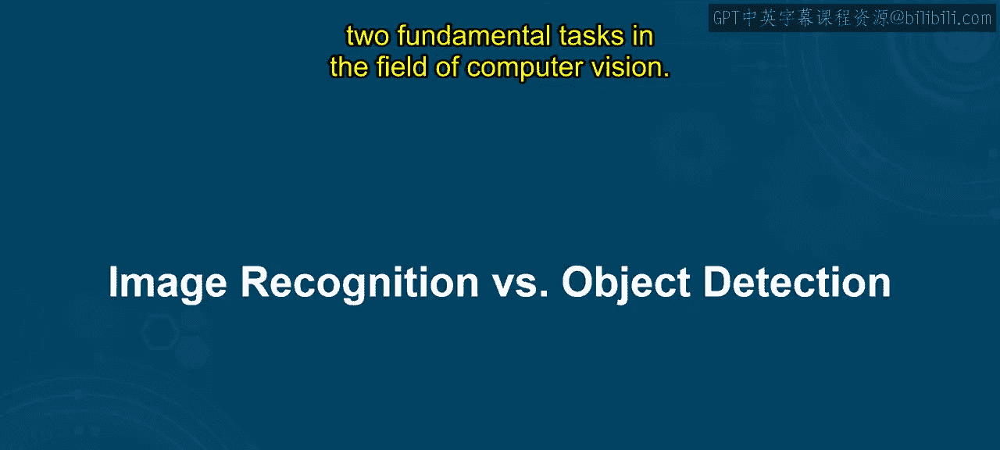
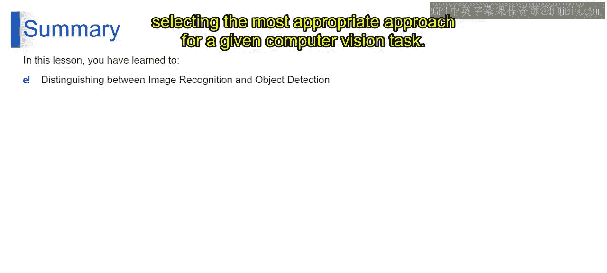

# 第二三四部分 118：图像识别与目标检测 🖼️🔍

在本节课中，我们将深入探讨计算机视觉领域的两个基础任务：图像识别与目标检测。我们将分析它们各自的特点、方法及应用场景，帮助你全面理解两者的区别及其在计算机视觉中的角色。

---

## 理解图像识别

上一节我们介绍了课程概述，本节中我们来看看图像识别。

图像识别，也称为图像分类，其任务是在不提供物体具体位置的情况下，识别图像中的物体。它涉及训练机器学习模型来识别图像中的模式和特征，并将其归类到预定义的类别或标签中。从某种意义上说，图像识别回答的问题是：“图像中存在什么物体？”，而不指明它们的具体位置。

---

## 理解目标检测

了解了图像识别后，我们接下来看看目标检测。

目标检测是一项比图像识别更全面的任务。它不仅识别图像中物体的存在，还提供额外信息，例如将这些物体分类到预定义类别，并为每个检测到的物体提供精确的边界框坐标。这些边界框标明了物体在图像中的确切空间位置和范围。因此，目标检测回答的问题是：“图像中存在什么物体？它们在哪里？”

---

## 核心差异对比

现在，我们来详细比较图像识别与目标检测的关键差异。以下是三个主要区别：

**1. 细节层次**
图像识别与目标检测的主要区别在于所提供的细节层次。图像识别仅专注于识别图像中的物体，而目标检测则通过边界框坐标提供这些物体空间位置的额外信息。

**2. 应用场景**
图像识别通常用于不需要知道物体具体位置的任务，例如图像分类、基于内容的图像检索和场景理解。另一方面，当需要精确定位图像中的多个物体时，目标检测是首选，适用于物体跟踪、计数和理解复杂场景等任务。

**3. 任务复杂度**
由于增加了在图像中定位物体的任务，目标检测通常比图像识别更复杂。它需要算法能够准确检测物体、将其分类，并精确划定其空间边界，通常还需要处理遮挡和尺度变化等情况。

---

## 总结与回顾

本节课中，我们一起学习了图像识别与目标检测。

总而言之，虽然图像识别和目标检测都涉及识别图像中的物体，但它们在提供的细节层次和应用场景上有所不同。图像识别仅专注于识别物体，而目标检测则通过边界框坐标提供这些物体空间位置的额外信息。理解这些差异对于为给定的计算机视觉任务选择最合适的方法至关重要。

感谢你加入我们对图像识别与目标检测的全面探索。希望本节课能让你更深入地理解计算机视觉中的这些基础任务，以及它们在分析和解释视觉数据中的各自角色。请记住，在你继续探索激动人心的计算机视觉领域时，持续探索和实验这些概念。敬请期待后续课程。