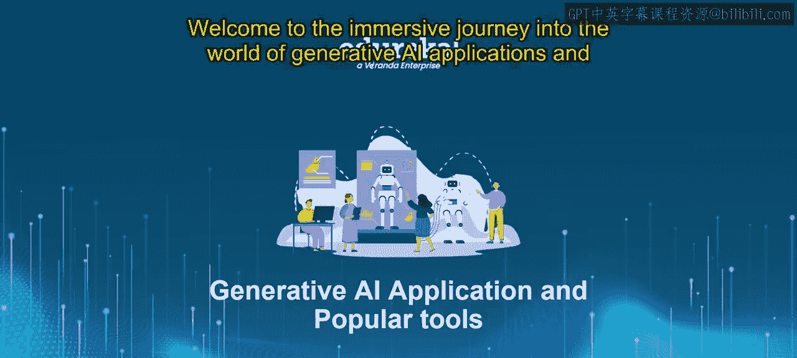

第2：什么是OpenCV 🖼️

在本节课中，我们将学习OpenCV，这是一个用于解决计算机视觉问题的强大Python库。我们将探讨其核心概念、主要功能以及如何与其他库集成，以处理图像和视频任务。

OpenCV，全称为开源计算机视觉库，是一个专门为解决计算机视觉问题而设计的Python库。它提供了广泛的函数和算法，用于简化图像处理、物体检测、面部识别等任务。借助OpenCV，开发者和研究人员能够高效地操作和分析图像与视频，使其成为计算机视觉领域不可或缺的工具。

OpenCV的一个关键优势在于它能与其他流行的Python库（如NumPy和Matplotlib）无缝集成。这种互操作性允许用户结合不同库的优势来完成各种任务。例如，你可以使用OpenCV加载图像，将其转换为NumPy数组以便高效操作，然后使用SciPy等统计库进行进一步分析，或使用Matplotlib进行可视化。

以下是OpenCV的几个关键特性：

**图像加载与操作**
OpenCV简化了图像的加载和操作过程。通过其直观的函数，你可以轻松地从文件读取图像、从视频流捕获帧，并执行调整大小、裁剪、旋转和过滤等操作。

**特征检测与匹配**
OpenCV提供了多种算法，用于检测和匹配图像中的特征。这些特征可能包括角点、边缘、关键点和描述符。特征检测与匹配对于物体识别、图像拼接和运动跟踪等任务至关重要。

**物体检测与识别**
OpenCV提供了预训练模型和算法，用于检测和识别图像或视频流中的物体。这些功能支持广泛的应用，包括面部识别、物体跟踪、手势识别和增强现实。

**与NumPy及其他库的集成**
OpenCV的优势之一在于它能与其他Python库（特别是NumPy）无缝集成。通过将图像转换为NumPy数组，开发者可以利用NumPy的数组处理能力进行高效的操作和分析。此外，OpenCV还能与SciPy（用于高级科学计算）和Matplotlib（用于可视化）等其他库良好协作。

在本节课中，我们一起学习了OpenCV，这是一个用于解决计算机视觉问题的多功能且强大的Python库。其丰富的函数和算法集合，加上与其他库的无缝集成，使其成为研究者和开发者的宝贵工具。借助OpenCV，你可以轻松高效地处理各种图像处理和计算机视觉任务。