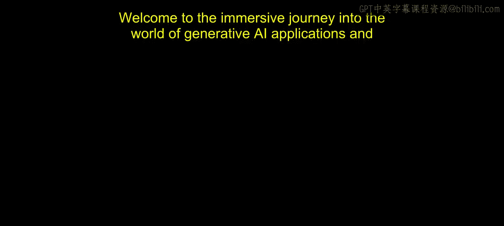
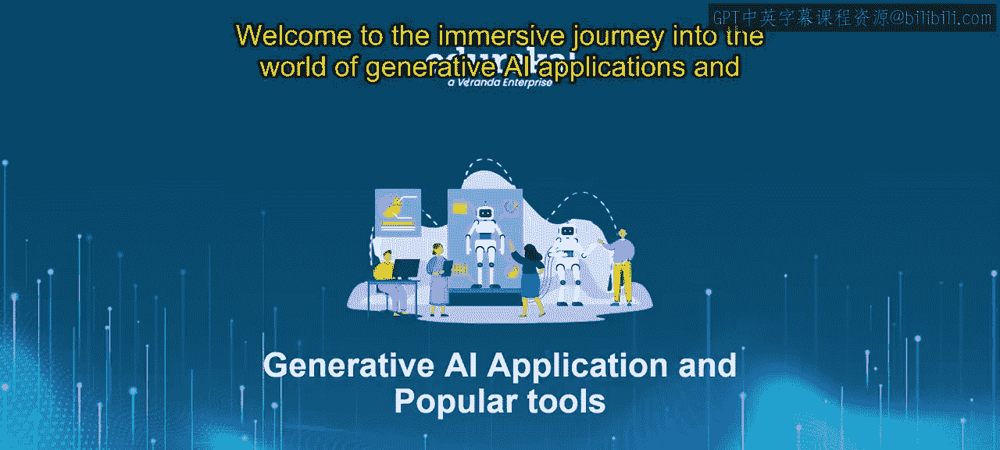
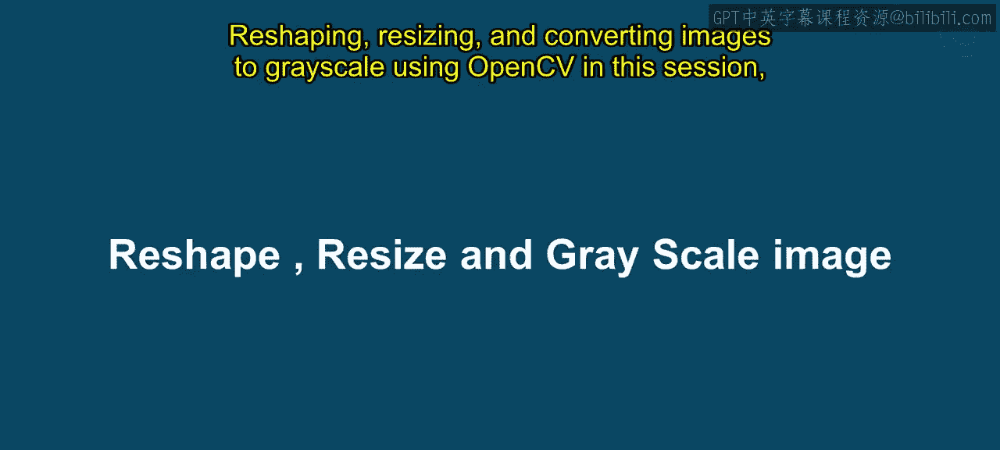
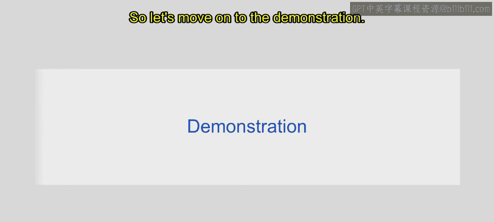
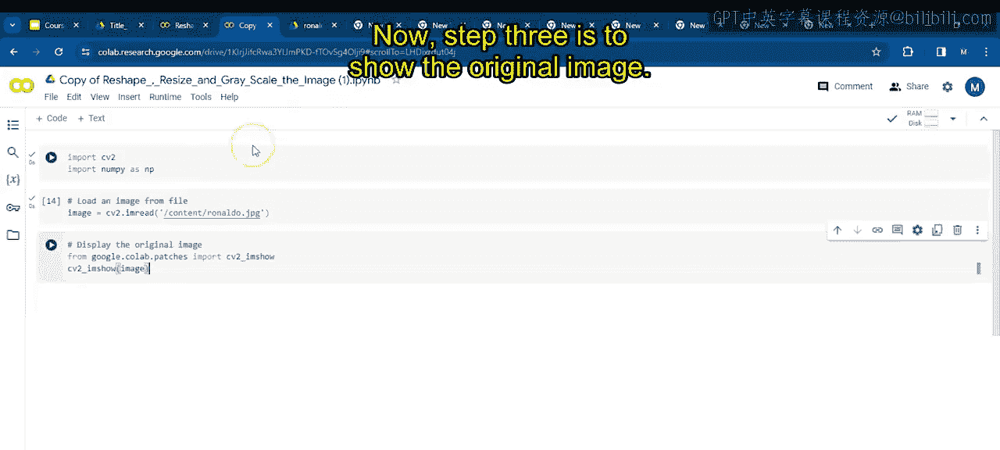
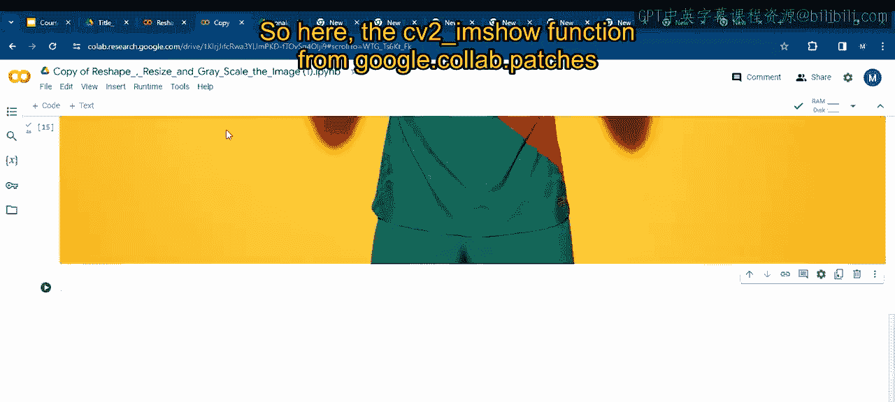
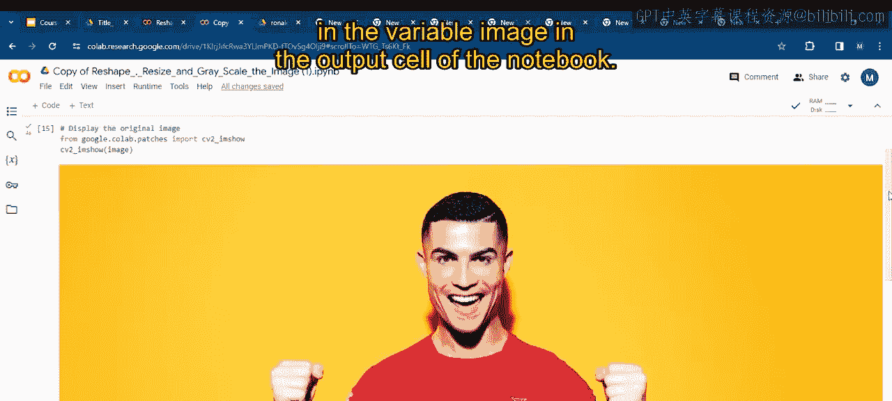
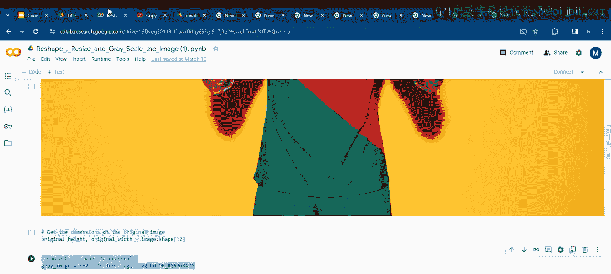
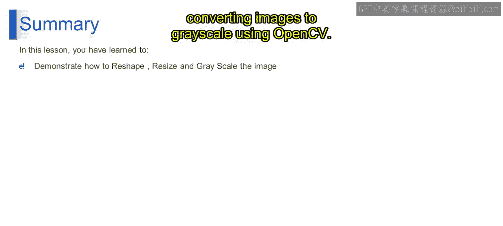
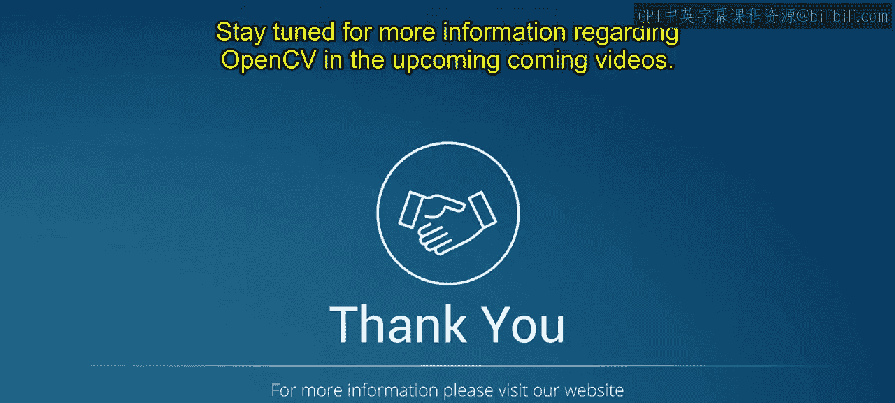

# 第二三四部分 122：使用OpenCV重塑、调整大小和灰度化图像 🖼️



在本节课中，我们将学习如何使用OpenCV库对图像进行基本操作，包括重塑形状、调整尺寸以及转换为灰度图。这些是计算机视觉任务中图像预处理的关键步骤。



## 概述



我们将通过一个完整的演示，逐步学习如何导入库、加载图像、查看其原始尺寸、转换为灰度图、重塑数组形状、调整图像大小，并最终保存处理后的图像。掌握这些技能将为后续更复杂的图像分析任务打下基础。

---

## 步骤详解



### 步骤1：导入OpenCV

首先，我们需要导入在计算机视觉和Python数值计算领域广泛使用的两个强大库：OpenCV和NumPy。

```python
import cv2
import numpy as np
```

### 步骤2：加载图像

我们使用`cv2.imread`函数来加载图像。该函数接受一个参数，即要加载的图像文件路径。



```python
image = cv2.imread(‘/content/Ronaldo.jpg’)
```
在此示例中，图像文件名为`Ronaldo.jpg`，位于`/content`目录下。函数会尝试读取指定路径的图像，如果成功，则将图像数据作为NumPy数组存储在变量`image`中。

### 步骤3：显示原始图像

在Google Colab环境中，我们使用`cv2_imshow`函数来显示图像。这是因为基于Web的笔记本没有GUI界面，传统的OpenCV窗口函数（如`cv2.imshow`）无法工作。

```python
from google.colab.patches import cv2_imshow
cv2_imshow(image)
```
如果您在Jupyter Notebook中工作，可以直接使用`cv2.imshow`函数。执行上述代码后，您将看到原始图像。

### 步骤4：获取原始图像的尺寸

这行代码用于提取存储在变量`image`中的图像的高度和宽度维度。在OpenCV中，图像通常表示为NumPy数组，其形状为`(高度， 宽度， 通道数)`。





```python
original_height, original_width = image.shape[:2]
```
`image.shape`返回图像数组的形状元组。通过切片`[:2]`，我们只取前两个元素，即图像的高度和宽度，而忽略通道数。这使得该表达式同时适用于灰度图和彩色图。提取出的尺寸分别存储在`original_height`和`original_width`变量中。

### 步骤5：将图像转换为灰度图

使用`cv2.cvtColor`函数将彩色图像转换为灰度图。

```python
gray_image = cv2.cvtColor(image, cv2.COLOR_BGR2GRAY)
cv2_imshow(gray_image)
```
转换后，使用`cv2_imshow`显示灰度图像。

### 步骤6：重塑灰度图像的形状

这里使用`.reshape(-1)`函数将二维数组重塑为一维数组。

```python
flattened_image = gray_image.reshape(-1)
```
参数`-1`告诉NumPy自动计算新维度的大小，以确保数组的总大小保持不变。这实际上是一种将数组变为单维并自动推断其长度的方式。

### 步骤7：转换回原始形状



这行代码逆转了上一步的扁平化过程，将一维数组转换回其原始的二维形状，从而恢复其原始的高度和宽度维度。

```python
reshaped_image = flattened_image.reshape(original_height, original_width)
```
此步骤展示了NumPy数组在处理图像数据时的灵活性，允许在不同形状和形式之间进行无缝转换，这在图像分析的预处理步骤中特别有用。

### 步骤8：显示重塑后的图像

使用`cv2_imshow`显示经过重塑形状操作后的图像。

```python
cv2_imshow(reshaped_image)
```

### 步骤9：将灰度图像调整到特定宽度和高度

`cv2.resize`函数是OpenCV中用于将图像尺寸更改为指定宽度和高度的多功能工具。

```python
new_width, new_height = 200, 150
resized_image = cv2.resize(gray_image, (new_width, new_height))
```
在此，我们将目标尺寸设置为宽度200像素、高度150像素，并存储在变量`new_width`和`new_height`中。

### 步骤10：显示调整大小后的图像

显示经过尺寸调整后的图像。

```python
cv2_imshow(resized_image)
```

### 步骤11：保存图像

我们可以使用`cv2.imwrite`函数将处理后的图像保存到文件中。

```python
cv2.imwrite(‘resized_grayscale_image.jpg’, resized_image)
```
这里我们将调整大小后的灰度图像保存为名为`resized_grayscale_image.jpg`的文件。如果保存成功，函数会返回`True`。

### 步骤12：关闭OpenCV窗口

最后，在处理完所有图像后，应关闭OpenCV创建的任何窗口。在脚本环境中，这通常是必要的步骤。

```python
cv2.destroyAllWindows()
```

---

## 总结





在本节课中，我们一起学习了如何使用OpenCV对图像进行重塑、调整大小和灰度化转换。我们逐步完成了从导入库、加载图像，到转换颜色空间、改变数组形状和图像尺寸，再到保存结果的全过程。这些预处理步骤对于准备图像以进行后续的计算机视觉任务分析和处理至关重要。希望您能将这些技术应用到您自己的计算机视觉项目中。请继续关注后续视频中关于OpenCV的更多内容。