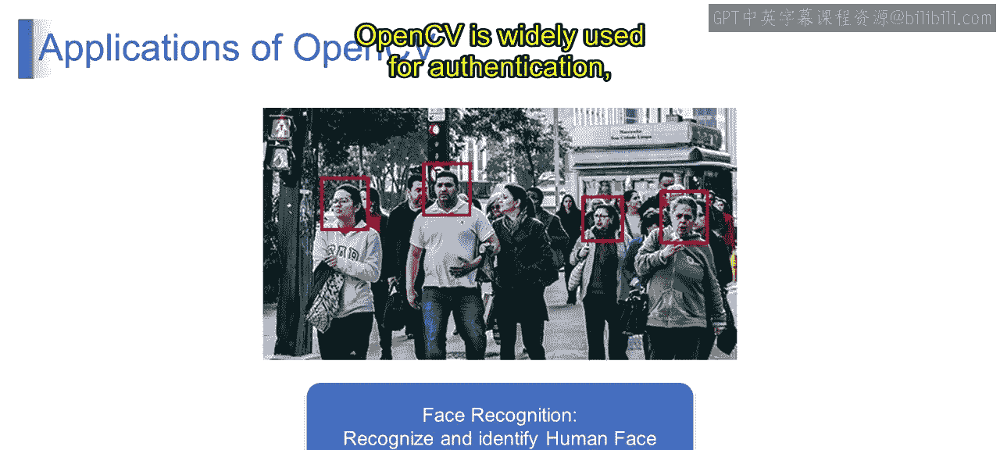
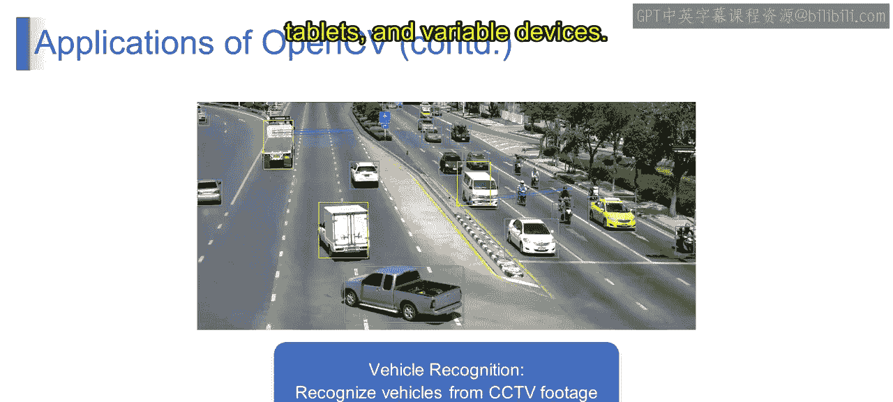

# 第二三四部分 124：OpenCV的应用 🖼️

在本节课中，我们将探索OpenCV的多样性及其在不同领域的广泛应用。通过了解其核心功能，你将全面掌握OpenCV的实际应用场景以及如何将其用于各种任务。

---

上一节我们介绍了OpenCV的基本概念，本节中我们来看看它在现实世界中的具体应用。

以下是OpenCV的一些主要应用领域：

*   **人脸识别**：OpenCV的核心应用之一是人脸识别。它提供了强大的算法，用于在图像和视频流中检测和识别人脸。从安全系统到社交媒体平台的照片标记，由OpenCV驱动的人脸识别技术被广泛用于身份验证、安全和个性化目的。
*   **车辆识别**：通过利用其图像处理和物体检测能力，OpenCV可以识别和分类来自闭路电视或交通摄像头画面的车辆。这项技术应用于交通管理、收费系统、停车管理和车辆追踪。
*   **物体检测**：我们在之前的视频中已经学习过，物体检测是OpenCV的应用之一。它提供了广泛的算法，允许用户在图像或视频帧中识别和定位各种物体。从检测行人和动物到识别特定物体（如水果或工具），OpenCV的物体检测能力在监控、工业自动化、增强现实和机器人技术中都有应用。
*   **手势识别**：OpenCV支持手势识别，使计算机能够解释和响应摄像头捕捉到的人类手势。这项技术应用于人机交互、虚拟现实和游戏。例如，手势识别可用于控制界面、浏览菜单或在沉浸式环境中与虚拟物体互动。
*   **文档分析与光学字符识别**：OpenCV提供了用于文档分析和光学字符识别的工具，使计算机能够从扫描文档或图像中提取文本和信息。这项技术广泛应用于文档管理系统、数字化项目和自动数据录入。
*   **医疗影像**：在医疗保健领域，OpenCV被用于医学影像任务，如图像增强、分割和分析。它协助医疗专业人员诊断疾病、检测X光或MRI扫描等医学图像中的异常，并随时间监测患者健康状况。
*   **增强现实**：OpenCV在增强现实应用中扮演着关键角色，其中虚拟物体会实时叠加到现实世界中。通过精确追踪场景中物体的位置和方向，OpenCV使得在智能手机、平板电脑和可穿戴设备上实现沉浸式AR体验成为可能。

---

OpenCV的多功能性和强大能力使其成为从计算机视觉、图像处理到机器学习和人工智能等各个领域的宝贵工具。其广泛的应用使开发者、研究人员和实践者能够在不同行业中创新并解决复杂问题。

本节课中，我们一起探索了OpenCV的多样化应用。希望你如今能更深入地理解OpenCV的多功能性及其在推动各领域创新和变革方面的潜力。请继续关注后续的视频内容。