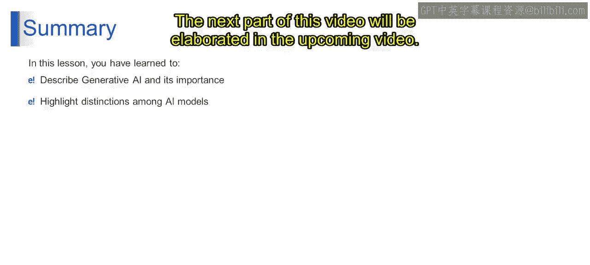

# 第二三四部分 125：生成式AI与判别模型

在本节课中，我们将要学习生成式人工智能的基本概念，并重点分析它与判别式模型之间的核心区别。通过一个厨房的类比，我们将清晰地理解这两种AI模型各自的功能、工作原理和应用场景。

---

## 生成式AI简介

生成式AI就像一个富有创造力和多才多艺的伙伴，能够独立地发明新事物。无论是创作艺术、谱写音乐还是解决复杂问题，它都能胜任。你只需提供一个起点，它就能利用其庞大的知识库创造出全新的内容。想象一下，你让它画一幅画，它就能生成一幅独一无二的艺术品。如果第一次尝试不完美，没问题，你可以让它再试一次。但请记住，它并非真正的艺术家或拥有情感的人，而是一个聪明的计算机程序，它通过学习数据中的模式来工作。它就像一位能满足你所有创意和实际需求的魔法助手。这种AI在大型数据集上进行训练，以生成与训练数据相似但避免完全复制的独特内容。

## 生成式AI与判别式AI的区别

为了更好地理解生成式AI，我们使用一个厨房的类比。想象你在厨房里有两个AI系统：一个是“食谱创造者”，另一个是“食谱识别者”。

### 食谱创造者（生成式AI）

首先，我们来看看“食谱创造者”，它代表生成式AI。

*   **角色**：它像一位富有创造力的厨师，能够发明新的食谱。
*   **工作方式**：你告诉食谱创造者你厨房里有哪些食材，它就会利用这些食材想出一道独特的食谱。这就像拥有一位能创造出你从未尝过的美味菜肴的厨师。

以下是其工作方式的一个例子：
*   **输入**：你向食谱创造者输入豆腐、番茄和罗勒等食材。
*   **输出**：它生成一份令人垂涎的卡普雷塞风味豆腐菜肴的食谱。它以一种独特而美味的方式组合了所有素食食材，为你提供了一道新菜。

这就是我们视为生成式AI的“食谱创造者”。

### 食谱识别者（判别式AI）

上一节我们介绍了创造新事物的生成式AI，本节中我们来看看“食谱识别者”，它代表判别式AI。

*   **角色**：它像一位烹饪专家，能够识别和分类现有的食谱。
*   **工作方式**：你向食谱识别者展示一道你已经做好的菜，它会识别出这是哪种类型的素食菜肴，并提供关于这道菜的信息，例如使用了哪些食材以及烹饪方法。它不会创造任何新食谱，但它足够有能力识别出这是一道什么菜，即擅长识别已知的食谱。

以下是其工作方式的一个例子：
*   **输入**：你向食谱识别者展示一盘配有番茄酱和无肉丸的意大利面。
*   **输出**：它迅速识别并解释这是一道素食意大利肉丸面。它能够提供所有细节，例如这道菜中有哪些食材，以及准备这道菜可用的所有烹饪方法。

这就是判别式AI的工作方式。它不足以从中创造出新东西，但能够自行对现有的或已知的实体进行分类。

## 核心对比总结

基于以上的类比，我们可以系统地总结生成式AI模型与判别式AI模型之间的核心差异。

以下是两种模型的关键区别：

*   **目标**
    *   **生成式AI模型**：能够**生成**或**创造**新的内容或输出。
    *   **判别式模型**：致力于对现有数据进行**分类**或**区分**。

*   **功能**
    *   **生成式AI模型**：从训练数据中学习模式，并能够基于其“智能”生成新内容。
    *   **判别式模型**：学习模式以根据所学内容进行分类或做出预测。

*   **输出**
    *   **生成式AI模型**：能够生成**新的、原创的**内容。
    *   **判别式模型**：能够预测给定输入的**标签**或**类别**。

*   **训练数据**
    *   **生成式AI模型**：需要代表期望输出的数据。
    *   **判别式模型**：需要包含不同类别的**带标签数据集**。

*   **模型示例**
    *   **生成式AI模型**：生成对抗网络（GANs）、变分自编码器（VAEs）、生成式预训练变换模型（GPTs）。
    *   **判别式模型**：支持向量机（SVM）、神经网络、Transformer网络（用于分类任务时）。

*   **应用场景**
    *   **生成式AI模型**：用于**图像合成**、**文本生成**、**异常检测**等。
    *   **判别式模型**：用于**图像分类**、**情感分析**、**物体识别**等。

*   **具体例子**
    *   **生成式AI模型**：根据现有艺术品或文本描述生成一幅新的画作。如果你给生成式AI一些文字，它就能据此产生一个新的结果，比如一幅美丽的图片。
    *   **判别式模型**：识别一封电子邮件或消息是否是**垃圾邮件**。

---

本节课中，我们一起学习了生成式人工智能的基本概念，并通过厨房的类比深入理解了生成式AI与判别式AI在目标、功能、输出和应用上的根本区别。生成式AI的核心在于“创造新事物”，而判别式AI的核心在于“识别与分类现有事物”。理解这一区别是深入学习生成式AI应用开发的重要基础。本视频的下一部分内容将在后续视频中详细阐述。