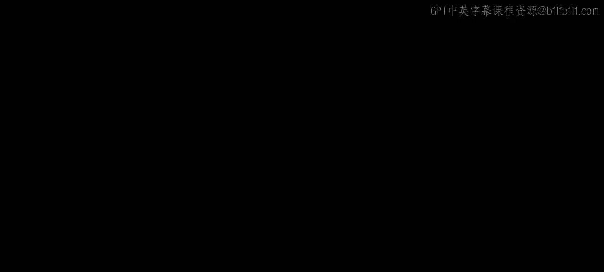
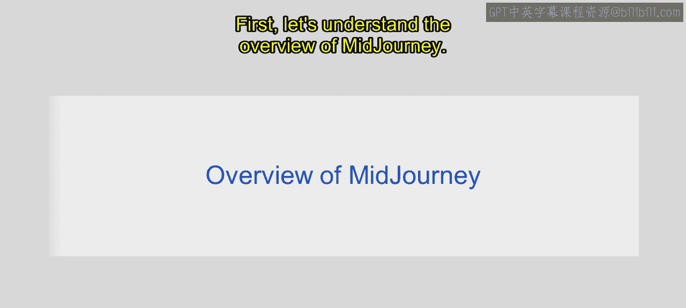
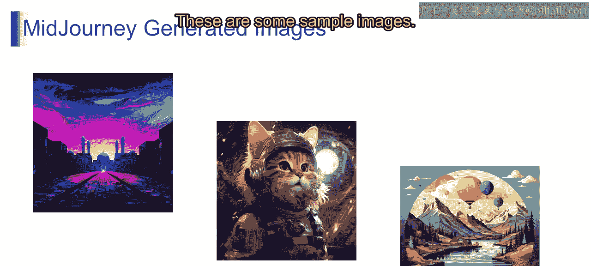
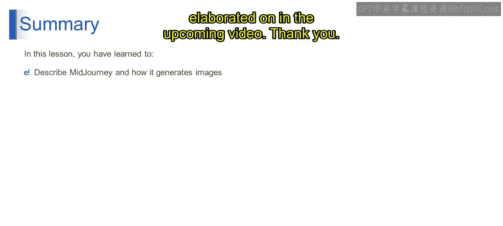

# 第二三四部分 126：解密Midjourney 🧙‍♂️

在本节课中，我们将要学习Midjourney的概述。我们将了解Midjourney的基本概念，它如何工作，以及它如何将文字描述转化为图像。

## Midjourney概述

首先，让我们理解Midjourney的概览。Midjourney究竟是什么？你可以把Midjourney想象成一个神奇的计算机程序。它做了一件非常酷的事情：**将文字转化为图片**，就像一个魔术师把兔子变成帽子一样。

你可以用文字描述一幅画，Midjourney就能让它显现出来，就像在表演魔术。尽管它仍在学习和改进中，但它已经吸引了许多人的目光。人们对此感到兴奋，因为它就像一个正在形成的数字热潮，即使它还不完美。

这里我们可以看到一张由Midjourney生成的图片示例，其中包含了山脉、石板、树木、平原以及云朵。

这意味着Midjourney就像一个数字工具，它使用生成式AI平台，能够从输入的文本中创造出逼真且富有创意的图像。Midjourney不仅仅是关于技术，它更是关于创造力。世界各地的人们用它来创作美丽且富有想象力的图像。它就像拥有一个艺术伙伴，无论你是专业艺术家还是从未画过一条线的人，Midjourney都能帮助你创作艺术。它的使命是让艺术变得简单易得，让每个人都能接触。简而言之，Midjourney是一个聪明的计算机程序，它将文字转化为图片，帮助人们创作出惊人的艺术作品，但它仍在学习，并且每天都在变得更好。

## Midjourney图像示例

现在，让我们看一些由Midjourney生成的图像示例。

以下是Midjourney生成的一些示例图像：
*   **背景有彩色云朵的城市日落**。
*   **一只穿着宇航服、戴着头盔和耳机的猫**。
*   **在山区湖泊上空飞行的热气球**。

这些图像展示了Midjourney根据文字描述生成多样化视觉内容的能力。

## Midjourney的工作原理

上一节我们看到了Midjourney能做什么，本节中我们来看看它是如何生成这些图像的。

通常，Midjourney使用AI模型将文本描述翻译成图像。下图是一个参考的图示表示。

Midjourney主要包含三个部分：
1.  **文本提示编码**
2.  **扩散模型**
3.  **图像生成器**

以下是每个部分的详细说明：
*   **文本提示编码**：这是一个将文本提示转换为数值表示的过程。这意味着无论我们以文本格式输入什么，它都会被转换成机器学习模型可以使用的数值表示。
*   **扩散模型**：这是一种机器学习模型，可用于通过逐渐向数据的潜在表示添加噪声，然后对潜在表示进行去噪来生成图像或其他类型的数据。
*   **图像生成器**：这也是一种机器学习模型，可用于从各种输入（如文本提示、草图或其他图像）生成图像。然后，它会通过执行放大操作来生成图像。

## 工作流程示例

用简单的术语来解释，让我通过一个例子来说明这里到底发生了什么。

让我们假设我们提供了一个文本输入提示：“**一只猫坐在沙发上**”。
1.  它首先会进入**文本提示编码器**，该编码器会将我们在此处给出的文本转换成数值表示。这个过程被称为**向量化**。
2.  然后，这个向量表示被传递给一个**扩散模型**。扩散模型在文本提示的向量表示引导下，迭代地从图像中去除噪声。
3.  生成的图像随后被**放大和后处理**以提高其质量。
4.  最后，生成的图像被呈现给用户。

Midjourney图像生成过程仍在开发中，但它有潜力彻底改变图像的创建方式。该模型可用于创建各种风格的图像，包括写实、超现实和抽象风格。Midjourney还可以用于生成与复杂且具有挑战性的文本提示一致的图像。

本视频的下一部分将在接下来的视频中详细阐述。

## 总结

本节课中我们一起学习了Midjourney。我们了解到Midjourney是一个基于文本生成图像的人工智能工具，其核心流程包括**文本编码**、**扩散模型去噪**和**图像生成**三个阶段。它降低了艺术创作的门槛，让想象力能够通过文字轻松转化为视觉图像。尽管技术仍在演进，但它已经展示了生成式AI在创意领域的巨大潜力。