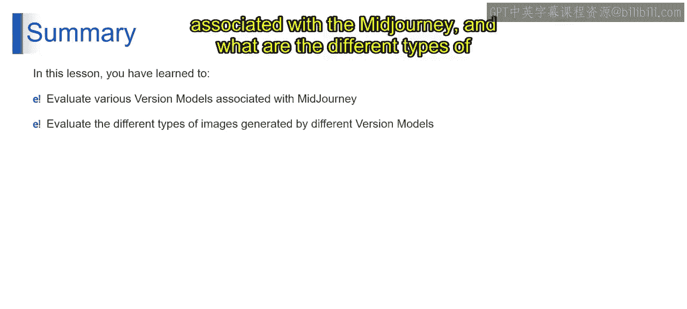
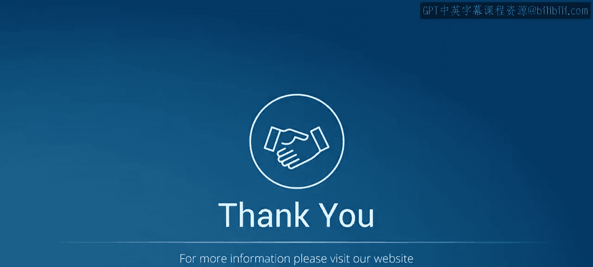

# 第二三四部分 127：Midjourney的起源与发展 🎨

在本节课中，我们将了解Midjourney的历史。通过学习，你将能够理解Midjourney的起源，并学会分析其各项功能。

## 概述

我们将从Midjourney的创立者开始，了解其发展时间线，并介绍其核心模型版本，特别是专为动漫风格设计的Niji模型。

## Midjourney的创立者

首先，我们来了解Midjourney的历史。那么，是谁创立了Midjourney呢？

*   David Holz是Midjourney的创始人。
*   他于2021年8月将该项目作为一个自筹资金的研究项目开始工作。
*   他同时也是Leap Motion公司的前联合创始人兼首席技术官，这是一家专注于虚拟现实（VR）和增强现实（AR）的公司。
*   目前，Midjourney仍处于测试和开发阶段。

## Midjourney的发展时间线

上一节我们认识了创始人，本节中我们来看看Midjourney自成立以来的关键发展节点。以下是其发展时间线：

*   **2022年3月**：David Holz在美国加利福尼亚州旧金山创立了Midjourney Inc.公司。
*   **2022年7月12日**：Midjourney图像生成平台首次进入公开测试阶段。
*   **2022年11月**：Midjourney第4版（V4）的Alpha版本向所有用户开放。
*   **2023年3月**：Midjourney成为市场上涌现的众多AI图像生成器之一。同年3月，第5版（V5）的Alpha迭代版本发布。

## Midjourney的模型版本

了解了发展历程后，我们来看看其核心——模型版本。Midjourney定期更新其模型，以提升生成图像的效率、连贯性和质量。每个模型都擅长生成不同类型的图像。

截至2023年7月，Midjourney已发布了7个不同的模型。版本号列表包括：1, 2, 3, 4, 5, 5.1 以及 5.2。

默认情况下，系统会自动选择最新版本。例如，截至2023年7月，最新版本是5.2，因此版本5.2会被选中。当然，用户也可以根据自己的需求更改使用的版本。

## Niji模型简介

除了标准模型，Midjourney还有一个特殊的合作模型。现在让我们了解一下Niji模型。

Niji模型是Midjourney与Spellbrush公司合资开发的成果，专门为擅长创作动漫和插画艺术风格而设计。

> Spellbrush是一家专注于开发AI模型的公司，尤其擅长使用自然语言提示生成特定风格的图像。该公司与Midjourney合作创建了此类AI模型。

该模型对动漫美学风格和主题有着广泛而深入的理解。它特别擅长构思以角色为中心的动态动作场景和构图。

## 总结

本节课中，我们一起学习了Midjourney的起源与发展。我们了解了其创始人David Holz，回顾了从公司创立到版本迭代的关键时间线，认识了不同的模型版本及其特点，并特别介绍了专注于动漫风格的Niji模型。通过这些内容，我们对Midjourney这一AI图像生成工具有了基础的认识。