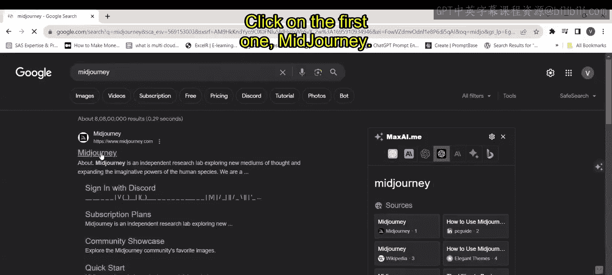
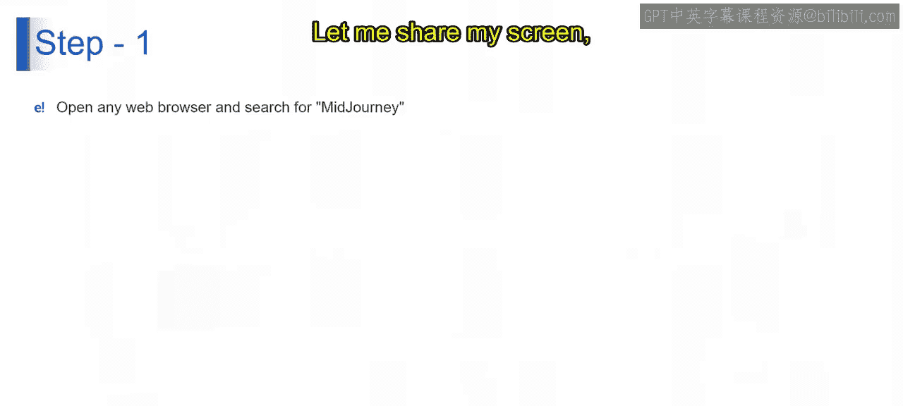
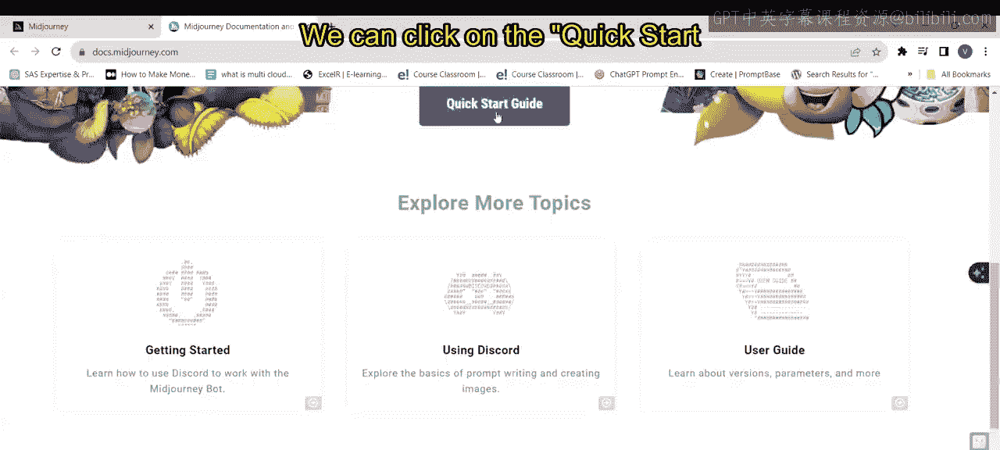
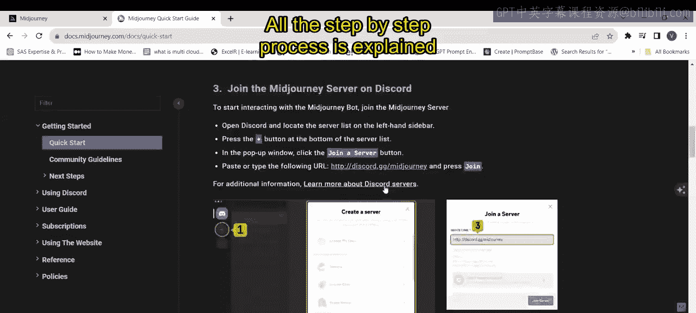
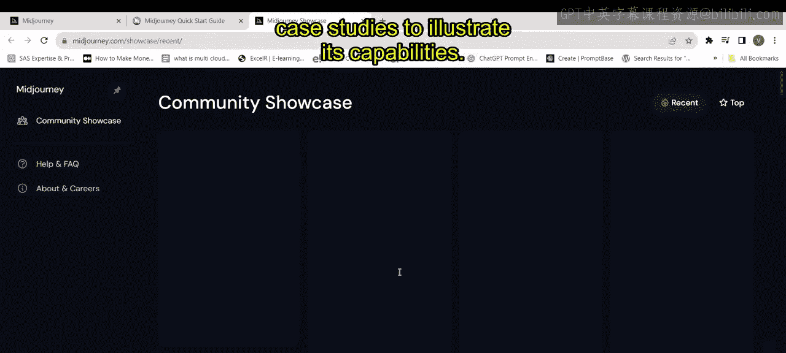
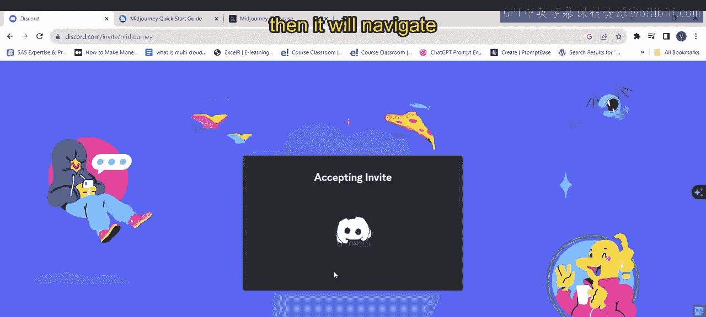
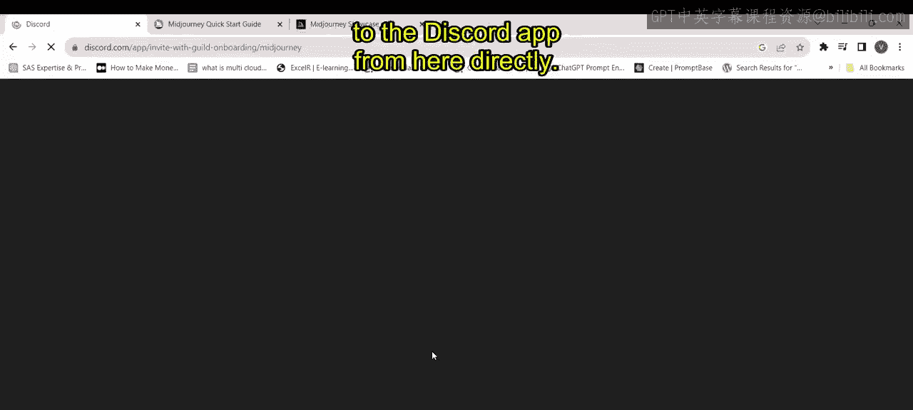
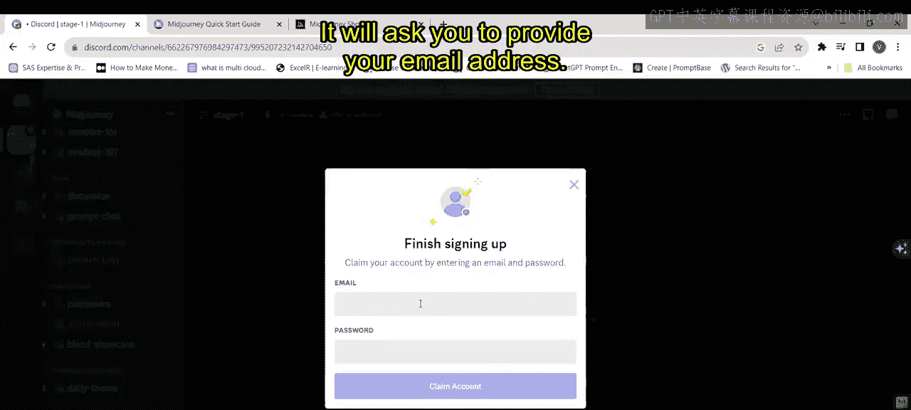
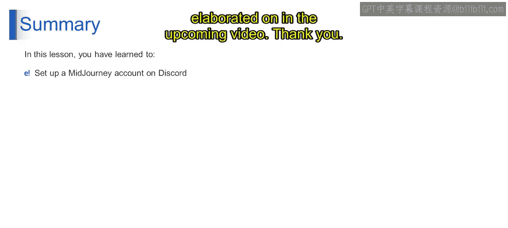

# 第二三四部分 128：Midjourney账户设置

在本节课中，我们将学习如何在Discord平台上设置Midjourney账户。你将了解在Discord上设置账户的目的与优势，并掌握创建账户的详细步骤。

## 什么是Discord？

在加入Midjourney之前，了解Discord平台非常重要。Discord是一个用户友好的通信平台，它作为一个虚拟聚集地，供人们连接与交流。它提供多种通信工具，包括文本消息、语音通话和视频聊天，使其适用于不同类型的互动。

用户可以创建自己的虚拟空间，称为“服务器”，并在其中将讨论组织到不同的“频道”中，每个频道专用于特定主题。它最初被游戏社区广泛采用，但其吸引力已扩展到学习小组、基于爱好的团体、专业团队和兴趣社区等多元化群体。Discord的易用性和可定制性使其成为在线交流和协作的热门选择。

此外，Discord还提供与其他应用程序集成的功能，以及可以自动化任务或为服务器添加额外功能的机器人。它已成为在线社交的中心枢纽，使人们能够在虚拟环境中连接、分享和协作。Midjourney正是一个社区导向的应用程序，Discord的这一特性有助于连接世界各地的人们并生成图像。

## Discord环境设置

现在，让我们了解Discord的环境设置过程。

第一步是打开任意网页浏览器并搜索Midjourney。以下是为您展示的步骤：

1.  打开一个浏览器窗口（例如Chrome）。
2.  在搜索栏中输入“midjourney”进行搜索。

搜索结果将引导您进入相关页面。点击第一个结果“midjourney”。

这将打开Midjourney主页，其中包含四个选项：“Get Started”（开始使用）、“Showcase”（作品展示）、“Join the Beta”（加入测试版）和“Sign In”（登录）。

首先，我们来理解“Get Started”选项。点击后，您将看到：

“Get Started”选项通常允许用户开始与产品或服务进行交互，引导他们完成初始设置或使用步骤，以熟悉其基本特性和功能。您可以点击“Quick Start Guide”（快速入门指南），然后在此页面上看到分步说明，例如“使用Midjourney制作图像”、“首先登录Discord”、“订阅Midjourney计划”等。这就是“Get Started”部分的内容。

接下来是“Showcase”选项。

“Showcase”很可能指的是一个突出显示产品或服务最突出或示范性方面的部分，通常通过演示、示例或案例研究来说明其功能。您可以在这里看到所有由Midjourney生成的图片示例。

您可以看到所有这些内容。

下一个选项是“Join the Beta”（加入测试版）。这表明用户有机会参与产品或服务的预发布版本，允许他们提供反馈、测试新功能，并帮助在正式发布前识别和解决潜在问题。这意味着我们将首先加入这里，然后开始操作。我稍后会点击它。现在我只是想向您展示这个选项。

还有一个“Sign In”（登录）选项。此操作通常授予用户访问其账户或配置文件的权限，使他们能够个性化体验、访问保存的数据或偏好设置，并以更个性化的方式与产品或服务互动。如果您已经拥有Midjourney账户，只需点击“Sign In”。但如果您是第一次操作，我建议您点击“Join the Beta”。

## 加入Midjourney社区

点击“Join the Beta”后，它将引导您进入以下页面。

页面上显示“您已被邀请加入Midjourney”。您还可以看到有多少人在线以及有多少活跃用户，即已经注册的成员数量。您只需点击“Accept Invite”（接受邀请）。

然后，它将直接从浏览器导航到Discord应用程序。您可以看到它正在导航到Discord。

如果您在这里看到，它会要求您输入生日。让我们在这里输入生日。

然后点击“完成”。接下来，它会要求您提供电子邮件地址。

本视频的下一部分将在接下来的视频中详细阐述。谢谢。

## 总结

本节课中，我们一起学习了Midjourney账户设置的基础。我们首先介绍了Discord作为一个通信平台的核心概念及其对Midjourney社区的重要性。接着，我们逐步演示了如何通过浏览器访问Midjourney官网，并理解了“Get Started”、“Showcase”等关键选项的功能。最后，我们完成了点击“Join the Beta”接受邀请并开始进入Discord设置流程的初始步骤，为后续的账户创建奠定了基础。