# 第二三四部分 129：Midjourney订阅指南

在本节课中，我们将学习Midjourney的订阅机制。我们将了解为何需要订阅、如何查看订阅计划、不同计划的具体内容以及如何完成订阅流程。

## 为何需要订阅？🤔

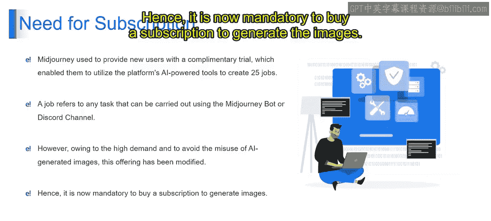

在了解具体订阅计划之前，我们首先需要理解为何使用Midjourney需要订阅。Midjourney曾为新用户提供免费试用，允许他们利用平台的AI工具创建最多25个“任务”。一个“任务”指的是通过Midjourney面板或Discord频道执行的任何操作，例如，输入文本提示词以生成图像。

然而，由于需求高涨以及为防止AI生成图像的滥用，此项免费试用已被调整。因此，现在必须购买订阅才能生成图像。

## 如何查看订阅计划？🔍

我们可以通过两种主要方式查看Midjourney提供的订阅计划。

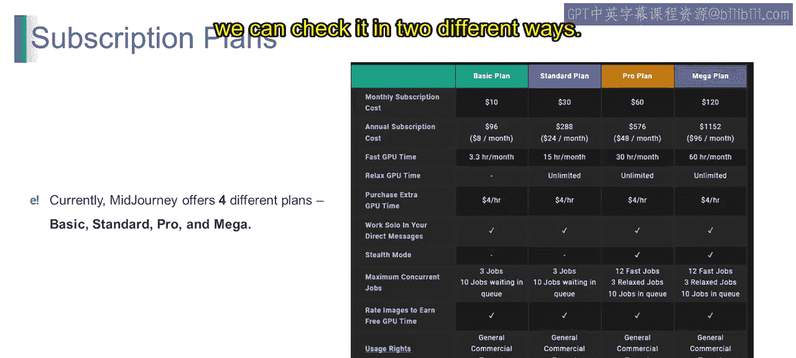

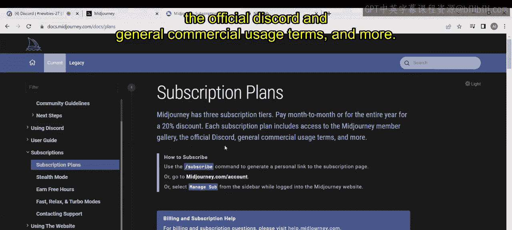

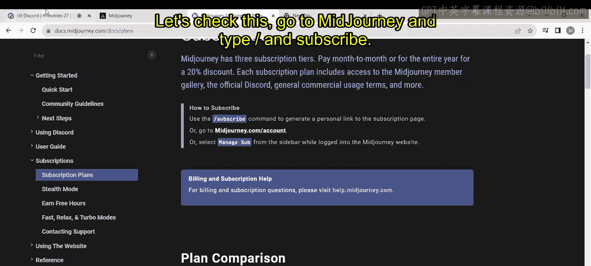

第一种方式是访问Midjourney官方平台或网站。点击“Get Started”按钮，这将打开文档页面。接着点击“Quick Start Guide”，它会引导至主页。在左侧面板中，你可以找到名为“Subscription”的选项，点击它，然后选择“Subscription Plans”，页面将跳转至详细计划介绍。

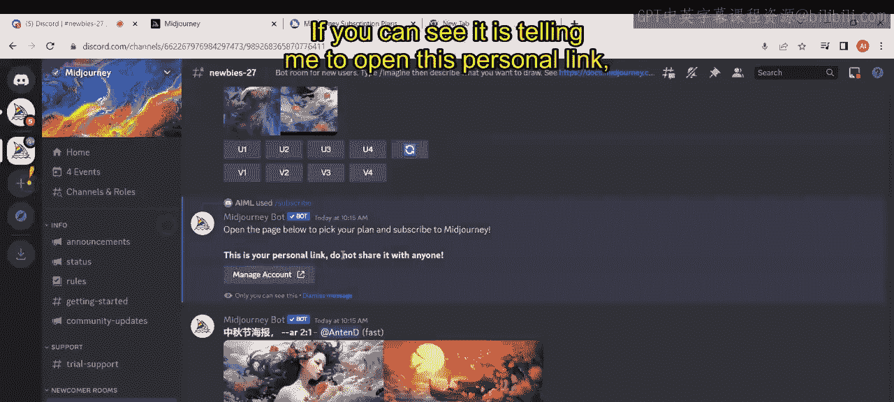

第二种方式是在Midjourney的Discord频道中直接使用命令。输入命令 `/subscribe` 可以生成一个指向订阅页面的个人专属链接。

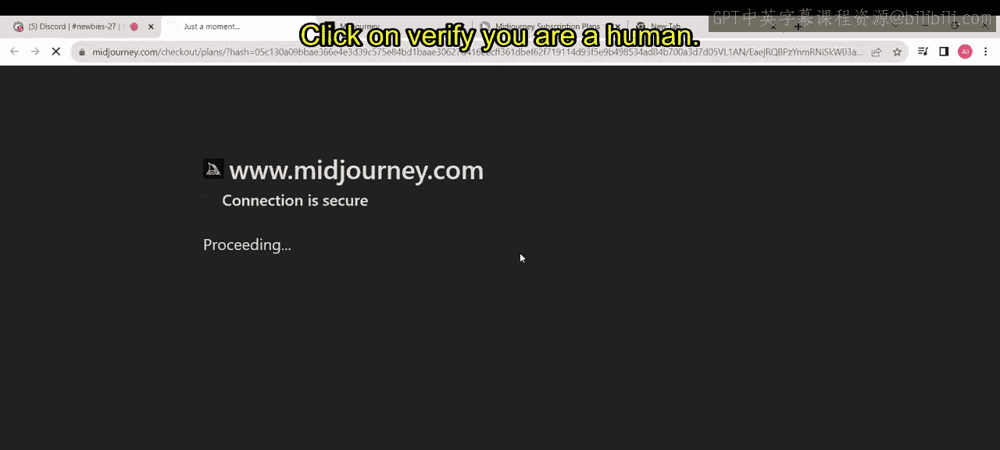

## 订阅计划详解 💰

Midjourney提供三种不同的订阅层级：按月支付或按年支付（按年支付享有20%的折扣）。每个订阅计划都包含访问Midjourney会员图库、官方Discord服务器以及通用的商业使用条款等权益。

计划主要分为四档：基础版、标准版、专业版和超级版。以下是各计划核心要素的对比：

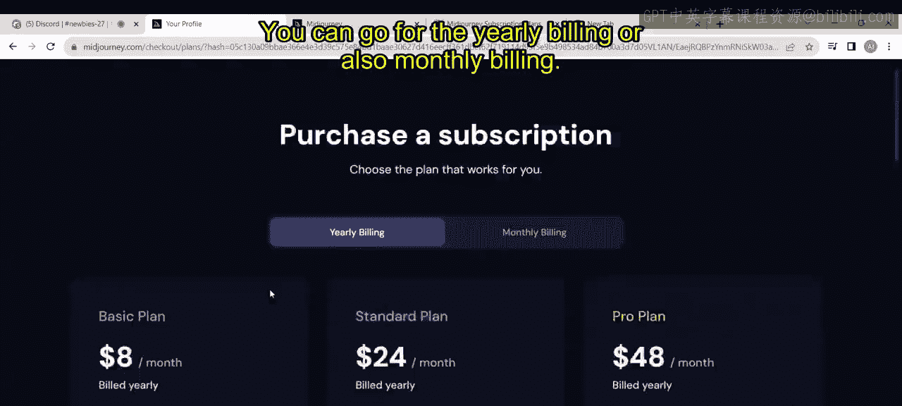

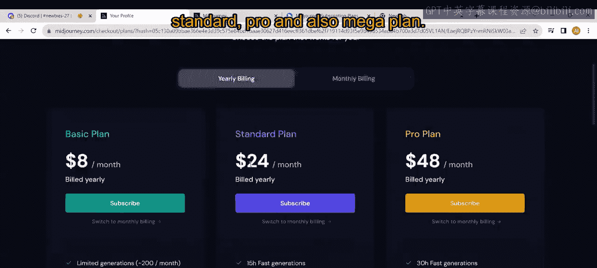

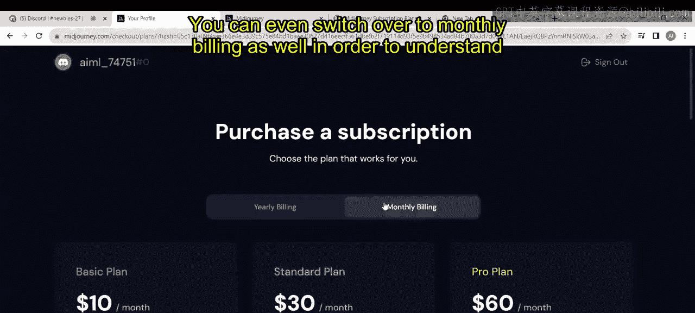

**月度订阅费用**：指为访问Midjourney服务每月支付的费用。
*   **基础版**：$10
*   **标准版**：$30
*   **专业版**：$60
*   **超级版**：$120

**年度订阅费用**：指为访问Midjourney服务支付的年费，通常比月度支付更优惠。
*   **基础版**：$96
*   **标准版**：$288
*   **专业版**：$576
*   **超级版**：$1152

**快速GPU时间**：指分配在高速GPU上的时间，用于更快地执行任务。
*   **基础版**：3.3 小时/月
*   **标准版**：15 小时/月
*   **专业版**：30 小时/月
*   **超级版**：60 小时/月

**宽松GPU时间**：指在低优先级GPU上的时间，成本更低但任务执行速度较慢。
*   **基础版**：无
*   **标准版**：无限
*   **专业版**：无限
*   **超级版**：无限

**购买额外GPU时间**：此选项允许你在订阅额度之外购买更多的GPU时间。所有计划均需额外支付 **$4/小时**。

**在私信中独立工作**：此功能允许你在私信中私下工作，不分享项目或数据。**适用于所有计划**。

**隐身模式**：此功能允许你工作时不显示在线状态或对他人可见。

**最大并发任务数**：指你可以同时运行的最大任务或项目数量。
*   **基础版/标准版**：3个快速任务，10个队列任务
*   **专业版/超级版**：12个快速任务，3个宽松任务，10个队列任务

**为图像评分以赚取免费GPU时间**：这是一个奖励系统，你可以通过为图像提供反馈来赚取GPU时间。**适用于所有计划**。

**使用权**：指关于如何使用Midjourney提供的GPU时间和服务的权限与限制。所有计划均适用**通用商业条款**。订阅后，你几乎可以以任何方式自由使用自己生成的图像。

## 如何完成订阅？🛒

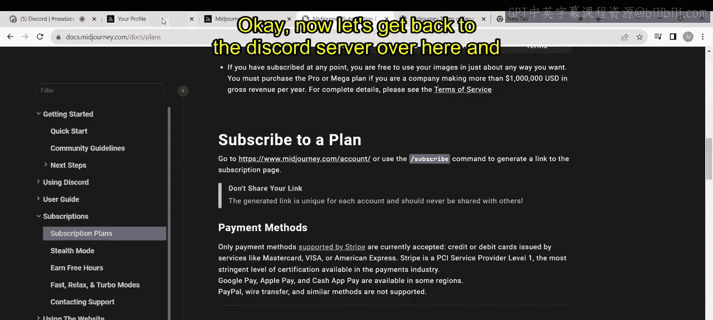

要订阅某个计划，你可以点击“Subscribe”选项。页面将跳转至需要填写账户信息的页面。你需要提供电子邮件、支付卡信息、账单地址等必填项。填写完毕后，点击“Subscribe”按钮即可完成订阅。

订阅完成后，返回Discord频道，你就可以直接在Midjourney面板中开始生成图像了。

## 总结 📝

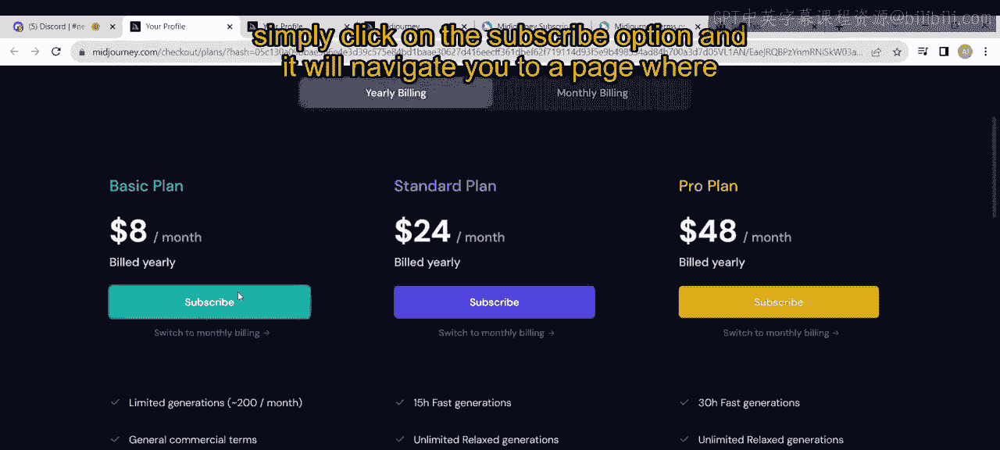

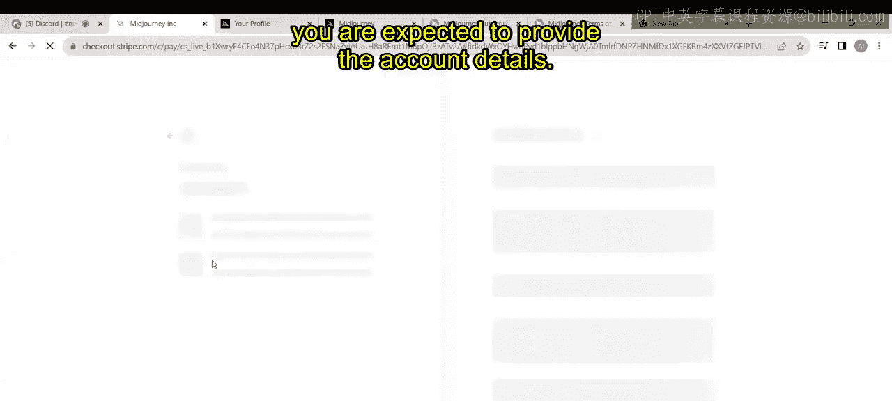

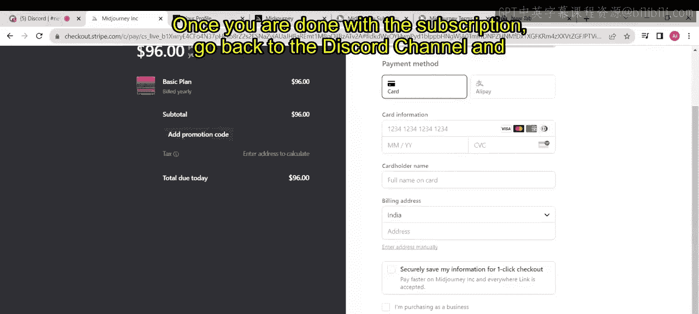

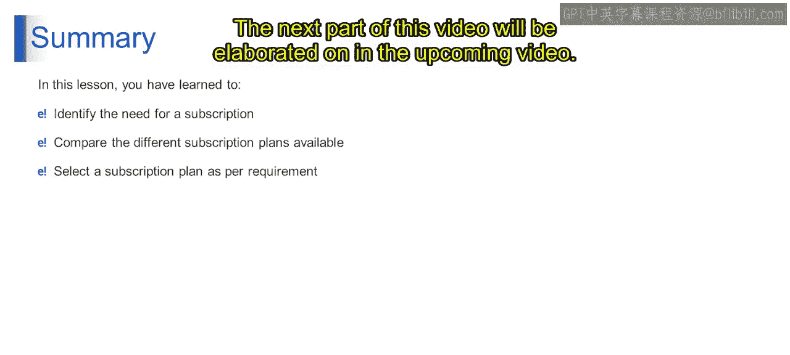

本节课我们一起学习了Midjourney的订阅机制。我们了解了订阅的必要性，掌握了查看订阅计划的两种方法，并详细对比了基础版、标准版、专业版和超级版在费用、GPU时间、并发任务等方面的区别。最后，我们简要介绍了完成订阅的步骤。完成订阅后，你将能够充分利用Midjourney的AI能力来生成图像。