# 第二三四部分 130：Midjourney版本解释第一部分 🎨

在本节课中，我们将学习如何创建并使用自己的Midjourney Discord服务器，并初步了解Midjourney的图像生成过程及其版本概念。

欢迎进入生成式AI应用与流行工具的沉浸式学习之旅。由于我已经拥有一个订阅账户，我将直接在此登录。系统会要求你输入电子邮件或电话号码以及密码，然后点击登录选项。

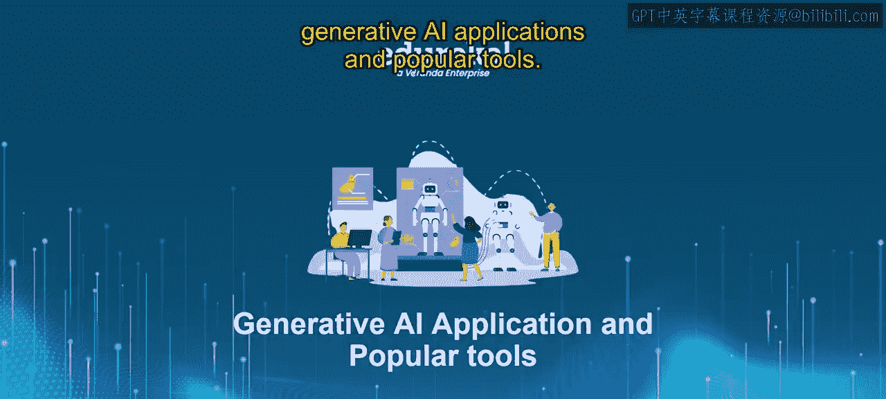

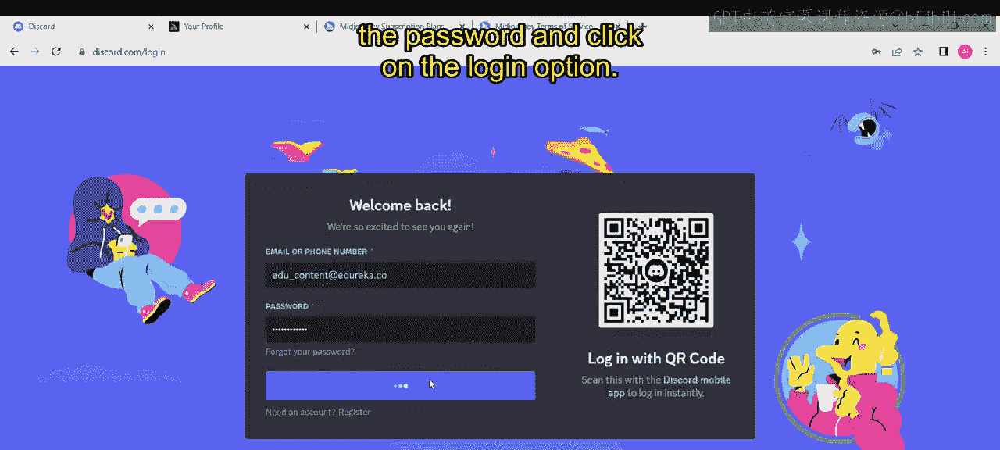

登录后，系统将引导你进入Midjourney界面。

首先，点击“探索可发现的服务器”，页面将跳转至显示主页、游戏、音乐、教育、科学与技术、娱乐和学生主页等类别的页面。你可以看到这里展示的所有精选社区。

点击“Midjourney”，页面将导航至Midjourney界面。在这里，你可以看到“关注以在你的服务器中获取此频道的更新”的提示，这意味着你也可以创建自己的服务器。

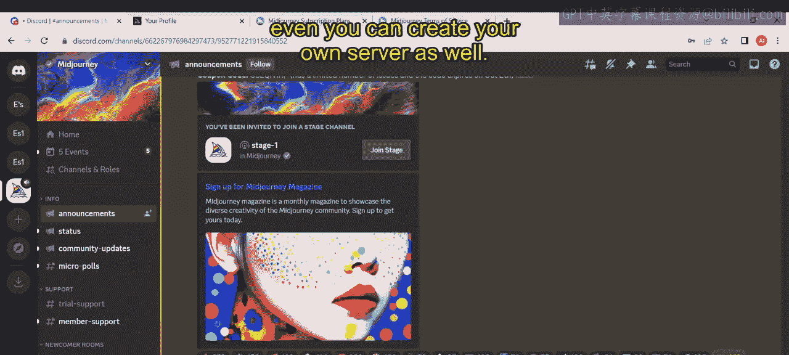

接下来，让我们看看如何操作。我们将学习如何在此处创建自己的Midjourney Discord服务器。

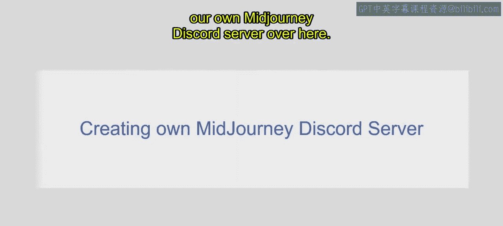

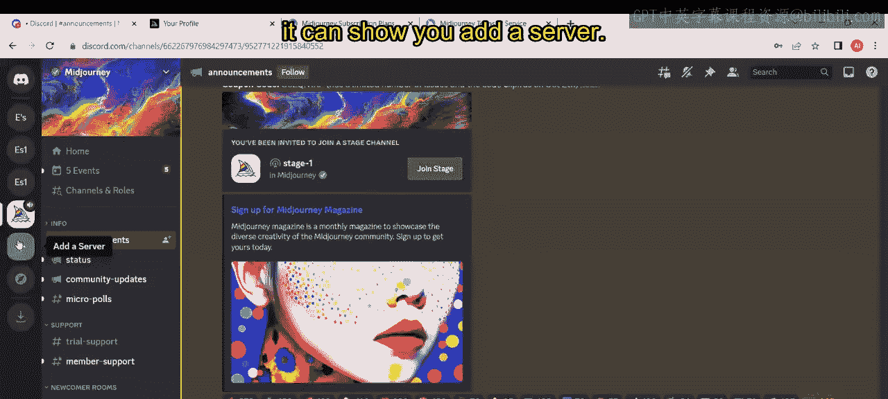

在左侧面板中，点击加号符号。

系统会显示“添加服务器”选项。点击它。

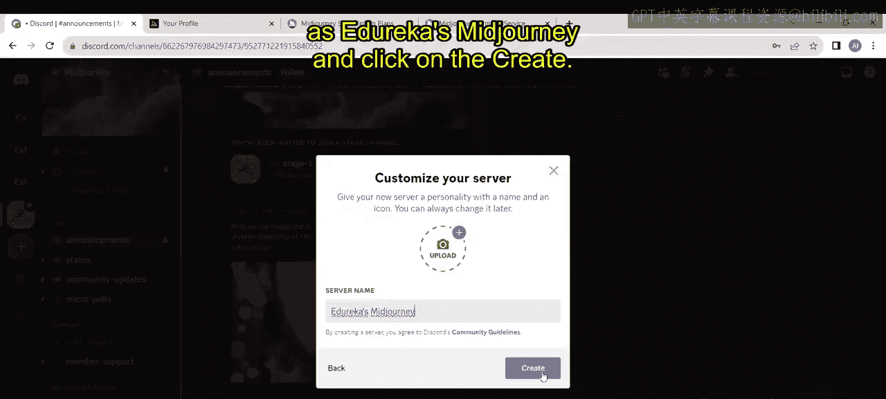

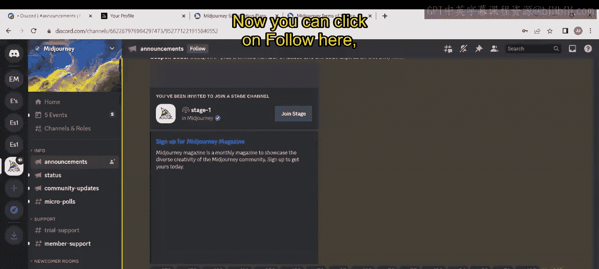

同时，系统提供了多个选项：创建自己的服务器、游戏、学校以及学习小组。现在，我点击“创建我自己的账户”。

选择“为我与我的朋友”或“为俱乐部或社区”。我点击“为我与我的朋友”。你可以编辑服务器名称，甚至可以上传图片。此刻，我将服务器名称编辑为“Edureka Midjourney”，然后点击“创建”。

现在，你可以看到“Edureka Midjourney”，这是我创建的服务器。接下来，点击“Midjourney”官方服务器。

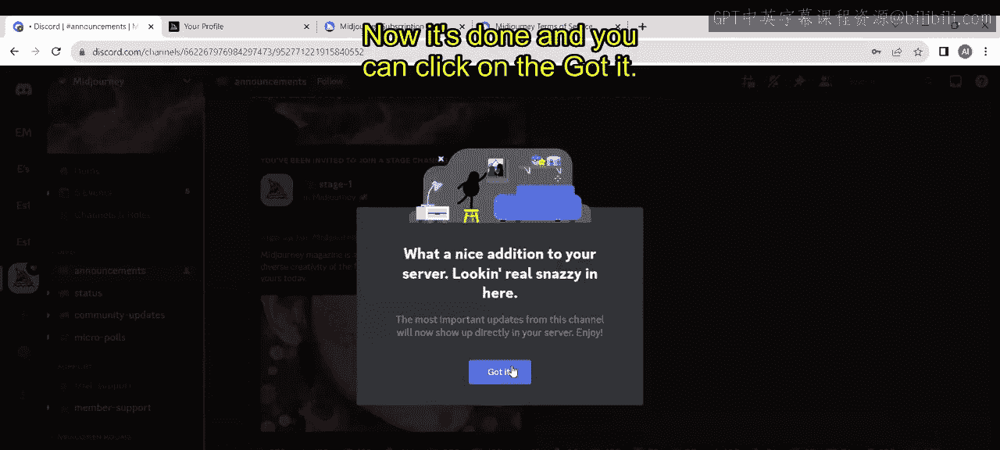

现在，你可以点击“关注”按钮，以便在你自己的服务器中获取此频道的更新。因为我已经创建了自己的Discord服务器，我想将其添加到这里。点击“关注”，系统会询问你是否将此频道的更新添加到你的服务器并发送到那里。如果你点击下拉按钮，你可以看到你创建的所有服务器。这些是我目前拥有的服务器。我选择添加最新的服务器“Edureka Midjourney”，然后点击“关注”。

操作完成。你可以点击“知道了”。

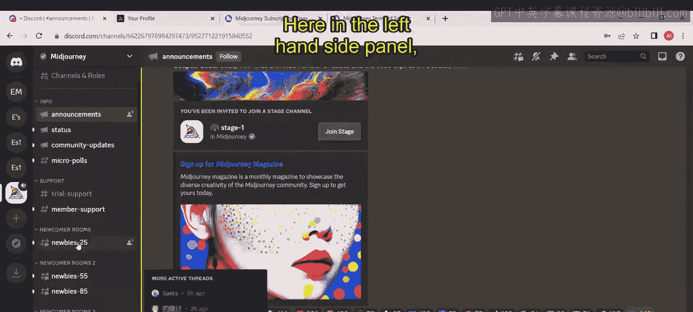

现在，再次点击Midjourney聊天板。接下来，你可以搜索“新手房间”，在那里你可以添加自己的提示词并生成图像。

在左侧面板中，你可以看到这里可用的新手房间，点击它。

页面将导航至此。你可以看到许多用户正在创建不同的图像，你也可以创建自己的图像。如前所述，默认情况下Midjourney会使用最新版本。让我们看看这是如何发生的，并记住另一件事：Midjourney一次会生成四张不同的图像。

现在，让我们来理解这个过程。首先，我们需要了解我们正在使用的版本以及如何创建图像。

如果你想创建图像，操作非常简单。输入斜杠 `/`，然后输入 `imagine` 命令，接着创建你的提示词。

在这里，如果你点击输入框，系统会要求你在此输入提示词。我给出一个简单的提示词：“crystallized desert oasis”（结晶化的沙漠绿洲），然后点击回车。

你可以看到这里我使用的是版本一。但如果你是第一次使用，默认情况下你将看到最新版本。在图像生成之前，我先解释一下为什么这里显示V1，因为我选择了版本一。系统正在等待开始，让我们稍等片刻。顺便说一下，这里显示的并非我创建的图像，而是其他用户正在创建的图像。你可以看到它开始生成了，进度为0%。

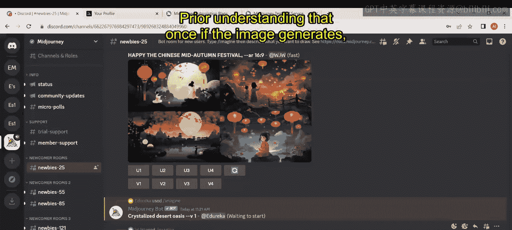

它仍在加载：6%，20%，26%，46%，53%，66%，73%。

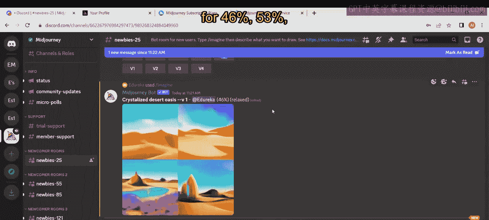

完成了！你可以看到为我们的提示词“crystallized desert oasis”生成的四张不同的图像。你可以点击图像，选择“在浏览器中打开”，然后查看。你可以放大并查看这四张不同的图像，正如我之前提到的。这些图像是基于版本一生成的。本视频的下一部分将在接下来的视频中详细阐述。

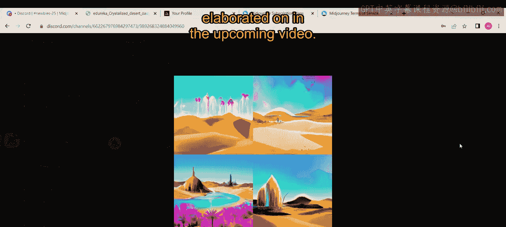

---

本节课中，我们一起学习了如何创建并关联自己的Midjourney Discord服务器，以及如何在服务器的新手房间中使用 `/imagine` 命令生成图像。我们还初步接触了Midjourney的版本概念，了解到默认使用最新版本，但也可以选择特定版本（如V1）进行生成。下一部分我们将更深入地探讨版本差异。