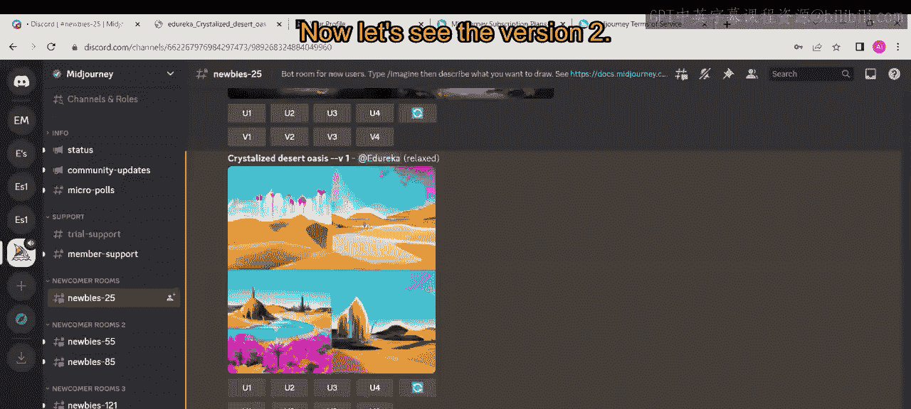
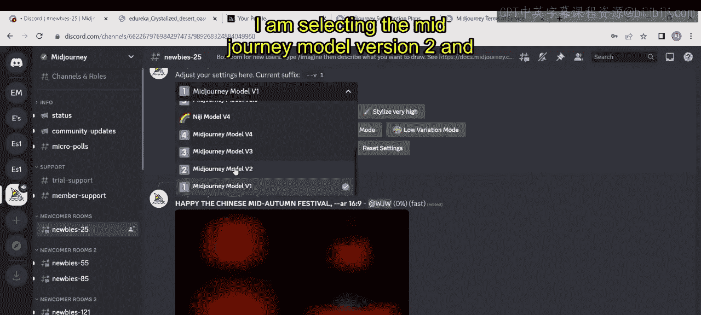
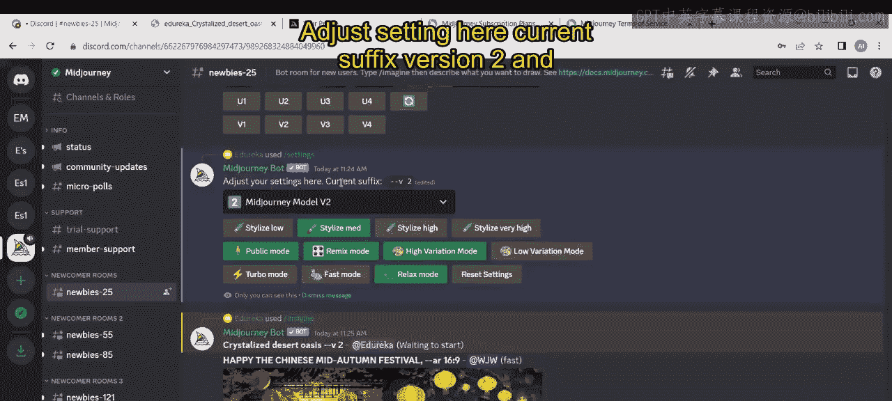
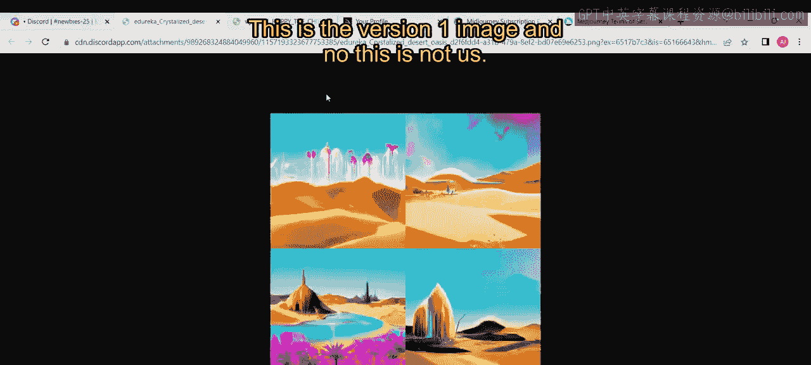
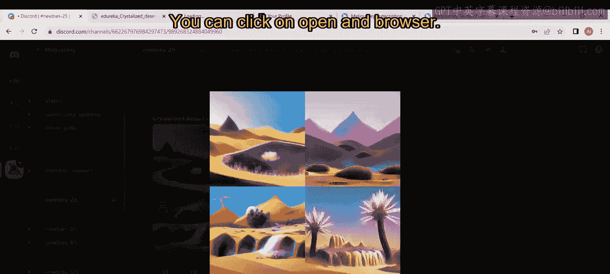
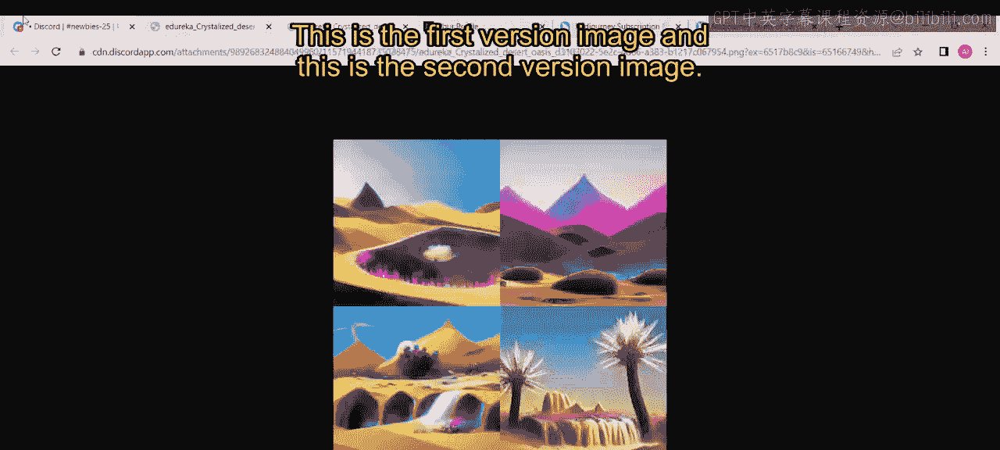

# 第二三四部分 131：Midjourney版本解释（第二部分）🎨

在本节课中，我们将学习如何切换Midjourney的不同模型版本，并通过对比不同版本生成的图像，直观地理解模型迭代带来的画质提升。

上一节我们介绍了Midjourney的基本概念，本节中我们来看看如何实际操作以切换其模型版本。

## 切换模型版本

要更改Midjourney的模型版本，你需要使用特定的命令。以下是操作步骤：

1.  在Discord的Midjourney机器人对话框中，输入斜杠 `/` 以调出命令列表。
2.  从列表中选择或输入 `settings` 命令并发送。
3.  在弹出的设置面板中，你会看到一个模型版本的下拉选择菜单。

## 可用的模型版本

Midjourney持续更新其模型以提升图像质量。在设置菜单中，你可以看到以下版本选项：

*   Version 1
*   Version 2
*   Version 3
*   Version 4
*   Niji 模型
*   Version 5.0
*   Niji Wifi
*   Version 5.1
*   Version 5.2

其中，**Version 5.2** 是目前最新的默认版本。如果你不进行任何选择，系统将自动使用此版本生成图像。

## 版本对比实践

为了展示不同版本间的差异，我们将使用同一个提示词在不同版本下生成图像。

首先，我将模型切换至 **Version 2**。接着，我输入与之前相同的提示词：`crystallized dessert oasis`。让我们观察Version 2生成的图像在质量上有何不同。

在生成过程中，你可以看到其他用户也在使用Midjourney，并能浏览他们生成的图像。当前设置显示后缀为“version two”，提示词是“crystallized dessert oasis”。图像生成后，点击即可查看，你也可以选择在浏览器中打开。

## 图像操作选项

当图像生成后，你会看到一系列操作按钮，它们的功能如下：

*   **U1, U2, U3, U4**：分别用于放大第1、2、3、4张图片。
*   **V1, V2, V3, V4**：用于基于选定图片的某个变体进行重新生成。
*   **🔄（重新生成）**：如果你对当前结果不满意，可以点击此按钮让模型重新生成一组图像。

点击重新生成按钮后，模型会开始创建新的图像。生成完成后，点击查看并与之前的版本进行对比。

## 版本效果对比

现在，我们可以直观地比较不同版本的输出结果了。下图展示了使用相同提示词 `crystallized dessert oasis` 时，Version 1 和 Version 2 生成图像的差异。可以看到，Version 2 在细节、光影和整体质感上通常有显著提升。

*Version 1 生成的图像*

*Version 2 生成的图像*

关于不同版本之间更详细的特性与差异，我们将在接下来的视频中进行深入探讨。

---

本节课中我们一起学习了如何切换Midjourney的模型版本，并通过实际对比了解了从Version 1到Version 2的画质演进。掌握版本切换功能，能帮助你根据创作需求选择最合适的模型，或直观感受AI绘画技术的快速发展。