P132：Midjourney版本解释第3部分 🎨

在本节课程中，我们将继续探索Midjourney的不同模型版本。我们将通过实际操作，对比从版本2到版本4的生成效果，直观地理解每个版本在图像质量和风格上的演进。

上一节我们介绍了Midjourney的基础设置和版本概念，本节中我们来看看如何实际操作并对比不同版本的输出结果。

现在，让我们从之前讨论的进展开始，看看同一提示词在版本3下的效果。我再次给出相同的图像提示，将设置从版本2改为版本3。点击下拉菜单，输入 `--v 3`，然后输入 `imagine` 命令。

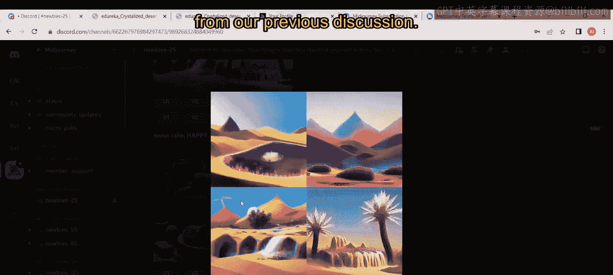

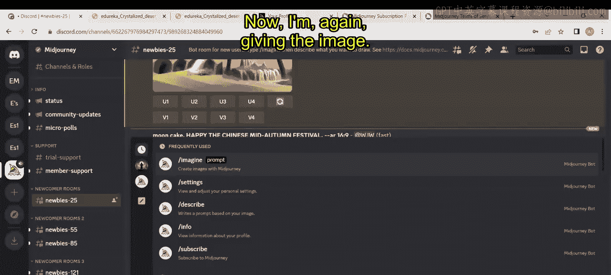

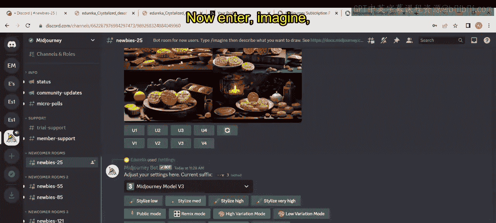

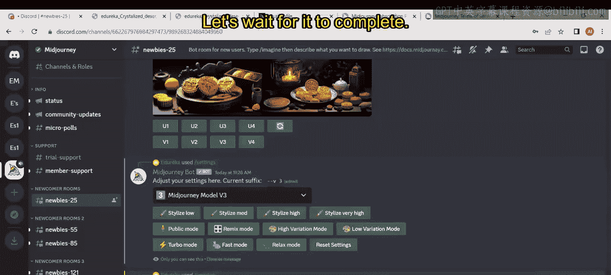

提供相同的提示词，然后按回车键。这需要一些时间来处理，让我们等待它完成。

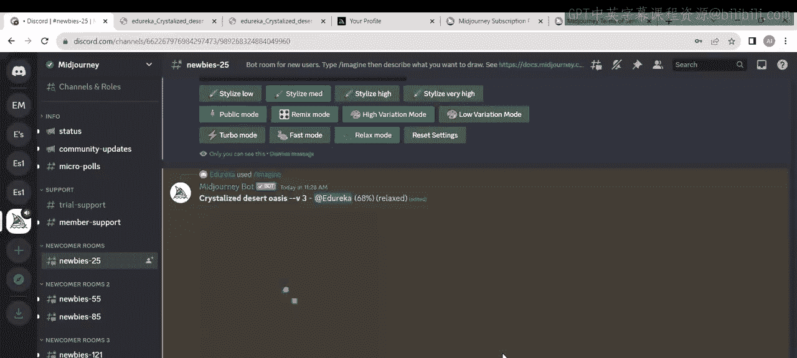

它仍在加载，加载已经开始了。

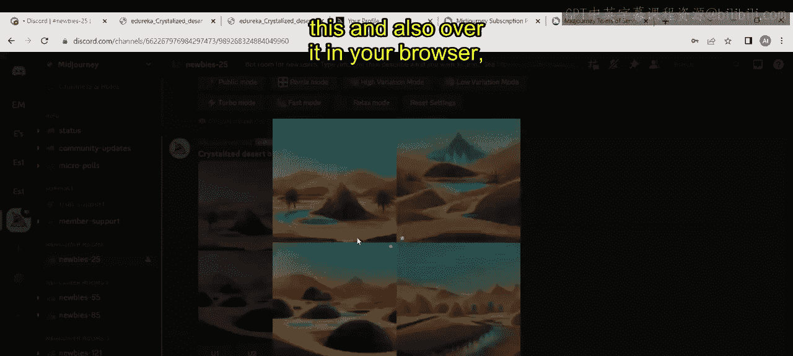

现在它准备好了，点击这个结果并在浏览器中打开它。

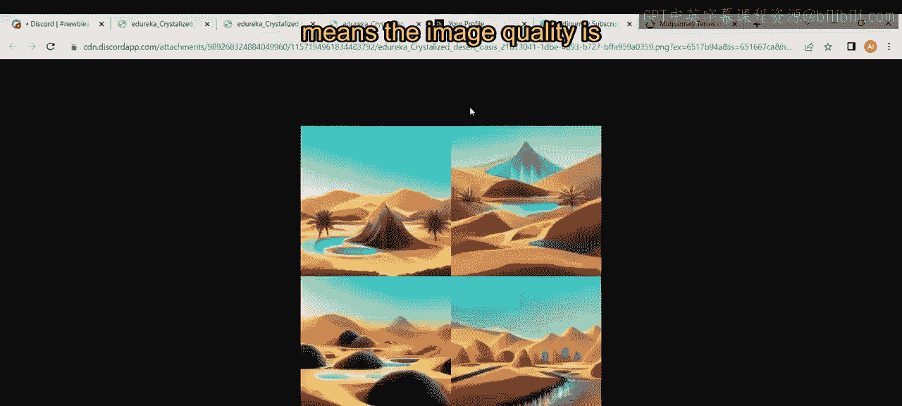

你可以看到区别。将这四个不同的图像与版本二和版本一对比，意味着图像质量相较于之前的版本有所提升。

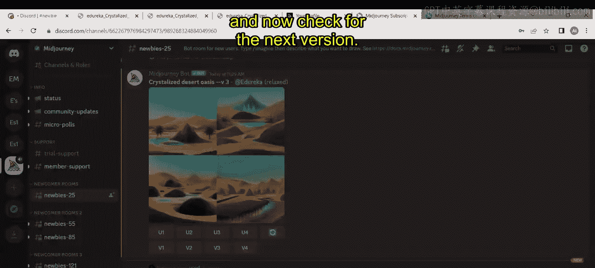

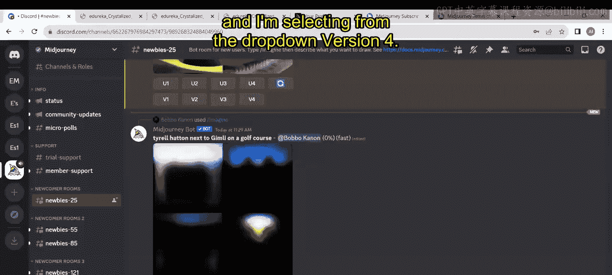

现在让我们回到这里，检查下一个版本。我再次点击设置。

我从下拉菜单中选择了版本四，并输入了相同的提示词：`imagine` 和相同的内容。

在下拉菜单中，你可能注意到了一些 `--niji` 模型。它到底是什么？在之前的内容中我们了解到，Niji是Midjourney中一个特定的AI图像生成模型，拥有丰富的动漫风格知识。它与Midjourney结合以产生出色的输出效果，因此他们也将niji包含在了这里。

版本四的图像仍在加载。是的，完成了。你可以看到这个，点击“在浏览器中打开”。现在你可以进行对比。

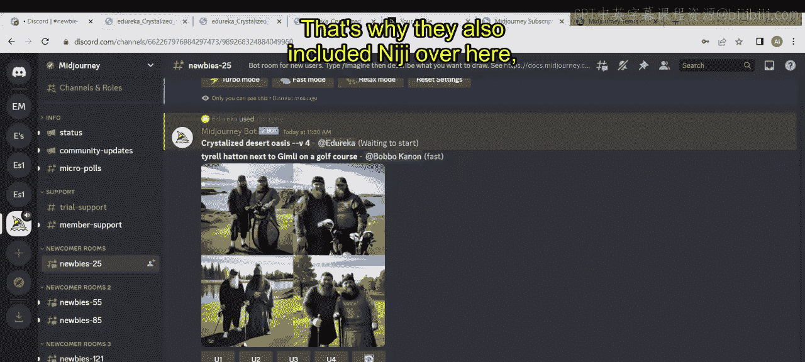

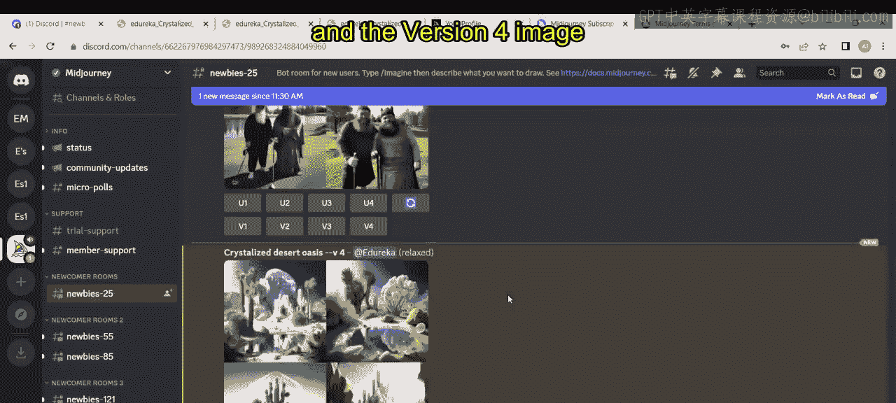

现在你可以看到区别。这是第一个结果，这是第二个版本、第三个版本和第四个版本的结果。你可以看到在第三版和第四版之间有巨大的变化。

如果你想从中选择第一张图像，可以到这里。即使你想选择第二张图像，也可以简单地点击U2按钮。

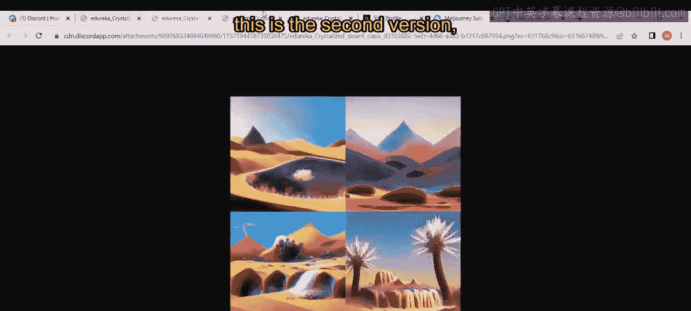

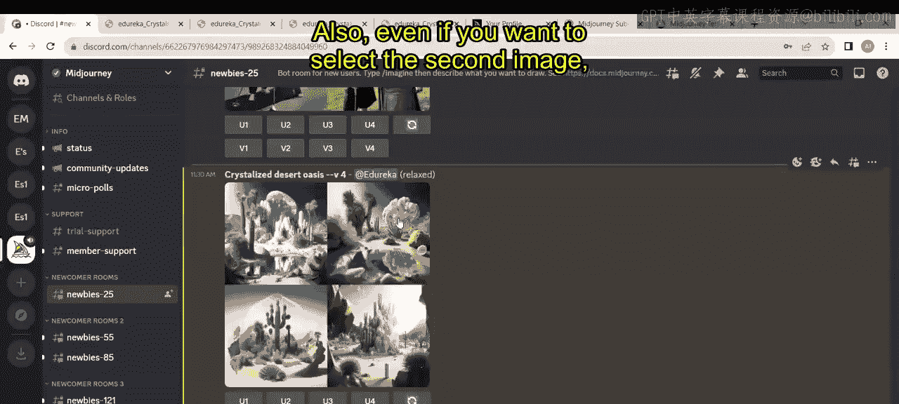

它将开始加载。即使你想放大它，也可以放大，也可以缩小，并可以直接单独查看这些图片。这就是关于版本四的内容。

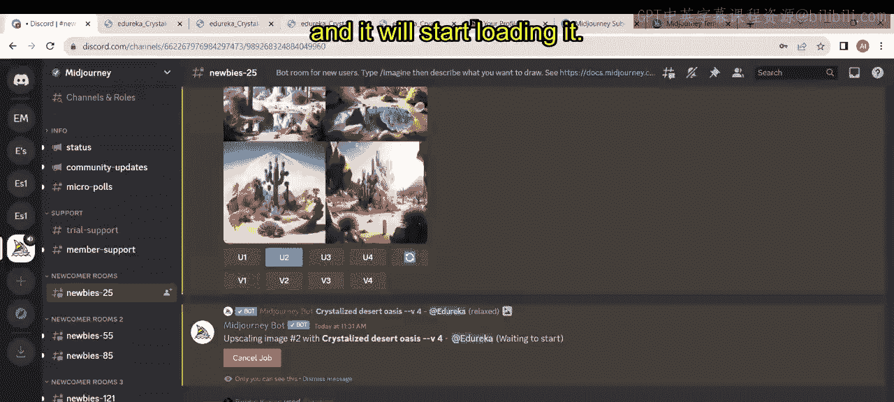

本视频的下一部分将在接下来的视频中详细阐述。

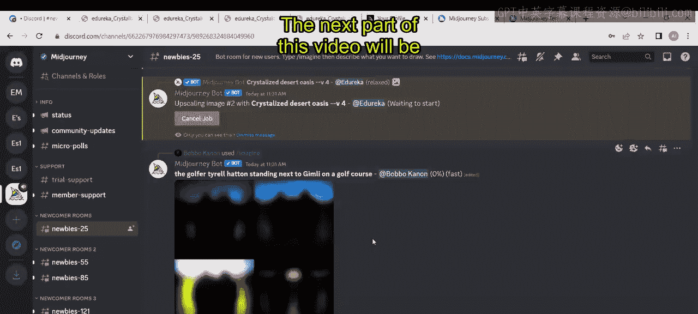

本节课中我们一起学习了如何切换Midjourney的模型版本（从v2到v4），并通过对比同一提示词下的生成结果，直观地观察了图像质量的逐步提升。我们还简要了解了 `--niji` 这个专注于动漫风格的特定模型。通过实际操作，你掌握了选择、放大和查看不同生成图像的基本方法。