# 第二三四部分 133：Midjourney版本对比与图像生成实践 🎨

在本节课中，我们将学习如何切换Midjourney的不同模型版本，并通过实践观察不同版本在生成同一提示词（prompt）时产生的图像差异。我们将从设置模型开始，逐步生成并对比图像效果。

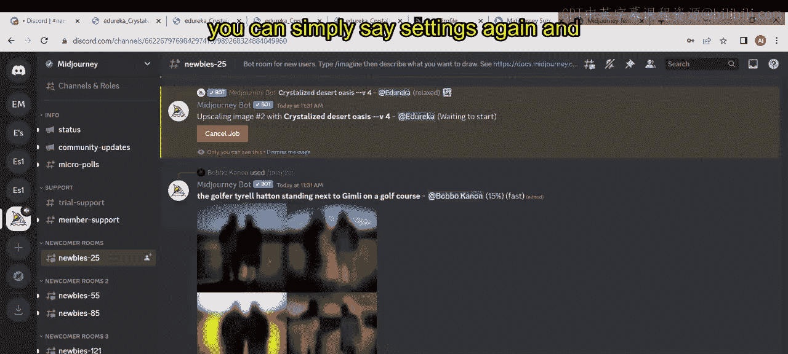

---

## 概述

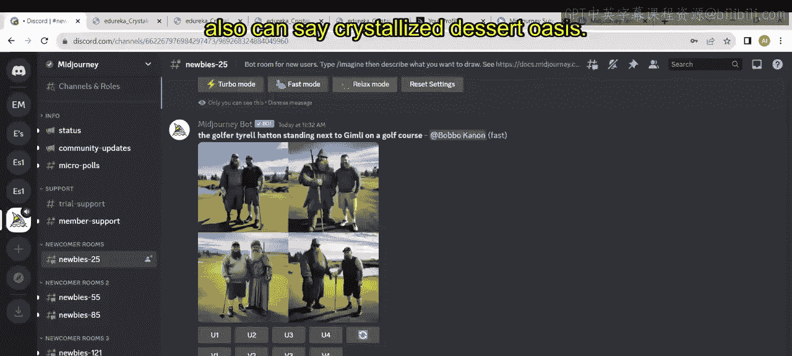

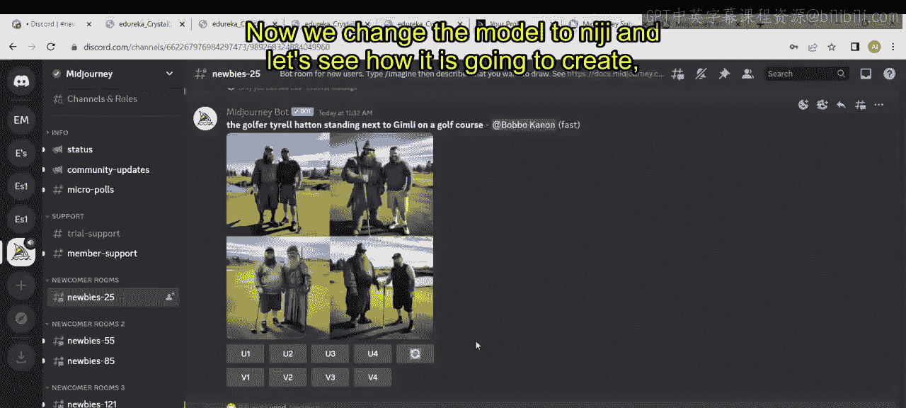

上一节我们介绍了Midjourney的订阅计划。本节中，我们将实际操作，探索从版本4到最新版本5.2的图像生成效果。通过输入相同的提示词，您可以直观地比较各版本在图像质量、风格和细节上的演进。

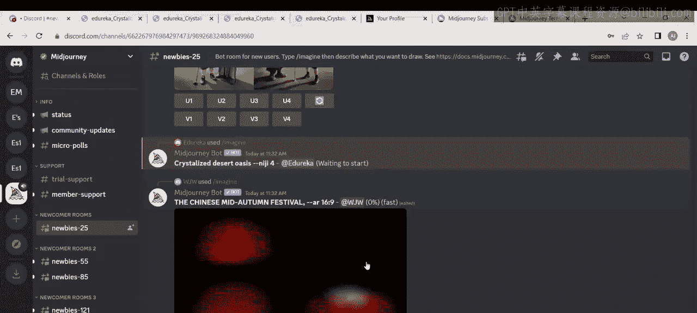

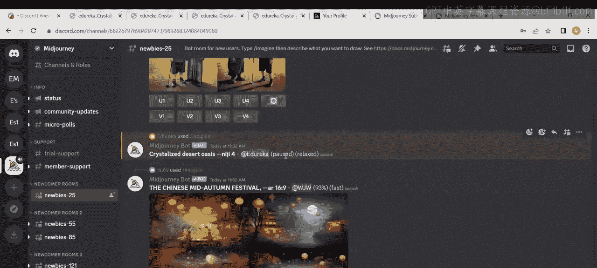

## 切换至版本4模型

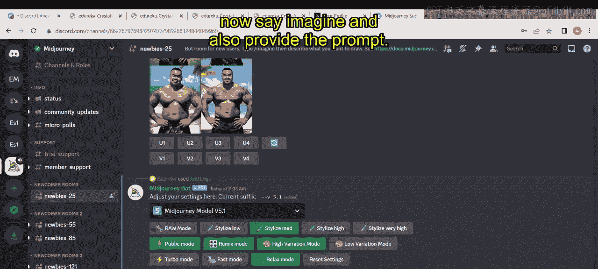

首先，我们将模型切换至版本4。在Discord中输入 `/settings` 命令并发送，在设置菜单中选择 `Nizzy model4`。

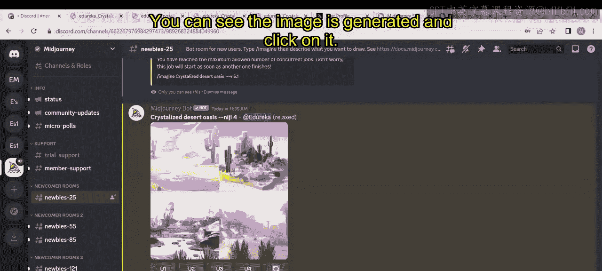

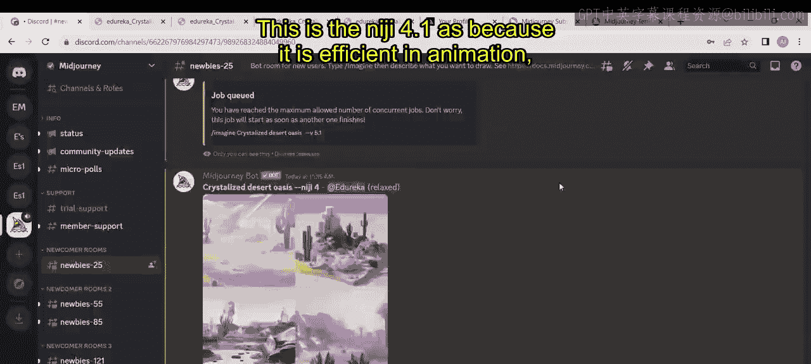

选择模型后，我们使用 `/imagine` 命令并输入提示词 `crystallized dessert oasis` 来生成图像。系统需要一些时间来加载和生成图像。

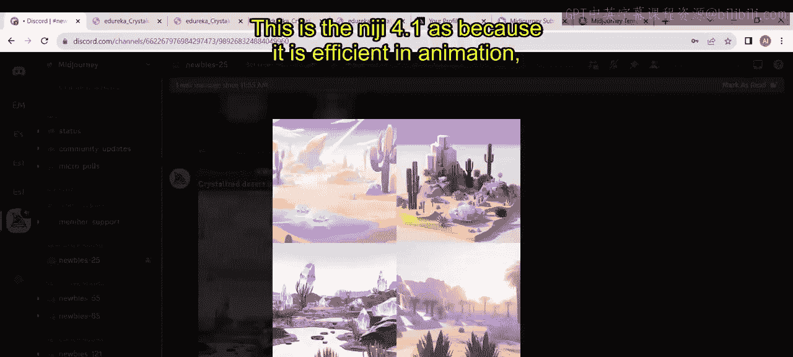

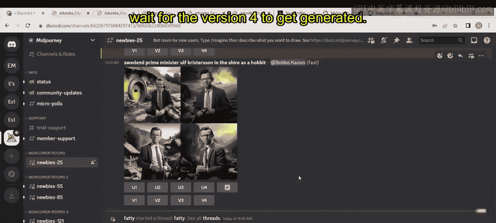

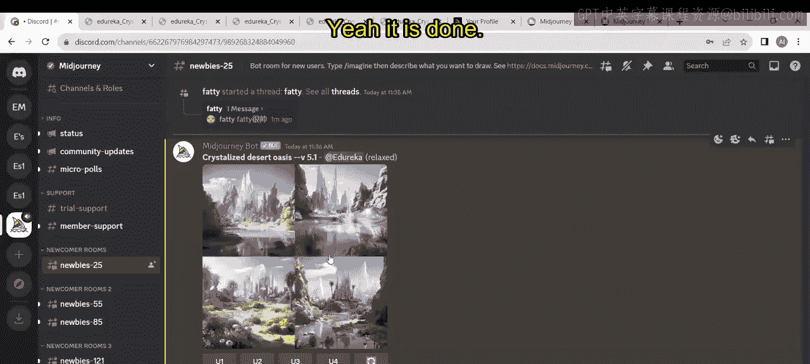

## 切换至版本5.1模型

接下来，我们尝试版本5.1。再次输入 `/settings`，选择 `Midjourney version 5.1`。然后，同样使用 `/imagine` 命令和相同的提示词 `crystallized dessert oasis` 生成图像。

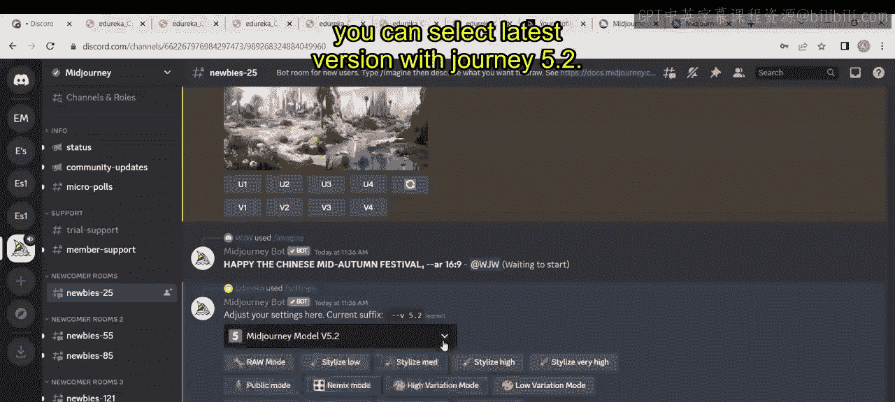

图像生成后，点击查看。您可以观察到版本5.1生成的图像与版本4存在差异。同时，等待之前版本4生成的图像完成。

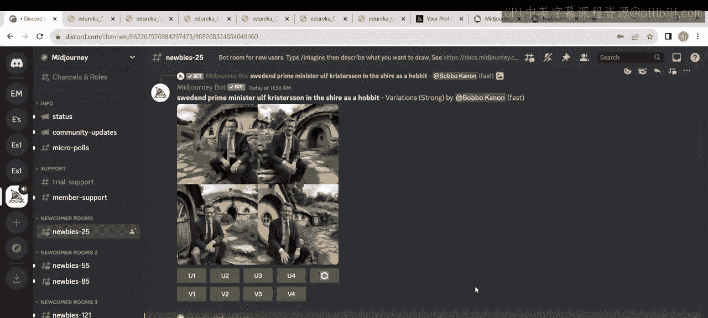

将版本5.1的图像在浏览器中打开，可以更清晰地看到其图像质量的不同。

## 尝试最新版本5.2模型

现在，让我们测试最新的版本5.2。输入 `/settings`，选择 `Midjourney version 5.2` 或保留默认模式（默认会使用最新版本）。再次使用相同的提示词生成图像。

这是最新版本生成的结果。通过对比版本1、2、3、4、Niji（动画风格）、5.1和5.2，您可以清晰地看到图像质量的提升，即使在放大后细节表现也不同。Midjourney仍在持续开发中，我们期待未来的更新。

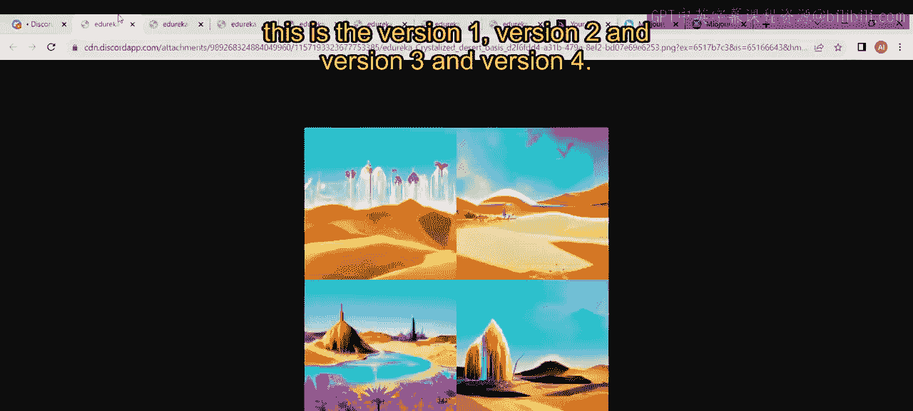

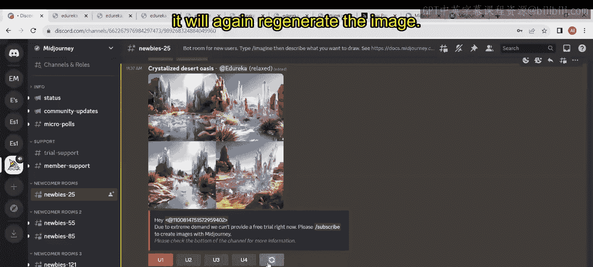

## 图像操作：放大与重新生成

如果您对某张图不满意，可以进行操作。以下是可用的操作：

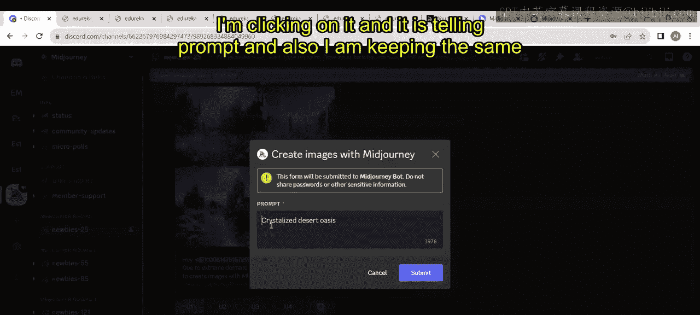

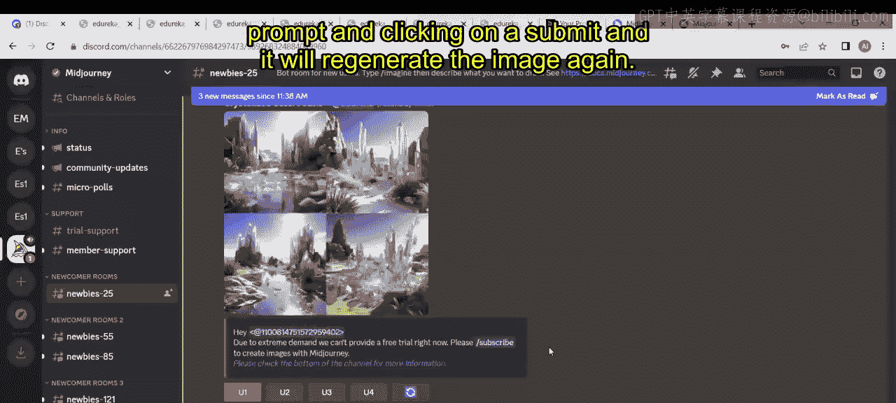

*   **放大图像**：在生成的四宫格图片下，点击 `U1`、`U2`、`U3` 或 `U4` 来放大对应的单张图片。
*   **重新生成**：点击 `🔄`（重新生成）按钮，系统将基于原提示词重新生成一组四张新图像。

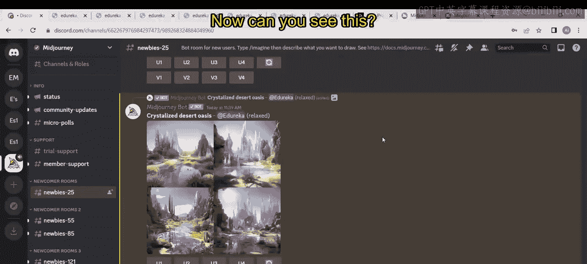

例如，点击重新生成按钮，系统会再次处理相同的提示词。

新生成的图像会有些许变化。在浏览器中打开对比，虽然差异不巨大，但在植物等细节上可以看到不同的处理方式。

## 默认版本说明

通常，您无需每次手动设置版本。Midjourney默认会使用其最新的可用版本（当前是5.2）来生成图像。只有在需要特定风格或效果时，才需要前往设置中选择旧版本或特殊模型（如Niji）。

## 总结

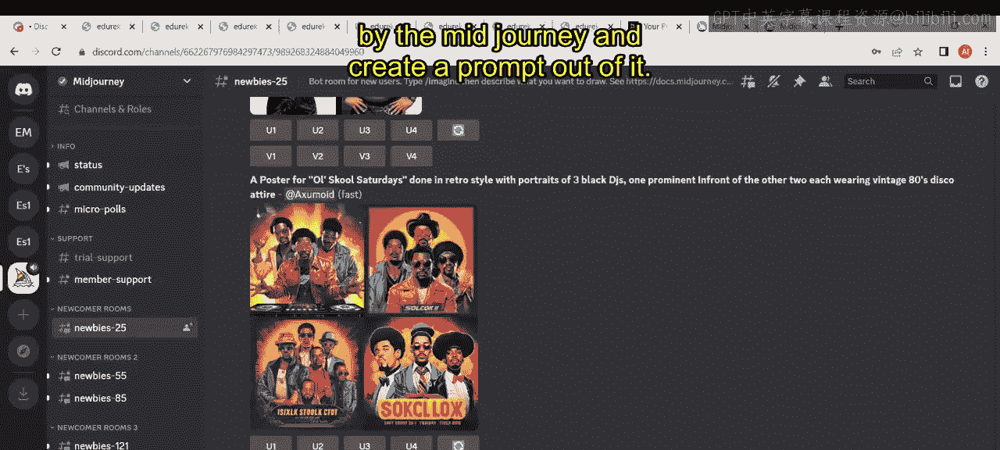

本节课中，我们一起实践了Midjourney的图像生成流程。我们学习了：

1.  如何使用 `/settings` 命令切换不同模型版本。
2.  如何通过 `/imagine` 命令和提示词生成图像。
3.  对比了从版本4到5.2的图像生成效果，直观了解了版本的迭代带来的质量提升。
4.  掌握了放大单张图像（`U`按钮）和重新生成（`🔄`按钮）的基本操作。

您现在已经完成了首次Midjourney图像生成实践，并理解了不同版本间的差异。接下来，您可以尝试使用不同的提示词，探索更多创意可能。

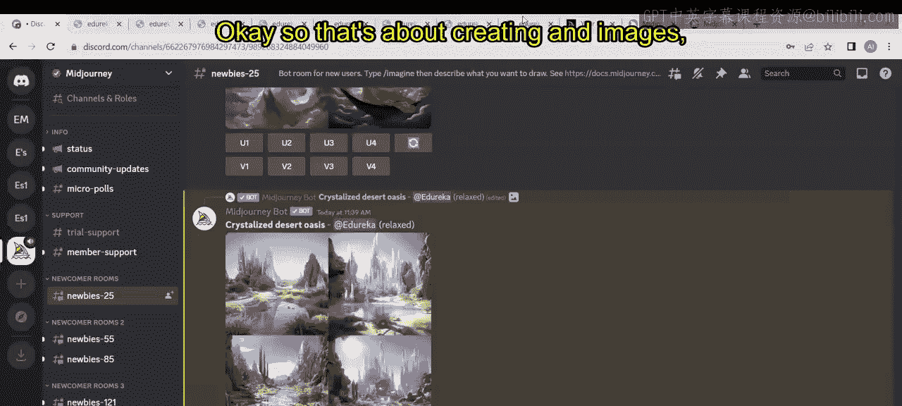

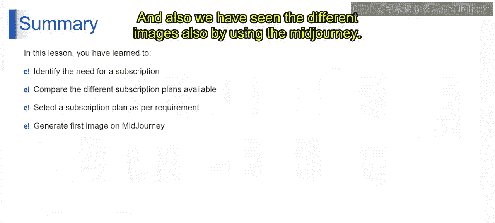

