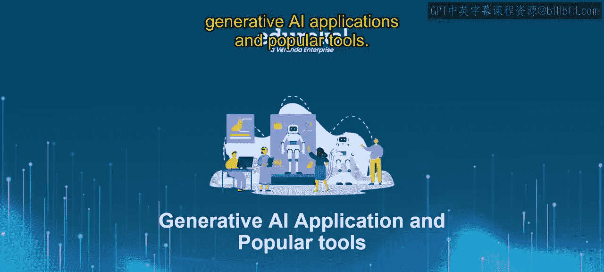
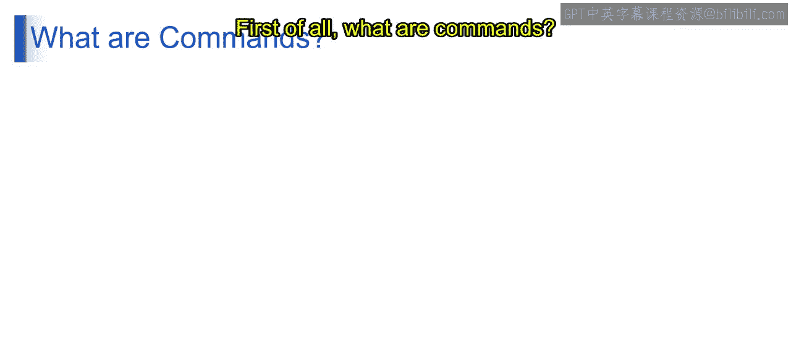
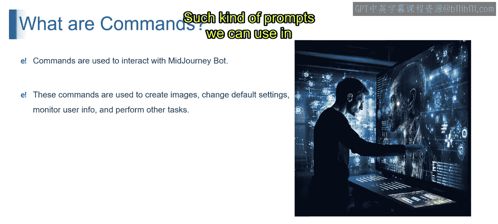
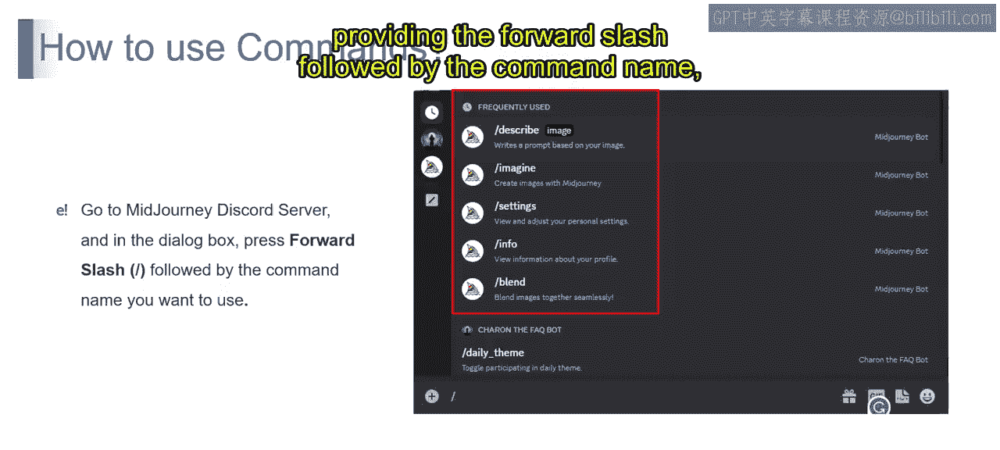
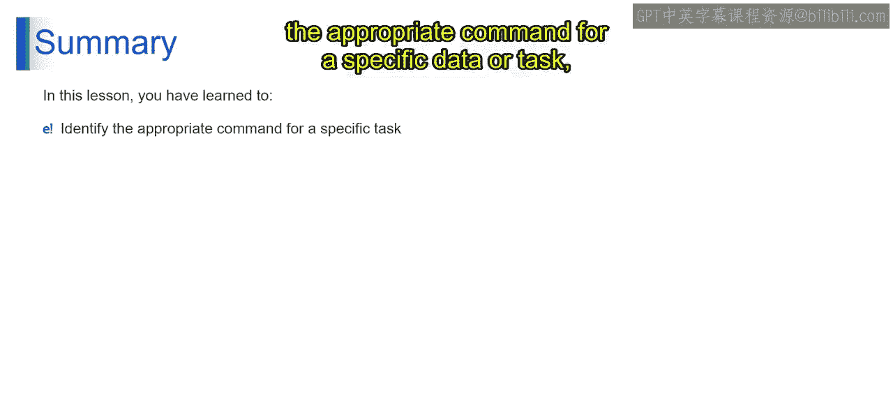
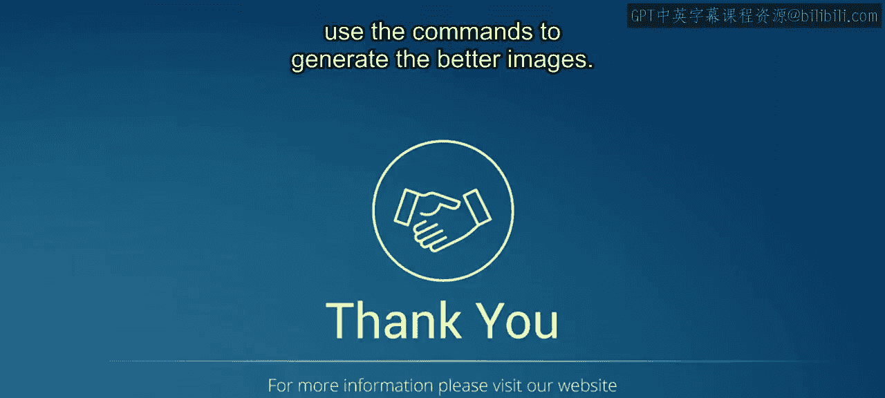

# 第二三四部分 134：使用Midjourney命令指南 🖼️

在本节课中，我们将学习如何使用Midjourney的各种命令来生成和操控图像。我们将了解每个命令的功能，并学习如何将它们应用于具体的图像生成任务中。

## 概述

Midjourney命令是用户与Midjourney机器人交互的主要方式。这些命令用于创建图像、更改默认设置、监控用户信息以及执行其他任务。通过掌握这些命令，你可以更精确地控制图像生成过程。

## 什么是Midjourney命令

首先，我们来了解什么是命令。命令用于与Midjourney机器人交互。这些命令用于创建图像、更改默认设置、监控用户信息以及执行其他任务。

如果你还记得之前的例子，我们在生成图像时使用了`/settings`命令来更改所使用的模型版本。如果你想提供提示词，则需要使用名为`/imagine`的命令，然后提供提示词。这类命令用于按照我们的意愿创建图像。

这些Midjourney命令可以在任何允许Midjourney机器人操作的Discord服务器频道、私人Discord服务器中，或在与Midjourney机器人的直接消息中使用。

以上就是关于命令及其使用方法的介绍。我们了解到Midjourney中存在多个命令。

## 如何使用命令

那么，我们如何实际使用这些命令呢？为此，我们需要前往Midjourney的Discord服务器，然后通过输入斜杠`/`后跟你想使用的命令名称来开始使用。

以下是Midjourney中可用的主要命令列表及其功能说明。

### 图像生成与操控命令

以下是用于创建和修改图像的核心命令。

*   **`/imagine`**：此命令用于根据文本提示创建图像。它允许用户生成创意图像。使用格式为：`/imagine prompt: [你的描述]`。
*   **`/blend`**：如果你想调整输出中不同元素或风格之间的平衡，可以使用此命令。
*   **`/remix`**：此命令切换混音模式，允许你通过混合现有图像来创建新图像。它的作用是将多个元素组合或混合，以创建独特的构图。
*   **`/show`**：此命令用于在Discord中重新生成某个图像任务，或直接使用图像任务ID来获取结果。
*   **`/relax`**：此命令切换到放松模式，生成的图像更可能具有放松或平静的风格。通常，默认情况下图像就是在放松模式下生成的。

### 图像风格与设置命令

以下命令用于控制图像的视觉风格、质量以及用户的个人偏好设置。

*   **`/style`**：此命令将风格应用于图像，影响其视觉或主题风格。如果你想改变图像的外观风格，可以使用它。
*   **`/fast`**：此命令切换到快速模式，能更快地生成图像，但质量显然会降低。
*   **`/settings`**：此命令允许你查看和调整Midjourney的机器人设置。例如，我之前用它来更改生成图像的模型版本。它不仅用于这个单一目的，你还可以通过设置和偏好选项来访问工具的自定义选项。
*   **`/prefer`**：此命令设置用户对内容生成特定方面的偏好。它允许你创建或管理自定义选项。
*   **`/prefer option list`**：此命令允许你查看当前的自定义选项，即列出可用的偏好设置。
*   **`/suffix`**：此命令允许你设置一个后缀，将其附加到每个提示词的末尾。这意味着它将附加用户特定的元素，以实现内容生成的自定义化。

### 信息与帮助命令

以下命令用于获取帮助、了解工具信息和管理账户。

*   **`/help`**：此命令提供可用命令的帮助。它为我们目前所见的所有功能提供使用工具的协助和指导。
*   **`/about`**：此命令提供关于Midjourney的信息，提供工具的背景和目的介绍。
*   **`/subscribe`**：此命令允许用户接收关于该工具更新的通知。同时，如果你想订阅或购买计划，也可以直接通过它进行，它会为用户账户页面生成一个个人链接。
*   **`/info`**：此命令审查或显示生成的内容，供用户直接评估。

## 总结

本节课中，我们一起学习了Midjourney的命令系统。我们能够识别用于特定数据或任务的适当命令，并且现在理解了如何使用这些命令来生成更好的图像。通过掌握`/imagine`、`/settings`、`/blend`、`/style`等命令，你可以更高效、更精准地利用Midjourney进行创意图像生成。