# 第二三四部分 135：Midjourney命令演示 🎨

在本节课中，我们将学习Midjourney平台的核心命令，通过实际操作演示如何生成、修改和混合图像。我们将从最基本的图像生成开始，逐步探索更多高级功能。

## 概述

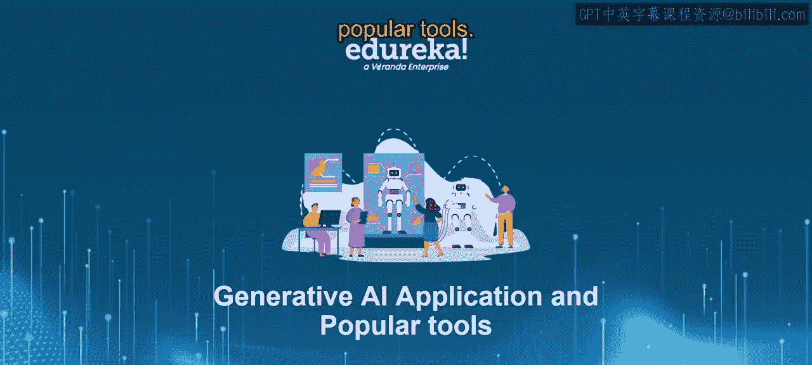

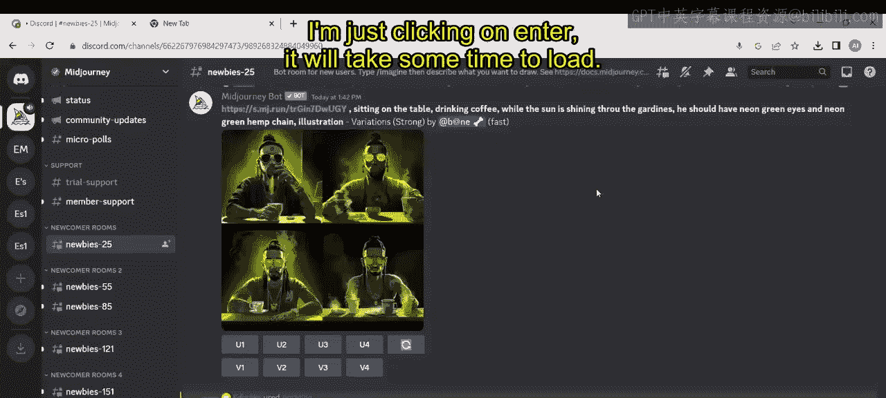

本节教程将详细介绍Midjourney的各项实用命令。我们将学习如何使用 `/imagine` 生成图像，使用 `/blend` 混合图像，以及如何切换生成模式和管理账户设置。每个命令都将通过具体示例进行演示。

---

上一节我们介绍了Midjourney的基本概念，本节中我们来看看其核心命令的具体使用方法。

首先，在Midjourney平台输入斜杠 `/`，可以看到所有可用命令。

以下是第一个核心命令 `/imagine` 的演示步骤，该命令用于根据文本提示生成图像：

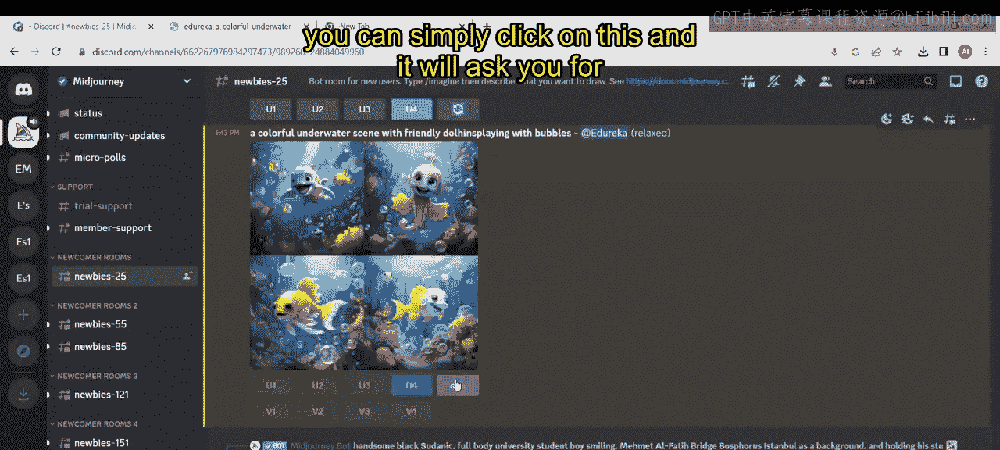

1.  输入 `/imagine` 命令。
2.  在提示框中输入描述，例如：`a colorful underwater scene with friendly dolphins playing with bubbles`。
3.  按下回车键，系统将开始加载并生成图像。

生成过程会显示进度百分比。完成后，系统会提供四张不同的预览图像。用户可以点击任何一张进行放大查看，也可以在新的浏览器标签页中打开或直接下载。

如果对某一张预览图满意，可以点击对应的 `U` 按钮（如 `U4` 选择第四张）来生成该单张图像的高清版本。生成后，可以进一步缩放或自定义缩放比例查看。

如果对生成结果不满意，可以点击 `🔄` 刷新按钮重新生成。系统会再次询问是否修改提示词，用户可以调整描述后提交，以获得新的图像。

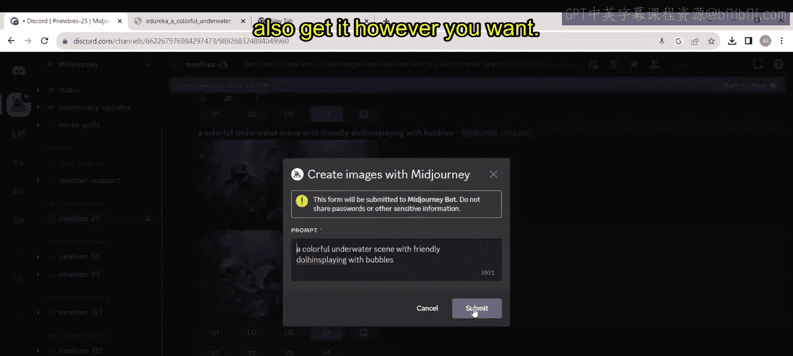

---

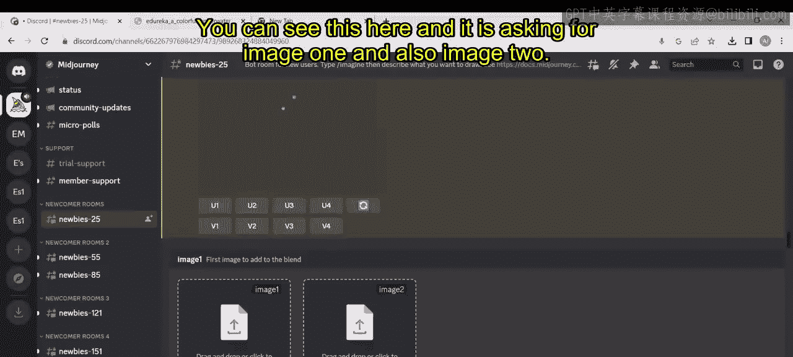

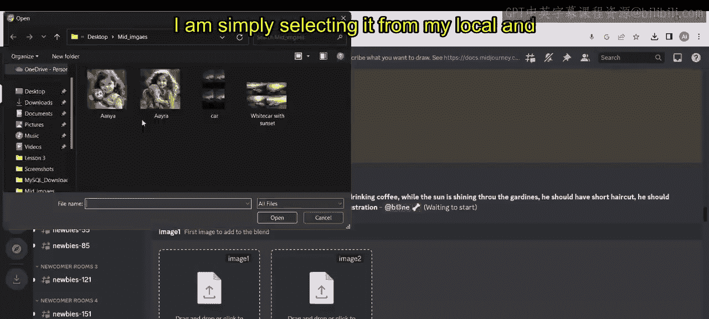

接下来，我们看看 `/blend` 命令，它用于将两张图像混合成一张新图像。

以下是使用 `/blend` 命令的步骤：

1.  输入 `/blend` 命令。
2.  按照提示，从本地设备上传第一张图片（例如：一个抱着猴子玩偶的婴儿）。
3.  上传第二张图片（例如：一个抱着大象玩偶的婴儿）。
4.  按下回车键，系统将开始处理。

该命令会融合两张输入图像的特征，生成一张全新的合成图像作为输出。

---

现在，我们来了解生成模式切换命令。Midjourney提供不同的生成速度模式。

*   **快速模式**：输入 `/fast` 命令可以切换到快速生成模式。在此模式下生成图像速度更快，但可能会消耗“快速时间”，并且图像质量可能略有降低。切换后，使用 `/imagine` 命令生成图像将应用此模式。
*   **放松模式**：输入 `/relax` 命令可以切换回放松模式。在此模式下生成图像不消耗“快速时间”，但生成速度可能较慢。用户可以根据需要在两种模式间切换。

---

账户设置和订阅管理也可以通过命令完成。

以下是相关管理命令：

1.  **`/settings`**：输入此命令会打开一个设置面板，用户可以在此调整图像生成参数，例如切换到 `RAW` 模式、更改模型版本、或重新选择生成模式（快速、涡轮、放松等），也可以重置所有设置。
2.  **`/subscribe`**：输入此命令会提供一个专属链接，点击该链接将跳转到Midjourney官网的订阅页面，用户可以查看详细的定价计划并购买订阅服务。

---

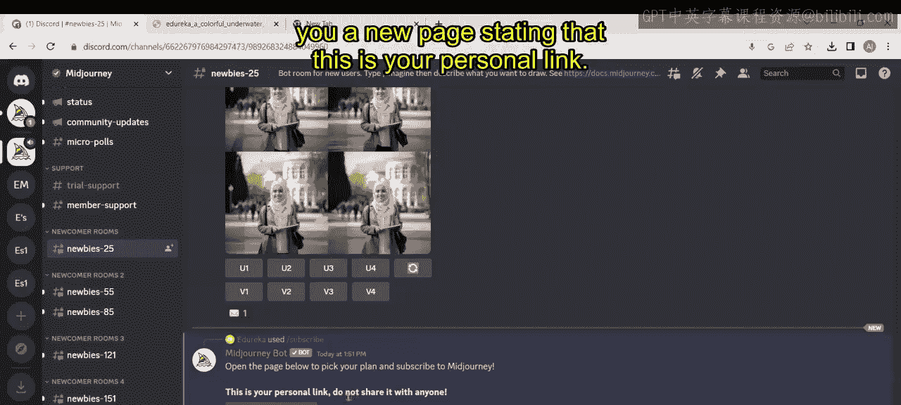

此外，Midjourney还提供其他实用命令来优化创作过程。

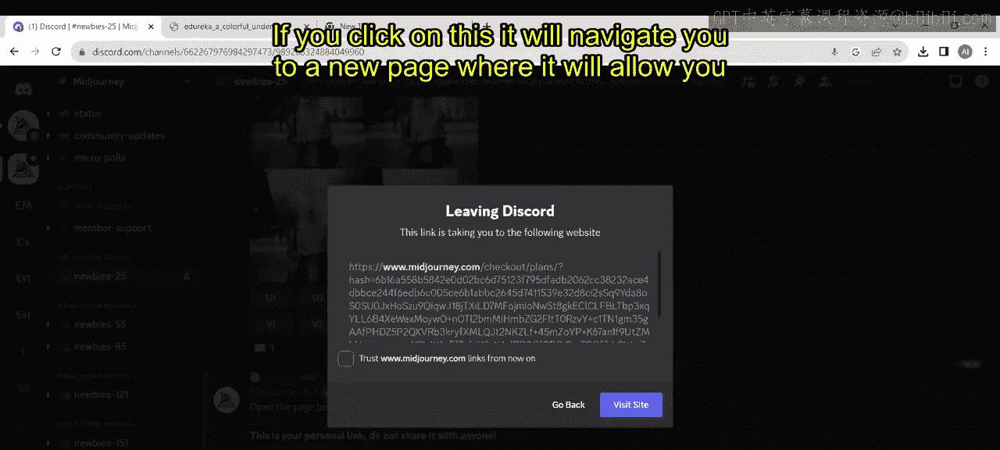

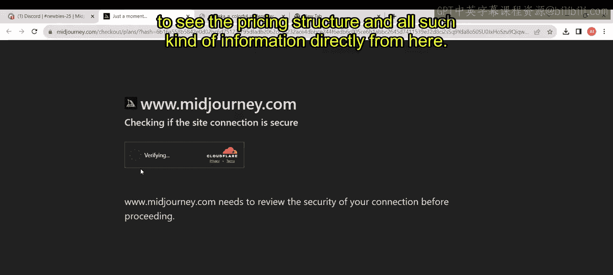

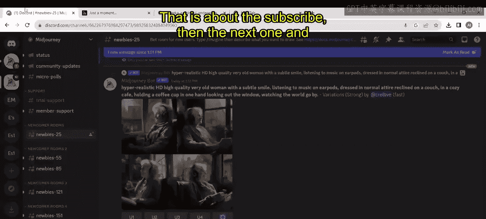

以下是一些辅助命令示例：

*   **风格化命令**：在 `/imagine` 的提示词中，可以加入 `--style` 参数来指定艺术风格。例如：`portrait of a woman in the style of Leonardo da Vinci`。
*   **色彩命令**：同样，可以使用 `--color` 等参数来强调图像的色彩倾向。
*   **偏好设置**：使用 `/prefer` 系列命令可以设置默认选项，如自动混合(`prefer remix`)或自动放大(`prefer autoU`)等。

要探索所有可用命令，只需在对话框中输入 `/`，即可查看列表并逐一尝试。

---

## 总结

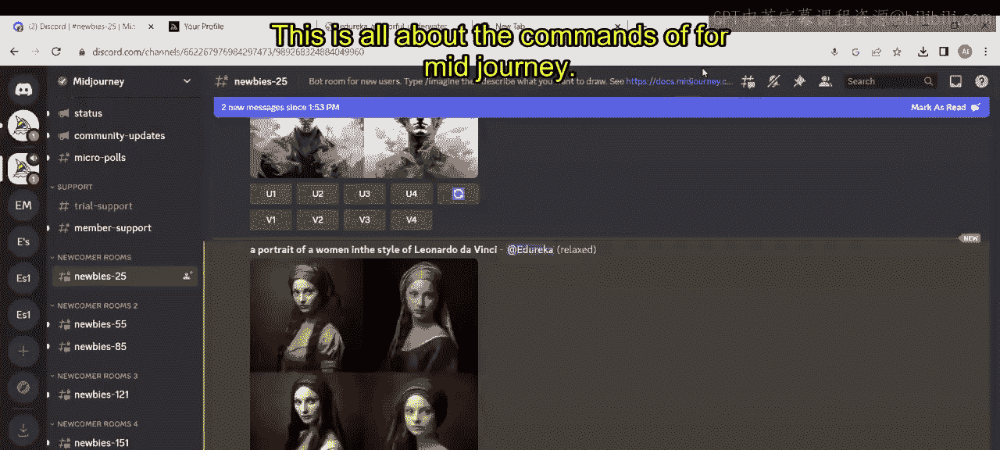

本节课中我们一起学习了Midjourney的核心操作命令。我们掌握了使用 `/imagine` 根据文本生成图像，使用 `/blend` 混合多张图像，以及如何使用 `/fast` 和 `/relax` 切换生成模式。我们还了解了通过 `/settings` 调整参数和通过 `/subscribe` 管理订阅。通过灵活运用这些命令，你可以更高效地利用Midjourney进行图像创作。