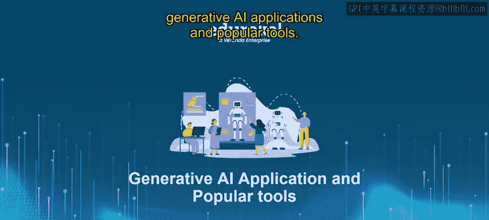
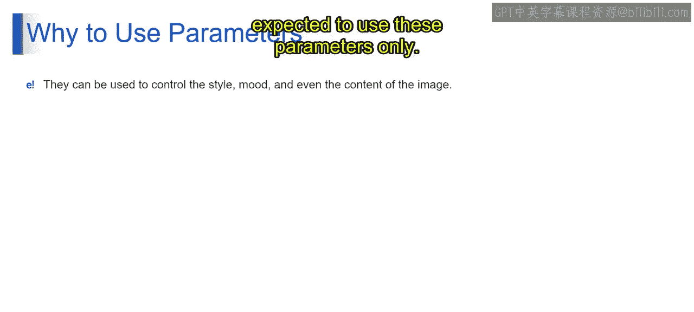
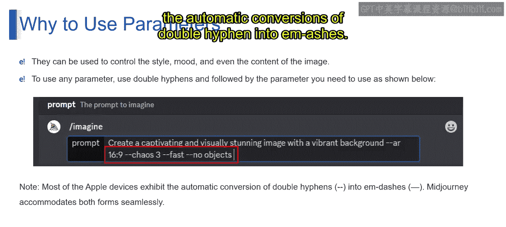
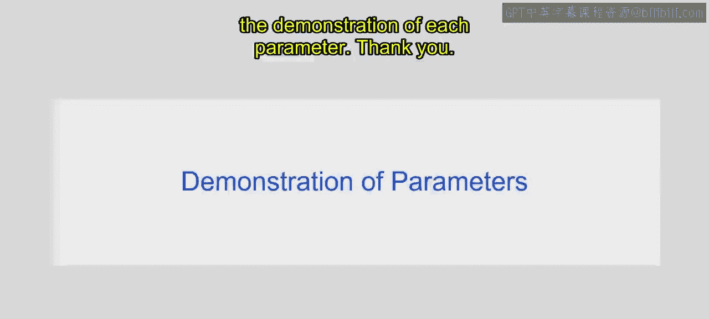

# 第二三四部分 136：使用Midjourney参数指南 🎨




在本节课中，我们将学习Midjourney平台中参数的使用方法。参数是添加到提示词末尾的选项，用于改变图像的生成方式，例如宽高比、风格、质量等。掌握参数的使用，能让你更精准地控制AI生成的图像。

## 什么是Midjourney参数？ 🤔

上一节我们介绍了Midjourney的基本图像生成命令。本节中，我们来看看如何通过参数来精细调整生成结果。

Midjourney参数是添加到提示词末尾的选项，用于改变图像的生成方式。参数可以调整图像的**宽高比**、**风格**、**质量**等诸多方面。这些参数总是附加在提示词的结尾，并且你可以在一个提示词中包含多个参数。

## 为何要使用参数？ 🎯

使用参数的主要目的是为了获得对生成图像的精确控制。以下是几个常见的使用场景：

以下是使用参数的一些具体原因：

*   **控制图像宽高比**：例如，你可能需要为社交媒体帖子生成方形图像，或为宽屏显示器生成16:9比例的图像。为此，你需要使用**宽高比参数**。
*   **控制图像风格**：例如，你想生成写实图像、抽象图像或卡通风格图像。这可以通过相应的**风格参数**来实现。
*   **控制图像质量**：例如，你可能需要为快速预览生成低质量图像，或为印刷出版生成高质量图像。这可以通过**质量参数**来控制。
*   **控制创意与多样性**：例如，你可能想生成一系列基于同一主题的变体图像，或者生成彼此完全不同的图像。这涉及到对图像**创意和多样性**的控制。
*   **排除特定内容**：例如，你可能希望阻止Midjourney生成包含暴力或裸露内容的图像。这可以通过**排除参数**来实现。

## 如何使用参数？ 💻

要使用任何参数，你需要在提示词末尾添加双连字符 `--`，然后跟上参数名和值。

以下是一个示例：

```
/imagine prompt: create a cap and visually stunning image with a vibrant background --ar 16:9 --chaos 3 --fast --no objects
```

在这个例子中，我们期望生成一张没有物体、具有特定尺寸、更具创意且快速生成的图像。

> **注意**：大多数苹果设备会自动将双连字符 `--` 转换为破折号 `—`。Midjourney对这两种形式都能无缝兼容。



## 参数演示 📸

现在，让我们通过演示来具体了解每个参数的效果。

（此处原课程包含演示图片，展示了不同参数如何影响图像生成。由于无法直接显示图片，建议您在实践中尝试不同的参数组合以观察效果。）

---





本节课中，我们一起学习了Midjourney参数的核心概念与使用方法。我们了解到参数是控制图像生成的关键工具，可以通过在提示词末尾添加 `--参数名 值` 的格式来使用。通过调整宽高比、风格、质量等参数，你可以更有效地引导AI生成符合你特定需求的图像。建议多加练习，熟悉各个参数的效果。