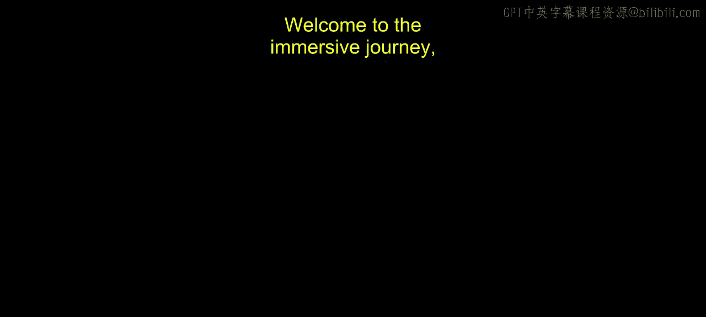
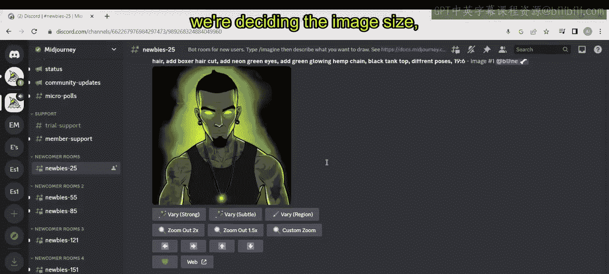
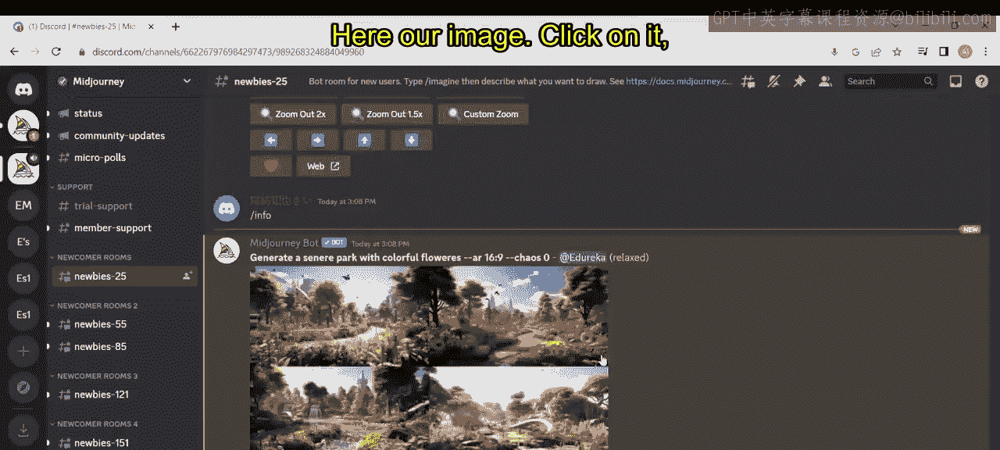
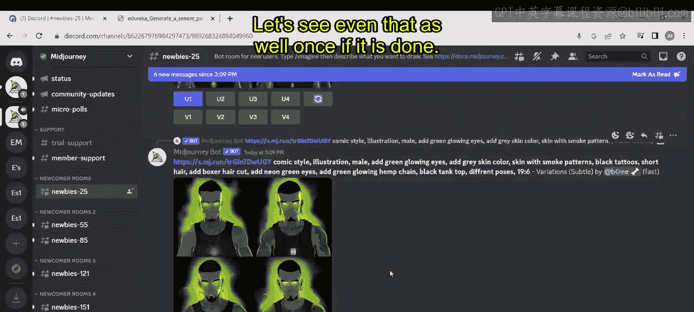
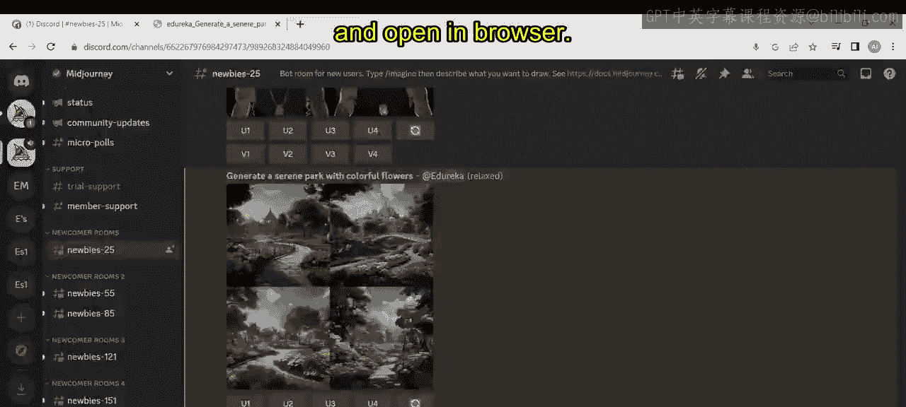
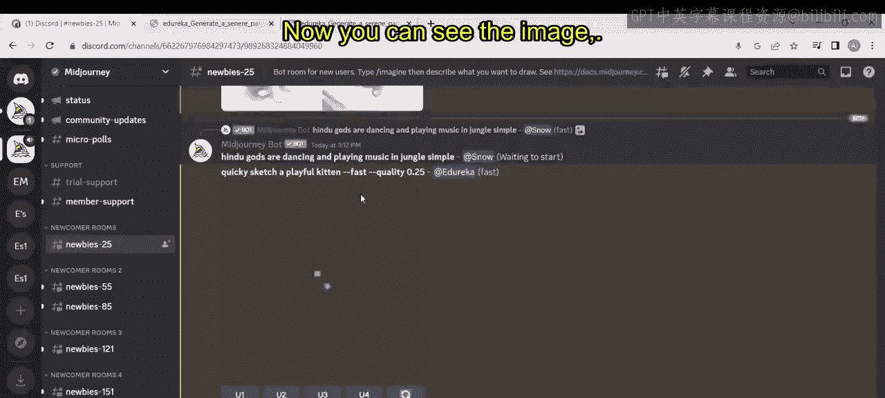
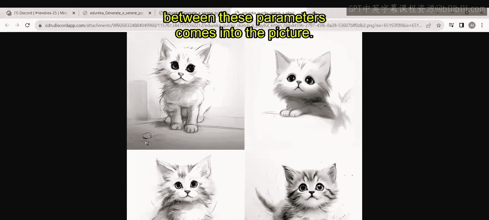
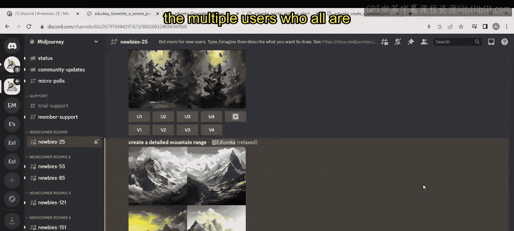
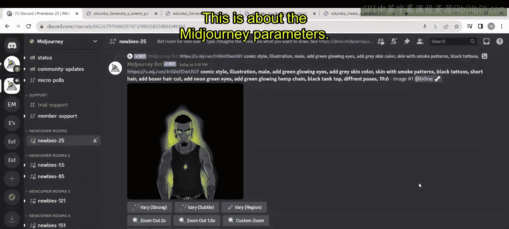

# 第二三四部分 137：Midjourney参数演示 🎨

在本节课中，我们将学习Midjourney中各种参数的实际应用。通过具体的示例，我们将了解如何通过添加参数来精确控制生成图像的尺寸、风格、质量和生成速度。




上一节我们介绍了Midjourney的基本用法，本节中我们来看看如何通过参数来精细化控制图像生成过程。

## 概述

参数是添加到提示词后的指令，用于调整图像的生成方式。要使用参数，首先需要一个提示词，然后在后面添加参数。参数以双连字符 `--` 开头，后跟参数名称和值。

## 参数使用基础

以下是一个基本示例。我们使用 `/imagine` 命令和一个提示词开始。

```
/imagine 一个有着五颜六色花朵的公园
```





现在，我想为这张图决定宽高比。为此，我需要添加参数。按照规则，我们使用双连字符 `--` 后跟参数名。这里我的参数名是 `aspect`，我给出的比例是 `6:9`。同时，我还添加了另一个参数 `chaos`，并将其值设为 `0`。

```
/imagine 一个有着五颜六色花朵的公园 --aspect 6:9 --chaos 0
```

点击回车后，等待图像生成。这需要一些时间。

*   **`--chaos` 参数**：控制图像的随机性和创造性。值范围通常在0-100之间。
    *   `--chaos 0`：生成更一致、更符合提示词描述的图像。
    *   更高的值（如 `--chaos 50` 或 `--chaos 100`）会使结果更具创造性和多样性。
*   **`--aspect` 或 `--ar` 参数**：决定生成图像的宽高比。
    *   例如 `--ar 1:1` 是正方形，`--ar 16:9` 是宽屏，`--ar 9:16` 是竖屏。

现在，让我们做一件事。我将使用相同的提示词，但不添加任何参数，然后观察两者的区别。这样我们就能理解参数的重要性。

```
/imagine 一个有着五颜六色花朵的公园
```



## 核心参数详解



正如之前提到的，是否使用 `--chaos` 或 `--aspect` 参数完全取决于你的需求。如果你想决定图像的尺寸，可以使用 `--aspect`。如果你想决定图像是更写实还是更具创意，可以使用 `--chaos`。

此外，还有其他重要参数：
*   **`--fast`**：如果你希望更快地生成图像，可以使用 `--fast` 参数，但这可能会影响质量。
*   **`--iw` (Image Weight)**：图像权重。这个参数用于平衡提示词中文本和参考图像的重要性。

让我们在下一个例子中解释 `--iw` 参数。

## 图像权重参数示例



图像权重决定了是文本提示词更重要，还是你提供的参考图像（如果有的话）更重要。

```
/imagine 未来主义城市景观与宇宙飞船结合 --iw 1
```



这里发生的事情是：
*   如果设置 `--iw 1`，图像（如果提供了）和文本提示词具有同等重要性。
*   如果设置 `--iw 0`，文本提示词将扮演更重要的角色。
*   如果设置 `--iw 2`，图像提示（如果提供了）将比文本更重要。

## 质量与速度参数

如果你想生成高质量图像，可以使用 `--quality` 或 `--q` 参数。同时，也可以结合 `--relax` 模式（如果可用）来节省快速模式时间。

```
/imagine 创建一幅详细的山脉景观 --quality 1
```

点击回车，等待图像生成。你可以直接从生成的图像中看到质量差异。

## 其他实用参数

同样地，我们已经了解了 `--iw`、`--aspect`、`--chaos`、`--fast` 等参数。你还可以使用其他参数，例如：

以下是其他一些有用的参数示例：
*   `--no people`：在生成的图像中不出现人物。
*   `--stop <数值>`：在指定的迭代百分比处停止生成过程（例如 `--stop 50` 在50%时停止）。
*   `--turbo`：使用涡轮模式进行极速生成，但会消耗更多的快速时间。

```
/imagine 生成一幅铅笔的快速草图 --turbo
```

你可以感受到生成速度的差异。这就是不同参数带来的区别。

## 更多参数尝试

还有一个例子，比如 `--weird` 参数，它可以尝试生成非常规、奇特的图像。你可以尝试点击并使用它。

```
/imagine [你的提示词] --weird
```

这些只是你可以使用的不同参数中的一部分。同样，你还可以尝试：
*   `--stylize <数值>` 或 `--s`：调整图像的艺术化程度。
*   `--tile`：生成可平铺的图案图像。
*   `--style raw`：使用更接近早期Midjourney版本的原始风格。

有大量的参数可供使用，你可以尝试将它们应用于不同的提示词，从而生成各种各样的图像。这也是我们看到许多用户能利用这些参数创造出丰富多彩作品的原因。

## 总结





本节课中我们一起学习了Midjourney的关键参数及其应用。我们了解到，通过添加如 `--aspect`、`--chaos`、`--quality`、`--iw` 和 `--fast` 等参数，可以精确控制生成图像的尺寸、创意度、质量、内容侧重以及生成速度。掌握这些参数是进行精细化AI绘画创作的重要一步。