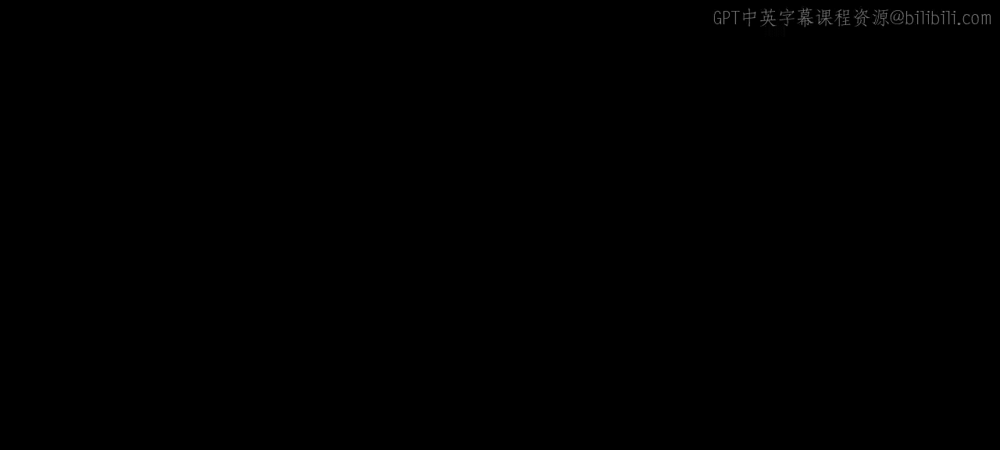
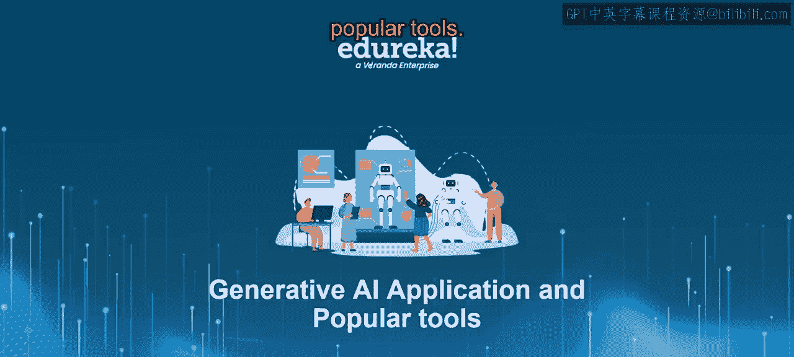
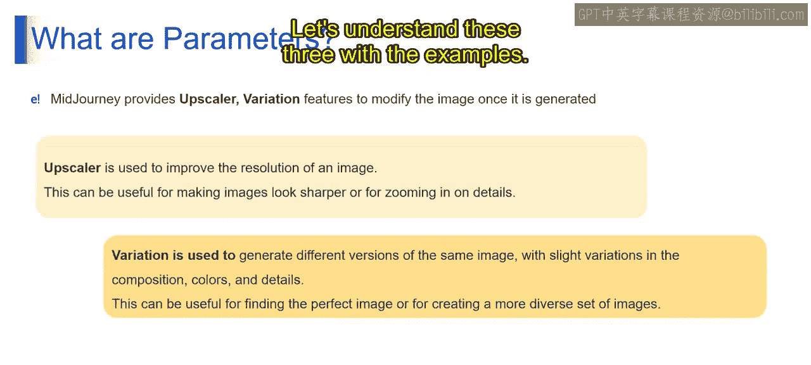
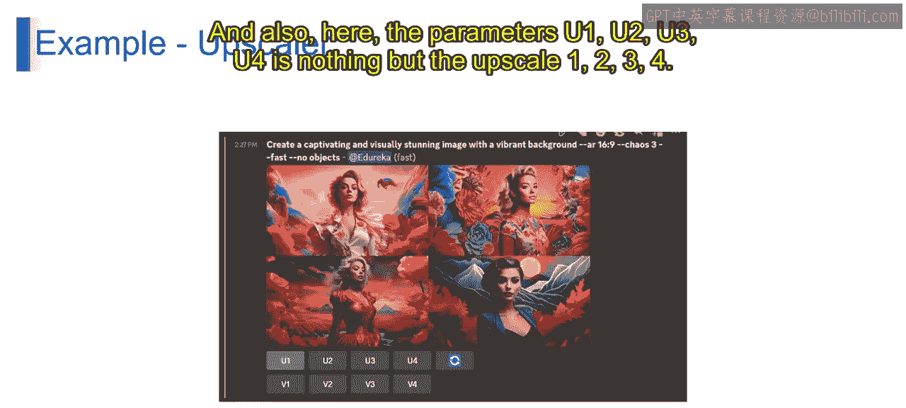
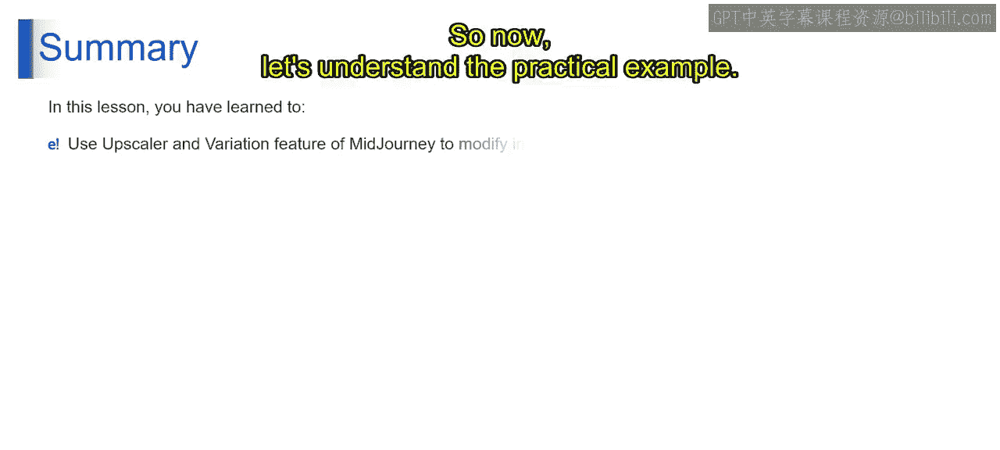
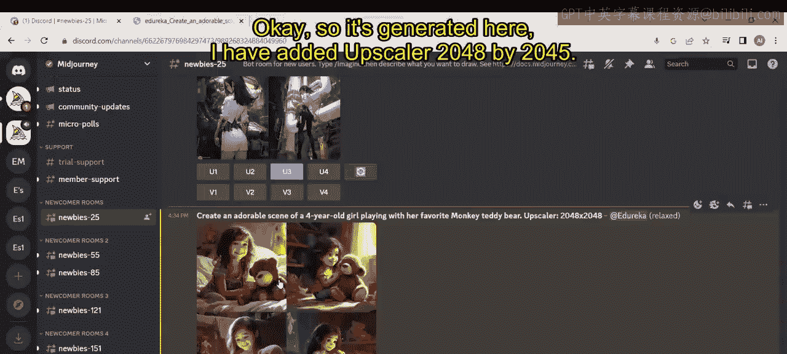
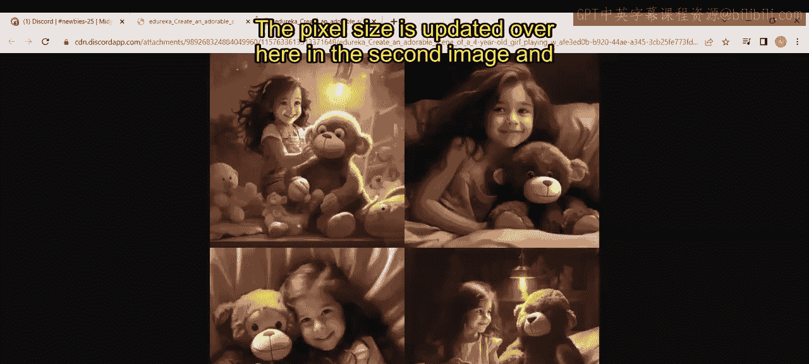
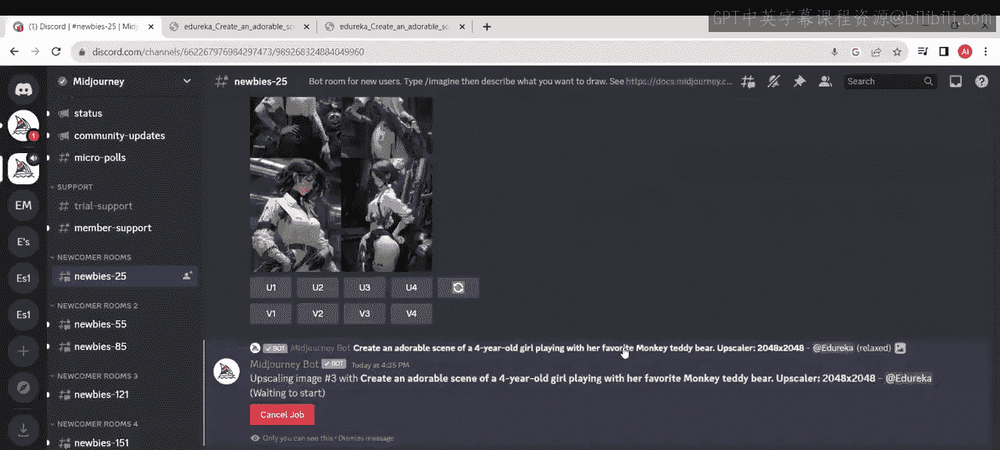
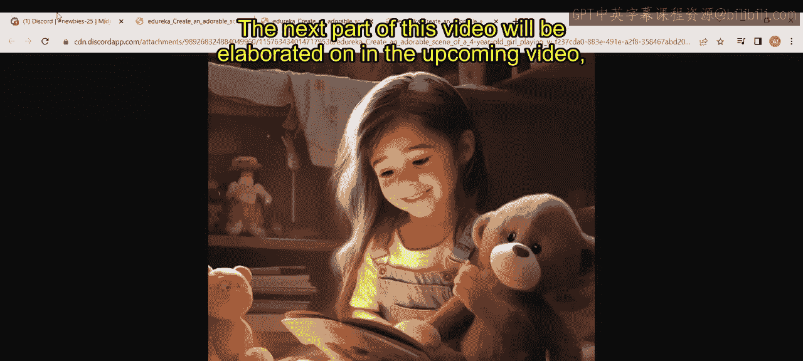
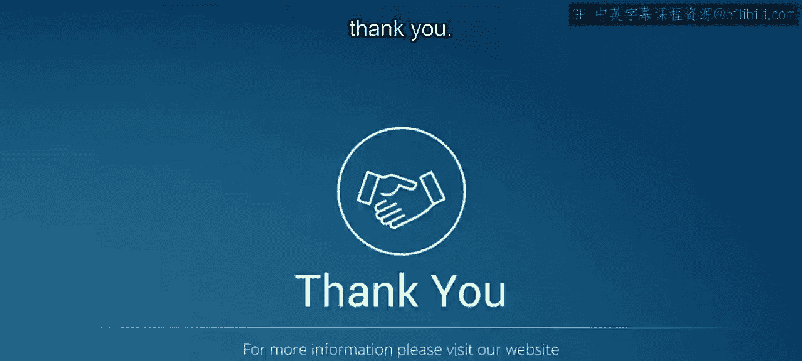

# 第二三四部分 138：使用Midjourney修改图像 🖼️





在本节课中，我们将学习如何使用Midjourney工具来修改和优化生成的图像。我们将重点介绍两个核心参数：**Upscale（放大）** 和 **Variation（变体）**，并通过实例演示它们如何改变图像的细节与风格。

---

## 概述

Midjourney提供了多种图像参数来控制生成图片的风格、质量和分辨率。其中，**Upscale** 和 **Variation** 是两个至关重要的参数，它们分别用于提升图像的分辨率和生成基于原图的新变体。掌握这两个参数，能让你更灵活地操控AI生成的艺术作品。

---

## 理解Midjourney的图像参数

上一节我们介绍了Midjourney的基本用法，本节中我们来看看用于修改图像的具体参数。这些参数主要用于控制生成图像的风格、质量和分辨率。

以下是两个最重要的图像修改参数：

1.  **Upscale（放大）参数**
    *   **功能**：`--up` 参数用于提高图像的分辨率，使其更大、更详细。这对于需要打印或高清发布的图像非常有用。
    *   **使用方法**：在提示词（prompt）的末尾添加该参数。例如，在生成图像的基本命令后，指定目标像素尺寸。
    *   **代码示例**：`/imagine prompt: a beautiful landscape --up 2048`

2.  **Variation（变体）参数**
    *   **功能**：`--variation` 参数基于一张现有图像生成新的变体。这有助于探索同一主题的不同创意可能性。
    *   **使用方法**：在提示词末尾添加该参数，并指定变体强度。强度值越高，生成的图像差异越大；值越低，则图像越相似。
    *   **代码示例**：`/imagine prompt: a portrait of a cat --variation 0.5`

此外，你还可以将Upscale和Variation参数结合使用，以同时获得高分辨率和多样化的图像结果。

---







## 实践示例：生成与修改图像

现在，让我们通过一个实际例子来理解这些参数的应用。我们将使用Midjourney生成一张图像，并对其进行放大和变体操作。

首先，我们输入一个基础提示词来生成初始图像。

**操作**：在Midjourney中输入以下命令：
```
/imagine prompt: create an honorable scene of a four years old girl playing with her favorite monkey teddy bear
```

生成完成后，你会得到四张不同的图像变体（V1, V2, V3, V4），以及对应的四个放大选项（U1, U2, U3, U4）。U代表Upscale，V代表Variation。

接下来，我们在同样的提示词后添加Upscale参数，以生成更高分辨率的图像。

**操作**：输入修改后的命令：
```
/imagine prompt: create an honorable scene of a four years old girl playing with her favorite monkey teddy bear --up 2048
```



生成后，对比两张图像，可以清晰看到第二张图像的像素尺寸和细节得到了显著提升。

最后，你可以选择其中一张喜欢的变体（例如V3），并点击其对应的放大按钮（U3），来单独对该变体进行高清化处理。





---

## 总结





本节课中，我们一起学习了Midjourney中修改图像的两个核心工具：**Upscale** 和 **Variation**。通过Upscale参数，我们可以提升图像的尺寸和细节；通过Variation参数，我们可以基于原图探索更多创意方向。结合使用这两个参数，能够让你更有效地控制和优化AI生成的图像，以满足不同场景的需求。在接下来的课程中，我们将继续深入探讨Midjourney的其他高级功能。