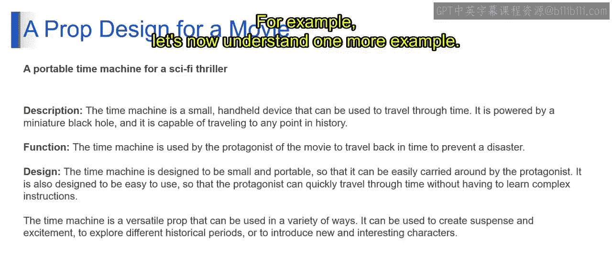
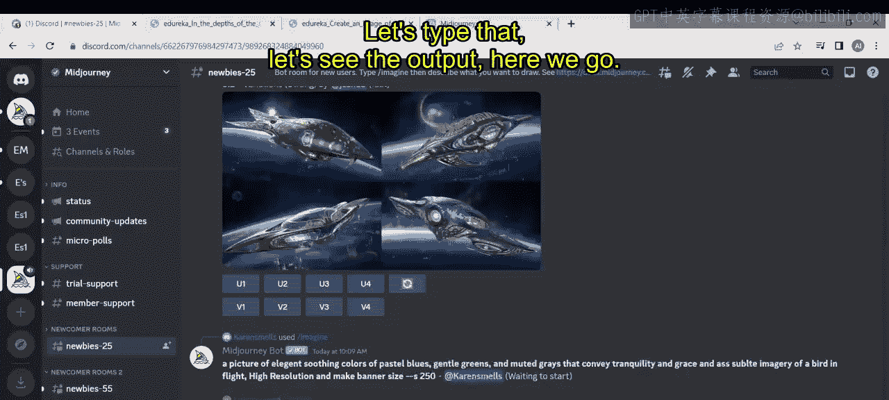
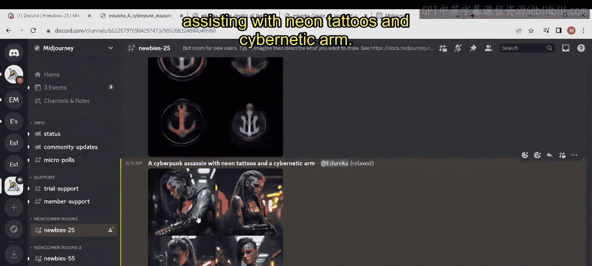
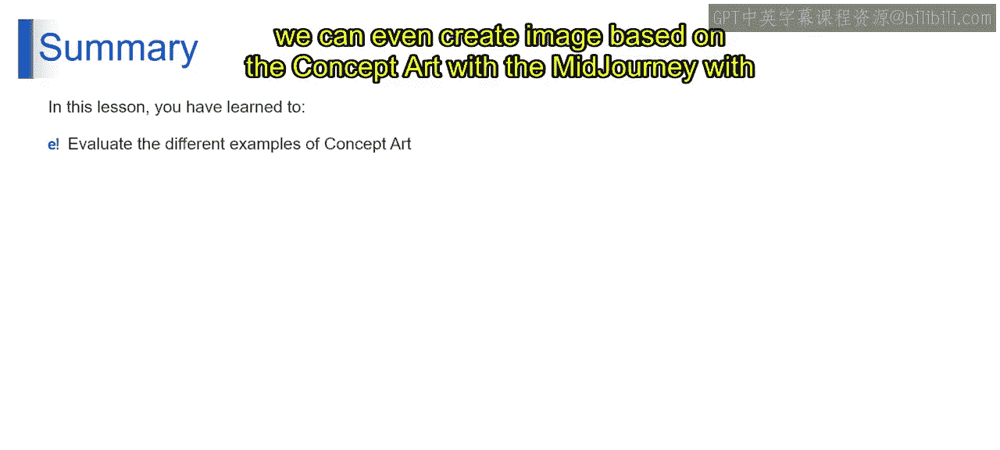
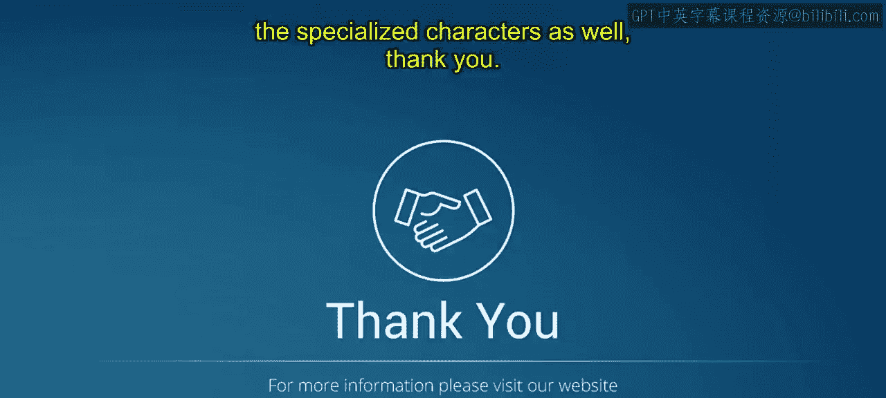

# 第二三四部分 139：概念艺术演示 🎨

在本节课中，我们将学习如何使用Midjourney进行概念艺术创作。我们将理解概念艺术的定义、应用场景，并通过分析具体示例，学习如何撰写描述并生成概念艺术图像。

## 概述

概念艺术是一种用于可视化表达想法的数字艺术形式，广泛应用于电影、电子游戏、动画和漫画等领域。它是一种向其他艺术家和设计师传达创意，并帮助项目所有参与者理解整体愿景的方式。Midjourney是一个强大的人工智能图像生成器，可用于创建从写实到超现实等各种风格的概念艺术。

## 什么是概念艺术？

在Midjourney中，概念艺术是一种数字艺术，用于创建想法的视觉表现。它被用于电影、电子游戏、动画、漫画书以及其他媒体。这是一种向其他艺术家和设计师传达想法的方式，有助于项目中的所有参与者理解整体愿景。

Midjourney是一个强大的AI图像生成器，可用于创建广泛风格的概念艺术，从写实到超现实。正因如此，艺术家们已经用它为各种项目创作了令人惊叹的概念艺术。

## 如何使用Midjourney创建概念艺术？

要使用Midjourney创建概念艺术，您只需输入描述您想创建图像的文本提示。

例如，您可以输入：
`cyberpunk city at night`
或
`a dragon flying through a forest`

Midjourney随后会根据您的提示生成一系列图像。然后，您可以选择最喜欢的图像，并优化您的提示以创建更具体的结果。

## 概念艺术的应用场景

Midjourney中的概念艺术可用于多种目的，并不局限于单一领域。以下是一些应用示例：

*   为电子游戏设计的角色。
*   为科幻作品设计的宇宙飞船。
*   奇幻景观。
*   未来主义城市。
*   为电影设计的道具。
*   为戏剧设计的服装。

Midjourney是一个**文生图扩散模型**，可用于创建概念艺术。它是一个强大的工具，可以生成从真实到奇幻的各种图像。

## 实例分析：电影道具设计

现在，让我们通过一个例子来理解具体操作：为一部科幻惊悚片设计一个便携式时间机器。

**描述**：时间机器是一个小型手持设备，可用于穿越时间。它由微型黑洞提供动力，能够前往历史上的任何时间点。

**功能**：在电影中，主角使用时间机器回到过去以阻止一场灾难。

**设计**：时间机器的设计小巧便携，便于主角随身携带。它的设计也易于使用，使主角无需学习复杂的指令就能快速穿越时间。

时间机器是一个多功能的道具，可以通过多种方式使用。它可以用来制造悬念和兴奋感，探索不同的历史时期，或者引入新的有趣角色。这就是在电影中应用它的预期方式。

## 实践演示：生成未来角色

让我们打开Midjourney，尝试为未来角色创建概念艺术。

例如，我们输入提示：
`a cyberpunk assassin with neon tattoos and a cybernetic arm`

然后，我们可以查看Midjourney生成的输出。通过输入这样的描述，我们就能利用概念艺术为电影或电子游戏生成特定的角色设计。这是一个具体的生成示例。

## 总结

本节课中，我们一起学习了概念艺术在Midjourney中的应用。我们了解了概念艺术的定义和广泛用途，掌握了通过文本提示生成图像的基本方法，并通过电影道具设计和未来角色生成两个实例，具体分析了从描述构思到图像生成的完整流程。Midjourney作为一个强大的文生图工具，能够帮助创作者高效地将抽象想法转化为具体的视觉概念。