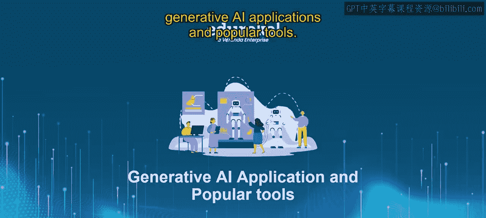
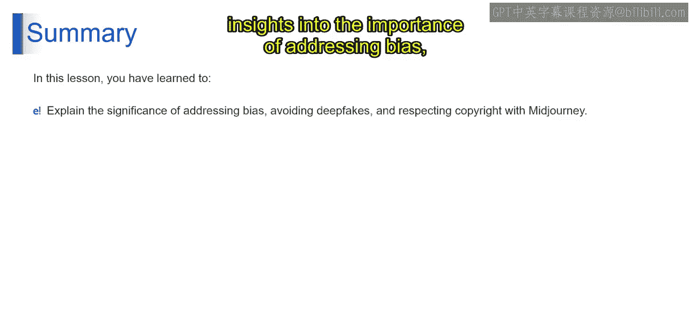
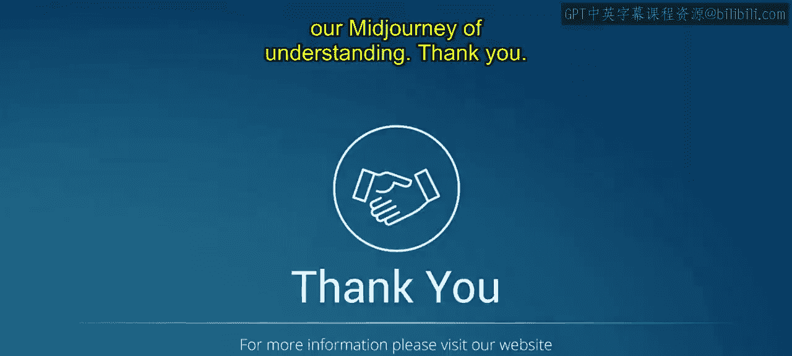

# 第二三四部分 140：使用Midjourney的伦理考虑 🧭

在本节课中，我们将要学习使用Midjourney这一强大工具时，必须考虑的关键伦理问题。我们将探讨偏见、深度伪造以及版权与知识产权等核心概念，并学习如何以合乎道德的方式使用Midjourney。

## 理解伦理考虑的重要性

上一节我们介绍了Midjourney的基本应用，本节中我们来看看使用它时必须面对的伦理问题。伦理考虑在使用Midjourney时至关重要，因为它是一个既可用于善也可用于恶的强大工具。为了防止错误信息的传播、保护他人的版权并避免创建有害内容，我们必须意识到Midjourney可能被滥用的风险，并采取措施加以防范。简而言之，伦理考虑是为了确保Midjourney被用于积极的方面。

## 使用Midjourney时的关键伦理问题

以下是使用Midjourney时可能遇到的几个主要伦理问题。

### 偏见问题

偏见指的是系统倾向于产生有利于某一群体或属性的结果。这可能是由多种因素造成的，包括系统训练所用的数据、其使用的算法以及设计和实施系统的人员。

一个Midjourney中偏见的例子是其生成人物图像的方式。一些用户报告称，Midjourney生成男性图像的可能性高于女性，并且这些图像往往更讨人喜欢和正面。这可能是因为Midjourney训练所用的图像数据集以男性为主，或者其使用的算法本身就更偏向于男性面孔。

### 深度伪造问题

深度伪造是指经过篡改的视频或音频记录，使其看起来或听起来像是某人说了或做了他们从未实际说过或做过的事情。深度伪造是使用多种技术创建的，包括机器学习、人工智能和计算机图形学。深度伪造可用于恶意目的，例如传播虚假信息或损害他人声誉。然而，它们也可用于创意目的，例如制作模仿作品或使电影和电视节目更加逼真。

一个Midjourney中深度伪造的例子是创建的一段汤姆·克鲁斯弹钢琴的视频。该视频非常逼真，很难分辨出并非汤姆·克鲁斯本人在弹钢琴。然而，该视频实际上是一个深度伪造，是使用包括机器学习、人工智能和计算机图形学在内的多种技术创建的。

### 版权与知识产权问题

版权是保护作者创意表达的法律概念。知识产权是一个更广泛的术语，包括版权以及其他形式的智力保护，如商标和专利。当你使用Midjourney创建图像时，你就是该图像的版权所有者。这意味着你拥有复制、分发和展示该图像的专有权。然而，你的版权也受到一些限制，例如合理使用原则。合理使用原则允许他人在未经你许可的情况下，为某些目的（如批评、评论、新闻报道、教学、学术或研究）使用你的受版权保护的作品。

除了版权，Midjourney还有自己的服务条款，规定了如何使用你创建的图像。例如，服务条款规定你不能使用Midjourney创建具有仇恨性、歧视性或非法的图像。

## 如何合乎道德地使用Midjourney

为了确保对Midjourney的道德使用，我们需要遵循以下指南。

### 应对偏见

首先，要意识到Midjourney中可能存在的偏见，并尝试使用中立、无偏见的提示词。如果你正在生成人物图像，尝试生成代表不同人群的多样化图像。对Midjourney生成的图像持批判态度，不要使用任何带有偏见或歧视性的图像。

### 尊重版权

只生成你拥有使用版权的图像。请注意，Midjourney是在受版权保护的图像数据集上训练的。如果你不确定是否有权使用特定图像，最好直接与版权所有者核实。

### 避免深度伪造

不要使用Midjourney生成旨在欺骗他人的图像或视频。诚实地说明你正在使用Midjourney生成图像或视频。不要使用Midjourney生成有害或诽谤性的图像或视频。

### 其他实用建议

以下是确保道德使用的一些额外建议：
*   注意你的图像可能对他人产生的影响。不要使用Midjourney生成暴力、仇恨或歧视性的图像。
*   不要使用Midjourney生成带有性暗示或剥削性质的图像。
*   尊重他人的隐私。未经他人许可，不要生成他人的图像。

### 道德使用示例

以下是如何以合乎道德的方式使用Midjourney的示例：
*   **促进多样性**：你可以要求生成来自不同背景和文化的人物图像，以促进多样性和包容性。
*   **教育目的**：你可以要求生成历史事件或人物的图像，以教育人们了解过去。

通过以创造性和合乎道德的方式使用Midjourney，你可以对世界产生积极影响。

## 总结

本节课中，我们一起学习了使用Midjourney时需要考虑的关键伦理问题。我们深入探讨了偏见、深度伪造以及版权与知识产权的重要性，并掌握了如何通过遵循具体指南来应对这些问题，以确保我们负责任且合乎道德地使用这项强大的生成式AI工具。