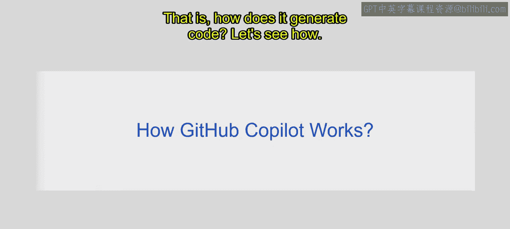
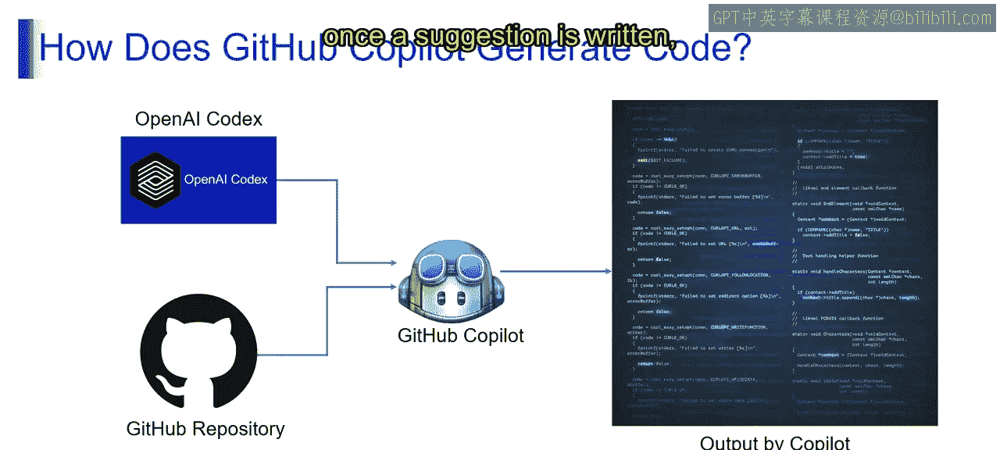
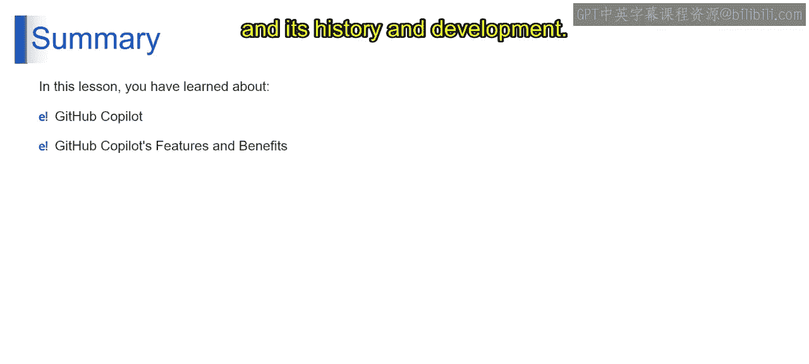

# 第二三四部分 141：GitHub Copilot概述 🚀

在本节课中，我们将学习GitHub Copilot，一个由AI驱动的代码自动补全工具。我们将了解它的定义、工作原理、核心功能与优势，以及它的发展历程。

## 什么是GitHub Copilot？🤔

上一节我们介绍了生成式AI和AI驱动的编码辅助。本节中，我们来看看GitHub Copilot具体是什么。

GitHub Copilot是一个由AI驱动的自动补全系统。例如，如果你想编写一个实现特定功能的函数，只需将该功能以注释的形式描述出来，GitHub Copilot就会为你自动补全代码。本质上，它能将自然语言提示转化为编码建议，并支持数十种编程语言。

它的工作方式类似于AI结对程序员。就像飞行员需要副驾驶一样，编写代码的主要工作仍由开发者完成，但Copilot通过提供建议，能极大地提升编码速度。开发者无需编写全部代码，Copilot会提供建议，你可以根据需要选择，它能在极短时间内高效地为你写出代码。

这类似于某些能纠正语法或拼写错误的软件。在编写代码时，GitHub Copilot会提供建议，以带来更好的编码体验。

## GitHub Copilot如何工作？⚙️

了解了它的定义后，我们来看看GitHub Copilot是如何生成代码的。

当你开始输入代码时，GitHub Copilot会生成供你选择的建议。这些建议基于你的代码上下文和所使用的代码库。

以下是其工作原理的简要说明：

GitHub Copilot的自动补全功能提高了效率。如图所示，它利用OpenAI Codex等技术解析自然语言并生成代码。同时，它依托GitHub上数百万代码组成的代码库。为了向你提供建议，GitHub Copilot会分享你代码的片段或块。这些代码片段的数据会实时传输以生成建议，并在建议生成后被丢弃，因此非常安全。

## 功能与优势 ✨

现在我们已经了解了GitHub Copilot如何工作，接下来看看它的主要功能和优势。

以下是GitHub Copilot的核心功能：

如果谈论其优势，它拥有诸多好处：
*   **自然语言处理**：它能根据自然语言描述给出代码建议。
*   **隐私与安全**：确保了用户代码的隐私和安全。
*   **编辑器集成**：与各种代码编辑器的集成非常出色。
*   **个性化**：能够提供个性化的编码建议。
*   **多语言支持**：支持多种编程语言。

## 发展历程 📜

在探讨了其功能之后，我们来回顾一下GitHub Copilot是如何发展演变的。

以下是其关键发展节点：
*   **2014年**：GitHub Copilot从早期的代码搜索插件演变而来。
*   **2020年至2021年**：GitHub开始试验OpenAI模型。
*   **2022年**：GitHub Copilot成为面向个人开发者的订阅制服务。
*   **2023年**：GitHub Copilot确保了广泛的可用性。
*   **2024年**：发布了GitHub Copilot企业版计划。

## 总结 📝

本节课中，我们一起学习了GitHub Copilot。我们了解了这个AI驱动的代码辅助工具是什么，它如何根据上下文生成代码建议，以及它的核心功能与优势。最后，我们还回顾了它从早期插件发展到如今成熟服务的历史进程。

感谢你观看本视频。我们下个视频再见，持续学习。😊

