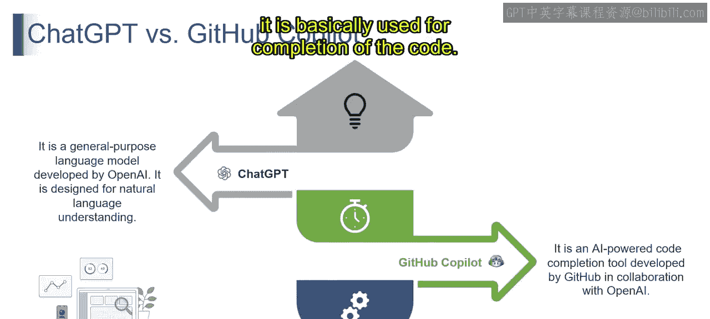
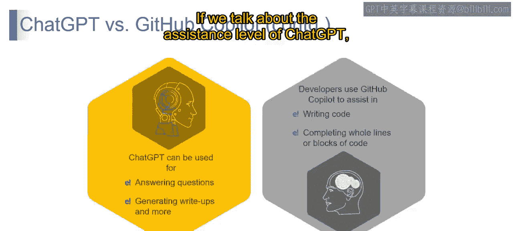
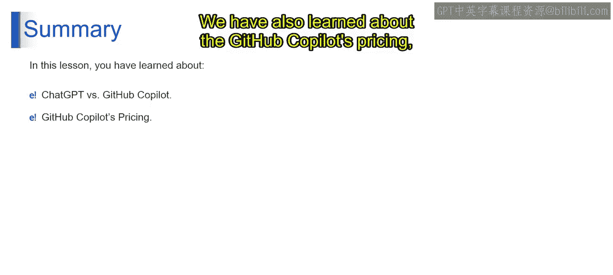

# 第二三四部分 142：ChatGPT与GitHub Copilot对比 🆚

在本节课中，我们将要学习ChatGPT与GitHub Copilot这两个流行AI工具的核心区别。我们将从设计目的、工作原理、定价模式等多个维度进行比较，帮助你理解它们各自的适用场景。

## 概述

ChatGPT和GitHub Copilot都是基于大型语言模型（LLM）构建的强大工具，但它们的目标和功能截然不同。理解它们的差异，有助于你在不同任务中选择最合适的工具。

## 核心对比

上一节我们介绍了本节课的主题，本节中我们来详细看看ChatGPT与GitHub Copilot的核心区别。

以下是两者的主要对比维度：

*   **设计目的**
    *   **ChatGPT**：一个通用目的的语言模型，由OpenAI开发，主要用于自然语言理解与生成。你可以向它提问（我们称之为“提示”），它会生成回答。
    *   **GitHub Copilot**：一个AI驱动的代码补全工具，由GitHub与OpenAI合作开发。它主要用于辅助编写代码。

*   **主要功能**
    *   **ChatGPT**：用于回答问题、生成文本或获取信息。
    *   **GitHub Copilot**：用于编写代码，提供整行或整个代码块的自动补全建议。

*   **交互模式**
    *   **ChatGPT**：提供对话式响应，你会感觉像在与他人交谈。
    *   **GitHub Copilot**：在你编写代码时，实时理解你的编程逻辑并提供代码建议。

*   **训练数据与学习方式**
    *   **ChatGPT**：在多样化的文本数据集上进行训练。其学习方式是**无监督学习**。
    *   **GitHub Copilot**：在代码仓库和文档上进行训练。其学习方式是**有监督学习**。

*   **辅助层级**
    *   **ChatGPT**：在对话模式下进行文本生成。
    *   **GitHub Copilot**：根据你编写代码的上下文，提供代码建议和自动补全。

## 定价与社区支持

了解了核心功能差异后，我们来看看它们的定价模式和社区生态。

*   **定价模型**
    *   **ChatGPT**：采用基于用户使用量的定价策略。
    *   **GitHub Copilot**：采用基于订阅的定价策略。

*   **社区支持**
    *   **ChatGPT**：拥有OpenAI社区及开发者资源。
    *   **GitHub Copilot**：拥有GitHub社区及官方文档。

## GitHub Copilot 定价详情

上一节提到了GitHub Copilot的订阅模式，本节中我们具体看看其定价方案。

GitHub Copilot提供不同层级的服务以满足不同用户的需求：

*   **免费版**：适用于学生、教师以及流行开源项目的维护者。
*   **个人版（Starter）**：为个人开发者、自由职业者设计，提供基础的聊天和代码补全功能。
*   **商业版（Business）**：为团队和规模化应用设计，提供更高级的功能和管理工具。
*   **企业版（Enterprise）**：为大型组织提供定制化解决方案。

你可以根据自身的使用场景和规模，选择最适合的订阅方案。

## 总结

本节课中，我们一起学习了ChatGPT与GitHub Copilot的全面对比。我们了解到，ChatGPT是一个面向通用对话和文本任务的工具，而GitHub Copilot则专精于代码编写辅助。它们在学习方式、交互模式和定价策略上均有不同。理解这些区别，能帮助你在开发和学习过程中更有效地利用这些强大的AI工具。