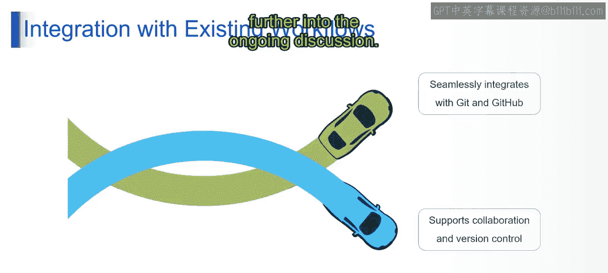

# 第二三四部分 144：GitHub Copilot用户界面与功能 🚀

在本节课中，我们将学习GitHub Copilot这一AI驱动的编程助手。我们将了解它的用途、核心功能，以及它如何提升开发者的工作效率并与现有工作流集成。

## 概述

GitHub Copilot是一个由AI驱动的编码助手，旨在帮助开发者更快地编写代码。它集成在流行的集成开发环境（IDE）中，如JetBrains系列和Visual Studio Code，能够根据上下文提供整行或整块代码的建议。

## GitHub Copilot的用途

上一节我们介绍了GitHub Copilot的基本概念，本节中我们来看看它的具体用途。GitHub Copilot的主要用途是辅助编码，它通过理解代码注释和上下文，为开发者提供智能的代码补全和建议。

## GitHub Copilot的核心功能

了解了它的用途后，接下来我们深入探讨GitHub Copilot的关键特性。以下是GitHub Copilot的核心功能：

*   **代码自动补全**：它能够预测并自动完成你正在编写的代码行。
*   **上下文感知建议**：Copilot能理解当前文件的代码上下文，甚至是你写的注释，从而提供高度相关的代码建议。
*   **多语言支持**：它支持多种编程语言，适用范围广泛。
*   **代码生成与测试**：可以根据描述生成函数、类甚至测试用例。
*   **代码文档解释**：如果你对某段代码或某个函数不理解，只需将其高亮，Copilot就能提供相关的解释文档，说明其用途和工作原理。其核心机制可以概括为：`根据上下文(代码 + 注释) -> 生成建议代码块`。

## 如何提升开发者生产力

我们已经看到了Copilot的强大功能，那么它是如何具体帮助开发者提升效率的呢？以下是其主要方式：

*   **加速编码过程**：通过提供准确、正确的代码建议，显著加快编码速度。
*   **减轻认知负荷**：开发者无需费力记忆和回忆所有语法与API细节，可以将更多精力集中在逻辑和问题解决上。例如，当你卡住时，可以写一句注释，Copilot会基于此给出建议。
*   **聚焦问题解决**：它让开发者能够更专注于算法逻辑和业务实现，而不是繁琐的语法细节。

## 与现有工作流的集成

最后，我们来看看GitHub Copilot如何融入开发者日常的工作流程。GitHub Copilot能够与Git和GitHub无缝集成，支持团队协作和版本控制，使得在现有开发流程中使用AI辅助变得非常顺畅。

接下来的视频将对以上讨论进行更深入的探讨。

## 总结

本节课中，我们一起学习了GitHub Copilot的用途、核心功能，以及它如何通过加速编码、减轻认知负担来提升开发者的生产力，并了解了其与现有开发工作流的无缝集成能力。GitHub Copilot是一个强大的工具，能有效改变开发者的编码体验。