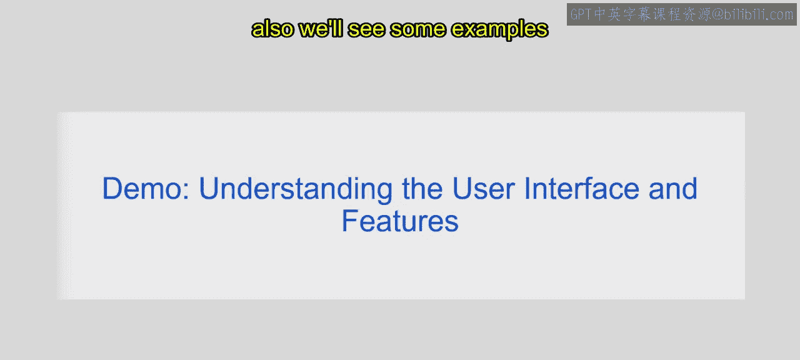
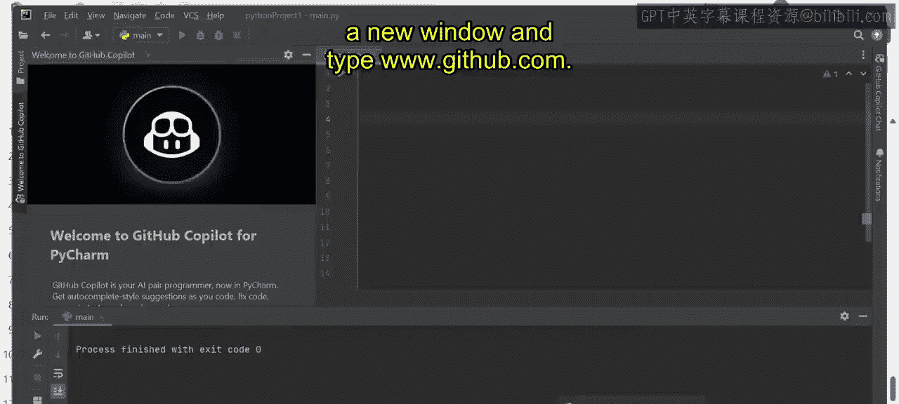
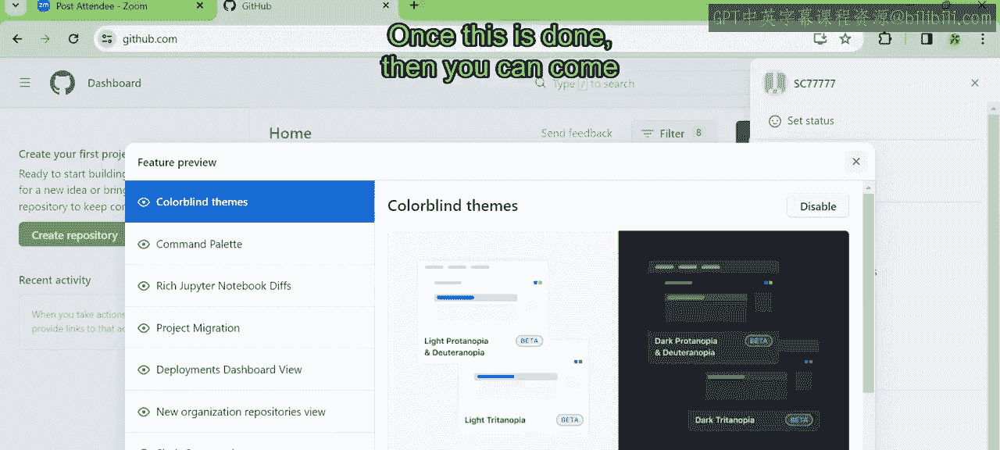
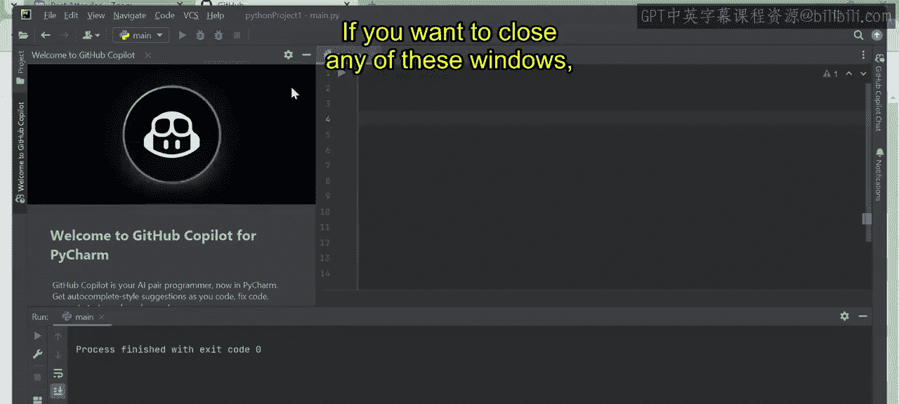
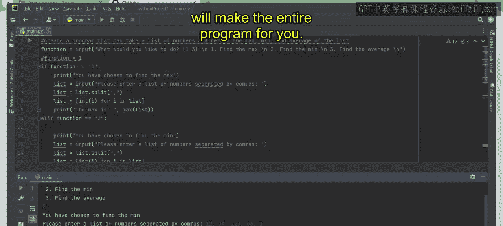
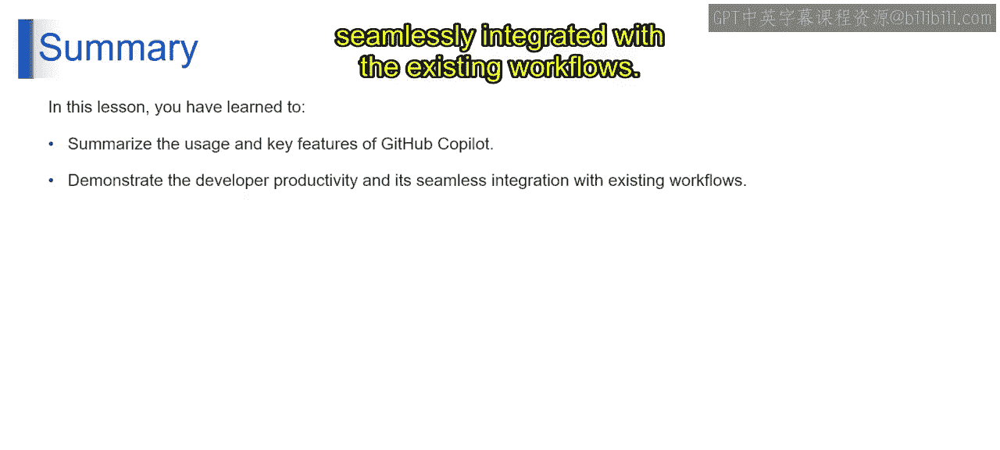

# 第二三四部分 145：GitHub Copilot用户界面与功能演示 🚀

在本节课中，我们将学习GitHub Copilot的用户界面及其核心功能，并通过实际演示了解它如何辅助编程。

上一节我们介绍了生成式AI的基础概念，本节中我们来看看如何在实际开发环境中应用这些工具。



## 用户界面概览

这是我们的编程窗口，以PyCharm为例。GitHub Copilot可以在任何IDE（如Visual Studio或PyCharm）中工作，其提供建议的方式是相似的。


初次使用时，你可能会遇到Copilot不工作的情况。这通常是因为一些必要功能未被启用。

## 初始设置与登录

以下是启用全部功能所需的步骤。

首先，你需要登录GitHub Copilot。在IDE的左侧面板，你可以看到“Welcome to GitHub Copilot”的提示。如果你尚未登录，请点击登录。




访问 `github.com` 并登录你的账户。如果你没有账户，需要先创建一个。创建账户是一个简单的过程，只需要提供邮箱并设置一个强密码即可。

登录后，点击侧边栏的Copilot图标，向下滚动找到“Feature Preview”（功能预览）选项。


在功能预览页面，你会看到多个选项，如“Colorblind themes”、“Notebook”等。为了获得最佳体验，建议你启用所有七个功能。点击每个功能旁边的“Enable”按钮即可。

完成设置后，你可以关闭设置窗口，回到主编程界面。

## 功能演示：代码建议


现在让我们看看GitHub Copilot如何提供代码建议。

例如，如果你想创建一个名字数组，可以将其写为注释。




输入注释 `# 创建一个名字数组` 然后按回车，Copilot会读取你的注释并给出相应的代码建议。




你可以用同样的方式创建颜色数组、数字数组等。

## 功能演示：生成完整程序

假设你是一名开发者，不记得具体的代码，但想将一个功能集成到更大的程序中。例如，我们想创建一个程序，它可以接收一个数字列表，并返回列表的最大值、最小值和平均值。

你可以通过注释来描述这个程序。

输入：
```python
# 第二三四部分 创建一个程序，接收一个数字列表，返回列表的最大值、最小值和平均值。
# 第二三四部分 确保程序可以接收任意长度的列表。
```

按回车后，Copilot会开始生成代码建议。如果你想接受某条建议，只需按下 `Tab` 键。

Copilot可能会生成类似以下的函数框架：
```python
def analyze_numbers(numbers):
    # 计算最大值、最小值、平均值
    max_val = max(numbers)
    min_val = min(numbers)
    avg_val = sum(numbers) / len(numbers)
    return max_val, min_val, avg_val
```

作为一个新手，你可能不确定生成的代码是否正确。你可以直接按下 `Tab` 键接受建议，然后运行程序来验证。

要运行程序，点击IDE中的绿色运行按钮（▶️）。程序可能会提供一个交互式菜单。

例如：
```
请选择操作：
1. 计算最大值
2. 计算最小值
3. 计算平均值
```

选择选项2来计算最小值。程序会提示你输入一系列用逗号分隔的数字。

输入：`5, 10, 3, 8, 1`

程序将输出：`最小值是：1`



这表明程序运行成功。即使你不完全了解底层代码，只需给出提示（prompt），GitHub Copilot就能为你生成可工作的程序。


## 总结

在本节课中，我们一起学习了GitHub Copilot的基本用法和关键特性。我们看到了它如何通过理解自然语言注释来提供代码建议，甚至生成完整的程序功能，从而显著提升开发者的生产效率。GitHub Copilot能够无缝集成到现有的开发工作流中，成为强大的编程助手。




感谢学习，我们下节课再见。