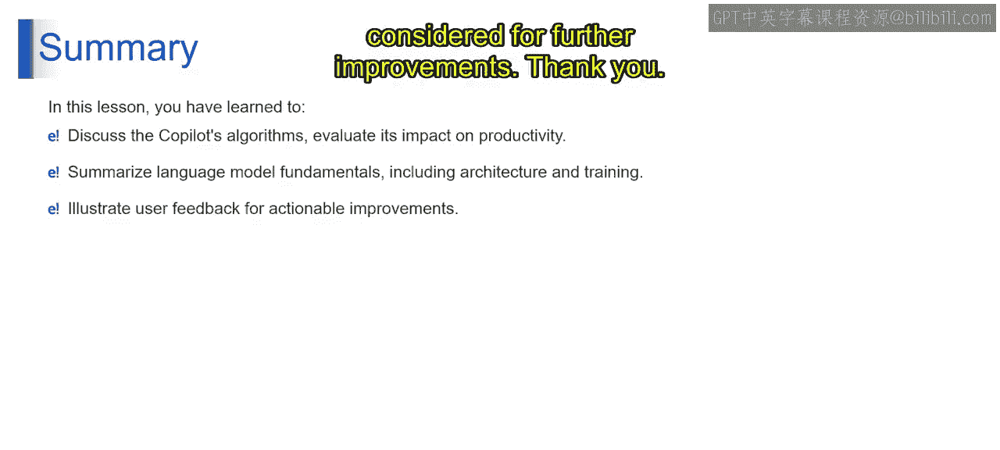

# 第二三四部分 146：GitHub Copilot的工作原理 🧠

在本节课中，我们将深入探索GitHub Copilot的内部工作机制。我们将了解它如何分析代码、生成建议，以及如何通过用户反馈不断进化，从而提升开发者的生产力。

---

### 学习目标 📚

通过本节课的学习，你将能够：
*   描述Copilot背后的核心算法。
*   评估其对开发效率的影响。
*   解释其语言模型的基本原理，包括架构和训练过程。
*   说明用户反馈如何被用于模型的持续改进。

现在，让我们揭开代码解释与生成背后的魔法，深入了解GitHub Copilot的内部运作及其影响力。

---

### 核心工作原理：代码解释与生成

GitHub Copilot通过分析代码片段、理解其中的模式和语法，来提供有意义的代码建议和补全。其核心能力建立在几个关键组件之上。

#### 训练数据

GitHub Copilot的训练数据来源于GitHub仓库中大量公开可用的代码。这些数据涵盖了多种编程语言、框架和库。通过分析这些数据，Copilot能够学习真实项目中代码的结构、常见编码模式和语法。

#### 上下文分析

上下文分析是Copilot生成精准建议的关键。它会仔细审视你正在编写的代码文件，理解当前的函数、变量以及项目结构。这确保了它提供的代码建议与现有代码库无缝衔接，具有高度的上下文相关性。

#### 统计语言模型

GitHub Copilot的核心是一个统计语言模型，它是**GPT（生成式预训练变换器）** 架构的一个变体。这个模型经过专门微调，用于生成代码。其基本工作原理是：根据给定的代码上下文和从训练数据中学到的模式，预测接下来最可能出现的代码序列。

用简单的公式表示其核心任务就是：
`预测的下一个代码 = 模型(当前代码上下文)`

---

### 个性化与进化：用户反馈的作用

GitHub Copilot并非一成不变，它会学习并适应。用户反馈是其学习过程中至关重要的一环。

当开发者接受或拒绝Copilot提供的代码建议时，这些行为会被系统记录和分析。接受的建议有助于模型巩固对“优质代码”的理解；而被拒绝的建议则帮助模型从错误中学习，避免在未来推荐类似的、不受欢迎的代码模式。这个过程使得Copilot能够为每位开发者提供越来越个性化的建议。

---

### 最佳实践：如何高效使用Copilot

为了从GitHub Copilot中获得最大收益，你可以遵循以下建议：

*   **编写模块化代码**：尽量将代码拆分成较小的函数或模块。这有助于Copilot更清晰地理解你的意图并提供准确的建议。
*   **使用有意义的命名**：为函数、变量和参数起一个描述性的名字。清晰的命名能帮助Copilot更好地理解你的编程目标。
*   **记住你才是主导者**：Copilot是一个强大的辅助工具（Co-pilot），但你始终是掌握方向的飞行员（Pilot）。由你来判断、选择并最终决定是否采纳其建议。

---

### 未来展望

展望未来，我们可以预见AI编程工具的持续进步。GitHub Copilot的目标是变得更加个性化和精准，使其生成的代码建议能更好地匹配每位开发者独特的编码风格和偏好。

---

### 总结 🎯

在本节课中，我们一起学习了：
1.  GitHub Copilot如何通过分析训练数据、上下文和利用统计语言模型来生成代码建议。
2.  用户反馈如何被系统收集并用于定制化和改进未来的代码建议。
3.  通过编写模块化代码、使用清晰命名等方式，可以更有效地利用Copilot提升开发效率。
4.  Copilot作为一个辅助工具，其最终目的是增强而非取代开发者的能力。

理解这些原理，将帮助你更好地驾驭这个强大的AI编程伙伴。