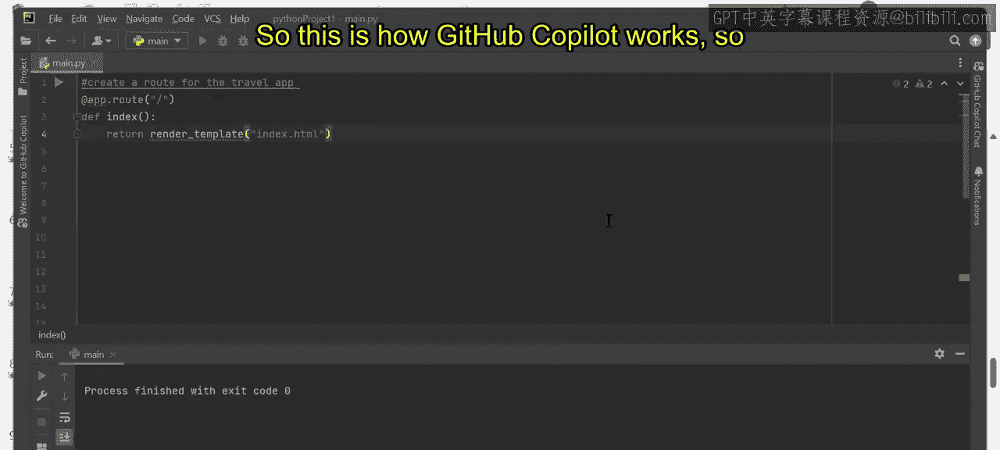
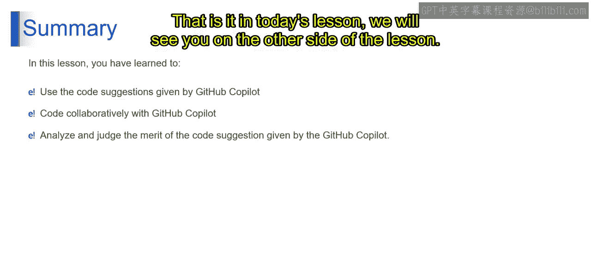

# 第二三四部分 147：协作与版本控制 🛠️


在本节课中，我们将学习如何利用GitHub Copilot进行协作编码，包括处理冲突和代码审查。我们将探索GitHub Copilot如何通过提供实时代码建议来提升开发效率和准确性。


## 学习目标 🎯

在本课结束时，你将能够：
*   使用GitHub Copilot创建和修改代码。
*   与GitHub Copilot协作编写代码。
*   分析并判断GitHub Copilot所提供代码建议的优劣。

## 自动代码生成 🤖

我们知道，编写代码是一项耗时且繁琐的任务。但GitHub Copilot与你并肩工作，可以提高准确性、生产力和效率。现在，让我们来探索GitHub Copilot提供的代码建议。


上一节我们介绍了GitHub Copilot的基本概念，本节中我们来看看它在实际编码中如何提供建议，使编码过程变得更简单。


## 实战：从注释生成代码

GitHub Copilot最酷的功能之一是能够将你的注释转化为代码。例如，假设你想列出一个组织的所有GitHub仓库名称。

以下是操作步骤：

1.  **开始编写**：首先，我们导入必要的库并开始编写代码。例如，我们输入 `import requests` 来发起网络请求。
2.  **编写注释**：接着，我们以注释的形式描述想要的功能。我们输入：
    ```python
    # 列出指定组织的所有GitHub仓库名称
    ```
3.  **接收建议**：在你输入注释的过程中或之后，GitHub Copilot会实时提供代码建议。它会自动补全一个函数，例如：
    ```python
    def list_org_repos(org_name):
        url = f"https://api.github.com/orgs/{org_name}/repos"
        response = requests.get(url)
        repos = response.json()
        return [repo['name'] for repo in repos]
    ```
4.  **接受或查看更多建议**：
    *   如果你想接受当前建议，只需按下 `Tab` 键。
    *   如果你想查看更多备选建议，可以按下 `Alt + [`（在Mac上是 `Option + [`）。这将弹出一个列表，显示其他可能的代码补全选项。

## 实战：创建旅行应用路由

即使你对编码了解不多，GitHub Copilot也能帮助你。假设你想为一个旅行应用创建一个路由。

1.  **描述需求**：你可以直接输入注释来描述你的需求：
    ```python
    # 为旅行应用创建一个路由，处理城市信息查询
    ```
2.  **跟随建议**：GitHub Copilot会开始建议代码。它可能会先建议导入必要的Web框架库（如Flask或FastAPI），然后逐步生成路由函数的结构。
3.  **持续交互**：你可以通过不断按 `Tab` 键来接受一系列建议，从而快速构建出完整的程序框架。




## GitHub Copilot 的工作原理

从以上例子中，我们可以看到GitHub Copilot的工作方式：


1.  **理解上下文**：它分析你已有的代码和注释，理解你的编程意图。
2.  **提供实时建议**：在你输入时，它即时提供代码片段、函数甚至整个代码块的建议。
3.  **提供多样化解决方案**：对于同一个问题，它可能提供多种实现方式供你选择。
4.  **减少手动劳动**：自动补全重复性或样板代码，让你专注于核心逻辑。
5.  **适应编码风格**：它会学习并适应你的个人编码风格和项目规范。
6.  **持续改进**：基于大量代码库训练，它能提供符合最佳实践的代码建议。

## 总结 📝

本节课中，我们一起学习了如何利用GitHub Copilot进行高效编码。

*   你学会了如何使用GitHub Copilot提供的代码建议来加速开发。
*   你掌握了与GitHub Copilot协作编码的流程，包括接受建议（`Tab`键）和查看备选方案（`Alt + [`）。
*   你也了解了如何分析和判断这些代码建议的优劣，决定是接受、修改还是拒绝它们，这是成为一名高效开发者的关键技能。



GitHub Copilot是一个强大的工具，它能将你的想法快速转化为代码，但最终的控制权和判断力始终在你手中。