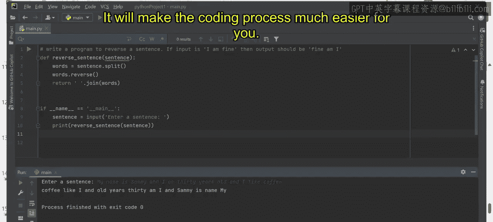
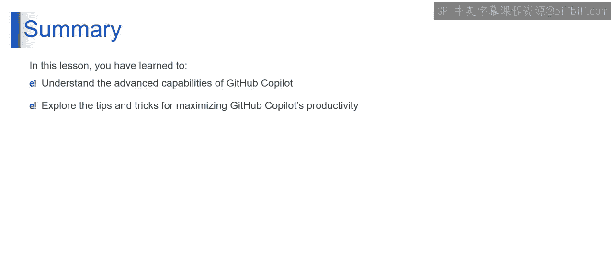

# 第二三四部分 148：技巧与诀窍 🚀


在本节课中，我们将深入探索生成式AI应用与流行工具的世界。我们将重点了解GitHub Copilot的高级功能，并学习一系列提升生产力的实用技巧与诀窍。

## 概述

通过本节内容，你将能够探索GitHub Copilot的高级功能，并掌握不同的技巧来显著提升你的编码效率。

---

## GitHub Copilot的高级功能

上一节我们介绍了生成式AI的基础，本节中我们来看看GitHub Copilot这一强大工具的核心能力。

以下是GitHub Copilot提供的一系列高级功能：

*   **多语言支持**：GitHub Copilot支持多种编程语言，帮助开发者无缝地使用不同语言编写代码。这增强了其通用性，使其成为处理多语言项目的宝贵工具。
*   **领域特定语言**：Copilot可以在特定领域语言上进行训练，从而增强其针对特定项目需求提供相关且专业的代码片段的能力。
*   **多行建议**：当开发者仅编写单行注释或代码时，GitHub Copilot能生成多行代码建议。这减少了对重复步骤进行手动编码的需求。
*   **结对编程协作**：Copilot支持实时协作，非常适合两名开发者共同工作的结对编程场景。
*   **文档代码合成**：GitHub Copilot协助生成代码注释和文档，这提高了效率，减少了错误，并帮助开发者维护一个文档完善的代码库。
*   **与IDE和编辑器集成**：GitHub Copilot能与各种集成开发环境和代码编辑器无缝集成，从而提升编码效率并减少错误。
*   **代码探索与学习**：GitHub Copilot也可用作探索不同代码的学习工具。这有助于开发者和学习者理解编码概念与最佳实践。
*   **提供单元测试框架**：Copilot可以协助为函数生成单元测试框架，从而促进测试驱动开发实践，并简化测试流程。

---

## 提升生产力的技巧与诀窍

了解了Copilot的核心功能后，我们来看看如何更高效地使用它。以下是使用GitHub Copilot时提升生产力的一些实用技巧。


*   **接受建议**：要接受GitHub Copilot给出的建议，请按 `Tab` 键。
*   **忽略建议**：要忽略代码建议，请按 `Esc` 键。
*   **查看下一个建议**：要查看GitHub Copilot给出的下一个建议，请按 `Alt` + `]`。
*   **查看上一个建议**：要查看上一个建议，请按 `Alt` + `[`。
*   **手动触发建议**：要手动触发建议，请按 `Alt` + `\`。
*   **在新窗格中查看多个建议**：要在单独窗格中查看接下来的10个建议，请按 `Ctrl` + `Enter`。

还有一个关键技巧：当你希望Copilot给出建议时，请尽量在编写注释时做到具体明确。

例如，如果你想编写一个反转句子的程序，可以尝试这样写注释：
```python
# 第二三四部分 写一个程序来反转一个句子。
```
如果你能更具体地描述，将有助于GitHub Copilot为你提供可直接应用到程序中的建议。

让我们更明确一些：
```python
# 第二三四部分 如果输入是 "I am Fine."，那么输出应该是 "Fine. am I"。
```
现在，让我们看看GitHub Copilot是否能帮助我们创建这个程序。

我们目前还没有得到任何建议，所以让我们开始编写程序。假设我刚刚输入了字母 `d`，没有输入任何额外内容，你可以看到它已经开始工作并给我建议了。让我们按 `Tab` 键接受这个建议，然后按 `Enter` 键。

如果程序名是 `__main__`，好的。这就是程序，让我们看看它是否为我们工作。

输入一个句子，例如："my name is Sammy and I am 30 years old and I like Coffee." 让我们看看输出。

很好，它已经将其反转为："coffee like I and old years 30 am I and Sammy is name my." 它运行成功了。

由此可见，如果我们给GitHub Copilot提供具体的建议，它就会按照你期望的方式工作，使编码过程变得更加容易。

---

## 总结



在本节课中，我们一起学习了GitHub Copilot的高级功能，并探索了最大化其生产力的各种技巧与诀窍。掌握这些功能和方法，将能让你在开发过程中如虎添翼。




本节课到此结束，我们下个视频再见。持续学习，不断进步！