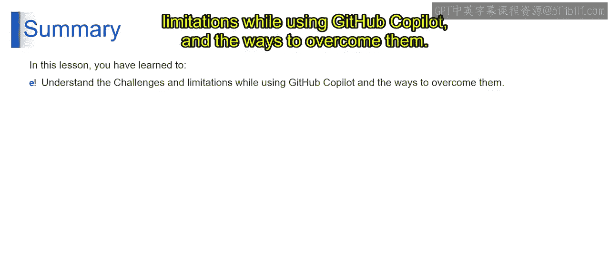

# 第二三四部分 149：GitHub Copilot的挑战与局限性 🧠

在本节课中，我们将探讨使用GitHub Copilot时可能遇到的挑战与局限性，并了解如何应对这些情况。

---

### 学习目标

完成本课后，你将能够了解使用GitHub Copilot时面临的挑战与局限性。

---

### 挑战与局限性详解

上一节我们介绍了GitHub Copilot的基本应用，本节中我们来看看在实际使用中需要注意的几点。

以下是使用GitHub Copilot时可能遇到的主要挑战与局限性：

1.  **上下文理解**
    GitHub Copilot的建议可能不完全理解代码的深层上下文。开发者需要仔细审查和验证其建议，以确保它们符合预期的功能和编码标准。

2.  **业务逻辑**
    Copilot缺乏对特定项目业务逻辑或领域需求的知识。这可能导致其生成的代码建议与项目的具体需求不符。因此，开发者在使用Copilot生成的代码时，应首先检查其逻辑是否符合业务要求，并据此进行调整。

3.  **过度依赖建议**
    过度依赖GitHub Copilot的建议可能导致开发者减少批判性思考和对所编写代码的理解。开发者应将Copilot视为辅助工具，而非自身编码技能的替代品。毕竟，编写代码的主体仍然是开发者本人。

4.  **处理边界情况**
    Copilot在处理复杂或边界情况时可能遇到困难。开发者在处理复杂场景时应保持谨慎，并对Copilot生成的代码进行彻底测试，尤其是在应用程序的关键部分。

5.  **安全问题**
    使用GitHub Copilot生成的代码时，仍需保持安全至上的开发实践，包括彻底的代码审查和安全测试。Copilot基于公共代码库的训练数据生成代码，这可能会引发代码所有权和潜在许可问题。

---

### 总结

本节课中，我们一起学习了使用GitHub Copilot时可能面临的挑战与局限性，包括上下文理解、业务逻辑匹配、过度依赖、边界情况处理以及安全问题，并了解了相应的应对方法。