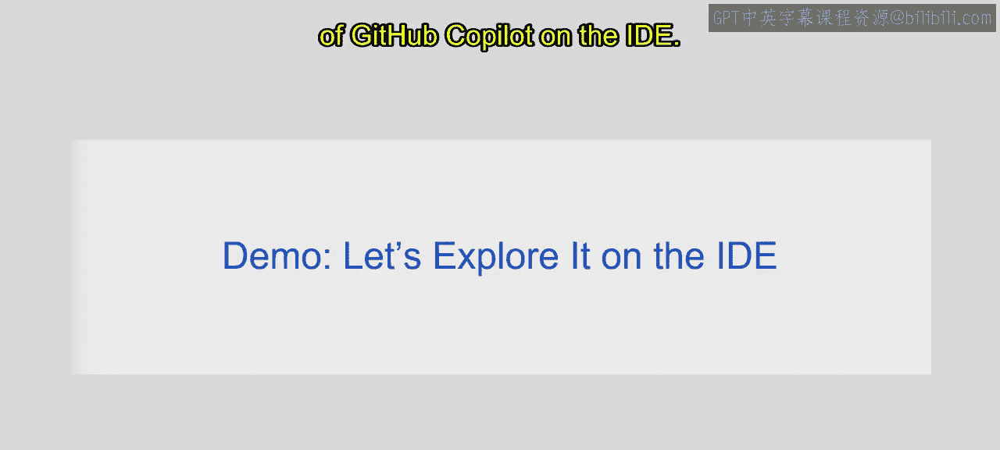
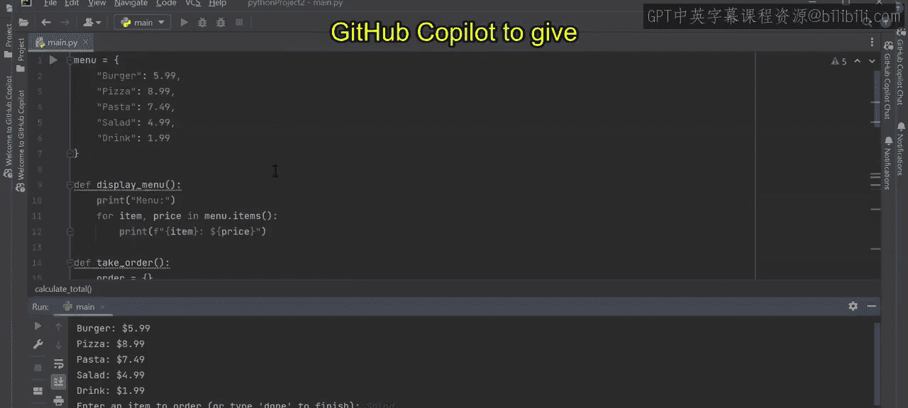
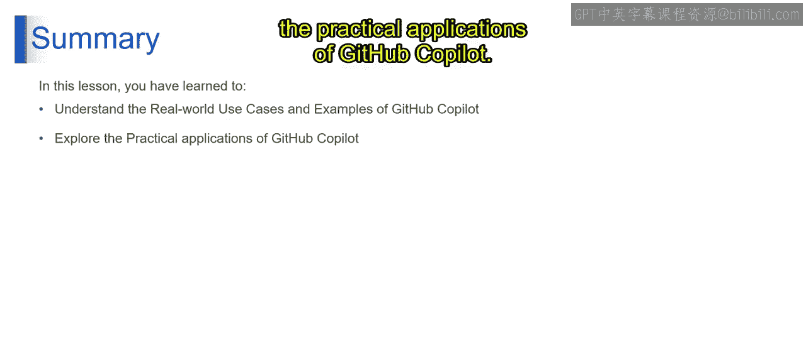

# 第二三四部分 150：GitHub Copilot 实战用例与示例 🚀


在本节课中，我们将深入探索生成式AI的实际应用，特别是聚焦于GitHub Copilot这一流行工具。我们将通过具体的真实世界用例和示例，来理解它如何在实际开发中提供帮助。

## 学习目标 🎯



在本课结束时，你将能够：
*   探索GitHub Copilot在真实世界中的用例。
*   理解GitHub Copilot在集成开发环境中的实际应用。

---

## GitHub Copilot 在IDE中的实际应用 💻

上一节我们介绍了GitHub Copilot的基本概念，本节中我们来看看它在代码编辑器中的具体应用。我们将通过两个编程示例来演示其功能。

### 示例一：合并字典值

假设我们正在编写一个程序，其中有两个字典。第一个字典包含一些键值对，例如 `{'a': 4, 'C': 9, 'D': 2}`。第二个字典是 `{'geeks': 100, 'C': 500, 'l': 400}`。我们的目标是创建一个新字典，它只包含两个字典中**共同的键**，并且其值是这两个字典中对应值的**总和**。

例如，键 `‘C’` 在两个字典中都存在，其值分别是 `9` 和 `500`，因此在新字典中，`‘C’` 对应的值应为 `509`。

如果我们不确定如何编写这段代码，可以直接将需求写成注释，然后让GitHub Copilot提供建议。

以下是操作步骤：
1.  在代码编辑器中，我们写下注释：`# 将两个字典中具有相同键的值相加`。
2.  GitHub Copilot 会立即给出代码建议。例如，它可能建议：
    ```python
    dict1 = {'a': 4, 'C': 9, 'D': 2}
    dict2 = {'geeks': 100, 'C': 500, 'l': 400}
    result = {}
    for key in dict1:
        if key in dict2:
            result[key] = dict1[key] + dict2[key]
    print(result)
    ```
3.  开发者可以接受、修改或拒绝这个建议。例如，我们可以将结果变量名从 `result` 改为 `combined_dict`，Copilot 会相应调整后续代码。
4.  运行程序后，输出结果为 `{'C': 509}`，符合我们的预期。

此外，Copilot 还可能基于上下文提供其他相关建议，例如“用相同键的值相减”或“获取键的交集”等代码片段，进一步展示了其理解代码意图的能力。

### 示例二：构建订单账单计算程序

接下来，我们看一个更复杂的例子：创建一个程序来接收食品订单并计算总账单。

我们首先需要定义菜单、显示菜单并接收订单输入。假设我们已经写好了部分代码，但在如何计算总账单的逻辑上卡住了。

以下是操作步骤：
1.  我们可以在代码中写下注释，描述我们想完成的功能，例如：`# 计算订单总金额`。
2.  GitHub Copilot 会分析现有代码（如菜单字典、订单循环）并给出建议。它可能提供类似以下的代码块：
    ```python
    total = 0
    for item, quantity in order.items():
        total += menu[item] * quantity
    print(f"总计: ${total:.2f}")
    ```
3.  按下 `Tab` 键接受建议，将这段代码插入到我们的程序中。
4.  运行完整的程序。程序会显示菜单，提示用户选择菜品和数量，输入完成后，它会正确计算出订单的总金额。

这个例子表明，当你在开发过程中遇到瓶颈，不知道如何实现特定功能时，可以依靠GitHub Copilot来提供解决方案或灵感，帮助你快速推进项目。

---



## 总结 📝




本节课中，我们一起学习了GitHub Copilot的实际应用。我们通过两个具体的编程示例，探索了它如何理解自然语言注释并生成对应代码，从而协助完成诸如字典操作和业务逻辑实现等开发任务。你不仅了解了它的真实世界用例，也亲身体验了它在集成开发环境中提升编码效率的实用价值。