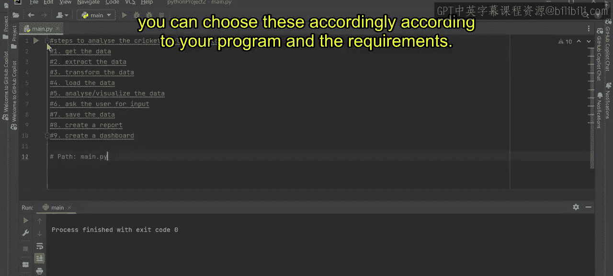

# 第二三四部分 151：提高编码效率

在本节课中，我们将学习如何在现实世界的项目中，利用GitHub Copilot来提高编码效率。我们将探讨如何将注释转换为代码、自动填充重复代码模式，以及如何借助AI助手探索不熟悉的编程领域。


---


## 概述


上一节我们介绍了生成式AI的基础概念。本节中，我们来看看如何将AI工具，特别是GitHub Copilot，应用到实际的编程工作中，以显著提升开发速度和代码质量。

## 将注释转换为代码

当你在编程过程中遇到困难，不确定如何继续时，可以尝试将你的意图写成注释。GitHub Copilot能够识别这些注释，并提供相应的代码建议。

例如，假设你正在编写一个设置闹钟的程序，但在验证输入格式时卡住了。

```python
# 第二三四部分 验证输入格式 (HH:MM AM/PM)
```

此时，只需按下回车键，GitHub Copilot 就会根据上下文和注释，给出可能的代码实现建议。你可以通过按下 `Tab` 键来接受这个建议，并将其整合到你的程序中。

```python
# 第二三四部分 验证输入格式 (HH:MM AM/PM)
def validate_time_format(time_str):
    try:
        datetime.strptime(time_str, ‘%I:%M %p’)
        return True
    except ValueError:
        return False
```

这种方法能有效帮助开发者突破思维瓶颈，快速推进项目。

## 自动填充重复代码

编写大量重复或模式化的代码非常耗时。GitHub Copilot 可以识别代码模式，并自动为你补全后续的代码块。

以下是使用GitHub Copilot自动填充重复代码的步骤：

1.  首先，定义初始的模式或公式。
2.  开始输入下一个类似的代码行。
3.  GitHub Copilot 会识别出模式并提供补全建议。

例如，当你需要定义一系列时间单位转换的常量时：

```python
SECONDS_IN_MINUTE = 60
MINUTES_IN_HOUR = 60
```

当你开始输入下一行 `HOURS_IN_DAY =` 时，Copilot 可能会自动建议 `24`。继续输入，它甚至可以补全 `DAYS_IN_WEEK`、`WEEKS_IN_MONTH` 等。这能为你节省大量编写样板代码的时间。

## 探索不熟悉的领域

对于不熟悉的技术栈或任务，GitHub Copilot 可以充当你的向导，帮助你规划实现步骤。

例如，如果你需要分析板球世界杯数据但不知从何入手，可以写下注释来寻求指导：

```python
# 第二三四部分 分析板球世界杯数据的步骤
```

Copilot 可能会生成一个包含数据获取、清洗、转换、加载和分析等步骤的提纲或伪代码框架。你可以根据这个框架，进一步要求Copilot为每个步骤生成具体的代码片段。

## 总结




本节课中，我们一起学习了如何利用GitHub Copilot来提升编码效率。我们掌握了三个核心技巧：**将注释转换为可执行代码**、**利用模式识别自动填充重复代码**，以及**在陌生技术领域获取实现指导**。熟练运用这些技巧，能够让你在现实项目开发中事半功倍。


感谢学习，我们下节课再见。