# 第二三四部分 154：DALL-E 2图像生成工具 🎨

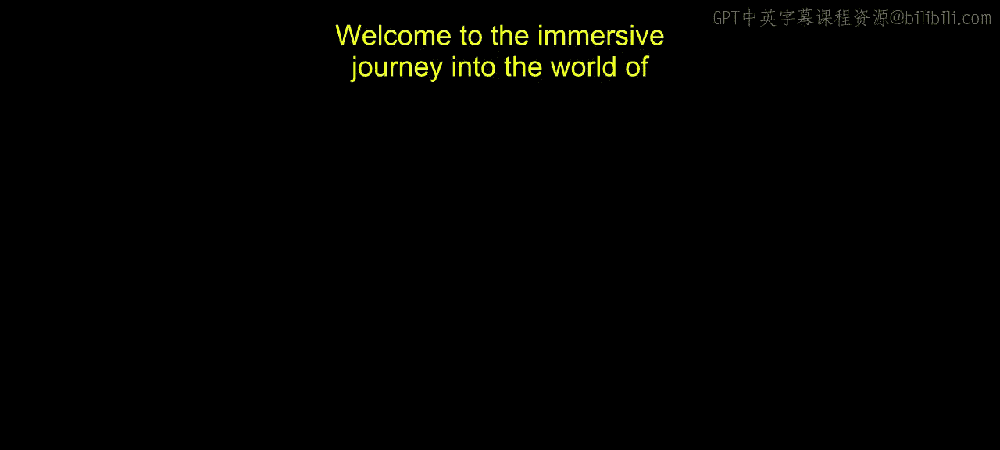

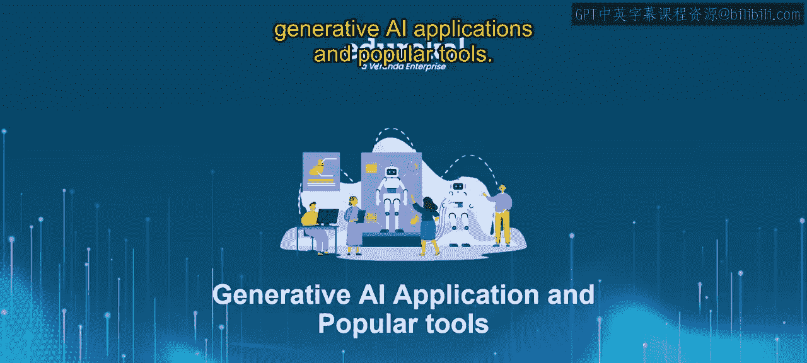

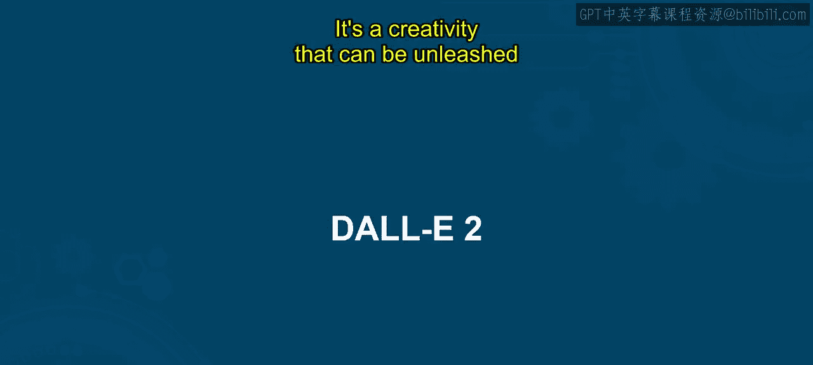

在本节课中，我们将学习OpenAI开发的图像生成AI工具——DALL-E 2。我们将了解它的功能、发展历程、使用方法以及实际应用场景。

---

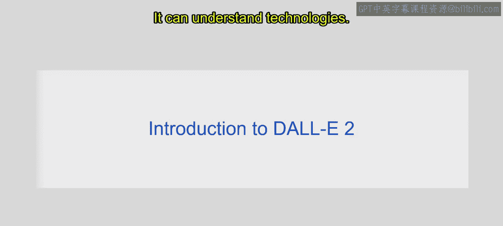

## 概述

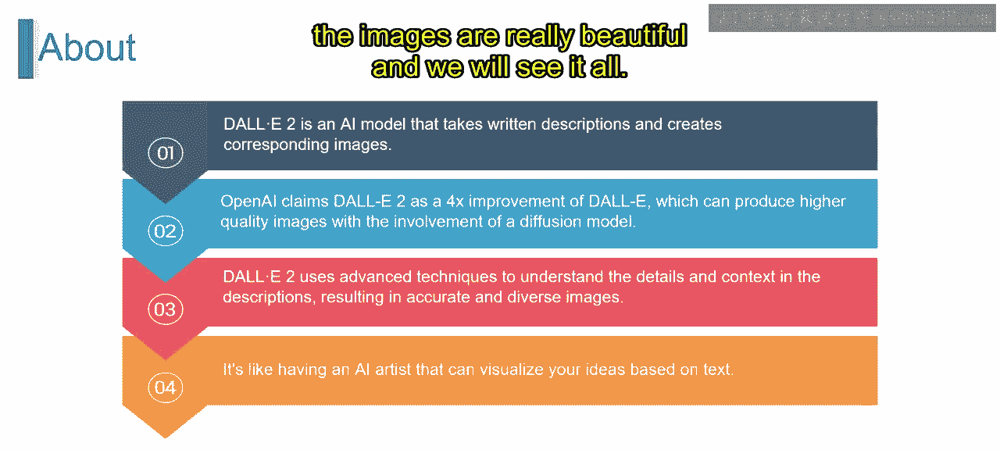

DALL-E 2是一个图像生成AI工具，它能够理解文本描述并创造出对应的图像。OpenAI声称，DALL-E 2相比第一代版本有大约四倍的提升，能够生成高质量图像。这得益于扩散模型的应用，使得生成的图像在细节和上下文上都非常出色。

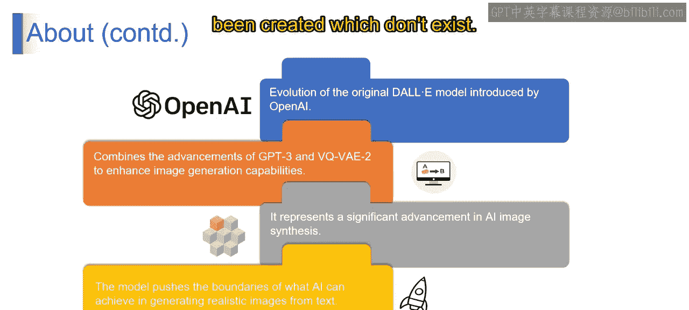

## DALL-E 2的发展历程

上一节我们介绍了DALL-E 2的基本概念，本节中我们来看看它的发展历程。

以下是DALL-E 2从发布到公开的关键时间节点：
*   **2021年1月**：OpenAI推出了第一代DALL-E。
*   **2022年4月**：经过近一年的努力，DALL-E 2被创建出来。
*   **2022年5月**：DALL-E 2向一千名测试用户开放，以收集反馈。
*   **2022年7月**：进入公测阶段，用户数量超过一百万。
*   **2022年9月**：向所有人开放公开测试版。
*   **2022年11月**：正式向公众开放。

## 如何使用DALL-E 2

了解了发展历程后，我们来看看如何实际使用这个工具。

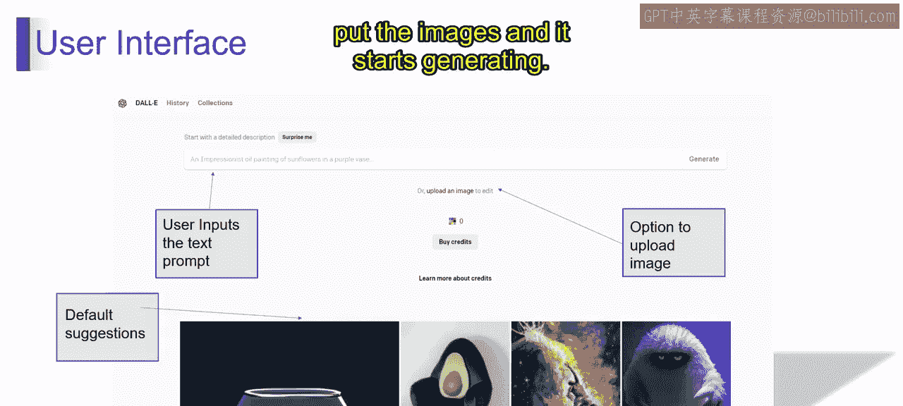

使用DALL-E 2的过程可以概括为一个简单的流程：**输入文本提示 -> 模型理解并生成 -> 输出图像**。

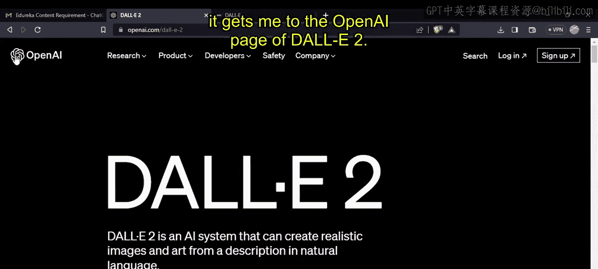

具体操作步骤如下：
1.  访问OpenAI的DALL-E 2页面。
2.  使用你的ChatGPT账户登录。
3.  在输入框中描述你想要生成的图像。
4.  点击生成，等待结果。

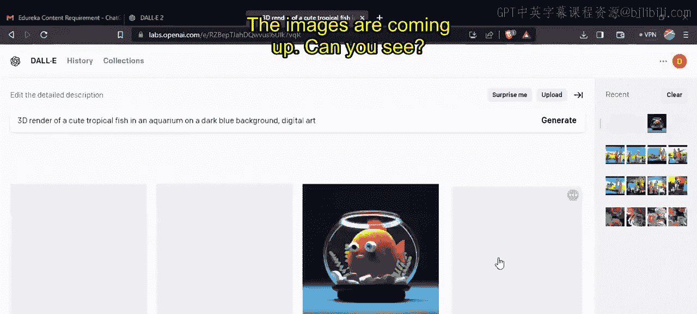

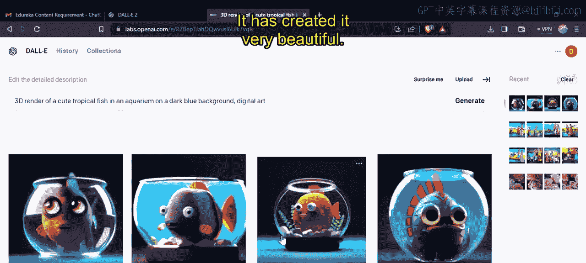

例如，输入提示词：“**3D render of a cute tropical fish in an aquarium with a dark blue background and digital art**”，DALL-E 2就会生成一张符合描述的、背景为深蓝色的可爱热带鱼3D渲染图。

你可以对生成的图像进行以下操作：
*   编辑图像。
*   基于某张图生成更多变体。
*   下载图像。

**核心提示**：你提供的描述越具体、约束越清晰，DALL-E 2生成的图像就越精准和美观。

## DALL-E 2的应用场景

掌握了基本用法后，本节我们探讨DALL-E 2能在哪些领域发挥作用。

DALL-E 2的应用非常广泛，主要包括以下几个领域：

**教育与创意写作**
DALL-E 2可以辅助学生和创作者。当人们脑海中有很多想法时，它可以快速将文字描述转化为视觉图像，从而增强讲故事的能力和创意写作技巧。

**商业与营销**
在商业领域，市场部门可以结合使用DALL-E 2（生成图片）和Copy.ai（生成文案）等AI工具，快速创建社交媒体广告和营销活动所需的内容。

**游戏与动画**
DALL-E 2能够帮助游戏开发者和动画师快速生成不同的角色概念图和场景环境设计，使游戏或电影的内容更加丰富有趣。

## 总结

本节课中我们一起学习了OpenAI的图像生成模型DALL-E 2。我们了解了它相比初代的显著进步，回顾了其发展历程，并逐步学习了如何通过文本提示来使用它生成图像。最后，我们探讨了它在教育、商业和娱乐等多个领域的实际应用。

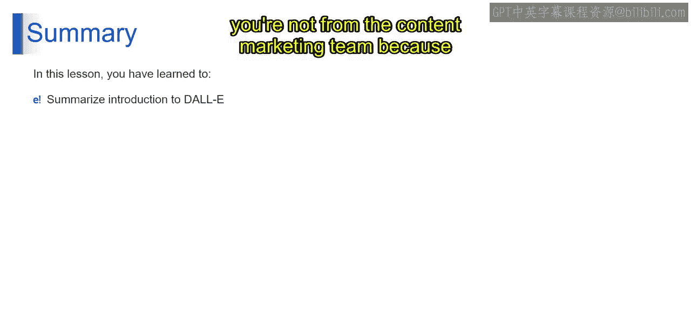

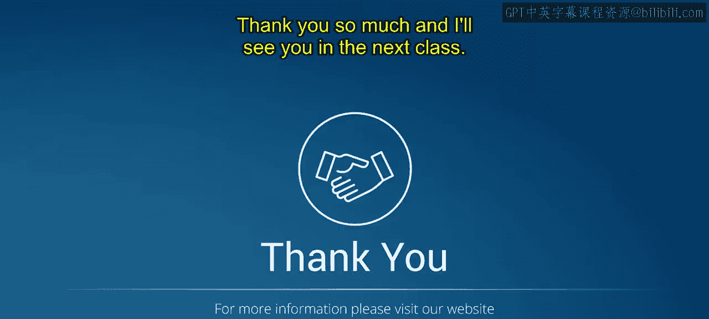

建议你亲自去探索和尝试DALL-E 2等AI工具，即使你并非从事内容营销工作，这也能帮助你更好地理解各类AI工具是如何运作的。