# 第二三四部分 155：Google Bard入门指南 🧠

在本节课中，我们将要学习Google Bard，这是由Google开发的一款生成式AI工具。我们将了解它的基本概念、工作原理、使用方法，并将其与ChatGPT进行对比。

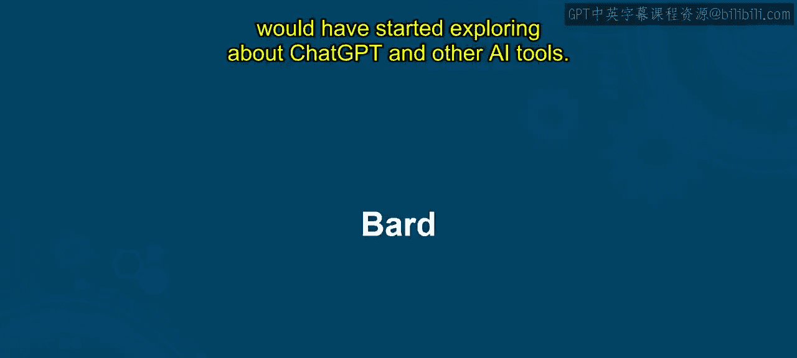

---

## 概述

Google Bard是一款基于大型语言模型的AI对话工具，能够生成文本、代码、诗歌等多种内容。本节我们将深入探索Bard的功能、访问方式以及实际应用。

---

## 什么是Google Bard？🤔

上一节我们介绍了生成式AI的基本概念，本节中我们来看看Google Bard的具体定义。

你可能在探索ChatGPT和其他AI工具时听说过Bard。Google Bard是Google的一项早期实验，它基于**Pathways语言模型（PaLM）**。与ChatGPT类似，Bard也是一个大型语言模型，能够回答各种问题、创作故事、谱写音乐等。

Google于2023年2月6日宣布开发Bard，并于3月21日开放了等待列表。5月10日，Google决定向公众免费开放Bard。

Bard基于PaLM概念，并在**5400亿参数**上进行了训练。这些参数帮助它生成各种类型的答案。它能协助你进行总结、语言翻译、代码编写，并能回答你向它提出的任何问题。

---

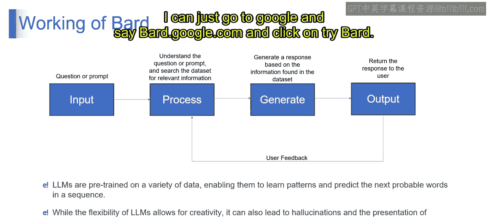

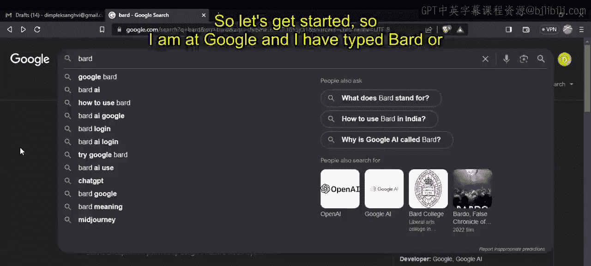

## Bard如何工作？⚙️

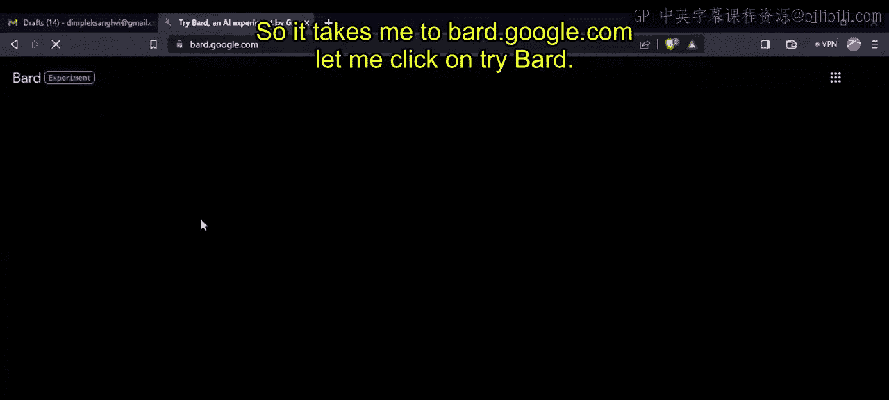

了解了Bard是什么之后，我们来看看它的工作原理。

Bard的工作流程遵循一个简单的过程：**输入 -> 处理 -> 生成 -> 输出**。

1.  **用户提出问题**。
2.  问题由Bard**处理**，Bard尝试理解提示词，并在其数据库中搜索相关信息。
3.  Bard**生成**答案。
4.  答案被**显示**给用户。

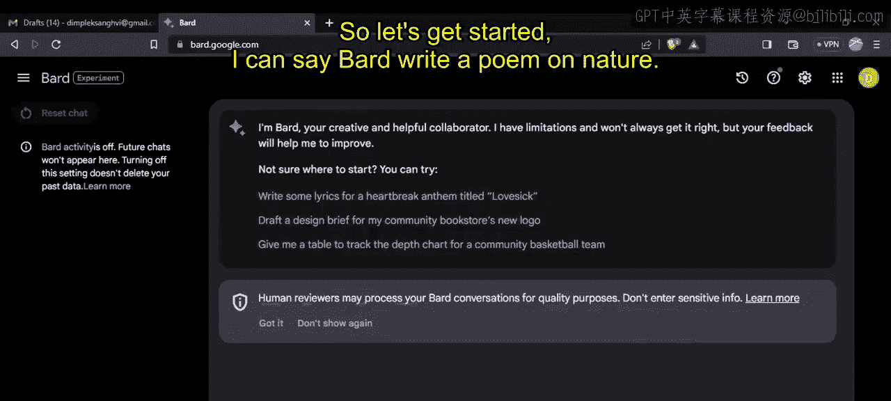

用户有一个**反馈循环**，可以表示是否喜欢这个答案，或者要求改变答案的格式。我们将在演示实际应用时详细看到这一切。

大型语言模型的灵活性允许创造性，但也可能导致**幻觉**和呈现不准确的信息。因此，作为提示工程师，我们必须确保通过交叉提问AI工具（如ChatGPT和Bard）来获得正确答案。

---

## 如何访问和使用Bard？🚀

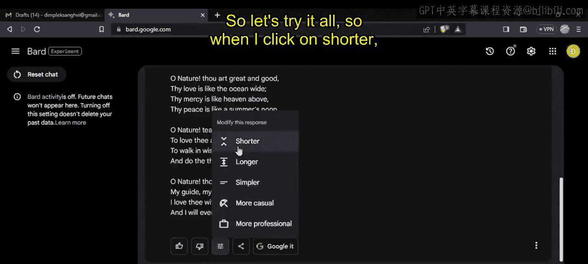

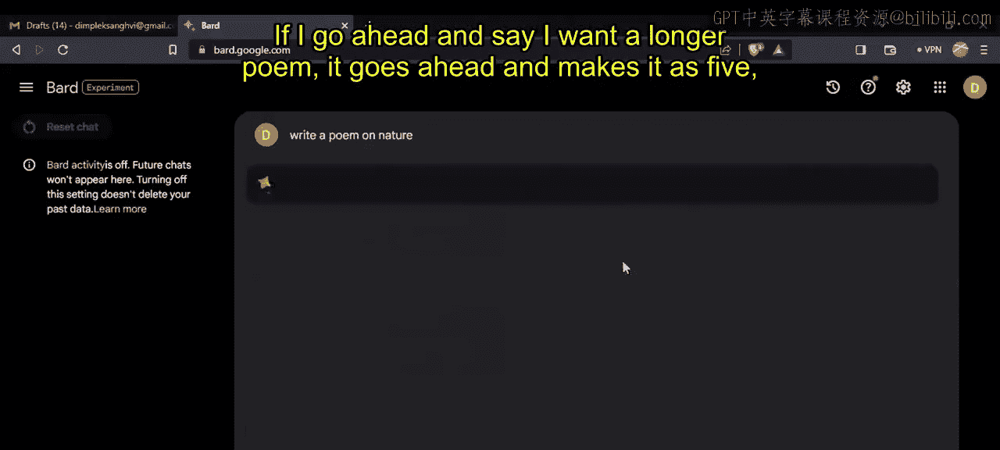

理解了原理，接下来我们进行实际操作。以下是访问和使用Bard的步骤。

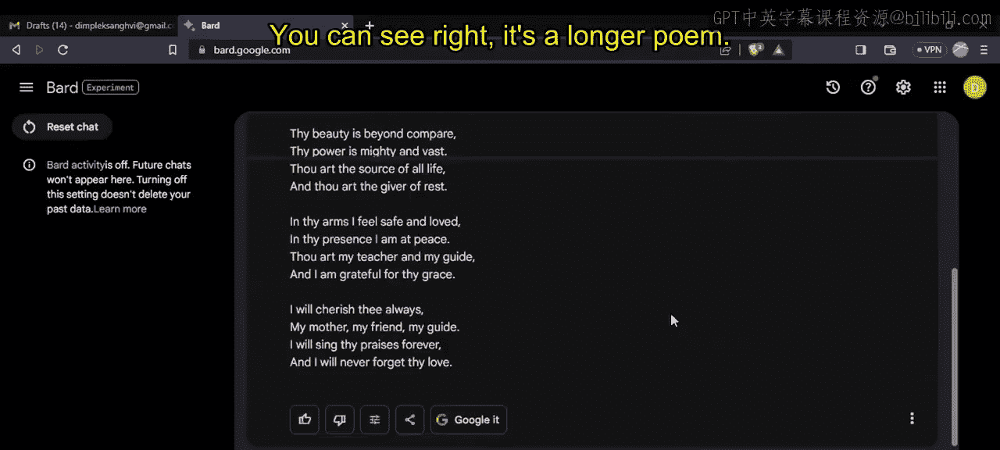

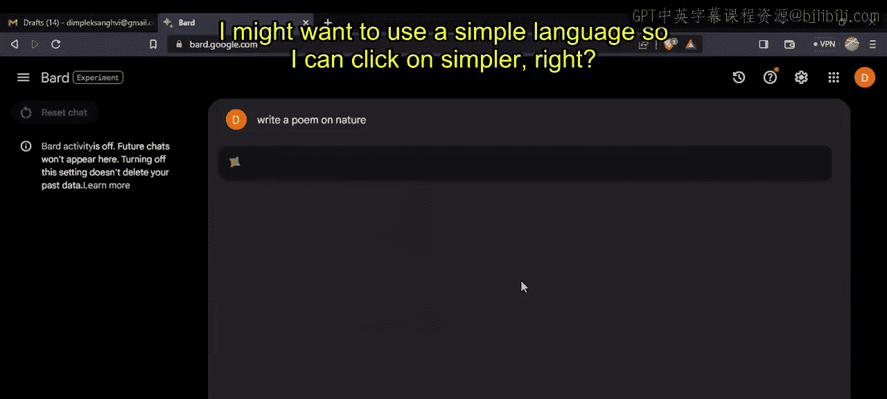

1.  打开浏览器，访问 `bard.google.com`。
2.  点击“Try Bard”按钮。
3.  系统会要求你使用Gmail账户登录。

**重要提示**：Google声明有人工审核员会审查对话以改进质量，因此**切勿输入任何敏感信息**，如社保号、信用卡号等。

登录后，你就可以开始与Bard对话了。例如，你可以输入：“Bard, write a poem on nature.” Bard会开始思考、搜索并生成输出。

---

## Bard的核心功能与操作 🛠️

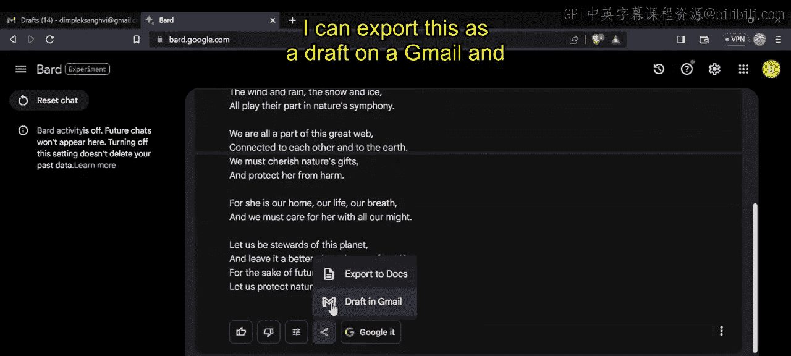

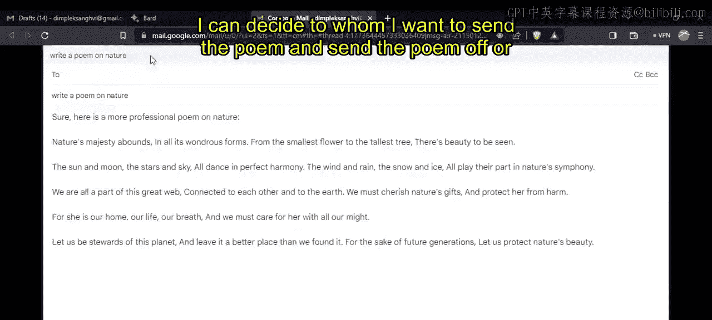

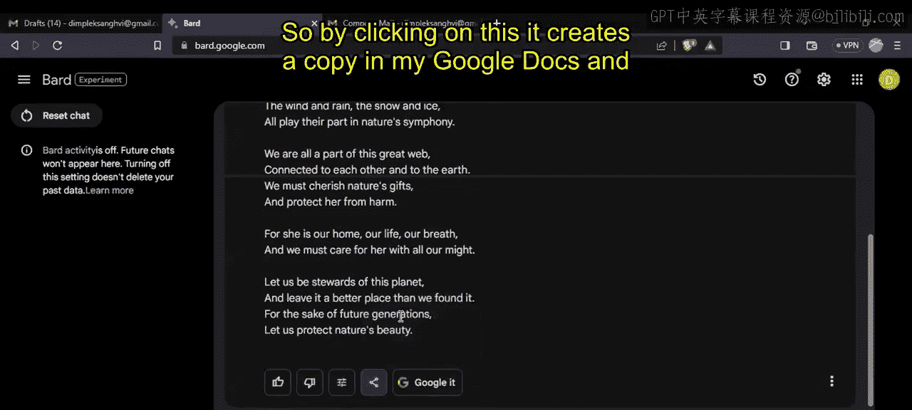

成功访问Bard后，让我们探索它的一些核心功能和交互选项。

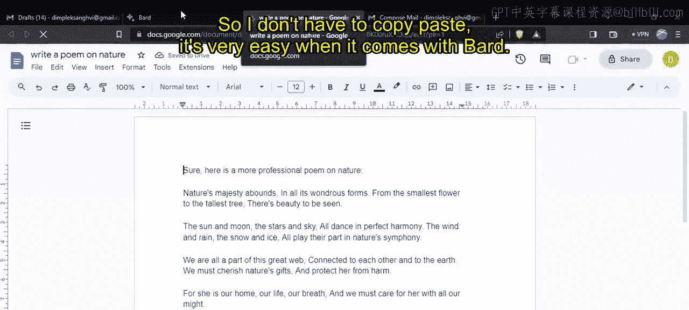

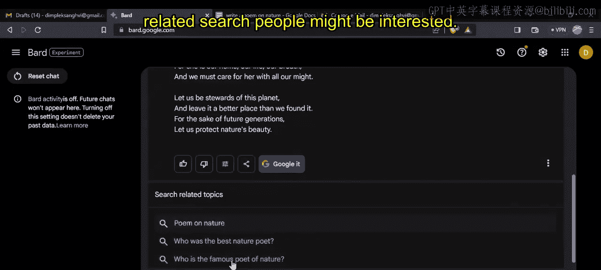

### 查看其他草稿
Bard在生成输出时，实际上会创建**三个不同的草稿**，并默认在屏幕上呈现其中一个。如果你不满意，可以点击查看第二个或第三个草稿。

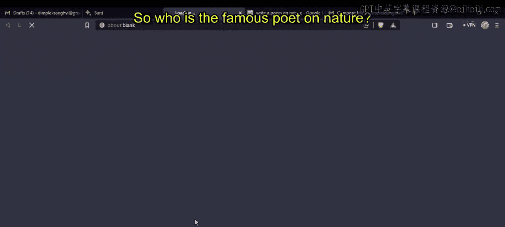

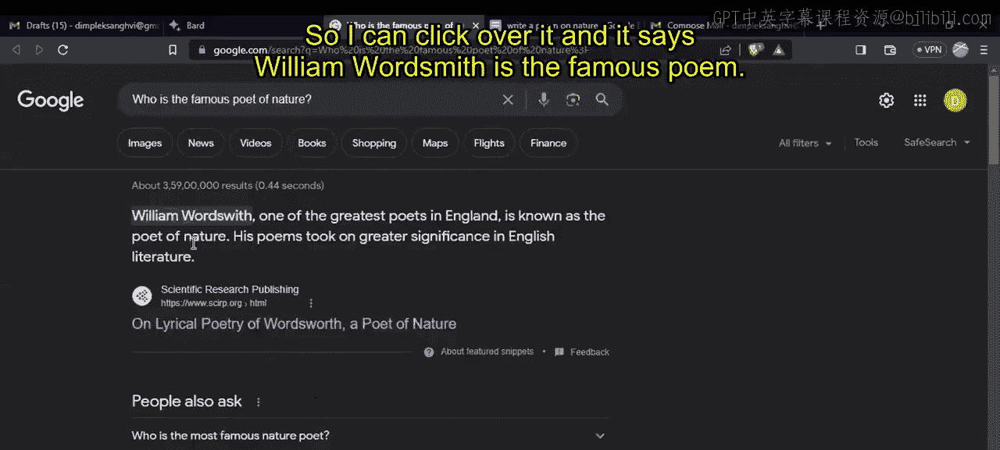

### 反馈与修改
以下是Bard提供的反馈和修改选项：

*   **点赞/点踩**：使用大拇指向上或向下的按钮表示你是否喜欢该回答。
*   **修改回答**：你可以要求Bard调整回答。选项包括：
    *   缩短诗歌
    *   加长诗歌
    *   使用更简单的语言
    *   使风格更随意
    *   使风格更专业

### 分享与导出
Bard可以轻松地将内容导出到其他Google服务：

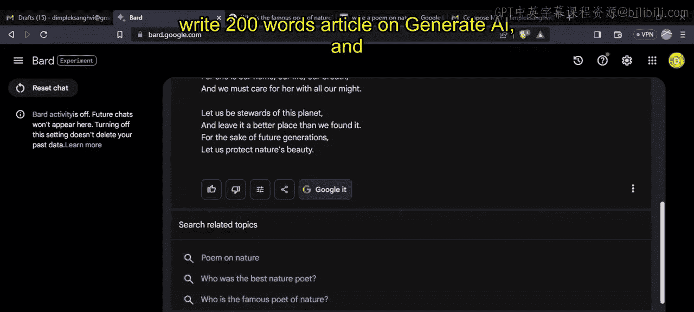

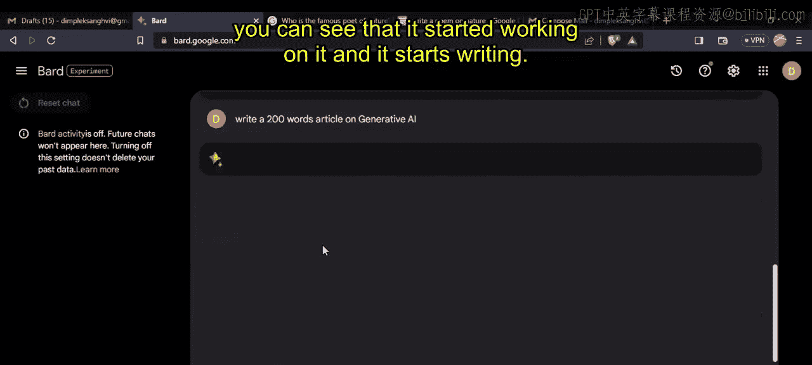

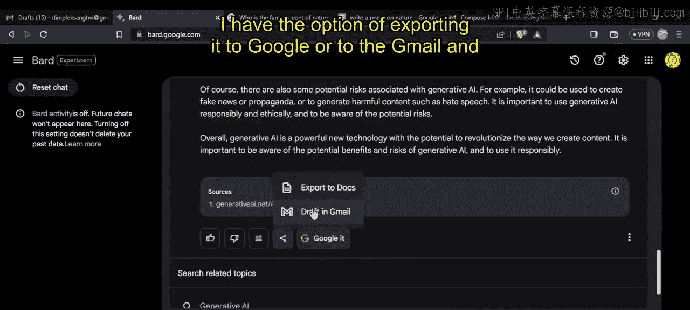

*   **导出到Gmail**：将生成的文本作为邮件草稿发送。
*   **导出到Google文档**：将内容直接保存到Google Docs中，无需复制粘贴。

### 进一步研究
如果你对某个主题感兴趣，可以点击 **“Google it”** 按钮。Bard会显示相关的搜索建议，帮助你进行更深入的研究。

### 语音输入
Bard界面有一个麦克风按钮，允许你通过**语音输入**来提出问题，这为交互提供了更多便利。

---

## Bard 与 ChatGPT 的对比 ⚖️

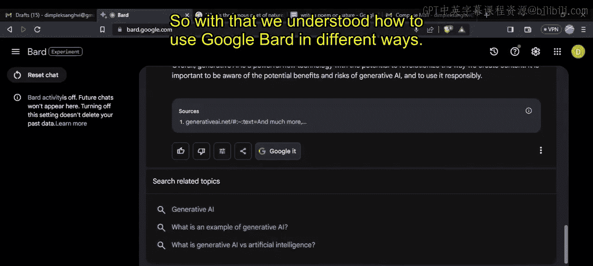

体验了Bard的各项功能后，我们将其与另一个流行的工具ChatGPT进行对比。

| 特性 | Google Bard | ChatGPT |
| :--- | :--- | :--- |
| **开发公司** | Google | OpenAI |
| **基础模型** | **Pathways Language Model (PaLM)** | **Generative Pre-trained Transformer (GPT)** |
| **训练参数** | 5400亿 | 1370亿 |
| **训练数据源** | 互联网文本、代码、Gmail数据（实时数据） | 截至2021年9月的互联网文章 |
| **核心优势** | 生成创意文本格式（诗歌、代码片段、音乐、邮件） | 理解并以自然语言回答问题 |
| **导出功能** | 可导出至Google Colab, Gmail, Google Docs, Sheets | 主要通过超链接或复制文本 |
| **费用** | 对所有用户免费 | 基础版免费；Plus版需支付**$20/月** |
| **典型应用** | 撰写技术文档、商业计划、营销材料、产品创意、销售策略、个性化内容（贺卡） | 对话、内容创作、编程辅助、分析 |

---

## Bard的编程应用实例 💻

除了创意写作，Bard在编程方面也非常有用。以下是其应用方式：

你可以要求Bard编写代码。例如，输入：“write a Python code to find the palindrome.”
Bard会生成相应的Python代码。作为代码，它可以轻松地**导出到Google Colab**。此外，Bard还能帮助进行**bug修复、编写代码和文档**，使得将输出发送到相应的集成开发环境变得非常容易。

---

## 总结

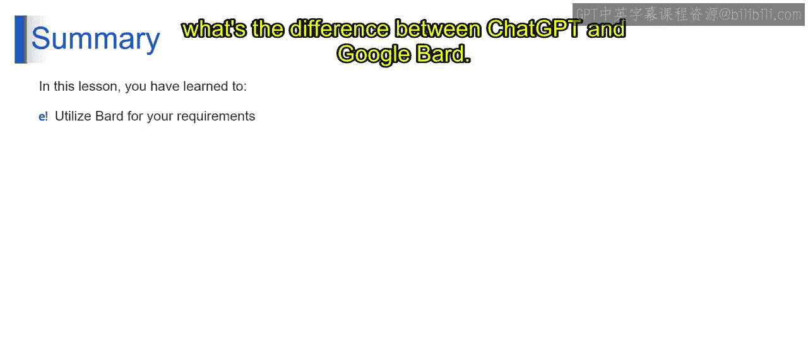

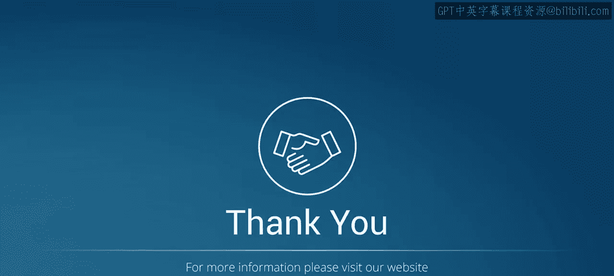

本节课中我们一起学习了Google Bard。我们理解了Bard是什么、它的工作原理（输入-处理-生成-输出），并逐步演示了如何访问和使用它。我们探索了其核心功能，如查看草稿、修改回答、分享导出以及语音输入。通过对比Bard和ChatGPT，我们清晰看到了两者在模型、数据、功能和费用上的区别。最后，我们还了解了Bard在代码生成和编程辅助方面的实用价值。现在，你可以开始探索Bard，尝试用它完成各种创意和任务了。