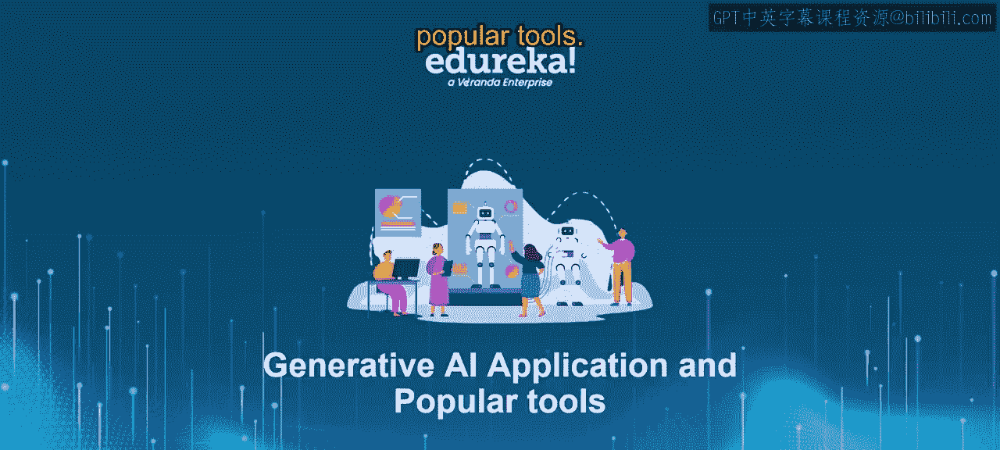
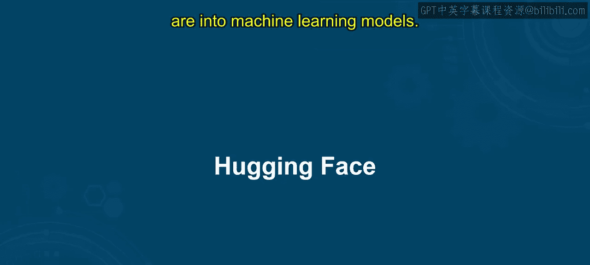
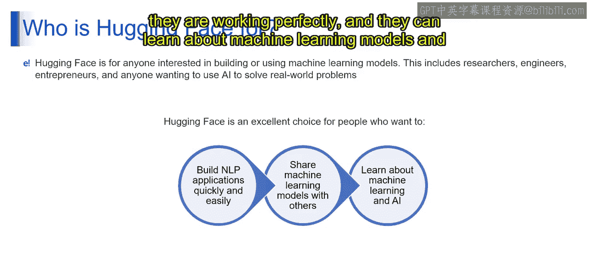
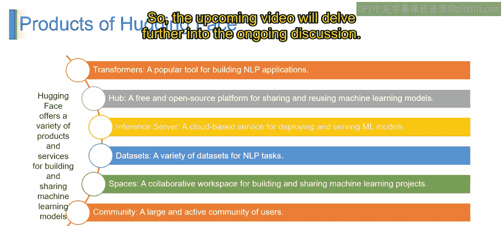

# 第二三四部分 156：Hugging Face平台介绍 🚀

在本节课中，我们将要学习一个名为Hugging Face的流行AI工具平台。这个平台专注于自然语言处理，旨在通过开源和开放科学来普及人工智能。

## 什么是Hugging Face平台？

Hugging Face是一个专注于自然语言处理的平台。它成立于2016年，旨在通过开源和开放科学来普及人工智能。该平台为专注于NLP工具的开发者提供了最先进的研究资源。

## 平台的重要性与功能

上一节我们介绍了Hugging Face的基本定义，本节中我们来看看它为何重要以及它能做什么。

该平台之所以重要，是因为像GPT这样的模型也是基于Transformer架构的语言模型。它们建立在自然语言处理的概念之上。当我们输入提示时，模型使用英语等自然语言进行理解并生成回应。

如果你想为你的业务定制某些功能，或者想进行与NLP模型相关的研究与开发，Hugging Face平台能提供帮助。它让你能够访问一个充满活力的社区。

以下是该平台的核心功能：

*   **它是一个Transformer语言模型库。**
*   **它是一个免费、开源的平台中心。**
*   **它拥有一个庞大的数据库。**
*   **它提供了一个名为“Spaces”的概念，这是一个用于构建和分享项目的工作区。**
*   **它拥有一个庞大的活跃用户社区，成员可以在整个过程中互相帮助。**

## 社区与协作的优势

在了解了平台的功能后，我们来看看其社区带来的具体好处。

你可以构建自己的机器学习模型并与公众分享。这个平台非常好，因为它拥有一个优秀的Transformer库。

你可以从社区中获得更多创造力，实现更多创新，因为你能获得所有愿意在你构建NLP模型的旅程中支持你的人。我们可以清楚地看到一个非常良性的反馈循环：每个人都在鼓励他人进行构建。如果你构建了某个项目，可以轻松地与他人分享。

对于那些希望快速、轻松构建自己NLP应用程序的人来说，这是一个解决方案。他们可以搜索其他人构建并运行良好的机器学习模型，可以学习如何解决现实世界中的机器学习模型和AI问题。

本节课中我们一起学习了Hugging Face平台。它是一个专注于NLP的AI社区与工具平台，通过提供开源模型、数据库、项目工作区以及活跃的社区支持，使研究人员、开发者和企业能够更有效地进行自然语言处理相关的开发、研究与协作。