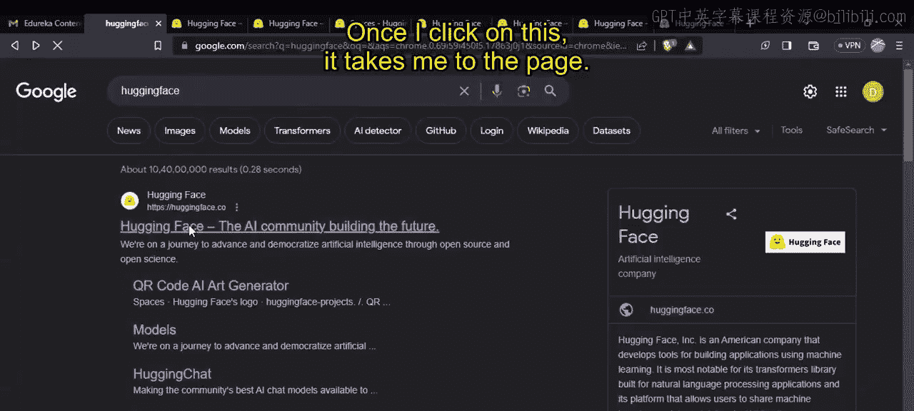
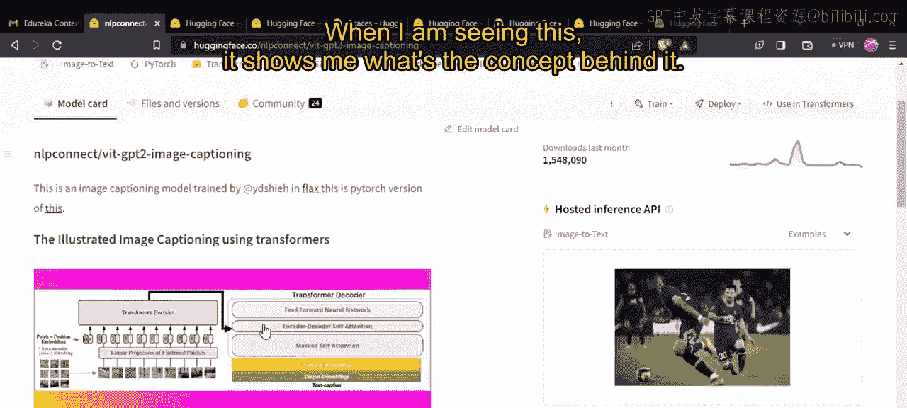
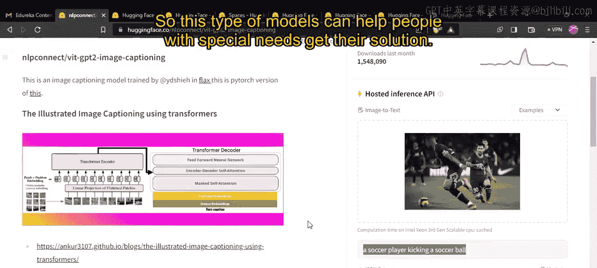
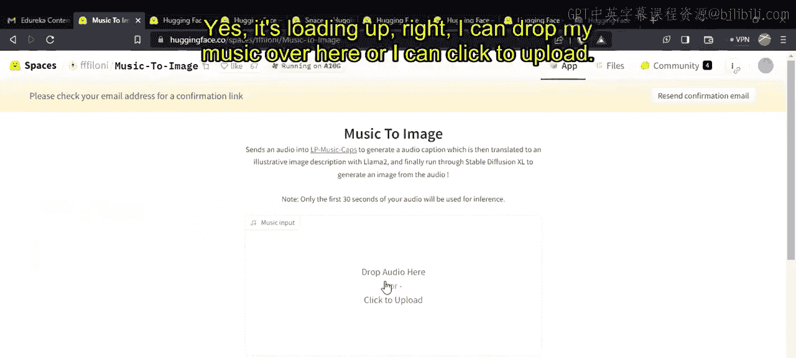
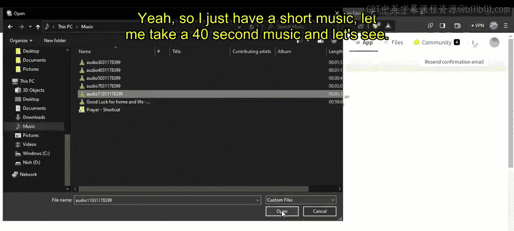
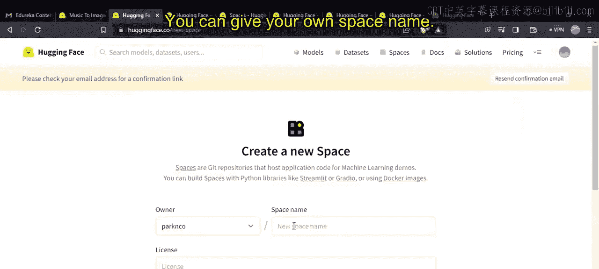
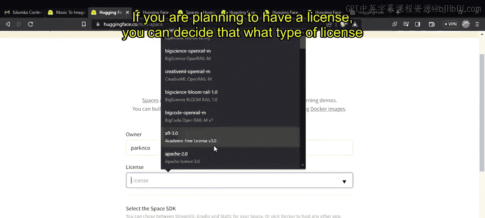
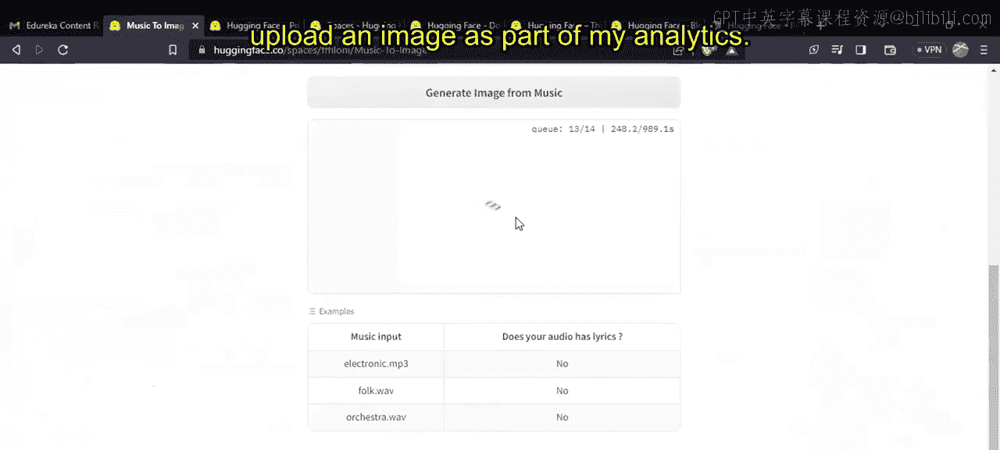

# 第二三四部分 157：探索Hugging Face界面 🚀

在本节课中，我们将学习如何探索和使用Hugging Face平台。Hugging Face是一个功能强大的机器学习社区和平台，提供了丰富的模型、数据集和工具，帮助开发者构建和部署AI应用。我们将从注册登录开始，逐步了解其主要功能模块，并通过实际例子演示如何使用这些资源。

---

## 概述

上一节我们介绍了生成式AI的基本概念。本节中，我们将深入探索Hugging Face平台。这是一个集模型、数据集、社区空间和文档于一体的中心，旨在简化机器学习工作流程。我们将学习如何导航其界面，查找并使用各种预训练模型，以及如何利用其社区资源。

---

## 访问与注册

首先，访问Hugging Face平台。在浏览器中搜索“hugging face”，第一个结果通常是其官网 `huggingface.co`。点击链接即可进入。

平台界面清晰，顶部导航栏包含 **Models**、**Datasets**、**Spaces**、**Docs**、**Solutions** 和 **Pricing** 等选项。你需要创建一个账户才能充分利用所有功能。注册过程简单，完成后你可以创建个人资料、参与论坛讨论并管理自己的任务。

---

## 探索模型库

在 **Models** 部分，你可以搜索各种预训练模型。例如，如果你想进行“图像到文本”的任务，可以在此搜索。

搜索后，平台会列出相关模型。每个模型都有简介和可能的应用场景。例如，一个图像描述模型可以分析图片内容并生成描述性文字。这种技术能帮助视障人士通过特殊眼镜“看见”周围环境，图像到文本模型在此类辅助技术中扮演关键角色。

以下是查找模型的步骤：

1.  进入 **Models** 页面。
2.  在搜索栏输入任务关键词，如 “image-to-text”。
3.  浏览结果，查看模型描述、许可证和示例。

你还可以根据任务类型（如特征提取、文档问答、文本生成视频）或支持的语言（英语、印地语、波斯语等）来筛选模型，以找到最适合你项目的工具。

---

## 使用数据集

**Datasets** 部分提供了用于训练和评估模型的大量数据。这些数据涵盖计算机视觉、自然语言处理、音频和表格数据等多个领域。

例如，如果你想进行自动语音识别或文本到语音转换，可以在此查找相关数据集。平台会展示可用的数据集列表，其中可能包含特定语言（如马拉地语）的语音数据，这有助于构建多语言应用。

---

## 体验社区空间

**Spaces** 是Hugging Face上一个有趣的板块，用户可以在这里公开分享他们基于模型构建的演示应用。这些应用种类繁多，例如“音乐生成图像”工具。

你可以直接使用这些空间应用。例如，在一个“音乐生成图像”的空间中，你可以上传一段音频文件（如一段40秒的音乐），系统会尝试根据音乐生成对应的图像。这个过程可能需要一些时间排队处理，但能直观展示模型的能力。

此外，你也可以创建自己的空间，将开发的模型部署为公开可用的Web应用。创建时需要指定空间名称、许可证、开发工具包（SDK）、所需硬件以及可见性（公开或私有）。

---

## 查阅文档与解决方案

**Docs** 部分提供了全面、详细的文档，涵盖了平台所有功能的使用方法，例如分词器（Tokenizer）、服务器、数据安全、与TensorFlow的集成、自动训练以及与Amazon SageMaker的协作等。对于初学者，理解如何高效使用分词器等核心组件至关重要。

**Solutions** 页面则为企业用户提供了更结构化的产品路线，包括企业中心、专家加速计划、API终端、自动训练和硬件解决方案。你可以在此申请演示，了解其他企业如何利用该平台进行机器学习实验。

---

## 了解定价计划

Hugging Face提供多种订阅计划以满足不同用户需求：

*   **免费计划**：包含无限的公开模型、数据集和空间，适合个人学习和实验。
*   **专业版**：每月9美元，提供更高阶的自动训练功能、优先API访问和新特性抢先体验。
*   **企业版**：每月每用户20美元，提供API管理、专属硬件支持等高级功能，适合团队协作。

平台还详细列出了空间硬件（约0.05美元/小时）、推理终端（约0.06美元/小时）等资源的用量计费标准。自动训练功能目前在免费计划中也可使用。

---

## 总结

本节课我们一起探索了Hugging Face平台的核心功能。我们学习了如何访问平台、查找并使用各种预训练模型和数据集，体验了社区分享的演示空间，并了解了其文档系统和定价结构。Hugging Face是一个极其丰富的资源库，非常适合初学者构建自己的机器学习作品集。建议你立即注册一个账户，开始动手实践，探索AI的无限可能。