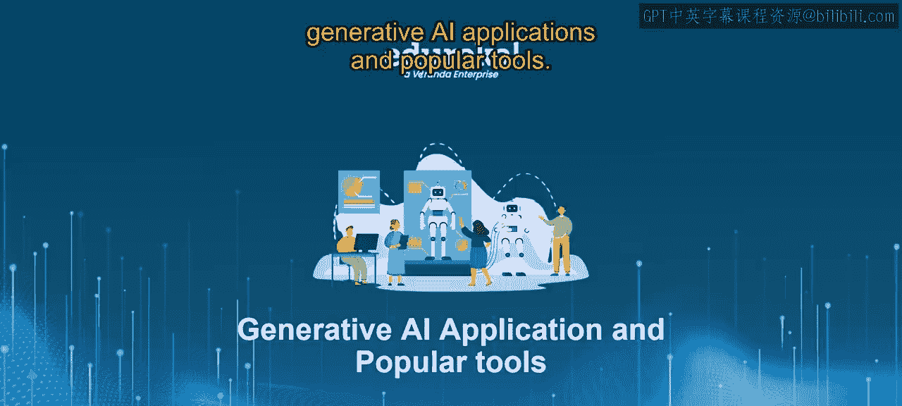
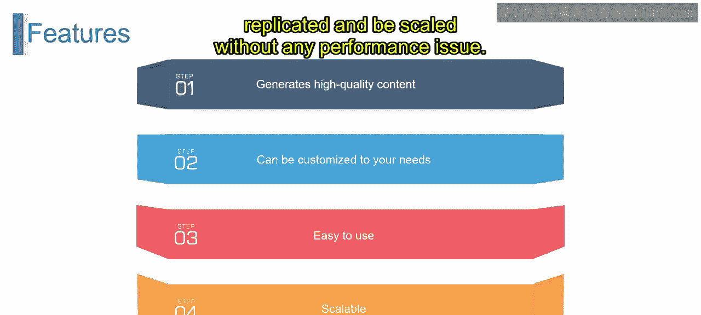
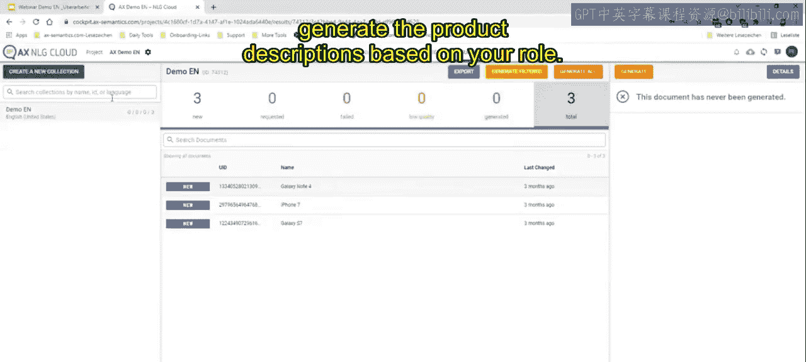

# 第二三四部分 158：NLG Cloud平台详解 🚀

在本节课中，我们将深入探索一个强大的自然语言生成平台——NLG Cloud。我们将了解它的功能、核心优势以及如何通过实际案例使用它来高效生成高质量内容。

## 概述

NLG Cloud是一个利用大型语言模型来大规模生成高质量内容的自然语言生成平台。它能理解用户需求，生成兼具信息性和吸引力的文本，是创建博客文章、产品描述等内容的优秀工具。

## 什么是NLG Cloud？ 🤔

上一节我们介绍了课程目标，本节中我们来看看NLG Cloud的具体定义。

NLG Cloud是一个自然语言生成平台。该平台能大规模生成高质量内容。它使用大型语言模型来理解用户需求。模型生成的文本既提供信息，又具有吸引力。这使其成为创建博客文章和产品描述的绝佳工具。

## 核心功能与特点 ⚙️

了解了平台的基本定义后，本节我们将详细拆解它的核心功能。

NLG Cloud的核心功能是生成高质量内容。该平台利用大型语言模型生成信息丰富且引人入胜的文本。它可以根据您的特定需求进行定制。您可以自定义文本的**语调**和**风格**。这确保了生成的文本符合品牌要求。

以下是该平台的主要特点：
*   **易于使用**：一旦输入需求，平台能在几分钟内生成高质量内容。
*   **高度可扩展**：内容可以复制和扩展，且不会出现性能问题。

## 使用NLG Cloud的好处 ✨

认识了平台的功能，我们接下来看看它能带来哪些实际益处。

使用NLG Cloud平台能带来多方面好处。

以下是其主要优势：
*   **提高生产力**：通过自动化内容创建过程，节省大量时间和精力，团队可以专注于市场营销和销售等任务。
*   **提升品牌一致性**：通过微调语音和风格的细节进行定制，可以确保品牌声誉得以维持。
*   **增加客户参与度**：该平台能帮助创建更具吸引力的内容，促使客户不断回访。
*   **优化搜索引擎**：平台生成的内容针对搜索引擎进行了优化，有助于为网站吸引更多访客。

## 实战演示：生成产品描述 🛠️

理论部分已经介绍完毕，现在让我们通过一个实际案例，看看如何使用NLG Cloud生成产品描述。

演示中创建了三个产品：Galaxy Note 4、iPhone 7和Galaxy S7。为每个产品输入了名称、品牌、颜色、功能、类别、重量、处理器、显示屏尺寸、操作系统等详细信息。

操作流程如下：
1.  **数据输入与分析**：一次性输入所有产品数据后，点击“分析”。系统会指出哪些功能项被遗漏，以及哪些产品信息完整。
2.  **规则设置**：通过从左侧拖拽数据点到右侧来设置内容生成规则。例如，可以设置规则来描述设备的显示屏尺寸或存储容量。规则形式类似于：`{产品名} 配备了 {操作系统} 和 {显示屏尺寸} 的显示屏。`
3.  **内容生成与发布**：设置好规则后，系统会根据规则为所有产品一次性生成内容。点击“发布”即可查看结果。
4.  **内容转换**：通过“转换”功能，可以设置条件规则来进一步定制内容。例如，可以设置规则：`如果 {设备尺寸} 是“大”，则描述为“这是一款适合观看视频的大屏手机”；如果 {设备尺寸} 是“小”，则描述为“这是一款便携的紧凑型手机”。`
5.  **生成故事**：最终，所有数据被转换并生成为完整的产品描述故事。系统能为所有输入的产品批量生成内容。

这个过程表明，即使有上百个产品，NLG Cloud也是一个能根据既定数据批量生成产品描述的强大工具。

## 总结

本节课我们一起学习了NLG Cloud平台。我们了解了它是一个基于大型语言模型的自然语言生成平台，能够高效、大规模地生成定制化的高质量文本。我们探讨了它的核心功能、主要优势，并通过一个生成产品描述的完整案例，演示了从数据输入、规则设置到内容生成和发布的全过程。掌握这个工具，能显著提升内容创作的效率与一致性。

如果您有任何疑问，请随时联系我们，我们将乐意提供帮助。

谢谢。