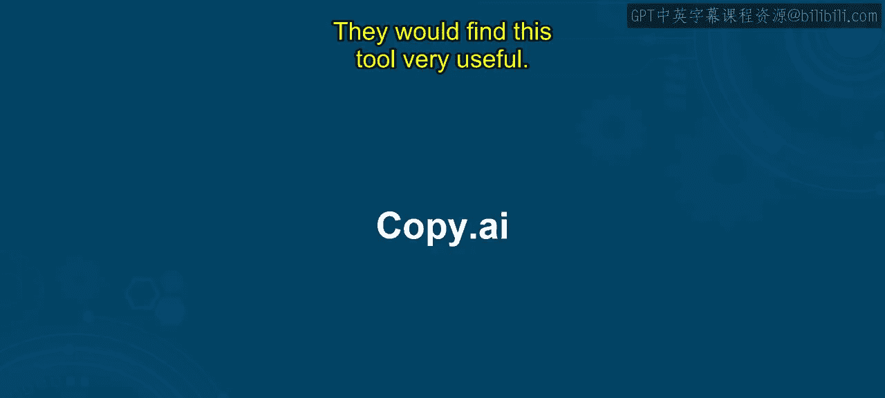
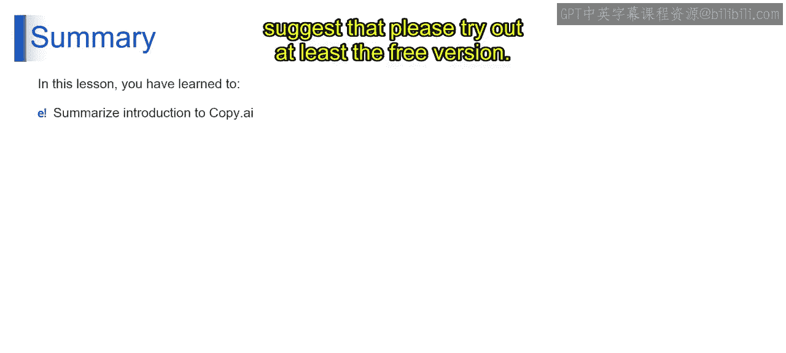

# 第二三四部分 159：Copy.ai工具详解 🧠

在本节课中，我们将学习一款专为营销领域设计的生成式AI工具——Copy.ai。我们将了解它的核心功能、优势以及如何使用它来提升营销文案的效率和效果。

---

## 什么是Copy.ai？ ✨

上一节我们介绍了生成式AI的应用场景，本节中我们来看看一个具体的工具。Copy.ai是一款基于OpenAI语言预测模型的AI写作工具，旨在帮助用户创作更具吸引力的营销文案，从而生成更多潜在客户。

它的核心优势在于能够提升文案质量、生成更吸引人的内容，并节省大量时间和金钱。最终，它能通过高效的营销文案将潜在客户转化为实际销售线索。

## Copy.ai的主要功能 🛠️

以下是Copy.ai提供的一系列实用功能，旨在全方位支持营销内容创作。

*   **90+内容模板**：工具内置超过90个模板，覆盖博客文章、社交媒体广告、电子邮件营销活动和落地页等多种营销文案类型。
*   **浏览器扩展**：通过安装浏览器扩展，用户可以直接在网页浏览器中生成文案，提升工作流效率。
*   **内置抄袭检查器**：无需借助外部工具，Copy.ai自带抄袭检查功能，确保内容原创性。
*   **释义工具**：由于使用AI工具生成内容，对文案进行改写和优化变得尤为重要，该工具内置了释义功能。

## 如何使用Copy.ai 🚀

要开始使用Copy.ai，操作非常简单。以下是获取访问权限和了解其服务计划的步骤。

1.  **访问网站**：打开浏览器，访问 `copy.ai`。
2.  **注册账户**：使用您的Google或Facebook账户创建登录ID。
3.  **回答问题**：系统可能会询问您的职业角色，您的选择不会影响输出内容的质量。
4.  **选择计划**：您可以开始使用免费计划，也可以升级到专业计划。

## 服务计划对比 💰

Copy.ai提供不同层级的服务计划以满足多样化的需求。以下是免费计划与专业计划的核心区别。

*   **免费计划**
    *   每月2000字额度。
    *   支持25种语言。
    *   可使用90+种工具。
    *   提供7天免费试用期。

*   **专业计划**（每年432美元）
    *   无字数限制。
    *   可使用全部90个模板。
    *   包含博客写作工具。
    *   支持最多5个用户使用同一账户。
    *   支持25+种语言。
    *   享有官方提供的技术支持。

## Copy.ai的应用场景 📈

对于营销领域的从业者而言，Copy.ai能显著简化多项日常工作。以下是几个典型的应用场景。

*   **博客文章创作**：快速生成高质量的博客初稿。
*   **社交媒体帖子**：为不同平台创作吸引眼球的文案。
*   **电子邮件营销**：撰写高效的营销邮件和客户沟通邮件。
*   **产品描述**：生成详细且富有说服力的产品介绍。
*   **销售文案与落地页**：专注于提升转化率的销售话术和页面内容设计。
*   **网站文案**：用于设计主页及其他网页内容的文案。

---

本节课中，我们一起学习了Copy.ai这款强大的AI营销文案工具。它专为需要生成营销内容、获取销售线索并实现转化的营销团队设计。其基于先进模型，能高效产出优质内容，非常实用。建议您至少尝试其免费版本。感谢学习，我们下节课再见。