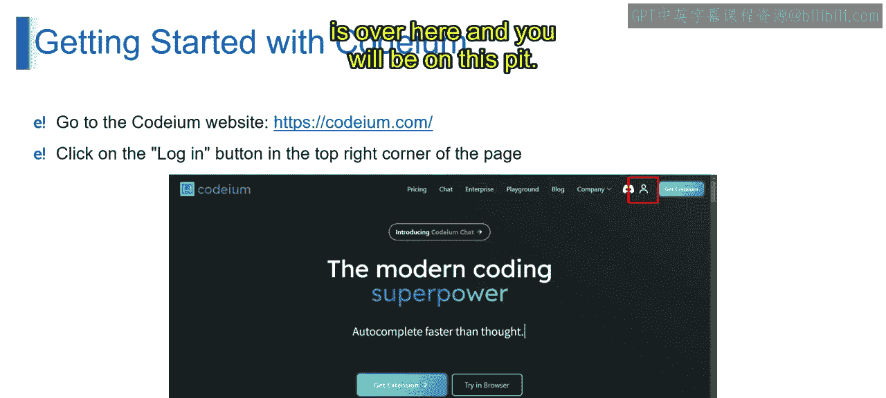
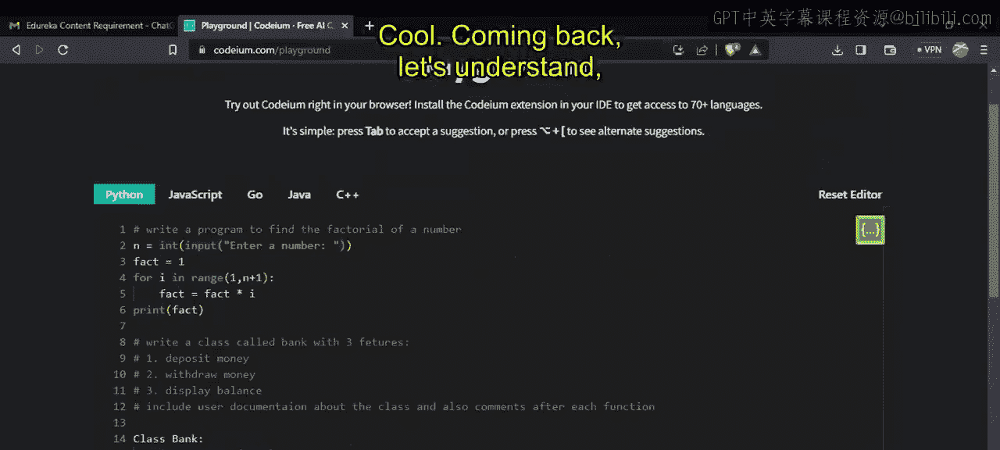
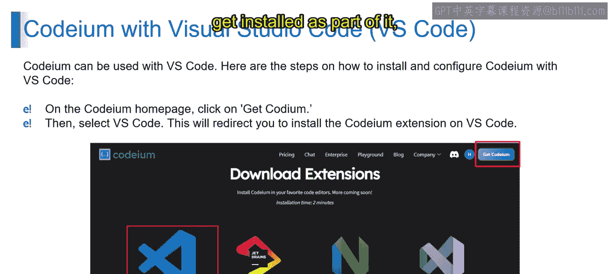
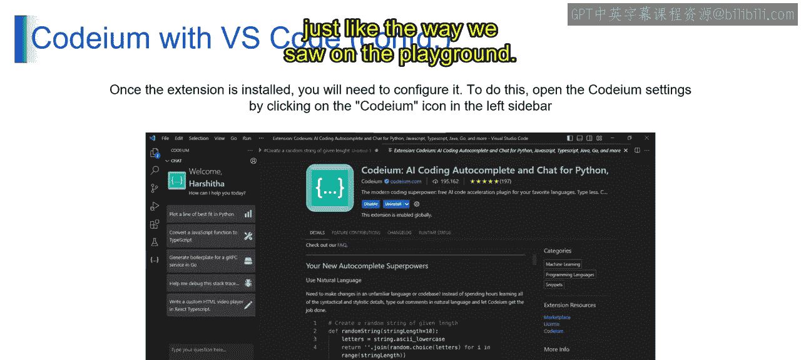
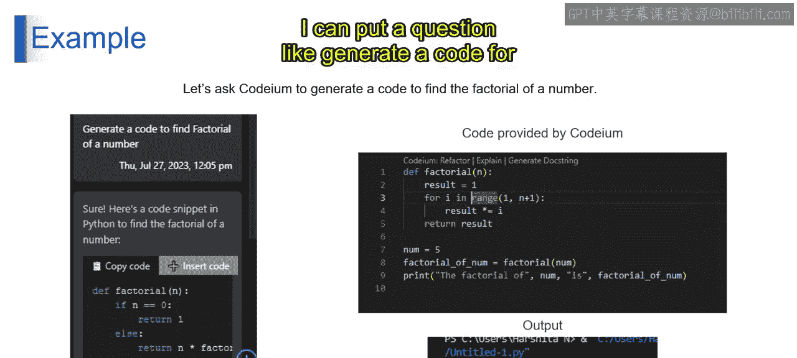
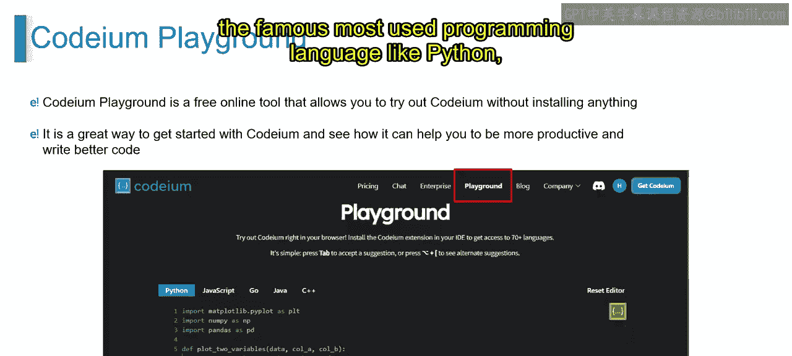
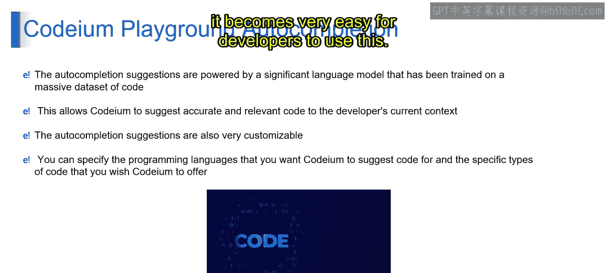
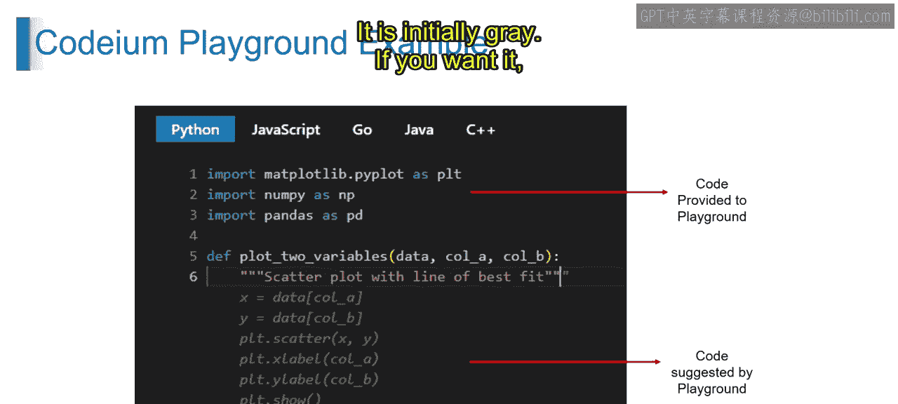
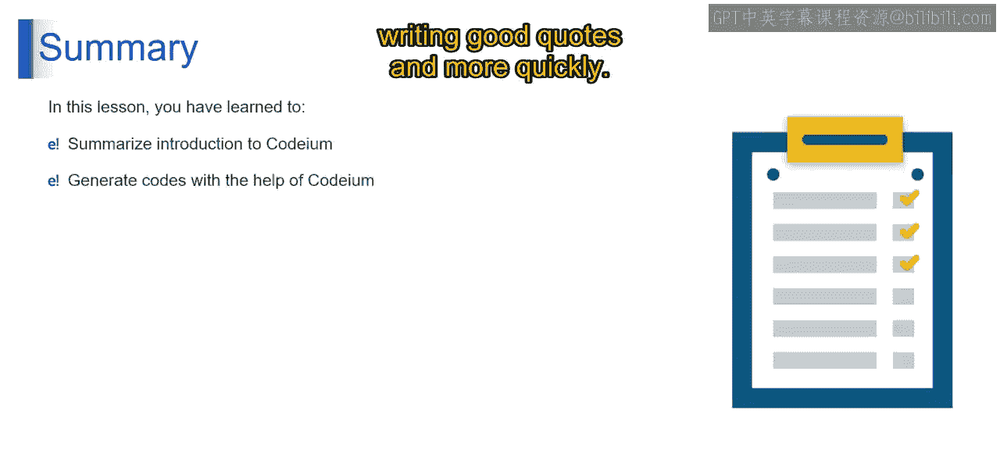

# 第二三四部分 161：Codeium工具介绍 🚀

在本节课中，我们将学习一款名为Codeium的新AI工具。这是一款旨在改变程序员和代码编写者工作方式的工具，它通过AI驱动的代码补全和搜索功能，帮助开发者提高生产力和代码质量。

---

## 什么是Codeium？🤖

Codeium是一款新的AI工具，它支持包括Python、Java、JavaScript、C++在内的20多种编程语言。这款工具的核心优势在于，它是一个免费的AI工具包，专门为开发者设计，专注于代码补全和逻辑实现。

与ChatGPT或Bard等通用大语言模型不同，Codeium从开发者的视角进行了更精确的训练。这意味着它更擅长理解编程语境和需求，而非通用内容创作。

---

## Codeium的主要功能与优势 ⚙️

上一节我们介绍了Codeium的基本概念，本节中我们来看看它的具体功能和优势。

Codeium的核心功能是AI驱动的搜索，它帮助开发者完成所需的文件和编码工作。

以下是Codeium带来的主要优势：
*   **提高生产力**：自动化代码补全加速开发流程。
*   **提升代码质量**：生成的代码更少出错（bug-free），开发者无需过度担心语法和逻辑错误。
*   **减少上手时间**：直观的工具降低了新工具的学习成本。

---

## 如何访问与使用Codeium？💻

了解了Codeium的功能后，本节我们将学习如何访问和使用它。

访问Codeium非常简单，只需在浏览器中打开 `codeium.com` 即可。目前该工具免费提供使用。

登录后，你会看到一个名为“Playground”的功能区。在这里，你可以直接开始编写代码，它支持Python、JavaScript、Go、Java和C++等多种语言。

**操作演示**：
1.  在Playground中点击任意位置开始编写。
2.  例如，输入 `# 计算一个数的阶乘`，Codeium会立即给出代码建议。
3.  按下 `Tab` 键即可接受建议，自动补全代码。
4.  你还可以要求它生成更复杂的代码，例如：`编写一个名为Bank的类，包含三个功能`。它会快速生成存款、取款和显示余额等方法的基本结构。
5.  你甚至可以要求添加文档字符串和函数注释，Codeium也能很好地完成。

---

## Codeium的集成与扩展 🔌

除了在线Playground，Codeium还能集成到各种流行的开发环境中，使其更加强大。

登录后，你可以将Codeium作为扩展安装到以下集成开发环境（IDE）中：
*   Visual Studio Code
*   Google Chrome
*   Jupyter Notebook
*   Visual Studio

安装扩展后，Codeium就能在你的IDE中直接提供帮助，就像在Playground中一样。例如，你可以直接提问：“生成计算数字阶乘的代码”，它便会开始生成。

此外，通过Codeium扩展，你还可以使用以下高级功能：
*   **重构代码**
*   **解释代码**
*   **生成文档**
*   **与代码对话**（进行问答）

---

## 核心使用技巧与总结 🎯

我们看到了Playground对Python、Java、C++等流行语言的支持，以及其自动补全功能如何让开发变得更轻松。Codeium高度可定制，能根据上下文提供智能建议。

**关键操作**：在Playground中，Codeium提供的代码建议初始显示为灰色。如果你同意该建议，只需按下 `Tab` 键，它就会自动填充到你的编辑器中。

**本节课总结**：
本节课我们一起学习了Codeium这款AI编程助手。它是一个出色的扩展工具，能帮助开发者更高效、更快速地编写高质量代码，从而显著提升开发生产力。

感谢学习，我们下节课再见！