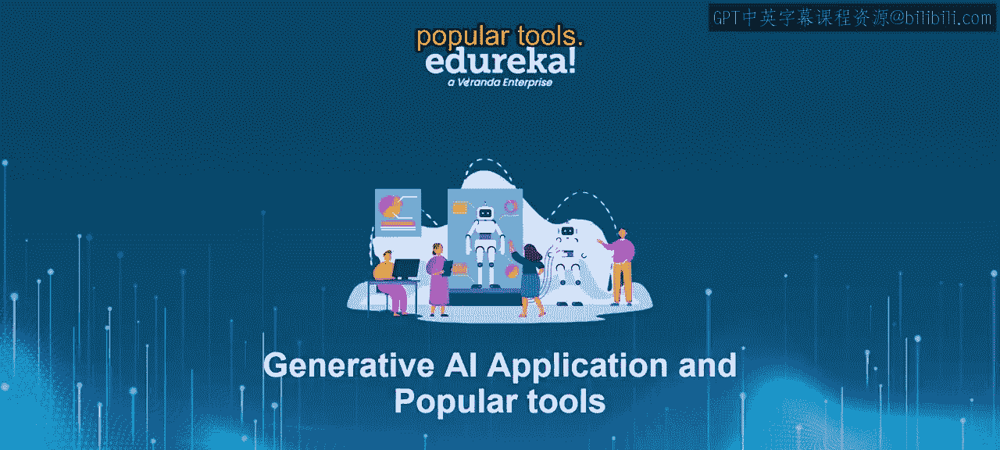
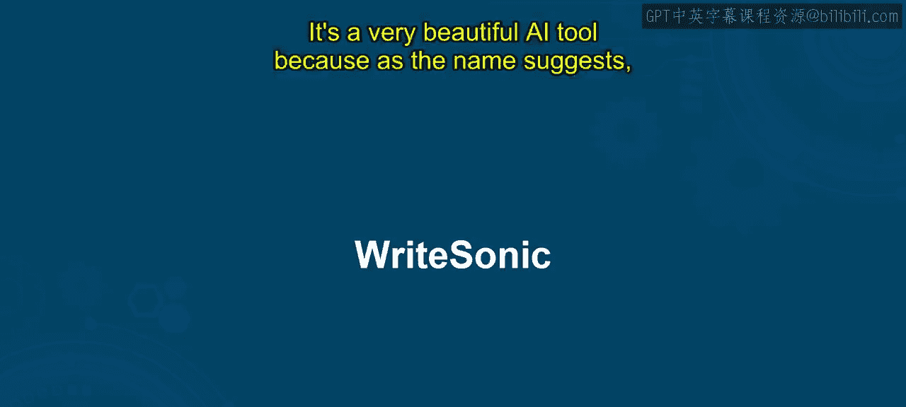
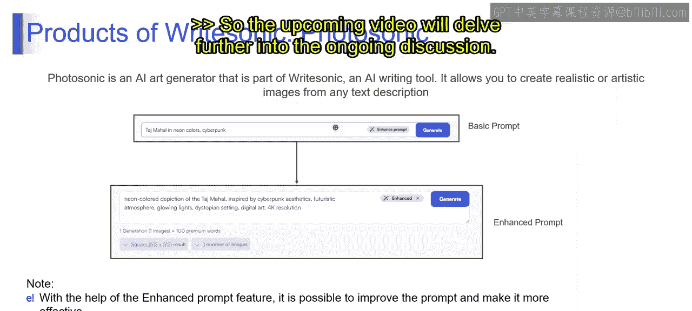

# 第二三四部分 162：Writesonic工具详解 🚀

在本节课中，我们将学习一个名为Writesonic的AI写作工具。我们将了解它的核心功能、产品构成、定价计划，并通过示例演示其使用方法。

---

### **概述**

Writesonic是一款基于生成式AI技术的内容创作工具。它能够帮助用户生成多种类型的高质量内容，例如博客文章、社交媒体帖子和广告文案。该工具旨在简化内容创作流程，让用户无需深厚的写作技巧也能高效产出。

---

### **Writesonic简介**

Writesonic是一个AI写作工具，可以帮助你创建多种内容，包括博客文章、社交媒体帖子、广告文案和登陆页面等。它利用人工智能生成既原创又高质量的内容。

该工具易于使用，其功能由Chatsonic、Botsonic、Photosonic以及超过100种不同的AI写作功能支持。这些创新的产品和功能是通过使用领先品牌的数千个真实案例训练AI模型而实现的。

正如你在右侧屏幕截图中看到的，Writesonic提供了多种选项来完成不同任务。

---

### **核心概念与工作原理**

Writesonic建立在**生成式AI**的概念之上。其模型针对特定用例（如谷歌广告、博客文章等）进行了微调，以便学习这些领域的写作模式。

要开始使用Writesonic，你只需访问其官网，使用Gmail账户登录。新用户可获得10000个免费单词额度，无需绑定信用卡。

---

### **定价计划**

Writesonic提供多种定价方案以满足不同需求。

以下是其主要方案：

*   **免费版**：零成本，使用GPT-3.5模型，提供Chatsonic、Botsonic和100多种AI工具的访问权限，支持25种以上语言。
*   **无限版**：每月16美元起（价格可能因用户数量上涨至160美元），提供Chatsonic和100多种AI模板的访问权限。
*   **商业版（企业版）**：针对需要多许可证的企业，价格从每月2.67美元到666美元不等，可申请演示。
*   **大型企业版**：每月500美元起，提供定制套餐、SSO（单点登录）以及开发和入职支持等多种服务。

本节课我们将使用Writesonic的免费版来了解其功能。

---

### **主要功能与产品**

在深入了解之前，我们先看看Writesonic能做什么。它可以撰写文章、生成社交媒体帖子、广告文案、登陆页面、产品描述和博客文章等。

当你进入Writesonic的模板库，会发现大量预设内容模板可供使用。该库包含博客文章、社交媒体帖子、登陆页面等多种内容类型，这使内容开发者能轻松使用该工具。

为了获得高质量输出，Writesonic内部包含多个产品：

*   **AI Writer**：帮助进行写作。
*   **Paraphraser**：帮助重写文本以提高可读性。
*   **Text Expander**：通过扩展短文本片段来节省时间。
*   **Sentence Shortener**：在保持原意的前提下，删除不必要的词语和短语，这非常重要。
*   **Chatsonic**：无需编码即可创建聊天机器人，并可使用你的数据或PDF文档进行定制（此功能需要付费账户）。
*   **Botsonic**：可以轻松集成到网站聊天框中，使用经过ChatGPT训练的AI模型。
*   **Photosonic**：根据文本描述生成图像。

---

### **Chatsonic深度解析**

Chatsonic是一款对话式AI，类似于ChatGPT，但其能力范围更广。

除了生成文本，Chatsonic在生成图像方面也表现出色。它的响应方式类似于Siri或Google Assistant。你可以将其添加为Chrome浏览器扩展程序，这使得使用起来非常方便。

Chatsonic的界面如下图所示。左侧有“新聊天”的概念，你可以提问并获得答案。它还提供了一个提示词库，里面包含预先写好的提示，帮助你最大限度地利用Chatsonic的功能。

例如，输入“Canadia的例子”，它会回复“Namascara”（意为“你好”），并给出Canadia语中的不同词汇及其英文翻译。

---

### **使用Botsonic创建聊天机器人**

接下来，我们看看如何使用Botsonic在不到一分钟内创建一个聊天机器人。

点击“新建机器人”并创建机器人。在左侧，你可以看到Botsonic选项，点击“创建”并给你的机器人命名。之后，你可以输入用于生成机器人的链接，或者上传相关文件。

在演示中，使用了维基百科的链接，然后提问“印度是什么？”。机器人会基于提供的链接读取内容并生成答案。

---

### **总结**

本节课我们一起学习了Writesonic这款AI写作工具。我们了解了它的核心功能、多样化的产品（如AI Writer、Chatsonic、Botsonic）、不同的定价计划，并通过实际示例看到了Chatsonic的对话能力和Botsonic创建知识库机器人的过程。Writesonic通过生成式AI技术，为内容创作和自动化交互提供了强大的支持。