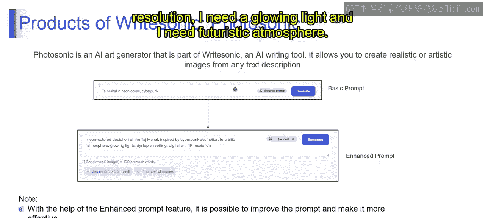
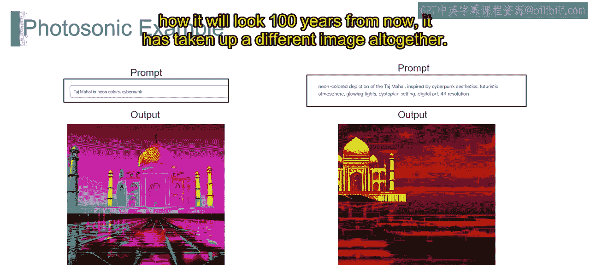
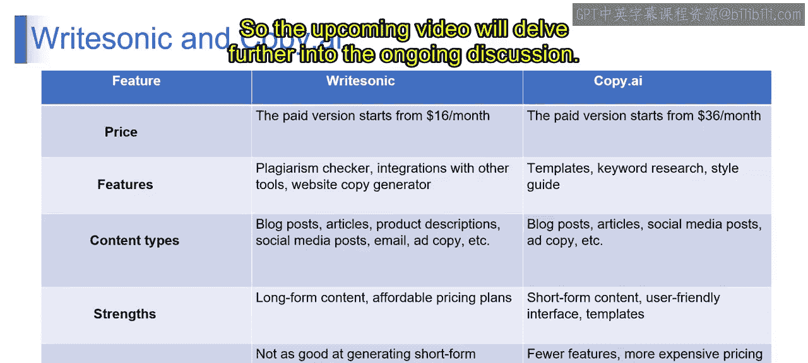

# 第二三四部分 163：Writesonic产品详解 🖼️

在本节课程中，我们将深入探索Writesonic平台，特别是其图像生成功能“Photosonic”。我们将学习如何通过优化提示词来生成更符合预期的图像，并对比Writesonic与另一款工具Copy.ai的异同，以帮助你根据需求选择合适的工具。

## 从文本到图像：Photosonic功能探索

上一节我们讨论了Writesonic的基本功能，本节中我们来看看其专为图像生成设计的“Photosonic”模块。顾名思义，Photosonic用于生成图片。用户可以使用基础提示词，或利用“增强提示词”功能来优化描述，从而更轻松地生成理想图像。但请注意，免费版本目前仅提供1000个单词额度，而生成一张图片将消耗至少10个“高级单词”的额度。

以下是使用Photosonic的示例。我输入了基础提示词：“Tajmahal and neon colors by cyberpunk”。

为了获得更精确的结果，我通过增强提示词功能进行了优化，具体描述为：“我需要一张4K分辨率的图片，画面要包含发光生命体，并营造出未来主义的氛围。”

你的描述越清晰，它在生成图像时产生的画面就越明确。因此，你可以看到两个不同提示词所产生的输出结果差异显著。当我们仅提及“霓虹色彩”时，它生成了一幅色彩绚丽的霓虹风格图像。

而当我补充要求“我希望画面充满发光灯光，具有未来感，并展现100年后的样貌”时，它则生成了一幅完全不同的图像。

你可以充分利用这种创造性在Writesonic中进行各种尝试。

## 工具对比：Writesonic vs. Copy.ai

接下来，我们将Writesonic与之前简单介绍过的Copy.ai进行对比。以下是两者的核心区别：

**价格**
*   Writesonic：每月 **$16**
*   Copy.ai：每月 **$36**

**主要功能**
*   Writesonic：支持抄袭检查、与其他工具和网站的集成，并能使用其“网站文案生成器”。
*   Copy.ai：提供丰富的模板、关键词研究和风格指南功能。

**内容类型**
两者都能生成博客文章、产品描述、广告文案等。但侧重点不同：
*   Writesonic：擅长生成长篇内容，且定价方案更实惠。
*   Copy.ai：在生成短篇内容、用户友好界面和模板多样性方面更具优势。

**选择建议**
Writesonic的弱点是**不擅长生成短篇内容**，因此它主要适用于长篇内容创作。而Copy.ai在生成长篇内容时价格更高。因此，你应该根据自己想要生成的内容类型来决定选择哪个工具。

## 界面速览与总结

在进入总结之前，让我们快速预览一下Writesonic的操作界面。接下来的视频将进一步深入探讨相关功能。

本节课中，我们一起学习了Writesonic的Photosonic图像生成功能，了解了通过优化提示词来提升输出质量的方法。同时，我们对比分析了Writesonic与Copy.ai在价格、功能和适用场景上的区别。关键点在于：**根据你的核心内容需求（长文本或短文本）来选择最具性价比的工具**。