# 第二三四部分 164：Writesonic界面探索 🚀

在本节课中，我们将探索Writesonic这一AI写作工具的核心界面与功能。我们将学习如何访问平台、使用其核心模块（如AI写作、聊天机器人、图像生成等），并了解如何利用它来提升内容创作效率。

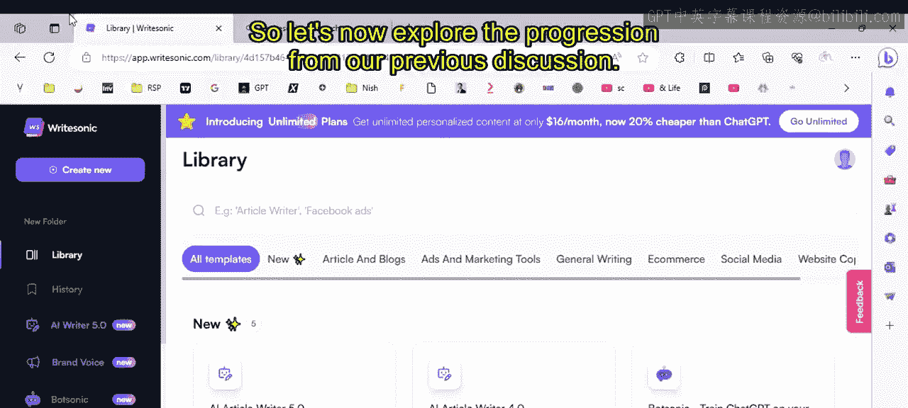

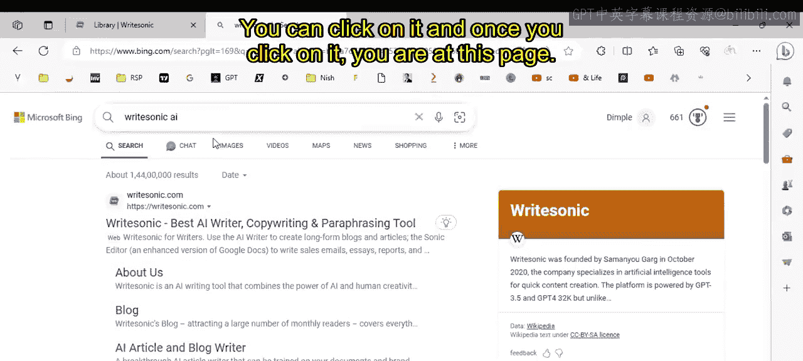

---

## 概述

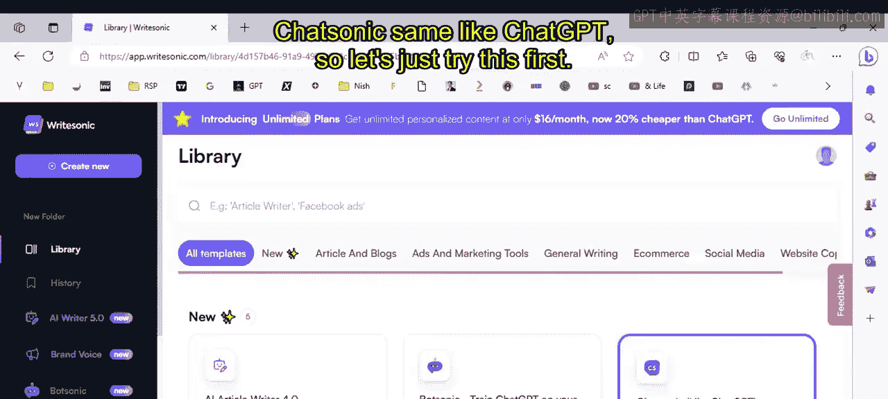

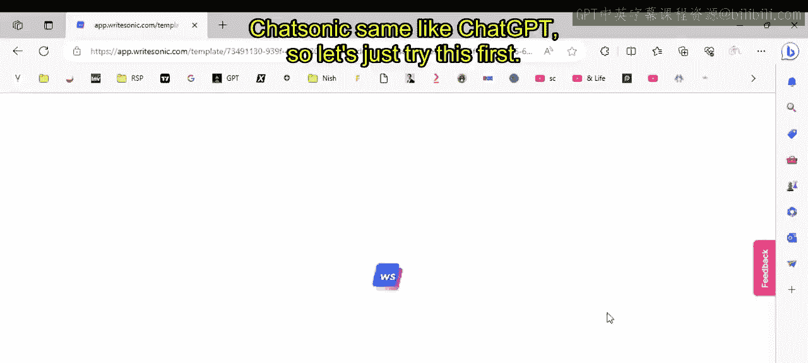

上一节我们介绍了生成式AI的基础概念与应用。本节中，我们将具体操作一个流行的AI写作工具——Writesonic。我们将从访问网站开始，逐步探索其各项功能，包括聊天、文章生成、图像创建和自定义机器人等。

---

## 访问与登录Writesonic

首先，在Google或Bing等搜索引擎中输入“Writesonic AI”即可找到其官方网站。

点击进入网站后，使用账户登录即可进入主界面。平台提供了多种模板和工具。

---

## 核心功能探索

登录后，您将看到Writesonic的主界面。接下来，我们逐一探索其主要功能。

### 1. ChatSonic 聊天功能 🤖

ChatSonic的功能类似于ChatGPT。在界面左侧有聊天历史记录。

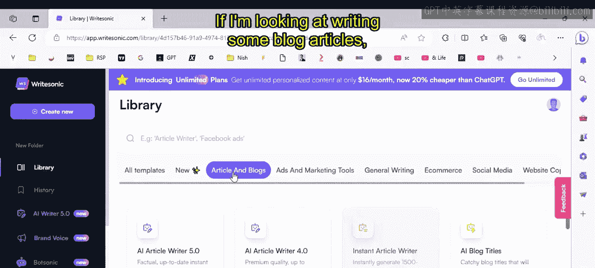

您可以在此直接提问。例如，输入“谁赢得了2023年奥斯卡最佳原创歌曲奖？”。Writesonic的一个优点是它能自动优化您的提问（增强提示词）。优化后的提问可能是：“请提供2023年奥斯卡最佳原创歌曲奖获奖者的信息。”

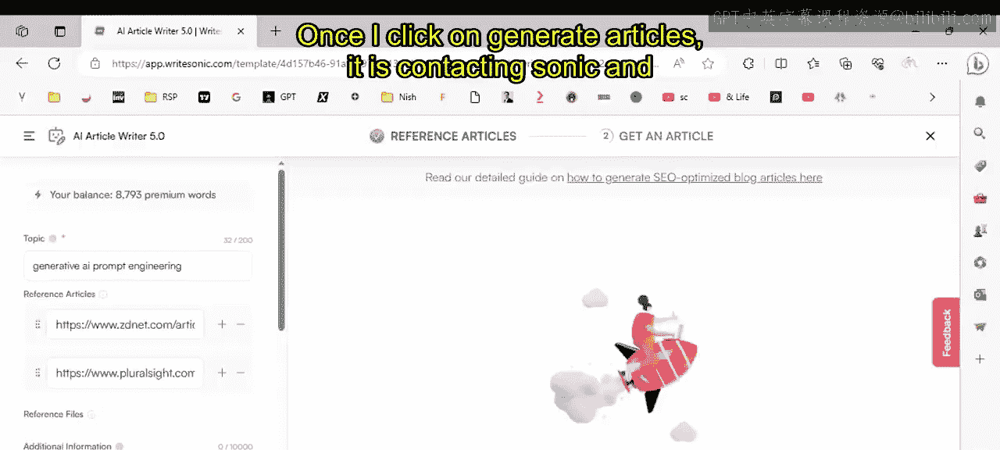

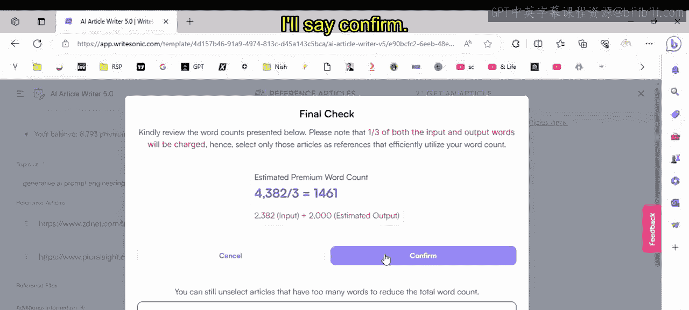

点击发送后，工具会在线搜索最新信息（这会消耗一定额度的字数）。答案生成后，它会清晰地列出所参考的信息来源。请注意，使用此功能会消耗您的字数额度。

### 2. AI文章写作 ✍️

如果您需要撰写博客文章，可以使用“AI Article Writer”功能。

返回主界面，在“AI Article Writer”中输入您想写的主题，例如“生成式AI提示词工程”。

工具会从网上搜索相关文章并列出结果。您可以选择其中一篇文章作为参考，例如“成为AI提示词工程师所需的六项技能”。

点击“下一步”，工具会分析所选内容。

分析完成后，它会提示生成文章将消耗的大致字数（例如1461字）。确认后，即可开始生成。

生成的文章结构清晰，包含：
*   **定义**：例如，“提示词工程可定义为与生成式AI模型交互以获取所需输出的过程。”
*   **核心技能**：以要点形式列出，如理解AI/ML/NLP、清晰定义问题等。
*   **段落式阐述**：对每个要点进行详细说明。
*   **参考文献链接**：注明信息来源。
*   **结论**：总结全文。

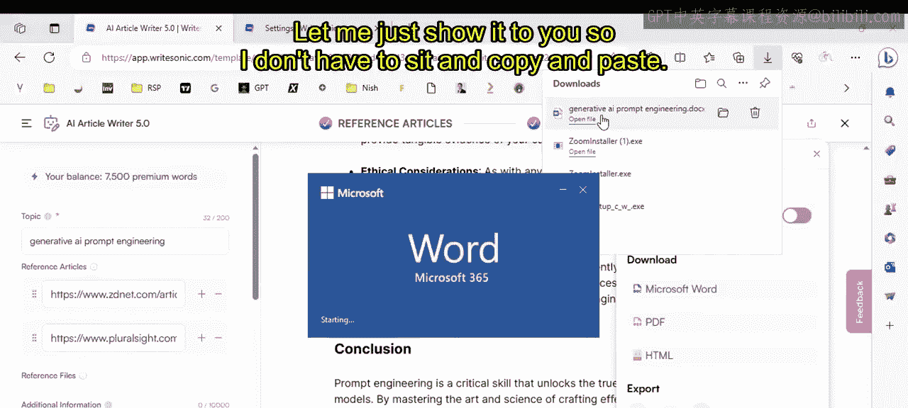

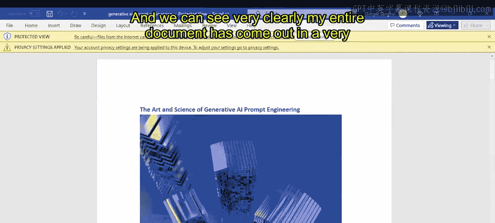

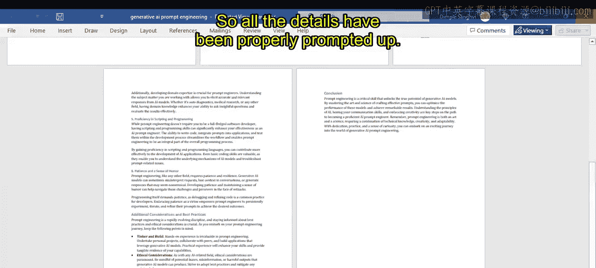

文章生成后，您可以直接将其下载为Word文档，无需手动复制粘贴。

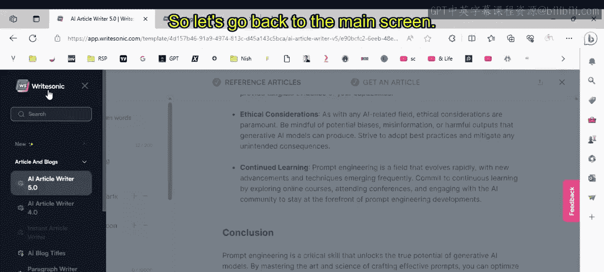

### 3. 其他创意工具 🎨

Writesonic的功能远不止于此。返回主界面，您还可以看到：

*   **Brand Voice（品牌声音）**：创建符合品牌调性的内容。
*   **Bot Creation（创建机器人）**：您可以训练自己的AI机器人。
    *   点击“Create a new bot”，为其命名。
    *   您可以上传自己的数据集（例如关于数据分析的文档）来训练它，之后便可向它询问与该领域相关的问题。
    *   在设置中，您还可以自定义机器人的外观和颜色。
*   **PhotoSonic（图像生成）**：类似于DALL-E，可以根据文字描述生成图像。
    *   输入提示词，即可创建新的图片。

### 4. 营销与社交媒体内容 📱

如果您需要创建营销文案或社交媒体内容，Writesionic提供了专门模板。

例如，要创建一条LinkedIn广告：
1.  选择相应的模板。
2.  输入产品名称、描述和关键词。
3.  点击生成，工具便会为您创建广告文案。

平台支持的格式非常广泛，包括：
*   通用写作
*   社交媒体帖子（Twitter、LinkedIn、Instagram）
*   视频内容（YouTube标题、介绍、TikTok文案）
*   网站内容（登录页文案、SEO元数据、行动号召、产品特点与益处列表等）

以下是部分功能区域的截图：

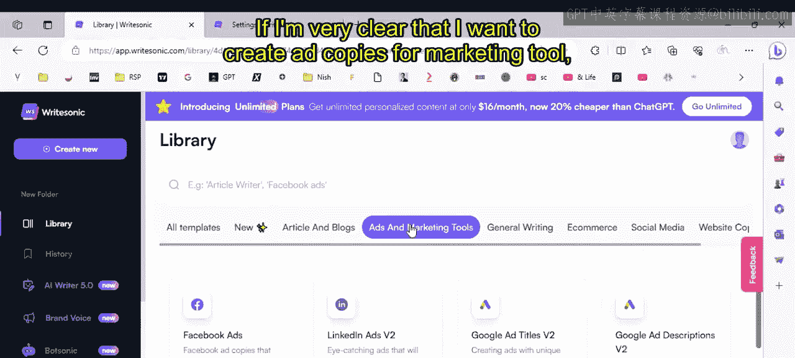
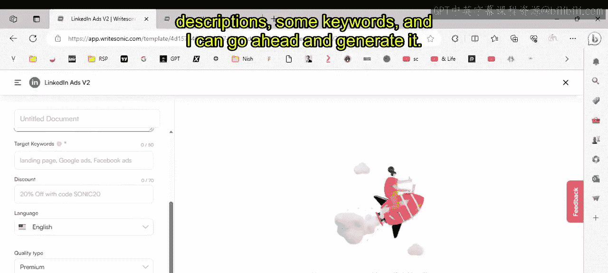
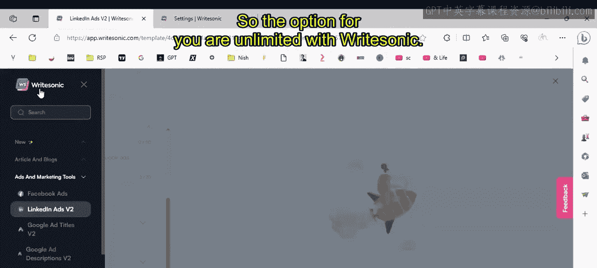

---

## 总结与建议

本节课我们一起深入探索了Writesonic AI写作工具。我们学习了：

1.  **如何访问和登录**Writesonic平台。
2.  **使用ChatSonic**进行智能对话和在线搜索。
3.  **利用AI文章作家**快速生成结构完整、引用清晰的博客文章，并导出为Word文档。
4.  **探索其他工具**，如图像生成（PhotoSonic）、自定义机器人训练以及各类营销文案模板。

Writesonic是一个功能强大的多合一AI内容创作套件。对于初学者而言，其免费额度足以让您体验核心功能。从个人经验来看，这类AI工具通过大幅提升生产效率，其价值往往超过订阅费用。当然，最终的选择权在您手中。

鼓励您亲自注册并探索Writesonic，根据您的具体需求（电子商务、内容创作、社交媒体运营等）来试用相关功能。

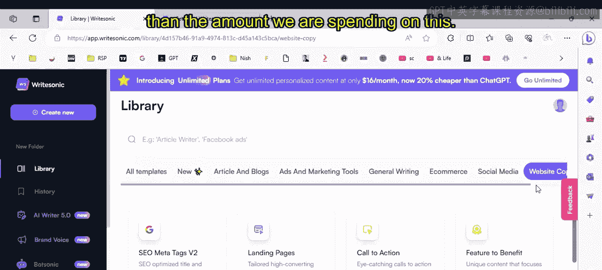
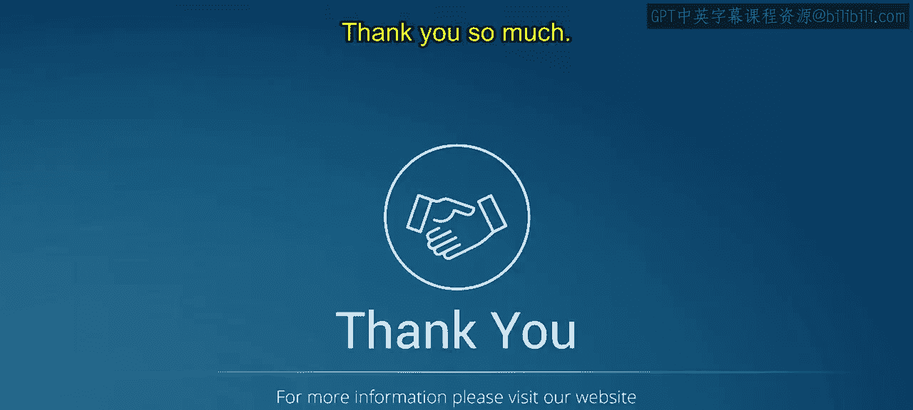

感谢学习，我们下节课再见。