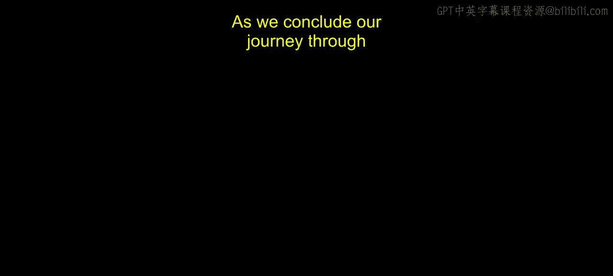
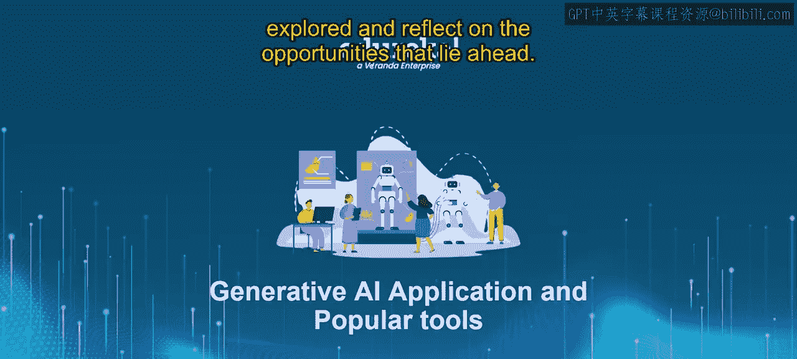
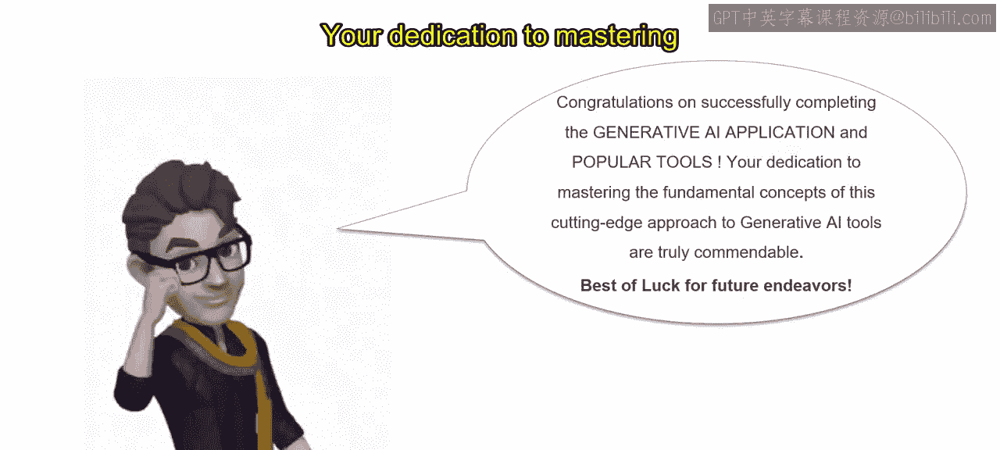

4：课程总结与未来展望 🎓

在本节课中，我们将回顾整个课程的核心内容，总结生成式AI在营销分析中的应用，并展望未来的机遇。

---

随着我们关于生成式AI应用与流行工具的旅程接近尾声，让我们回顾一下探讨过的关键主题，并展望前方的机遇。

我们首先理解了生成式AI的基础概念及其对营销分析的深远影响。随后，我们深入探讨了生成模型的基本原理，学习了它们如何基于从现有数据中学到的模式来生成新的数据实例。在“营销中生成式AI的数据准备”部分，我们认识到数据准备对于确保生成式AI模型在营销分析中的准确性和有效性的重要性。

在“生成式AI在营销分析中的应用”章节，我们探索了生成式AI的多样化应用，从个性化内容创作到预测分析，再到营销策略中的自动化创建。

在“营销分析中实施生成式AI模型”的课程中，我们获得了实施生成式AI模型的实践经验。通过现实世界的案例研究和实际例子，我们得以优化营销活动并推动业务增长，见证了领先组织如何利用生成式AI取得营销成功。

在“未来趋势与新兴技术”部分，我们展望了生成式AI的未来趋势和新兴技术，为在这个动态的营销分析领域保持领先做好准备。

最后，我们通过全面的学习评估来总结每个模块，确保我们已充分准备好将生成式AI原理应用于现实世界的营销场景。

完成本课程将开启无数激动人心的机遇。无论是实施前沿的营销策略、探索AI驱动的营销分析新职业道路，还是在该领域进行进一步的教育与研究，可能性都是无限的。

祝贺你成功完成了关于生成式AI应用与营销分析的课程，你为掌握这些基础概念所付出的努力值得高度赞扬。

祝你未来一切顺利。请记住，生成式AI与营销分析的世界充满了可能性，我迫不及待想看到你的旅程将通往何方。

---

本节课中，我们一起学习了生成式AI从基础概念到实际应用的全貌，总结了其在营销分析中的关键作用，并展望了未来的发展趋势与个人机遇。