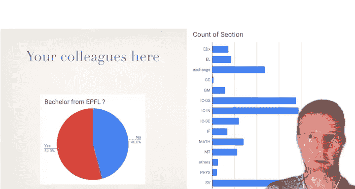
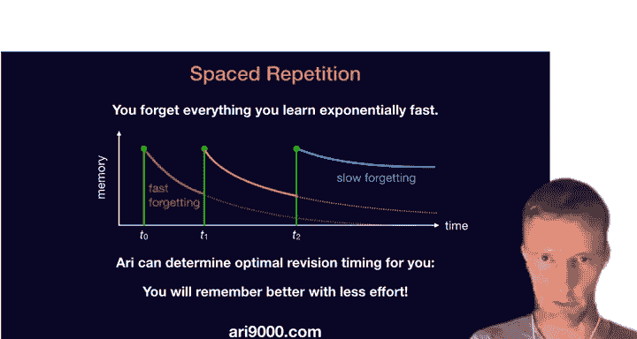
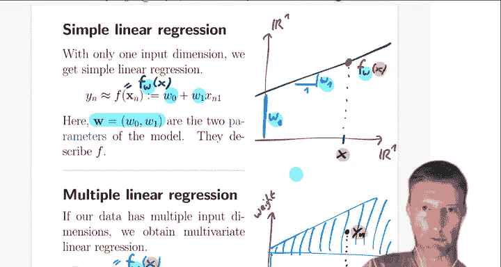

# 1：课程介绍与回归基础 📚

## 概述

在本节课中，我们将学习EPFL机器学习课程的基本框架、课程结构，并深入探讨机器学习的核心概念——回归分析。我们将从课程介绍开始，逐步理解机器学习的基本原理、应用场景以及线性回归的数学基础。

---

## 课程介绍与结构 🏫

大家好，欢迎来到今年的EPFL机器学习课程。我是Martin，将与Nikicola Flamon一起带领大家完成本学年的课程讲座。

今年的课程形式有所不同，但我们尽力确保所有材料对大家开放。我们预计有大约500名学生，与去年类似。机器学习应用广泛，许多同学来自校园的不同院系。为了满足更专业的需求，校园内还开设了其他与机器学习相关的课程，相关信息可在课程网页上找到。

所有课程幻灯片都将在Github和课程页面上提供。此外，我们提到的两个研讨会也对硕士生开放。

### 课程评分与形式

课程评分至关重要，如果你想获得学分，评分构成如下：
*   **项目**：占总分的40%，包含两个项目。
*   **期末考试**：占总分的60%，为纸质考试。网页上提供了往年的考试样例。

课程形式今年略有调整：
*   **讲座视频**：每周发布两个视频，上传至YouTube。
*   **问答环节**：每周二下午5点进行。
*   **练习课**：非常重要，我们稍后会详细解释。

课程网页上已经列出了每周的教学计划。我将主要负责前三周左右的课程，之后由Nikola Flamon接手，最后我将负责无监督学习的部分内容。

讲座将被录制，我们尽力营造课堂氛围。注释版本也将提供。视频通常在每个周二发布。

### 练习课与助教团队

练习课非常重要，尤其是在疫情期间，长时间在家观看视频容易感到枯燥。定期参加现场互动有助于打破这种单调。

我们将遵循EPFL的常规时间表。如果你的课程安排允许，非常欢迎你每三周来校园参加一次线下练习课。我们出色的助教团队中，大约三分之一会在线下，其余三分之二将通过Zoom提供支持。练习课在每周四进行，请务必在日历上标记，这对于提问和与同学讨论至关重要。

实验课主要使用Python，你将学习如何运行机器学习示例，亲身体验课堂上学到的理论概念。请务必为这些实验课投入时间。

我们的助教团队也可以通过电子邮件联系。我们非常期待本周四的第一次课程。

### 论坛与项目

对于任何问题，请始终使用Moodle论坛。这是最便捷的方式，因为你的问题可能也是其他同学的疑问，公开讨论能让所有人受益。论坛设有子主题，请充分利用它来讨论各种问题。

我还提到了每周二下午5点关于讲座的问答环节。

接下来是项目介绍，这是本课程的一个特色。
*   **第一个项目**：是一个热身项目，帮助你开始处理数据并在一个真实数据集（实际上来自CERN的粒子物理学）上进行机器学习。
*   **第二个项目**：在课程后半段进行，更加令人兴奋。你可以自由选择主题，但需要以三人小组的形式完成（两个项目都如此）。在第二个项目中，我们鼓励你进行任何你感兴趣的真实世界项目。你可以联系EPFL校园内任何实验室或其他学术机构，与他们合作，利用真实数据识别机器学习的新应用，进行激动人心的跨学科项目。这被称为“机器学习用于科学”选项，通常约有一半的学生选择。我们稍后会详细讨论。

此外，你还可以选择我们提供的三个预定义挑战之一，这类似于Kaggle竞赛，团队在同一数据集上竞争，看谁的机器学习系统能获得最佳准确率。或者，如果你对机器学习本身的研究方面更感兴趣，可以选择“机器学习可重复性挑战”，这是一个全球范围内的重要项目，旨在复现近期论文中的科学结果，验证其实验是否合理且可重复。

关于第二个项目的这三个选项，请保持关注，并务必阅读项目描述和课程信息表（PDF格式，可在我们的Github和网页上找到）。请仔细阅读相关细则。

### 课程目标与定位

本课程旨在为你提供对机器学习的基本理解，并教授其基础知识。我们不仅希望你知道如何在商业软件中按几个按钮，更希望你真正理解机器学习的原理、可能出错的情况以及何时能成功。我们会介绍一些数学基础，虽然不会像学习理论课程那样深入，但会确保涵盖核心内容。

另一方面，我们也希望确保课程与现实世界保持联系，让你在实际数据集和应用中体验各种方法的优缺点。我们将在课程中多次看到这一点。希望我们能在教授实践经验和理论基础知识之间取得平衡。

当然，你无法仅从这门课程中获得一切。如果你需要更专业的知识，可以参考其他相关课程。这只是打下一个基础。课程中也会涉及许多实用的技巧。希望学完本课程后，你至少能更好地理解当前的发展趋势，并能够快速跟进最新的进展，以便在某个领域进行更深入的专业学习。

### 学生背景与学习工具

我们讨论了教师团队，那么你们是谁呢？这是去年课程的情况，我展示这张图是因为我非常喜欢这门课程的多样性——它汇集了来自校园各个院系的众多学生，不仅在数量上，更在背景上。这真的很棒。

你们来自生物、数学、物理、生命科学、数学工程、金融数学等各个专业，还有许多博士生。这使得课程具有高度的跨学科性，这实际上也是一项关键优势。在项目团队合作中，我们强烈建议组建跨学科团队，不要总是和背景相同的熟人组队，尝试与不同背景的同学合作，这样项目会更成功。

例如，如果你能将擅长编程、擅长数学和擅长特定领域应用（如生物学）的人组合在一起，就能形成更强大的团队。我们认为，应用机器学习本身就是一个跨学科的主题，因此这是一个很好的项目合作机会。在Moodle论坛上很容易找到队友，即使在疫情期间，远程协作也更加方便。所以，这是一个很好的机会。欢迎所有人。

去年来自不同院系的所有学生表现都非常出色，这通常超出了人们对这个主题的初步预期。这不一定是一门纯粹的计算机科学课程，每个人都非常受欢迎，并且取得了成功。

我们还有一个额外的学习工具，这不是练习和讲座材料的替代品，而是一个补充。这是一个不错的手机应用，也可以在浏览器中使用，它会提醒你课程中涉及的关键词和维基百科概念。这实际上是一个很好的学习应用，它甚至包含一个小小的机器学习组件，能够根据你的遗忘和学习速度，适时地提醒你复习那些容易出错的概念。这很有趣，体现了人类学习和机器学习之间的联系。如果你想尝试这个游戏化的学习应用，欢迎使用。

---

## 什么是机器学习？🤖

对我来说，机器学习基本上可以描述为**从数据中定义和学习的算法**。

与在代码中逐行硬编码算法不同，机器学习算法的参数由某个数据集决定。这意味着算法被一些数值参数化。你可以将这些参数想象成系统上的旋钮或权重。这些旋钮是可调的，意味着它们被优化以最好地拟合数据集。

这些旋钮具体是什么，取决于我们使用的机器学习模型类型。例如，在线性回归模型或神经网络中，核心思想是相同的：算法根据数据进行调整，然后可以作为一个算法来使用。

### 一个具体例子：图像分类

图像分类是过去十年中广泛使用的经典机器学习应用。我想给你展示一个能够完成此任务的数学算法。

以下是其工作原理的图示。你需要将数据点（位于底部）表示为特征空间中的点。这是你的训练数据，这里有六张图像。以其中一个训练数据点为例，你需要将该图像表示为一个点，这样我们才能使用机器学习模型来分离这些点，例如将狗的图像与猫的图像分开。

“分离”是什么意思？例如，这里我们采用一个简单模型，即使用一个平面（在二维中是直线）。在二维平面上，每个点都是平面上的一个点，你会寻找最佳直线来分隔这两组点。如果你能像图中那样分隔它们，那么你就找到了一个好的分类器。

一旦找到了这个分类器（即那条直线），你就可以处理新图像。例如，对于这张标签未知的新图像，我可以使用我的机器学习系统来回答这个问题。系统会判断该点落在直线的哪一侧。实际上，它落在了蓝色一侧，因此系统的答案将是：这是一张狗的图像。

这就是分类器的工作原理。那么，图像是如何变成二维点的呢？实际上并非如此。机器学习中的数据点通常不止二维，它们具有许多特征。这里的特征不止两个，例如可能有数百个特征，即每个像素的值。你可以将所有像素值写成一个很长的向量。如果像素是黑色，你写0；如果是白色，你写1（或者反过来）。所以，这张图像可能由100或1000个像素组成。这意味着代表照片的点是一个1000维的数据点，由0和1组成（或者对于灰度图，每个值在0到1之间，可以是任何数字或百分比）。

这只是将原始数据（这里是数字图像）转换为数值格式的一种简单方法，或者更专业的术语是：为原始数据项**定义特征**。一旦将其转换为特征，即我们找到了D个数值特征来表示我们的点，我们就可以进行机器学习了。

### 学习过程：感知器算法

那么学习是如何完成的呢？你如何找到分隔这些点的平面？我提到过，这不是一条直线，而是一个平面，也就是所谓的**超平面**。你试图找到它，使得红点在一侧，蓝点在另一侧。

如何做到这一点？训练是如何工作的？这里有一个非常优雅的算法，至今仍然非常基础，甚至现在仍用于训练神经网络。基本上，还没有出现比这更好的新算法。这只是一个非常简单的算法示例，但该算法实际上早在1957年就已应用于线性和更强大的非线性分类器。

它是如何工作的？我们的模型是这里的黑色超平面。我们如何描述平面？例如，我们用一个法向量来描述它。假设我们考虑所有通过原点的平面。这是一个不好的平面，它由法向量 **w** 描述。**w** 是一个D维向量。

这是一个不好的平面。我如何找到一个更好的？我找到一个被错误分类的点，即位于错误一侧的点，比如这个红点。这意味着它是一张猫的图像。但问题在于它位于平面的下方，即蓝色一侧，这是不应该的。我们希望所有红点都位于上方。

我们怎么做呢？有趣的是，在极高维空间中，你能做的事情并不多。记住，点 **x** 是一个超高维向量，例如1000维，因为它来自照片。**w** 也是如此，有1000个分量。我不想讨论在这种空间中的复杂操作。但我肯定能做的最简单的事情，就是将这两个向量相加一点点。

所谓“一点点”，我是指取被错误分类的数据点向量，乘以一个小标量（比如0.1），然后将其加到我的 **w** 向量上。这样我就得到了这个新向量，作为我的新法向量 **w**，也就是我将要使用的新平面。

这里并没有发生什么神奇的事情，只是我们通过添加一点点错误分类的数据点向量，修改了旧的平面。现在，我们有了一个新平面。这是该算法的一次迭代。你可以看到平面已经变得更好了。现在，我们几乎分隔了所有两类点。虽然还有两个点分类错误，但所有红点都已经正确分类了。

这就是你执行该算法一次迭代的方式。这个算法现在实际上被称为**随机梯度下降**。这只是针对一个特定模型和损失函数的一个非常简单的例子，我们稍后会解释这具体意味着什么。但这里我们所做的就是这个算法，它现在也被称为**支持向量机**。我们将在课程中期更多地讨论这类方法。

这个算法的优点在于它超级快。执行一次迭代当然很快，虽然最终需要多次迭代，但每次迭代只需要将两个向量相加，成本极低。只需要大约1000次浮点运算来相加这两个向量，也许再乘以一个标量。

这就是我们在进行机器学习时应考虑的操作类型。我们进行了内积运算来判断点位于哪一侧，然后进行了两个向量的加法。我们使用标量0.1作为步长，稍后会解释其含义。

这是机器学习算法中非常典型的迭代或操作示例。这个算法基本上是世界上唯一的机器学习算法，只不过我们会稍后解释得更详细、更通用，并看看它如何用于许多监督学习和无监督学习的用例。

我展示这张幻灯片是为了说明，如果一个机器学习系统在硬件上训练，你可以想象CPU或显卡正在执行的就是这类操作。它们必须计算内积（这实际上会导致梯度，我们稍后会讲到），然后必须在非常大、非常大的向量上进行更新。机器学习模型的参数不仅限于10维，实际上可以达到数百万、数十亿甚至更多，通常比数据点数量还要多得多，这也是我们稍后会讨论的一点。

### 监督学习的一般流程

这是一个具体的例子，希望能激发你的一些兴趣。为了更概括地理解，这里发生了什么？我们拥有训练数据，即猫和狗的图片。它们已经带有标签，标签指明它属于哪个类别：是猫还是狗。你有很多你想要完成的任务（区分猫狗）的示例，并且这些数据已经有人工标注。

这是标准**监督学习**中的假设。这并不总是容易的。实际上，主要问题往往不在于写一行Python代码来在数据上训练神经网络，而在于如何识别、找到这些数据，或者说服许多人进行手动标注工作，为机器学习算法生成训练数据。

我们之前看到的算法，例如支持向量机，可以通过梯度下降进行训练（稍后我们会更精确地定义）。当然，还有其他机器学习方法。无论如何，它们会输出一个训练好的模型，通常称为 **w**。在我们的例子中，这是描述平面的向量。这个平面就是整个模型，即分类器。一旦你有了它，就可以交付给客户，他们将使用这个超平面来做“是”或“否”的决策，或者决定自动驾驶汽车是停止还是加速（这也是一个分类问题）。

当你有了模型，就可以输入测试数据。这就是我之前描述的绿点。关键是你不知道它的标签，但你可以将其输入模型，然后询问它位于超平面的哪一侧，你会得到一个答案：要么是狗，要么是猫。

你还需要进行非常可靠的评估，这是一个重要主题。如果未经彻底评估，我们不会放心部署这样的机器学习系统。这也是我们将要讨论的内容。如果有人给你一个训练好的模型，你如何判断这是一个训练良好的模型？你如何确定它足够准确？这就是监督学习的流程。

在课程后期，我们还将讨论更多关于**无监督学习**的内容，这是一个不同的、甚至可以说更有趣的用例，即尝试在没有手动标注训练数据的情况下进行学习。有时你也可以使用一些辅助任务或让模型自我训练，从而了解数据的一些信息。

---

## 机器学习与智能、其他领域的关系及现状 🔍

让我们退一步思考。这一切与智能有什么关系？到目前为止，这看起来并不智能。我们只是拟合了一个线性平面，确实如此。实际上，你可以说机器学习只是一种回归，这是一个相当准确的描述。然而，与传统模型相比，这仍然是一大进步。传统模型只有硬编码的规则，例如由人类编程的硬编码聊天机器人（如果用户说这个，聊天机器人就回答那个）。这与机器学习模型所能达到的准确性和质量相去甚远。当然，这些模型还不是智能，但它们正试图朝着更好地泛化和真正理解任务某些方面的方向迈进一步。但核心上，这些模型确实只是我们描述的回归模型。

### 与神经科学的比较

另一种观点是与神经科学比较。神经科学试图理解生物神经网络的工作原理以及生物大脑为何工作。这本身就是一个超级有趣的领域，并且基本上独立于机器学习。另一方面，机器学习也独立于此。它更像是一种工程方法：我们能否建造一台会飞的机器？它不需要像鸟，我们只想建造某种机器。在我展示的例子中，我们建造了一个“平面”（线性超平面），它与任何聪明的大脑之类的东西无关，但如果针对某些应用在足够的数据上训练，它就能工作。这就是另一种方法。机器学习不关心提出的模型是否与生物大脑有任何相似之处，只关心在分类任务上获得良好的测试准确率，以便你的自动驾驶汽车能安全行驶。

到目前为止，它们似乎是完全分离的。但有趣的是，我们在机器学习中获得的许多表现最好的模型（例如与人工神经网络相关的模型），仅仅因为从工程角度看它们效果最好而出现，结果发现它们也与生物网络有相似之处。这是一个引人入胜的平行现象。当然，仍然存在巨大差异。例如，在机器学习中，我们使用的每个人工神经元都通过反向传播进行训练（稍后会解释），这在生物大脑中并不真正存在：信号顺序地从输入到输出向前传播，然后又顺序地从输出到输入向后传播以调整权重。你不会认为生物大脑中有如此协调有序的序列化过程来进行调整。所以问题是，是否存在类似的算法？这是一个巨大的开放性问题。我们不会接近回答这个问题，但如果你对这两个领域之间的类比或有趣关系感兴趣，神经科学系也有一些其他有趣的课程。

### 与其他领域的交叉

另一张简短的幻灯片。你可能已经见过这个，我不会花太多时间。这只是关于机器学习如何与其他领域结合。众所周知，统计学已有数百年历史，计算机科学的历史稍短一些。那么，我们如何定位机器学习？我们认为，机器学习实际上始终处于这三个领域的交叉点：
*   **计算机科学**：提供工程方面，使其真正工作，能够在大数据集上实现。
*   **应用领域**：明确的任务，例如我们想根据基因组等对疾病进行分类。数据来源以及答案和训练数据的来源。
*   **建模决策**：例如，我们可以使用线性模型（平面），然后使用计算机科学的训练算法来高效地找到最佳平面。

如果你能将这些结合起来，你就处于这三个领域的交叉点，也就是机器学习领域。在就业市场上也是如此，这类技能需求日益增长，也更加普遍。许多行业应用现在也试图从数据中受益，机器学习通常是一个重要工具。你可以看到，这与数据科学专家紧密合作。

### 现状与挑战

机器学习领域确实经历了一些热潮，当然，人们的兴趣也增加了。我想展示的是，过去五年发生了很大变化。你可以看到兴趣有显著增长（这是谷歌趋势数据）。虽然最近趋于平稳，但人们对机器学习的兴趣仍然很高。例如，如果你比较传统领域如线性代数，我放这两个有点奇怪，但有趣的是，这两种技术在使用方式上有点相似，因为线性代数也广泛应用于任何应用领域，可能是生物学、心理学、地理学等许多科学和工业应用都需要这类数据技术，它们已经存在很长时间了。在某种程度上，机器学习也与线性代数类似，它只是许多已有术语的重新包装。但一个很大的区别是，现在我们实际上能够更广泛地应用它，我们发现了更多的应用，有更多机会使用这些数据驱动的技术，而且技术本身也在一定程度上得到了改进。

热潮有利有弊。你可能看到，也许两年前，机器学习确实处于炒作曲线的顶端。现在它正朝着更合理的领域发展。从长远来看，事物应该趋于合理水平，这就是我们现在看到的整合。它不再是最酷、最时髦的东西了，但人们也开始更实质、更扎实地对待它。仅仅抛出机器学习这个流行语已经不够了。它正成为一种许多人了解的标准工具，因此更深入地了解细节也变得更重要：具体在什么意义上、为了什么、以及如何精确地使用机器学习。你可以看到许多专业应用，如设备端AI、可解释AI、自然语言处理、自动化机器学习等，涉及方方面面。我们课程会涉及其中一些，但不会全部。深度学习、图分析等也有很多方面。很高兴看到人们更认真地对待它，而不仅仅是把它当作一个流行语。

### 为什么使用机器学习？

我希望我已经稍微激发了你对机器学习的兴趣。但我会快速浏览这些幻灯片，我只想指出一点：这不仅关乎通常的数字公司或互联网数据。在传统上非数字化的领域，机器学习也带来了大量机会。

例如，在瑞士西部地区，你可以看到许多初创公司也在使用机器学习。例如，在农业领域制造智能机器人，或利用卫星数据进行预测，以实现更好的农业管理。或者非政府组织，例如共享单车（虽然现在可能不是最好的例子，但它们可以使用机器学习）。我只是