# 10：泛化与验证 🧠

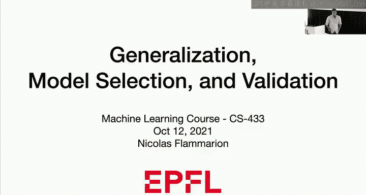

在本节课中，我们将要学习机器学习中的核心概念：**泛化**与**验证**。我们将探讨如何评估一个预测函数的好坏，以及如何从多个候选模型中选择最佳模型。理解这些概念对于构建可靠且有效的机器学习系统至关重要。

---

## 1. 引言与动机

上一节我们介绍了机器学习的基本框架。本节中，我们来看看两个核心问题：**泛化**和**验证**。

想象一下，你的朋友Mike告诉你他有一个预测函数F，并且声称这个函数效果非常好。你自然会问：**如何信任他？如何验证这个函数确实能做出好的预测？** 这引出了泛化和验证的问题。

在机器学习中，我们不仅关心模型在已有数据上的表现，更关心它在新数据上的表现，即**泛化能力**。

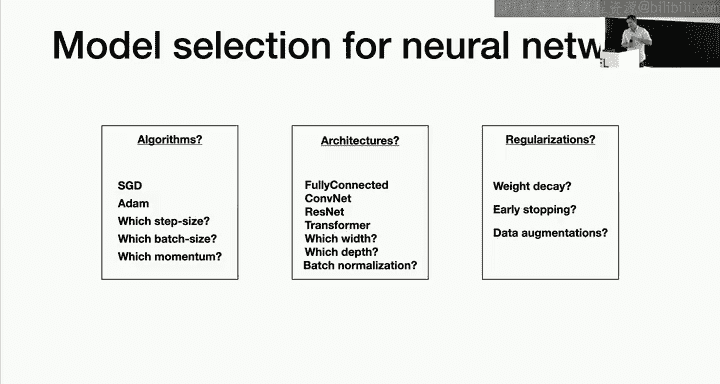

第二个问题是**模型选择**。例如，在岭回归中，我们有一个超参数λ来控制模型的复杂度。λ=0意味着没有正则化，而λ很大则会严重约束模型。问题在于：**我们应该选择哪个λ值？** 这不仅是岭回归的问题，在多项式特征扩展、神经网络架构选择、优化算法选择等场景中都会遇到。

以下是本节课将涵盖的核心内容：
*   泛化误差的定义与挑战。
*   如何使用数据来估计和验证模型性能。
*   模型选择的标准流程与理论保证。
*   交叉验证等更高效的数据利用方法。

---

## 2. 概率框架与数据模型

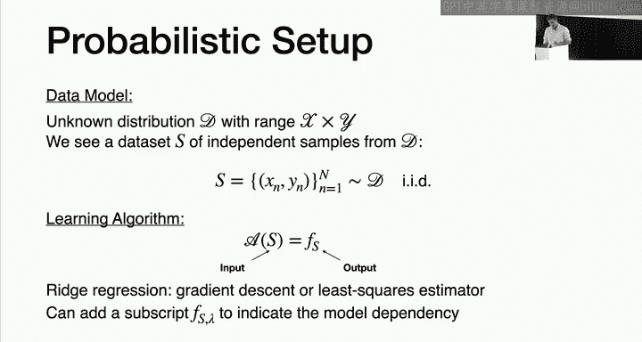

为了回答上述问题，我们需要建立一个概率框架。在实践中所拥有的是观测数据，我们会基于这些数据做出假设，并在这些假设下推导结论。但必须注意，这些假设在实践中可能并不完全成立。

我们考虑一个简单的模型：
*   存在一个**未知**的分布 **D**，它定义了数据（特征X和标签Y）的生成机制。
*   我们观测到一个数据集 **S = {(X₁, Y₁), ..., (Xₙ, Yₙ)}**，其中的样本是**独立同分布**地从D中采样得到的。

这个假设非常强。在实践中，数据可能不独立（例如时间序列数据），分布也可能随时间变化（分布漂移）。我们必须意识到这些局限性。

此外，我们假设可以访问一个**学习算法 A**。它接收一个数据集S作为输入，并输出一个预测函数 **f = A(S)**。当算法依赖于超参数λ时，我们记作 **f = A_λ(S)**。

---

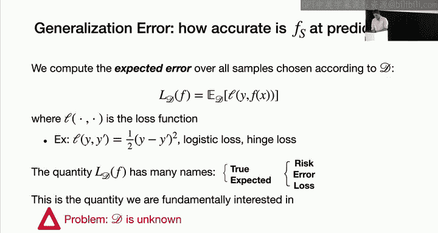

## 3. 泛化误差、经验误差与训练误差

上一节我们建立了数据模型。本节中我们来看看如何量化一个预测函数的好坏。

### 3.1 泛化误差（真实风险）

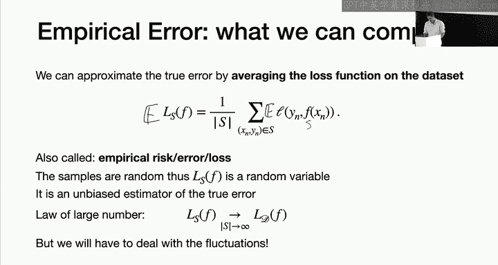

我们真正关心的是模型在未知数据上的表现，这由**泛化误差**（或称**真实风险**）来衡量。

**定义**：给定一个损失函数 **L(y, y‘)**（例如均方误差 `L(y, y‘) = (y - y‘)²`）和一个预测函数 **f**，其泛化误差 **R(f)** 是损失在数据分布D上的期望值：
`R(f) = 𝔼_{(X,Y)∼D} [ L(Y, f(X)) ]`

这是一个**数值**，衡量了f的平均预测损失。我们的目标是找到最小化R(f)的函数。

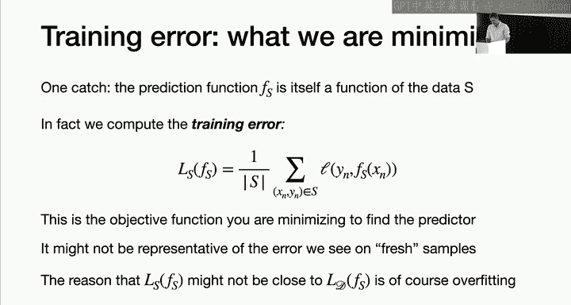

**核心问题**：我们无法直接计算R(f)，因为分布D是未知的。

### 3.2 经验误差

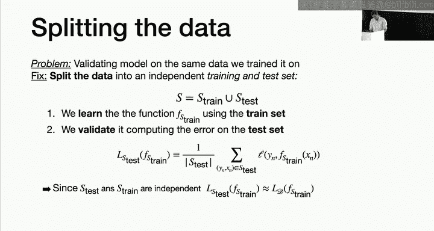

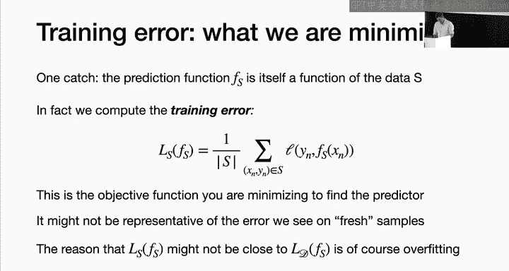

既然无法计算期望，一个自然的想法是用观测数据的平均损失来近似它，这称为**经验误差**。

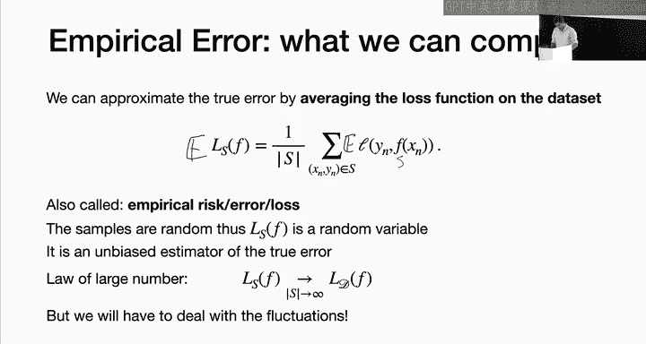

**定义**：在数据集 **S** 上，f的经验误差 **R_S(f)** 定义为：
`R_S(f) = (1/n) Σ_{i=1}^{n} L(Y_i, f(X_i))`

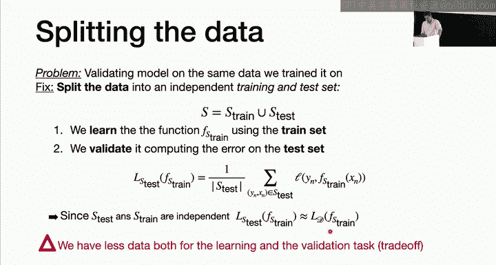

经验误差是泛化误差的一个**无偏估计量**，即 `𝔼_S [R_S(f)] = R(f)`。根据大数定律，当样本量n趋于无穷时，经验误差会收敛到泛化误差。

### 3.3 训练误差及其问题

然而，在机器学习流程中，我们通常用数据集S来**训练**（即选择）预测函数f。此时，如果我们用同一个数据集S来计算f的经验误差，就得到了**训练误差**。

**关键区别**：当f依赖于S时（即 `f = A(S)`），训练误差 `R_S(A(S))` **不再是**泛化误差 `R(A(S))` 的无偏估计。过度优化训练误差可能导致**过拟合**，即模型在训练集上表现很好，但在新数据上泛化能力很差。

因此，训练误差和泛化误差是两个不同的概念，训练误差不能代表模型在新数据上的表现。

---

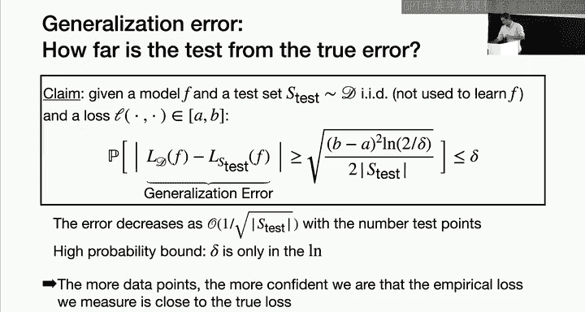

## 4. 验证：训练集/测试集划分

上一节我们指出了使用相同数据训练和评估的问题。本节中我们来看看如何通过数据划分来解决它。

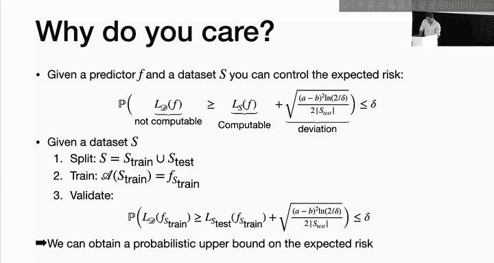

为了可靠地评估模型性能，我们需要一个与训练过程**独立**的数据集。标准做法是将原始数据集 **S** 随机划分为两部分：
*   **训练集 S_train**：用于训练模型，得到预测函数 `f = A(S_train)`。
*   **测试集 S_test**：用于评估模型，计算测试误差 `R_{S_test}(f)`。

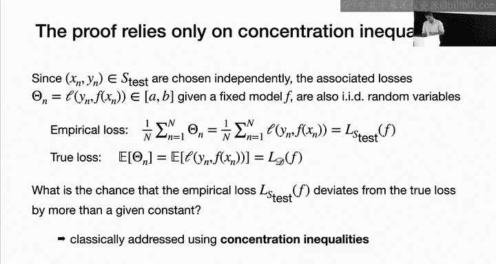

由于 `S_test` 独立于 `S_train`，因此函数f也独立于 `S_test`。这样，测试误差 `R_{S_test}(f)` 就是泛化误差 `R(f)` 的一个无偏估计，我们可以用它来近似真实性能。

**权衡**：划分比例（如70%/30%， 80%/20%）是一个需要权衡的问题。更多的训练数据通常能得到更好的模型，而更多的测试数据则能让性能评估更可靠、方差更小。

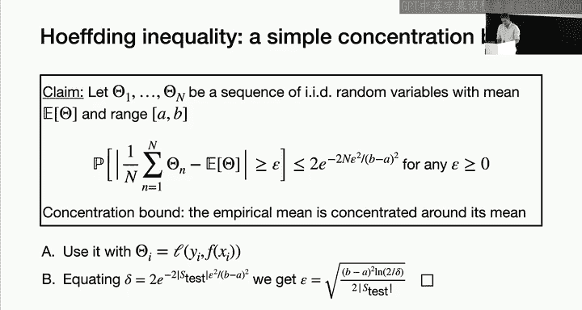

---

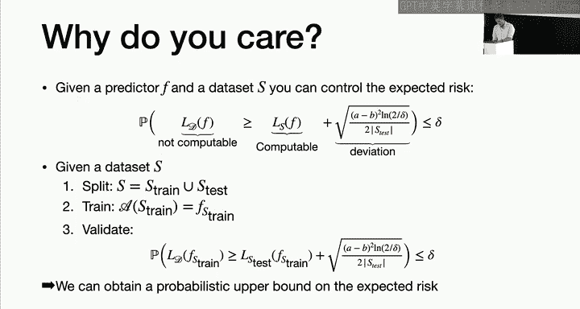

## 5. 泛化误差的理论控制

我们不仅希望用测试误差来估计泛化误差，更希望从理论上知道这种估计的可靠程度。

### 5.1 霍夫丁不等式

我们的目标是控制泛化误差 `R(f)` 与经验误差 `R_S(f)` 之间的差距（即**泛化差距**）。这依赖于一个重要的概率工具——**霍夫丁不等式**。

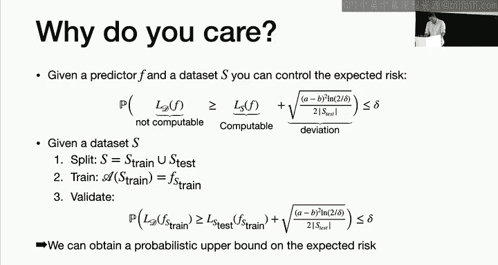

**定理（霍夫丁不等式）**：设 `Z₁, ..., Zₙ` 是n个独立同分布的随机变量，且满足 `a ≤ Z_i ≤ b`。令其均值为 `μ = 𝔼[Z_i]`，则对于任意 ε > 0，有：
`P( |(1/n)Σ Z_i - μ| ≥ ε ) ≤ 2 exp( -2nε²/(b-a)² )`

这个不等式表明，样本均值会以很高的概率集中在真实均值附近，偏离超过ε的概率随着样本量n增加而指数级下降。

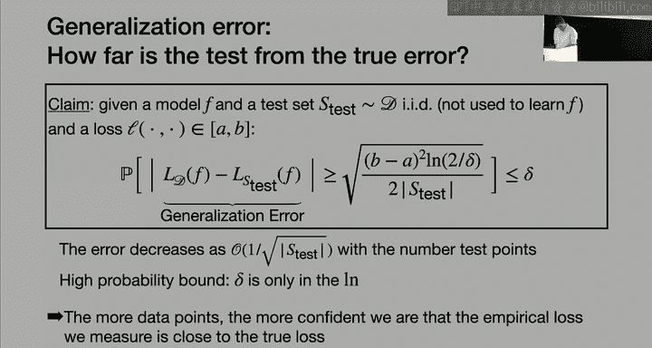

### 5.2 应用于泛化误差控制

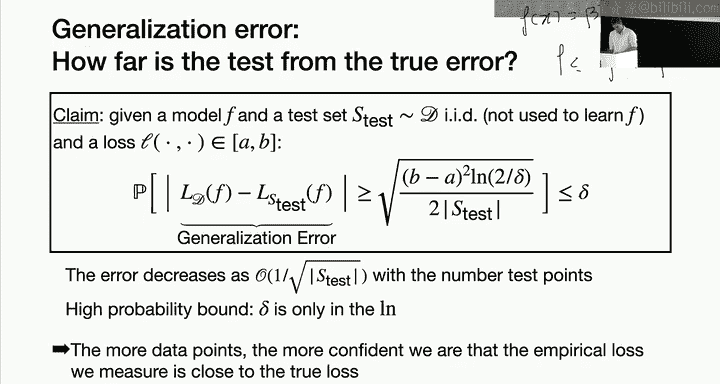

将霍夫丁不等式应用于我们的问题：令 `Z_i = L(Y_i, f(X_i))`，并假设损失函数有界，即 `a ≤ L(·, ·) ≤ b`。那么，对于任意给定的失败概率 δ > 0，我们可以推导出，以至少 `1-δ` 的概率，泛化差距满足：
`|R(f) - R_S(f)| ≤ (b-a) √( log(2/δ) / (2n) )`

**结论解读**：
1.  **样本量n**：所需样本量与 `1/√n` 成正比。样本越多，估计越准。
2.  **置信度δ**：对数值 `log(1/δ)` 出现在公式中，这意味着即使要求极高的置信度（δ非常小），所需代价也很小。
3.  **损失范围(b-a)**：损失函数的范围直接影响界限。范围越大，估计越不确定。

这个结果为模型性能提供了**概率性证书**：我们可以说，有95%的把握，模型的真实误差不超过测试误差加上某个计算出的偏差值。

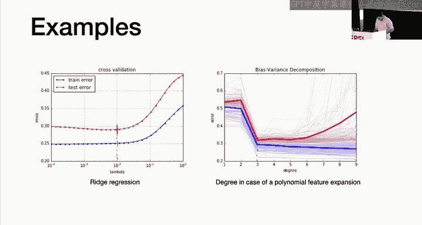

---

## 6. 模型选择的理论保证

上一节我们解决了单个模型评估的问题。本节中我们来看看如何为从多个模型中选出的最佳模型提供保证。

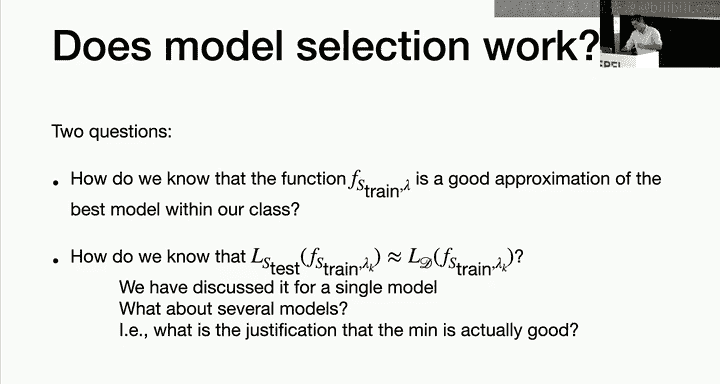

### 6.1 模型选择流程

假设我们有K个不同的超参数设置 `{λ₁, ..., λ_K}`，对应K个模型。模型选择的标准流程如下：
1.  将数据S划分为训练集 `S_train` 和测试集 `S_test`。
2.  在 `S_train` 上分别用每个λ训练模型，得到K个预测函数 `f₁, ..., f_K`。
3.  在 `S_test` 上计算每个函数的测试误差 `R_{S_test}(f_k)`。
4.  选择测试误差最小的模型，即 `k* = argmin_k R_{S_test}(f_k)`。

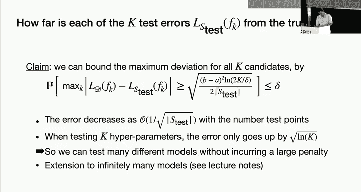

### 6.2 理论分析：控制最大偏差

我们想知道，选出来的模型 `f_{k*}` 的泛化误差 `R(f_{k*})`，与理论上所有模型中最好的泛化误差 `min_k R(f_k)` 相比，到底差多少。

我们需要同时控制所有K个模型的泛化差距。利用**联合界**，我们可以得到：
以至少 `1-δ` 的概率，对于所有k=1,...,K，同时有：
`|R(f_k) - R_{S_test}(f_k)| ≤ (b-a) √( log(2K/δ) / (2n_{test}) )`

与单个模型的界限相比，这里多了一个 `log(K)` 项。这意味着即使尝试大量（K很大）不同的模型，我们付出的代价也只是对数级的，这是可以接受的。

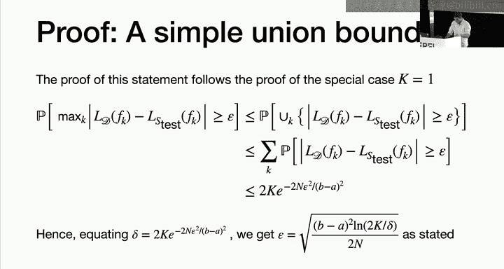

### 6.3 最终性能保证

基于上述一致收敛界限，我们可以证明以下关键结果：
以高概率，我们选出的模型 `f_{k*}` 的泛化误差满足：
`R(f_{k*}) ≤ min_{k} R(f_k) + 2 (b-a) √( log(2K/δ) / (2n_{test}) )`

**结论**：通过测试集选择出的模型，其性能与候选模型中理论上的最佳性能之间的差距，被一个与 `log(K)/√n` 成正比的量所控制。这为模型选择流程的有效性提供了理论依据。

**重要提醒**：一旦我们使用测试集做出了选择决策，这个测试集就被“污染”了，不能再用于提供最终模型的公正评估。因此，在严谨的流程中，需要进一步将数据划分为**训练集**、**验证集**（用于模型选择）和**测试集**（用于最终评估）。

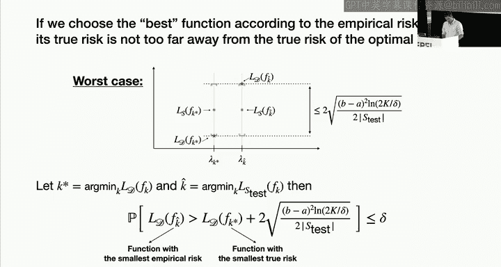

---

## 7. 交叉验证

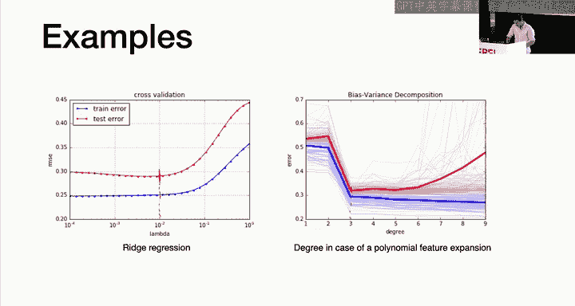

简单的训练集/测试集划分会浪费部分数据。为了提高数据利用效率，实践中广泛使用**交叉验证**方法。

### 7.1 K折交叉验证流程

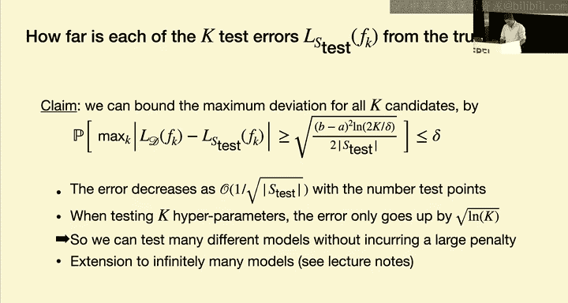

以下是K折交叉验证的步骤：
1.  将数据集S**随机**划分为K个大小近似相等的子集（折）`S₁, S₂, ..., S_K`。
2.  对于每一折 `i = 1 to K`：
    *   将 `S_i` 作为**验证集**。
    *   将其他K-1折的数据合并，作为**训练集**。
    *   在训练集上训练模型，并在验证集 `S_i` 上计算误差 `E_i`。
3.  最终的交叉验证误差估计是K次验证误差的平均值：`CV_error = (1/K) Σ_{i=1}^{K} E_i`。

### 7.2 优势与注意事项

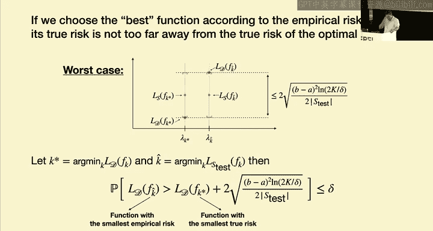

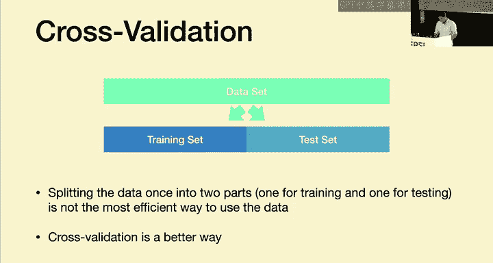

*   **优势**：每个数据点都既被用于训练，也被用于验证一次，数据利用率高，评估结果通常更稳定。
*   **复杂度**：需要训练模型K次，计算成本是单一训练的K倍。
*   **模型选择**：我们可以对每个候选超参数λ计算其CV_error，然后选择平均验证误差最小的λ。
*   **最终模型**：在选出最佳λ后，通常会使用全部数据重新训练一个最终模型。

---

## 8. 总结

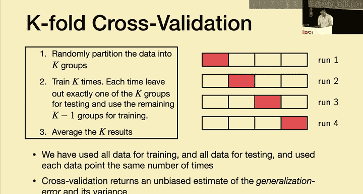

本节课中我们一起学习了机器学习中关于评估与选择模型的核心知识。

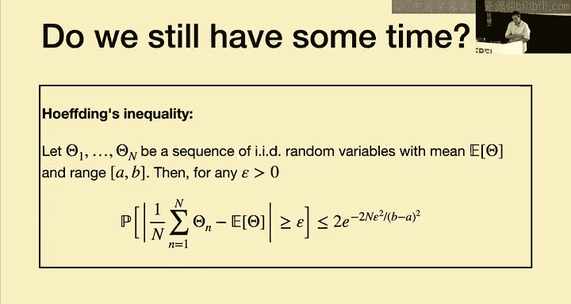

我们首先定义了**泛化误差**作为衡量模型性能的根本指标，并指出了其不可直接计算的困难。为此，我们引入了**经验误差**作为估计，并强调了**训练误差**因其与模型的依赖性而不能用于可靠评估。

为了解决评估问题，我们介绍了**训练集/测试集划分**的方法，并利用**霍夫丁不等式**从理论上给出了泛化误差的**概率性上界**，为模型性能提供了可量化的保证。

接着，我们将理论扩展到**模型选择**场景，证明了通过最小化测试误差来选择超参数是有效的，选出的模型性能与理论最优的差距是可控的。

最后，我们简要介绍了更高效的**K折交叉验证**方法，它通过多次训练-验证循环来更充分地利用数据，以获得更稳健的模型性能估计。

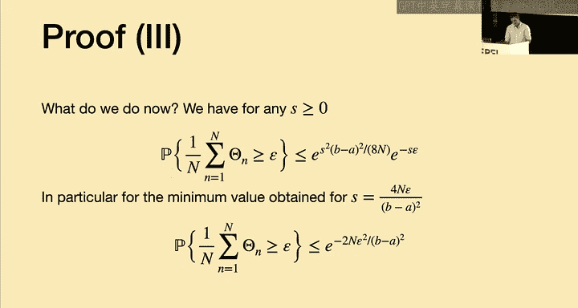

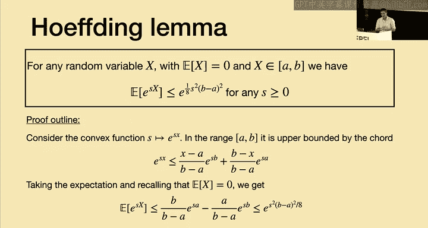

理解泛化、验证和模型选择是构建实用、可靠机器学习系统的基石。这些概念将贯穿于后续所有更复杂的模型（如分类器、神经网络）的学习与使用过程中。