# 11：偏差-方差分解 📊

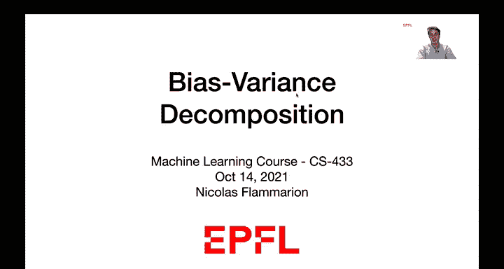

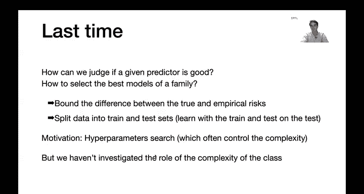

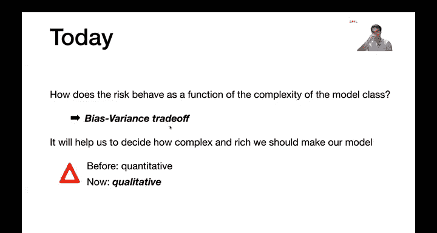

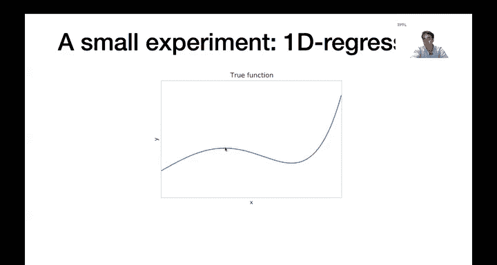

在本节课中，我们将学习一个机器学习中的核心概念：偏差-方差分解。我们将探讨模型复杂度如何影响预测性能，并理解为什么有时简单的模型表现不佳，而过于复杂的模型也可能存在问题。我们将通过一个具体的回归例子，并推导出总风险的数学分解，从而清晰地看到偏差、方差和噪声这三个组成部分。

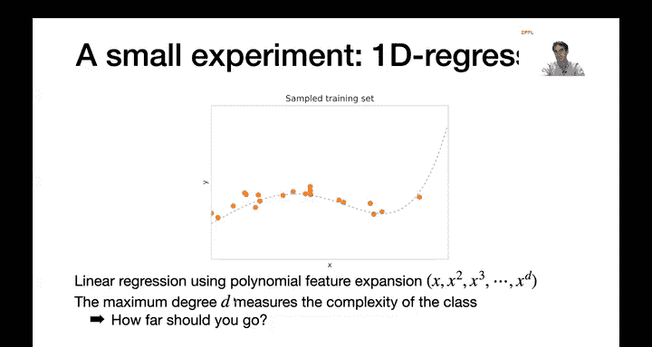

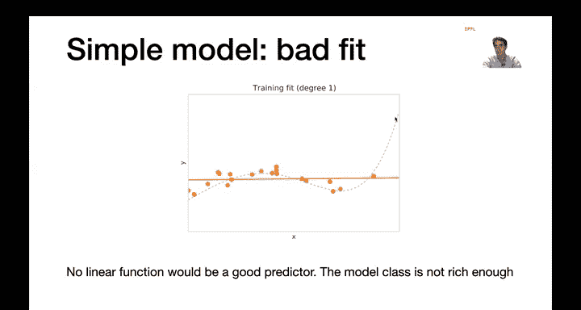

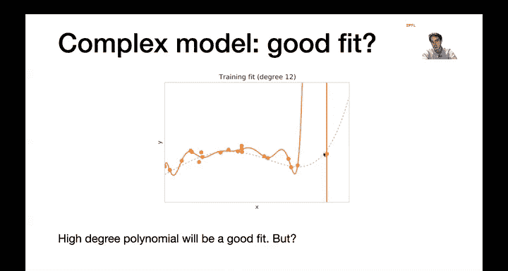

上一节我们讨论了如何通过训练集和测试集来评估模型性能。本节中，我们将深入分析模型复杂度对泛化误差的影响。

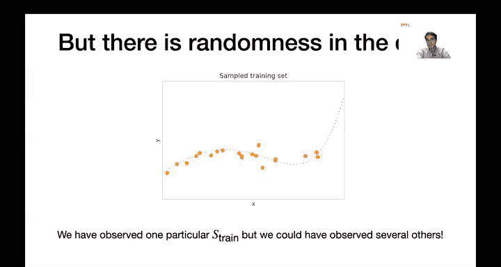

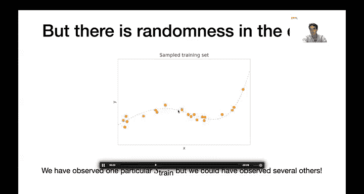

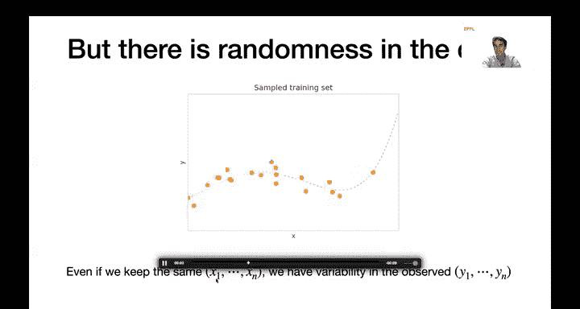

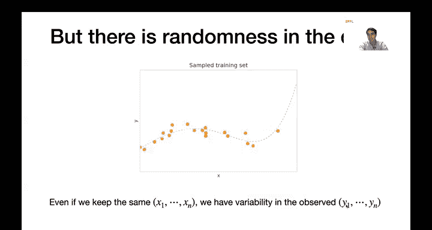

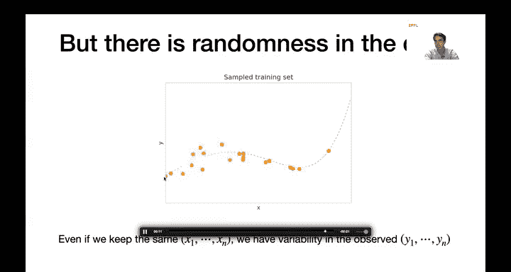

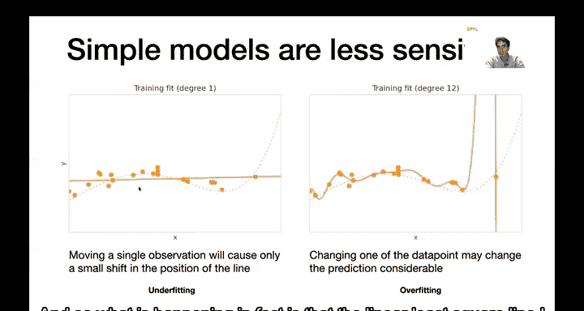

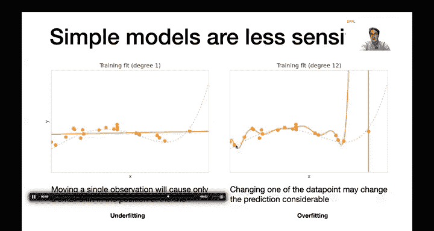

## 引言：模型复杂度的挑战

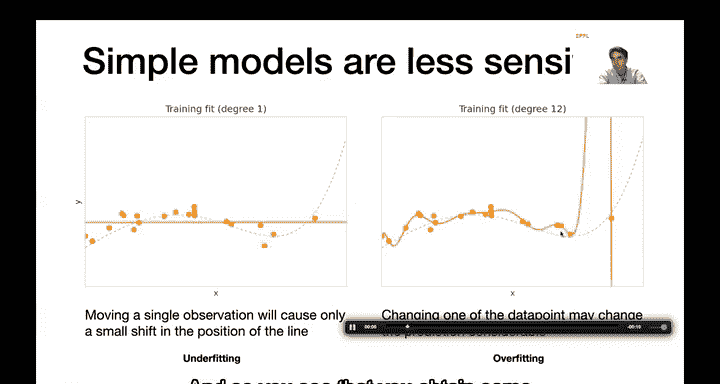

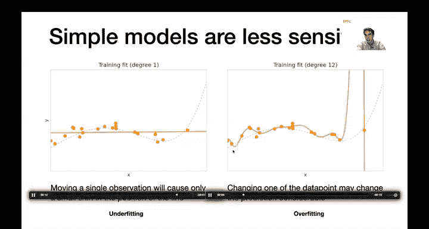

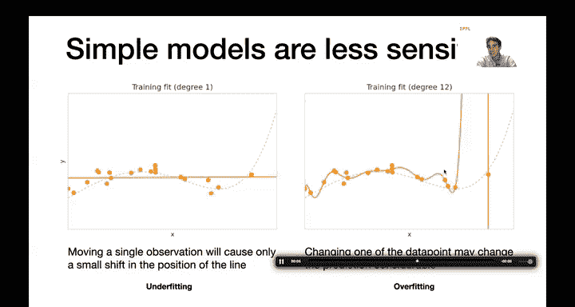

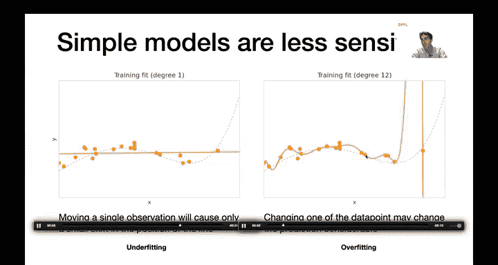

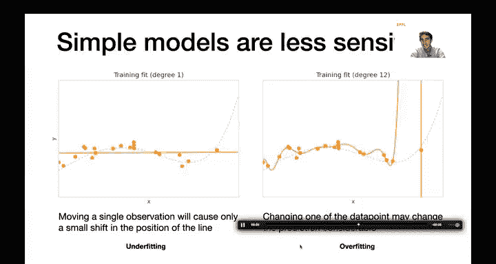

我们面临一个核心问题：如何为我们的问题选择合适复杂度的模型？例如，在多项式回归中，我们应该使用一次多项式（线性模型）还是九次多项式？模型的最大阶数 `D` 决定了模型类的复杂度。`D` 值小，模型简单；`D` 值大，模型复杂。

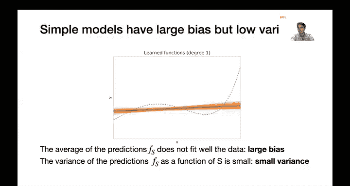

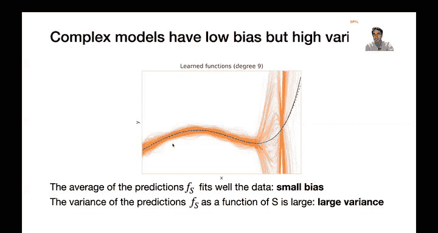

以下是两种极端情况：
*   **模型过于简单（如 `D=1`）**：模型无法捕捉数据中的潜在模式（例如非线性关系），导致对数据的拟合不佳。
*   **模型过于复杂（如 `D=9`）**：模型可以完美拟合训练数据（训练损失接近零），但其预测函数对训练数据中的随机噪声过于敏感，导致在新数据上表现不稳定。

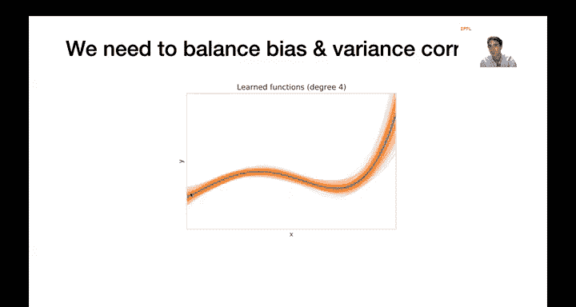

为了理解这种现象，我们需要考虑数据本身的随机性。我们观察到的数据 `y` 是真实函数值 `f(x)` 加上随机噪声 `ε` 的结果：`y = f(x) + ε`。即使真实函数 `f` 是固定的，不同的训练集（由于噪声不同）也会产生不同的预测函数。

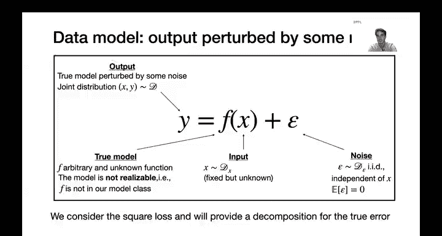

## 偏差-方差分解的推导

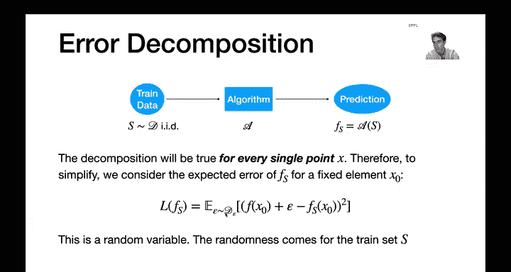

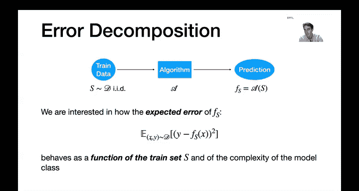

我们的目标是分析期望风险如何随训练集 `S` 和模型复杂度变化。我们固定一个测试点 `x₀`，并考察预测函数 `f_S` 在该点的期望平方误差。

我们假设以下数据生成模型：
*   `x` 服从某个固定但未知的分布。
*   `y = f(x) + ε`，其中 `f` 是未知的真实函数。
*   噪声 `ε` 均值为零（`E[ε] = 0`），方差为 `Var(ε)`，且与 `x` 独立。

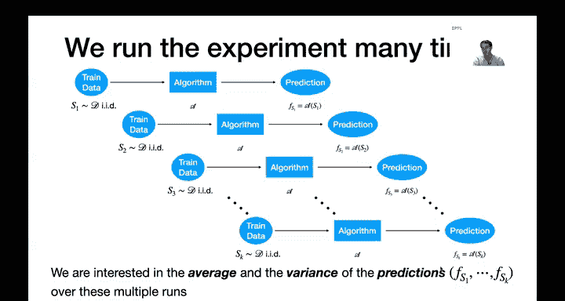

学习算法 `A` 根据训练集 `S` 给出预测函数 `f_S`。在点 `x₀` 的期望损失（风险）为：
`L(f_S) = E_ε[(y - f_S(x₀))²]`，其中 `y = f(x₀) + ε`。

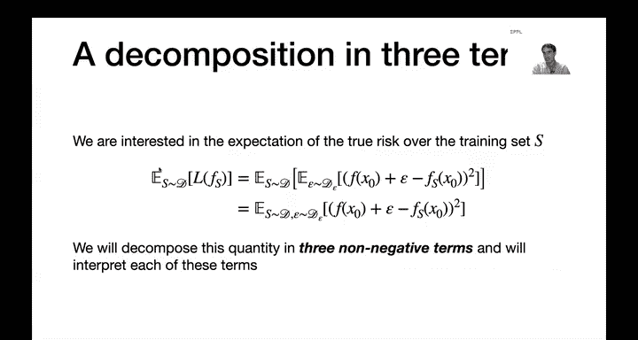

我们关心的是这个风险在不同训练集上的平均表现，即 `E_S[L(f_S)]`。通过数学推导，我们可以将此期望风险分解为三个非负项之和：

**期望风险 = 噪声方差 + (偏差)² + 方差**

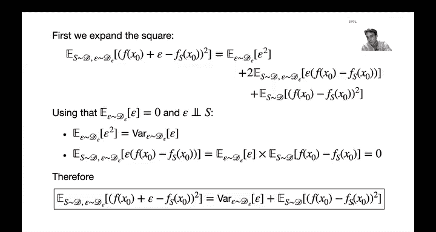

具体公式如下：
`E_S[L(f_S)] = Var(ε) + (f(x₀) - E_S[f_S(x₀)])² + E_S[(f_S(x₀) - E_S[f_S(x₀)])²]`

接下来，我们详细解释每一项的含义。

## 分解项的解读

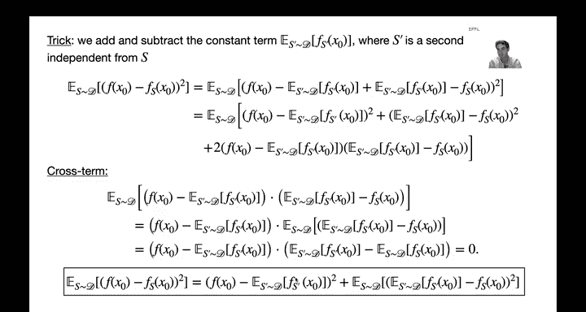

### 1. 噪声方差 (Irreducible Error)
`Var(ε)` 项代表了数据中无法消除的随机噪声。即使我们知道了真实函数 `f`，预测误差的期望也不会低于这个值。它给出了模型性能的理论下限。

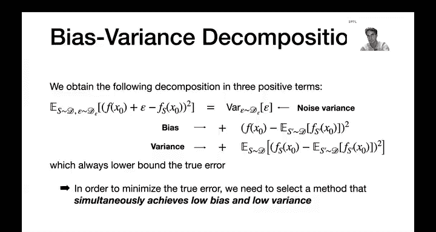

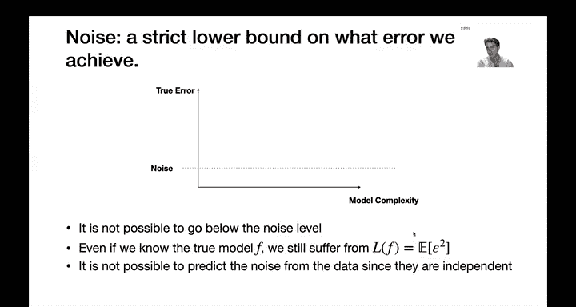

### 2. 偏差² (Bias)
`(f(x₀) - E_S[f_S(x₀)])²` 项衡量了**平均预测**与**真实值**之间的差距。它反映了模型由于本身过于简单而无法捕捉真实关系所导致的系统性误差。
*   **高偏差**：模型“欠拟合”，平均预测偏离真实值较远。通常发生在模型复杂度较低时。
*   **低偏差**：模型足够灵活，平均预测接近真实值。通常需要较高的模型复杂度。

### 3. 方差 (Variance)
`E_S[(f_S(x₀) - E_S[f_S(x₀)])²]` 项衡量了**单个预测函数**相对于**平均预测函数**的波动程度。它反映了模型对训练集中特定随机性的敏感度。
*   **高方差**：模型“过拟合”，训练数据的微小变化会导致预测函数的巨大改变。通常发生在模型复杂度过高时。
*   **低方差**：模型预测稳定，不同训练集得到的预测函数彼此接近。通常发生在模型复杂度较低时。

## 偏差-方差权衡

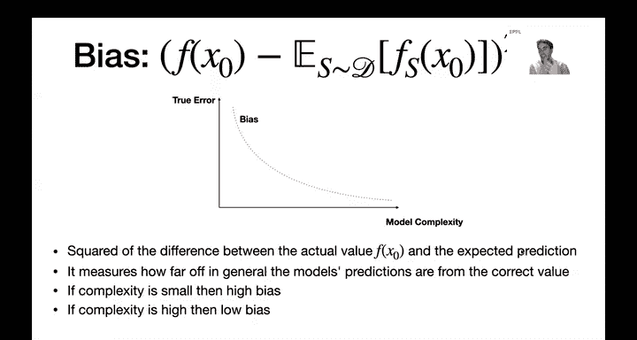

总风险是偏差、方差和噪声之和。噪声是固定不可控的，因此我们的目标是最小化偏差和方差之和。然而，偏差和方差通常随模型复杂度变化趋势相反，形成**权衡**关系。

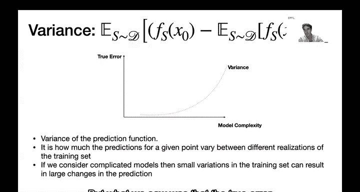

以下是模型复杂度对各项的影响：
*   **低复杂度模型**：高偏差，低方差。
*   **高复杂度模型**：低偏差，高方差。
*   **最优复杂度**：存在于中间某点，此时偏差和方差之和最小，总风险最低。

这种关系通常导致总风险曲线呈U形。选择模型的任务就是在偏差和方差之间找到最佳平衡点，使总期望风险最小化。

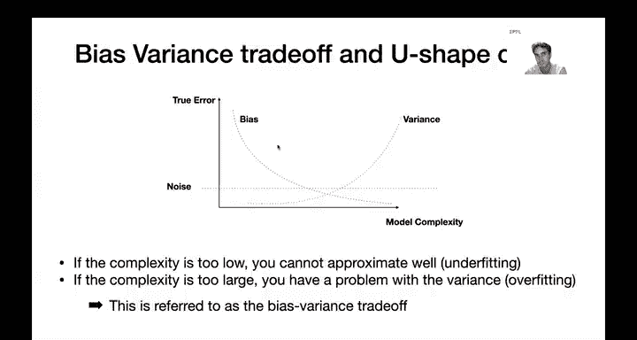

## 现代机器学习中的新现象

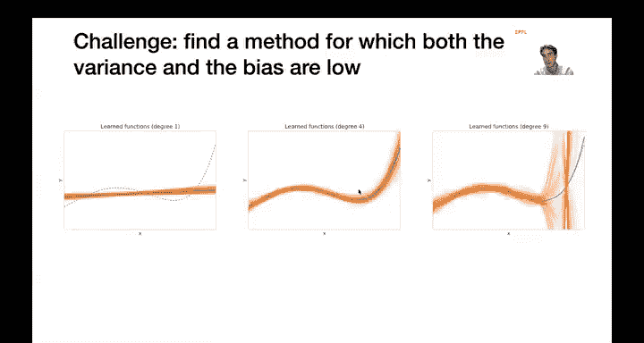

需要指出，上述经典的偏差-方差权衡描述主要适用于参数数量适中或少于样本数的“欠参数化”模型。在现代深度学习领域，我们经常使用“过参数化”模型（参数远多于样本）。

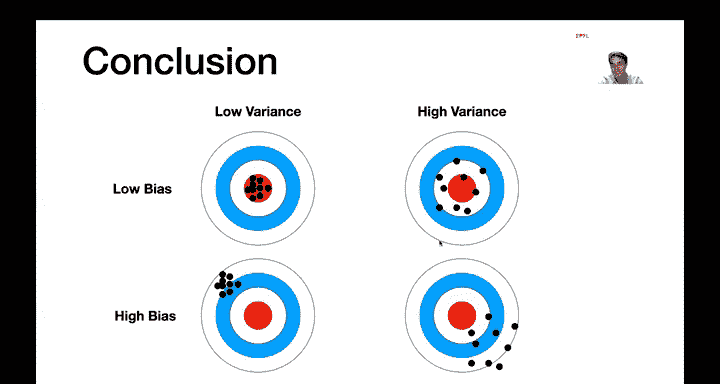

有趣的是，在这些极其复杂的模型中，有时会出现“双重下降”现象：随着模型复杂度增加到远超插值点（训练误差为零），测试风险会再次下降，甚至低于经典权衡理论预测的最优风险。这被称为“良性过拟合”，是当前研究的热点。它表明，对于特定的模型族（如深度神经网络）和优化算法（如随机梯度下降），偏差-方差关系可能比经典理论描述更为复杂。

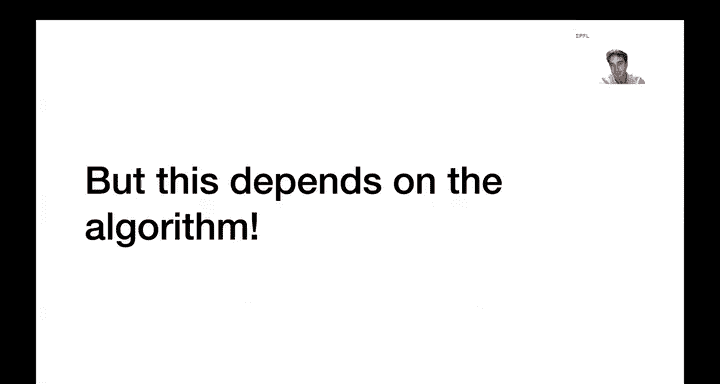

## 总结

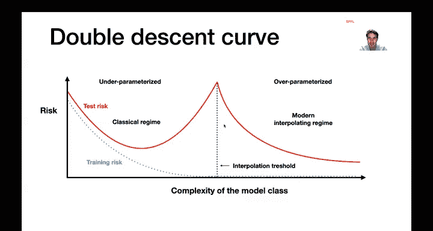

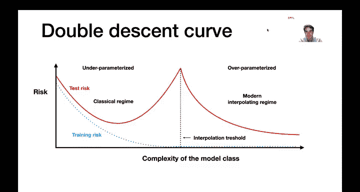

本节课我们一起学习了偏差-方差分解。我们了解到，模型的泛化误差可以分解为不可约的噪声、偏差和方差三部分。偏差衡量了模型的系统性误差，方差衡量了模型对数据扰动的敏感性。在模型选择中，我们面临着偏差与方差的权衡，目标是通过选择合适的模型复杂度来最小化总误差。最后，我们也了解到在深度学习等现代范式中，这种经典关系可能会有新的表现形式。理解这一概念对于诊断模型问题和指导模型设计至关重要。