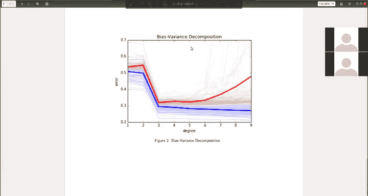

# 12：练习4 - 入门指南 📚


在本节课中，我们将学习如何执行交叉验证，并利用它来选择最佳模型。我们还将探究一个称为偏差-方差分解的现象。

## 概述 📋

本次练习将引导你完成交叉验证的实现过程。你需要使用之前在练习2和练习3中编写的代码，并将其应用到新的函数中，以评估不同模型参数下的性能。

## 准备工作 🛠️

在开始之前，你需要复制之前练习中的代码。

以下是需要复制的函数：
*   从练习2复制的**最小二乘法函数**。
*   从练习3复制的**岭回归函数**。
*   用于**分割数据**的函数。

请将这些函数复制到本次练习指定的文件中。

## 实现交叉验证函数 🔧

上一节我们介绍了准备工作，本节中我们来看看如何实现核心的交叉验证函数。

你需要填写 `cross_validation` 函数中的代码。此函数旨在计算对应于一个子组的训练误差和测试误差。

该函数接收以下输入：
*   `y` 值和 `x` 值（整个训练数据）。
*   一组索引 `k_indices`，代表第 `k` 个子组。
*   回归参数 `lambda`。
*   用于多项式回归的阶数 `degree`。

`k_indices` 对应的子组应作为**测试数据集**。所有其他不在 `k_indices` 中的索引应作为**训练数据集**。

使用这个测试和训练数据集，你应该运行一个指定 `degree` 和 `lambda` 参数的**多项式岭回归**。

然后，计算训练损失和测试损失，并将其作为输出返回。

**核心计算步骤**可以用伪代码描述如下：
```python
# 1. 根据 k_indices 分割数据
x_train, y_train = x[~k_indices], y[~k_indices]
x_test, y_test = x[k_indices], y[k_indices]

# 2. 构建多项式特征（假设有 expand_features 函数）
phi_train = expand_features(x_train, degree)
phi_test = expand_features(x_test, degree)

# 3. 使用岭回归求解权重 w
w = ridge_regression(phi_train, y_train, lambda_)

# 4. 计算均方误差 (MSE)
train_loss = mean_squared_error(y_train, phi_train @ w)
test_loss = mean_squared_error(y_test, phi_test @ w)
```

## 评估正则化参数 λ 的影响 📊

接下来，我们将使用上面实现的函数来评估不同正则化参数 `lambda` 的影响。

我们将运行一个 **7阶** 的多项式岭回归，并让正则化参数 `lambda` 在 `10^{-4}` 到 `1` 的范围内变化。

对于每个 `lambda` 值，我们将执行 **4折交叉验证**。这意味着将数据集分成4部分，并调用 `cross_validation` 函数4次，每次使用不同的部分作为测试集。

以下是执行流程：
1.  将数据随机分成4个折叠。
2.  对于每个 `lambda` 值，进行4折交叉验证。
3.  存储每次折叠得到的训练和测试误差。

正确实现代码后，你应该能看到一个类似的图表。请注意，由于交叉验证的数据分割是随机的，你的图表可能不会与示例完全一致。

## 评估多项式阶数的影响 🔬

在第二部分，我们将改变多项式回归的阶数，观察其影响，而不是改变正则化参数 `lambda`。

代码结构与之前非常相似。我们将反复调用 `cross_validation` 函数，计算训练和测试误差的均值。

我们将使用 **100 次不同的数据分割** 来运行交叉验证，并绘制随着多项式阶数增加，训练误差和测试误差的变化情况。

你应该能得到一个类似的图表。图中：
*   **粗线** 代表这100次重复交叉验证的**均值**。
*   **细线** 代表每次单独的运行结果。

每种颜色的细线分布范围代表了**方差**，而粗线代表了**均值**。请注意方差如何随着阶数的增加而变化。

## 扩展任务 💡

本次练习还包含一些扩展问题，要求你不仅计算交叉验证的**平均误差**，还要计算这些误差的**方差**。这有助于更深入地理解模型的稳定性。

## 总结 🎯

本节课中我们一起学习了：
1.  **交叉验证** 的基本原理和实现方法，包括如何分割数据、训练模型并计算误差。
2.  如何利用交叉验证来**评估不同模型参数**（如正则化强度 `lambda` 和多项式阶数 `degree`）对模型性能的影响。
3.  通过可视化结果，观察了模型复杂度变化时，**训练误差与测试误差的关系**以及**误差方差的变化**，这直接关联到偏差-方差分解的概念。




希望这些练习能帮助你巩固对模型选择和评估的理解。我们周四见！