# 13：分类问题入门 🎯

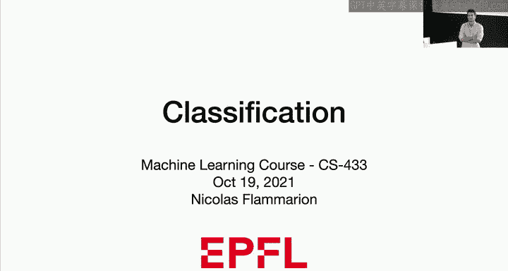

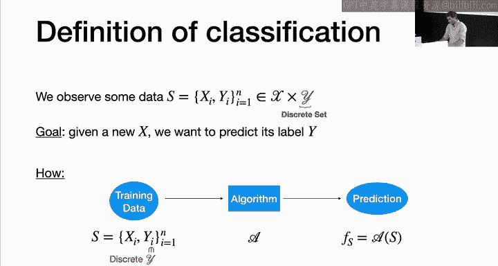

在本节课中，我们将要学习机器学习中的核心任务之一：分类。我们将从定义分类问题开始，探讨其与回归问题的区别，并介绍几种基础的分类方法。

## 概述 📋

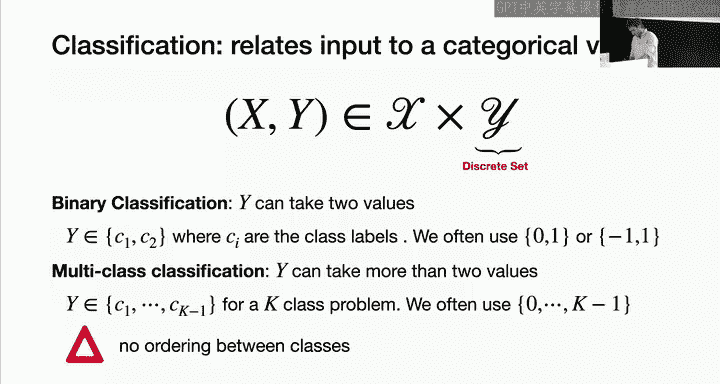

分类是监督机器学习中继回归之后最基础的任务之一。与回归不同，分类的输出变量是离散的、类别型的。本节课我们将介绍分类问题的基本框架、核心挑战以及几种初步的解决方法。

## 什么是分类？ 🤔

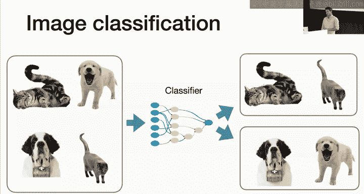

在监督机器学习中，我们观察一个数据集 **S**，它包含输入 **X_i** 和输出 **Y_i**。分类问题的主要区别在于，输出 **Y** 属于一个离散的集合 **Y**。

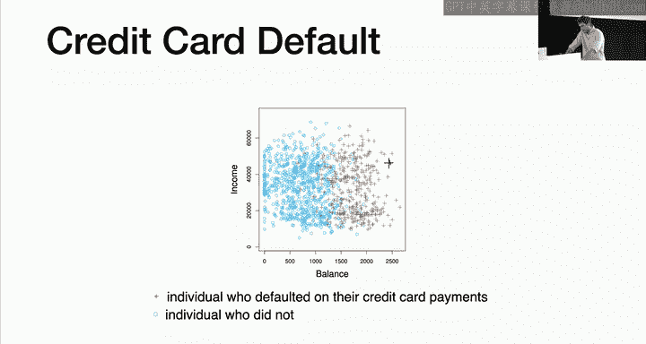

**目标**：给定一个新的输入 **X**，预测其对应的标签 **Y**。

这与回归的框架完全相同，核心区别在于输出变量是类别型的，只能取离散值。

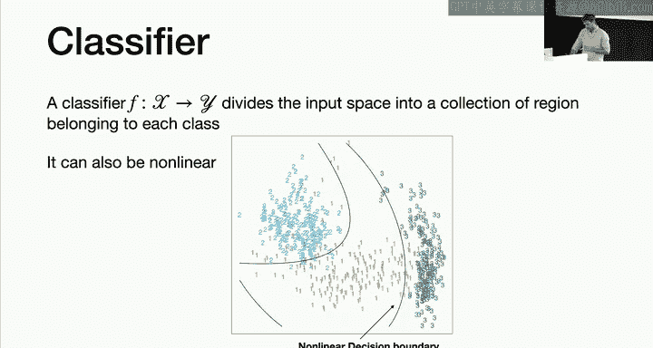

### 二元分类与多元分类

*   **二元分类**：输出 **Y** 只能取两个值，例如两个类别 **C1** 和 **C2**。我们通常用 `0` 和 `1` 或 `-1` 和 `1` 来命名这些类别。重要的是，这些数字仅仅是标签，**没有顺序关系**（例如，`0` 并不比 `1` “小”）。
*   **多元分类**：输出 **Y** 可以取 **K** 个不同的值，对应 **K** 个类别，例如 `0` 到 `K-1`。

## 分类问题示例 📧🐱🐶

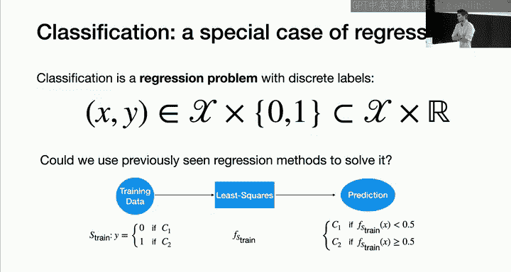

以下是几个分类问题的典型例子：

*   **垃圾邮件检测**：输入是一封邮件，输出是“正常邮件”（类别1）或“垃圾邮件”（类别0）。标签 `0` 和 `1` 可以互换，不影响问题本质。
*   **图像分类**：输入是一张图片，输出是图片内容的标签，例如“猫”或“狗”。
*   **信用卡违约预测**：输入是客户的收入、信用余额等特征，输出是客户“会违约”（类别1）或“不会违约”（类别0）。通过历史数据，我们可以学习一个模型来预测新客户的违约风险。

## 分类器与决策边界 📐

分类器是一个函数，它将输入空间 **X** 映射到输出集合 **Y**。它的作用是将输入空间划分为属于不同类别的区域。

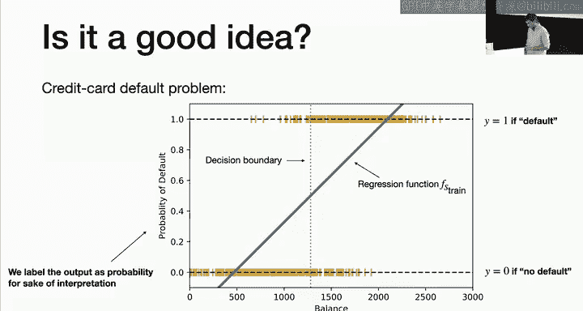

*   **决策边界**：这些区域之间的分界线。当输入跨越决策边界时，预测的类别就会改变。
*   **线性分类器**：决策边界是线性的（在二维空间中是直线，高维空间中是超平面）。
*   **非线性分类器**：决策边界是非线性的。值得注意的是，通过特征变换（例如多项式扩展），一个在扩展特征空间中的线性分类器，在原始特征空间中可能表现为非线性分类器。

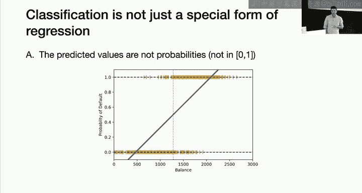

上一节我们介绍了分类问题的基本定义和示例，本节中我们来看看能否用回归的方法来解决分类问题。

## 将分类视为回归：可行吗？ ⚠️

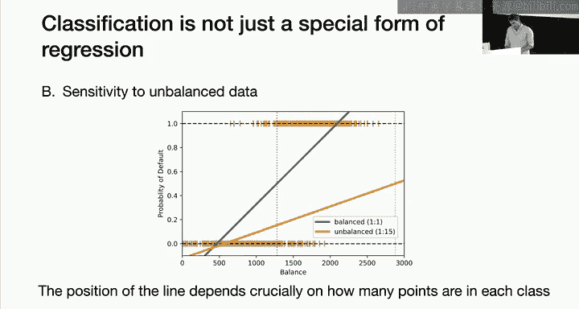

由于分类可以看作是输出受限的回归问题，一个自然的想法是：能否直接使用回归技术（如最小二乘法）来解决分类问题？

**思路**：
1.  将类别标签数值化（例如，类别0设为 `0`，类别1设为 `1`）。
2.  使用最小二乘法拟合数据，得到一个线性模型 **f(x) = w^T x**。
3.  对于新样本 **x**，计算 **f(x)**，并通过一个阈值（如 `0.5`）将其转换为类别预测：若 **f(x) > 0.5** 则预测为类别1，否则预测为类别0。

### 存在的问题

尽管直观，但这种方法存在几个严重问题：

1.  **概率解释不合理**：最小二乘法的预测值 **f(x)** 可能不在 `[0, 1]` 区间内，难以解释为概率。
2.  **对类别不平衡敏感**：当两类样本数量差异巨大时，最小二乘拟合的直线会严重偏向多数类，导致决策边界不合理，对少数类的预测效果很差。
3.  **对“简单”样本敏感**：在分类中，那些特征值极端且标签明确的样本（如债务极高且违约的客户）是“简单”样本，应能轻松预测正确。但在最小二乘中，这些点会像回归中的“离群值”一样，显著地拉动拟合直线，扭曲决策边界。
4.  **损失函数不匹配**：分类的核心目标是**最小化错误分类的数量**。而最小二乘的平方损失函数惩罚的是预测值与标签 `0/1` 之间的数值差距，这与我们关心的“对/错”度量并不一致。一个预测函数可能有较大的均方误差，但仍然是一个好的分类器。

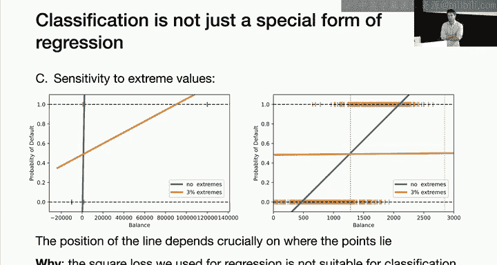

因此，我们需要为分类问题设计专门的方法。

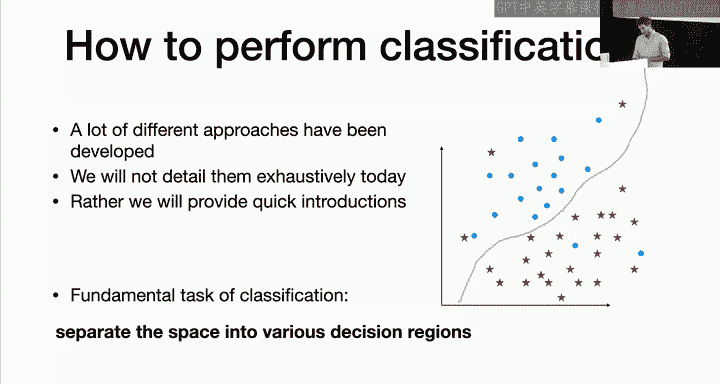

## 分类方法初探 🗺️

解决分类问题的核心是为输入空间找到决策边界，将其划分为不同的决策区域。本节课我们将简要介绍几种基础方法，后续课程会深入分析。

### 1. 最近邻法 👑

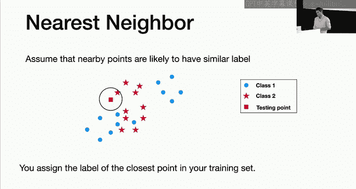

最近邻法基于一个核心假设：在特征空间中相近的样本，其类别标签也 likely 相同。

**算法**：对于一个新样本点 **x**，在训练集中找到与它距离最近的样本，然后将该最近邻的标签赋予 **x**。

以下是最近邻法的优缺点：

*   **优点**：
    *   无需训练/优化过程。
    *   易于理解和实现。
    *   在低维空间中，能拟合非常复杂的决策边界。
*   **缺点**：
    *   **预测时速度慢**：每次预测都需要计算与所有训练样本的距离，复杂度为 **O(N)**，其中 **N** 是训练集大小。
    *   **高维灾难**：在高维空间中，数据点之间平均距离很大，很难找到真正“邻近”的样本，导致预测不准。
    *   **距离度量选择关键**：使用不同的距离度量（如欧氏距离、曼哈顿距离）会得到不同的结果。

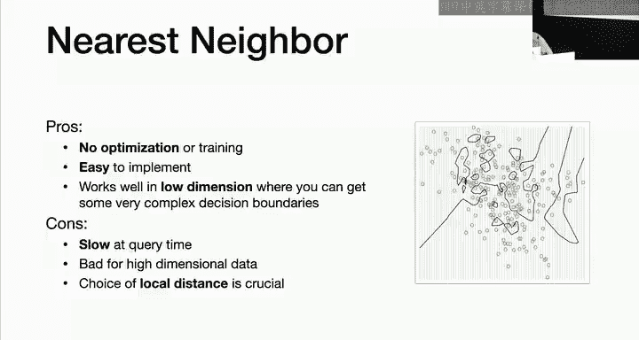

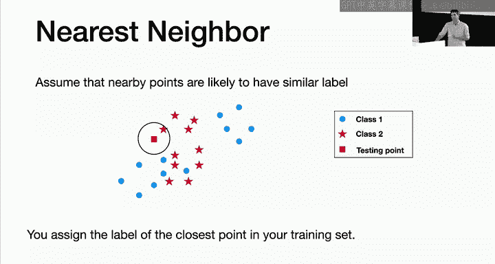

#### K近邻法

一个自然的扩展是考虑 **K 个**最近邻，而不仅仅是一个。

**算法**：对新样本 **x**，找出训练集中距离最近的 **K** 个点，然后通过**投票**决定 **x** 的类别（即这 **K** 个点中占多数的类别）。

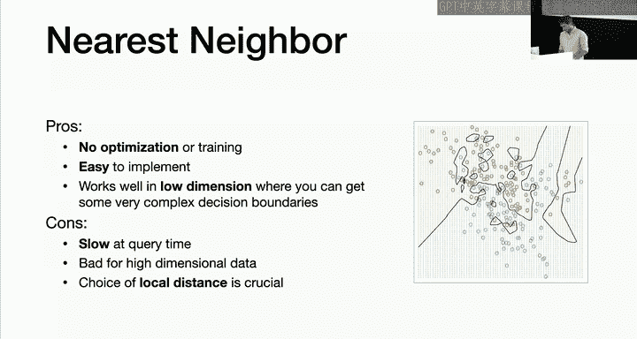

*   **平滑核方法**：可以进一步为不同距离的邻居赋予不同的权重，距离越近权重越高。

K近邻法引入了超参数 **K**，其选择涉及到偏差-方差权衡，我们将在后续课程中讨论。

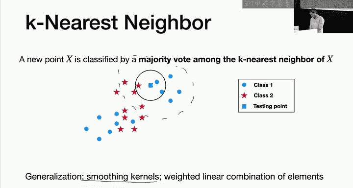

### 2. 线性分类器与最大间隔超平面 📏

另一种思路是假设决策边界是线性的（一个超平面）。对于样本 **x**，预测规则为：
**预测类别 = sign( w^T x )**
其中 **sign** 是符号函数。若结果为正，预测为一类；为负，则预测为另一类。（注：通常会增加偏置项 **w0**，或通过添加常数特征 `1` 来实现）。

#### 线性可分与最大间隔

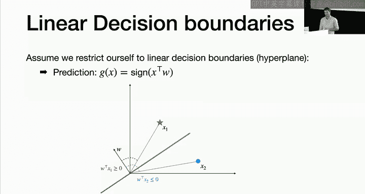

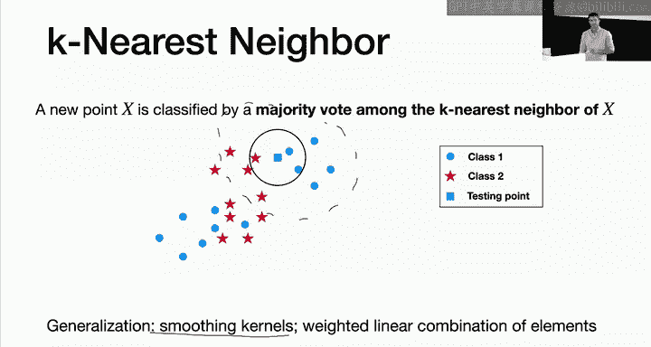

当存在一个超平面能完美分开所有训练样本时，我们称数据是**线性可分**的。此时，这样的超平面通常有很多个。

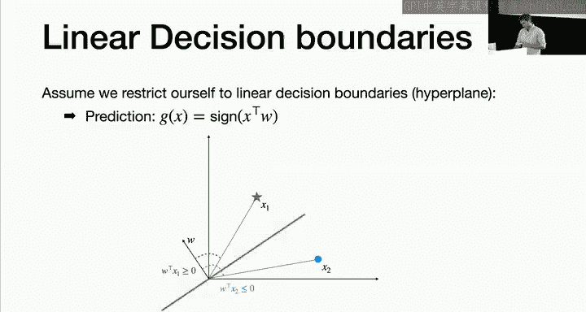

**问题**：应该选择哪一个？

**答案**：选择**最大间隔超平面**。间隔定义为超平面到所有训练样本的最小距离。最大化这个间隔的超平面被认为是最鲁棒的，因为它对数据中的小扰动和噪声最不敏感，泛化能力通常更好。

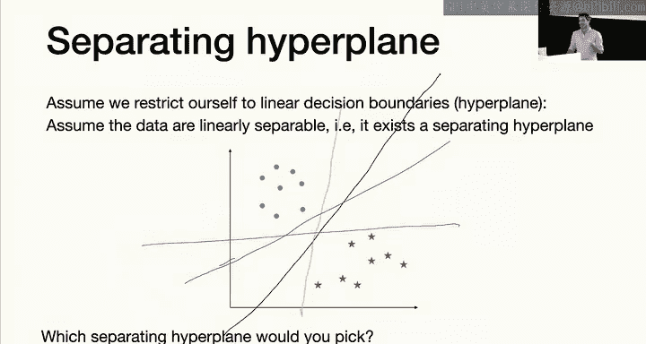

支持向量机（SVM）就是寻找（或近似寻找）最大间隔超平面的经典算法，我们将在后续课程中详细讲解。逻辑回归在某种意义上也与最大间隔的思想相关。

### 3. 引入非线性：特征变换 🌀

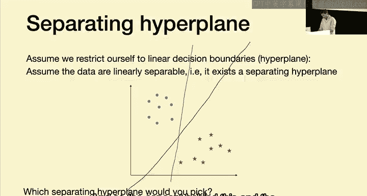

对于非线性可分的数据，线性分类器表现会很差。与回归类似，我们可以通过**特征变换**引入非线性。

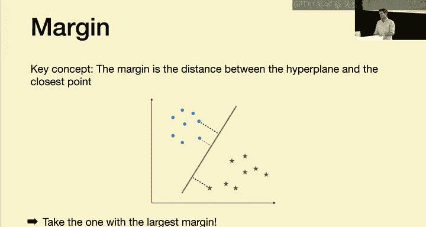

**方法**：将原始特征 **x** 映射到更高维的特征空间 **φ(x)**（例如，添加多项式特征 `x^2`, `x^3`, `x1*x2` 等）。然后在这个新的高维空间中学习一个线性分类器。当把这个线性决策边界映射回原始特征空间时，它就变成了非线性的。

**挑战**：直接进行特征变换可能会显著增加计算复杂度（维度灾难）。

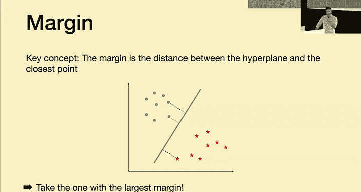

**解决方案（后续课程）**：核方法。它允许我们在极高维（甚至无限维）的特征空间中隐式地工作，而无需显式计算这些特征，从而避免了计算成本激增的问题。

## 分类的理论基础：贝叶斯最优分类器 🧠

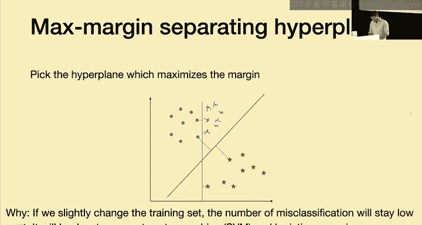

最后，我们从理论角度探讨分类问题的极限性能。我们假设数据 `(X, Y)` 服从某个未知的联合分布 **D**。

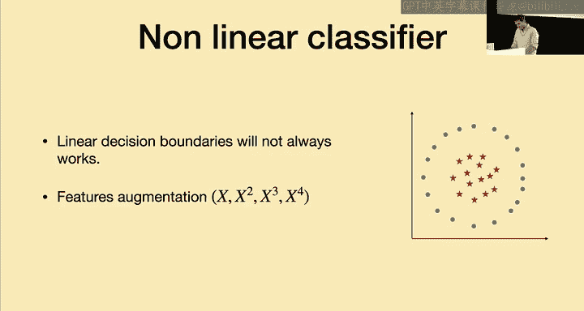

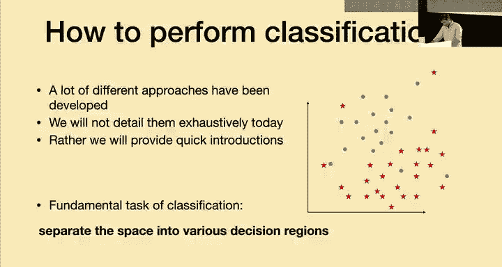

### 分类损失与风险

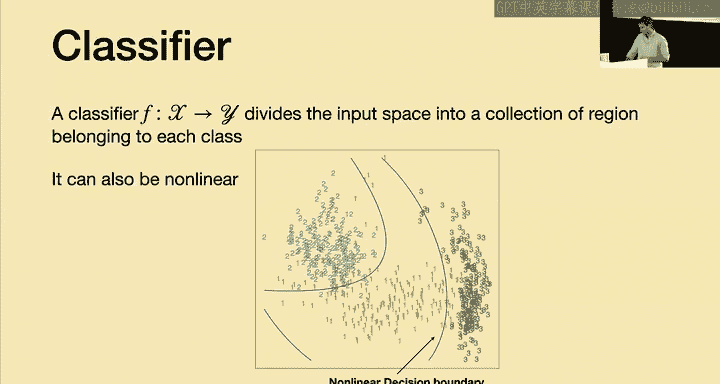

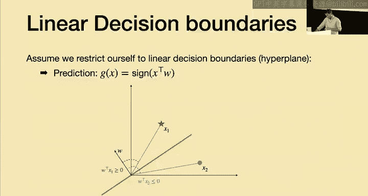

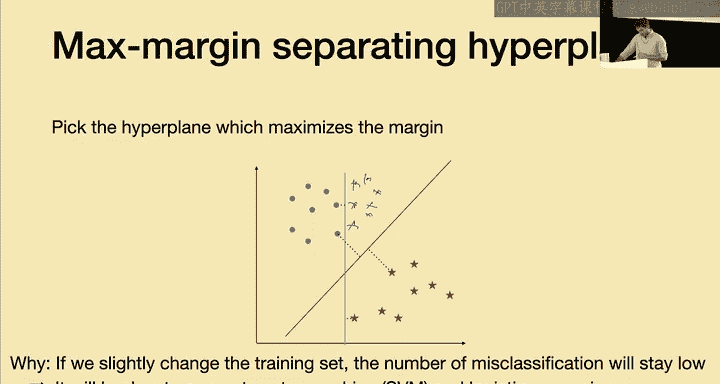

对于分类问题，最自然的损失函数是 **0-1 损失**：
**L(y, y') = 1 如果 y ≠ y'，否则为 0**
其中 `y` 是真实标签，`y'` 是预测标签。

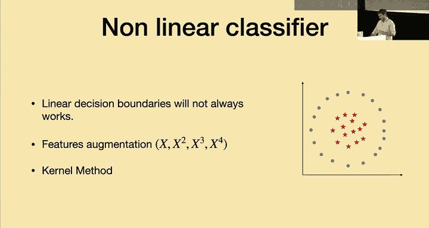

分类器 **g** 的**真实风险**（泛化误差）是该损失的期望：
**R(g) = E[ L(Y, g(X)) ] = P( Y ≠ g(X) )**
这正好就是分类器出错的概率。

### 贝叶斯最优分类器

在所有可能的分类器中，那个能最小化真实风险 **R(g)** 的分类器，称为**贝叶斯最优分类器** **g***。即使拥有无限数据且知道真实分布，我们也不能做得比它更好。

**g*** 有一个简洁的形式：对于给定的输入 **x**，它输出**后验概率最大**的那个类别。
**g*(x) = argmax_y P( Y = y | X = x )**
直观理解：对于每个 **x**，选择最可能出现的那个类别，这样平均错误率最低。

（注：课程幻灯片中提供了该结论的简要证明。）

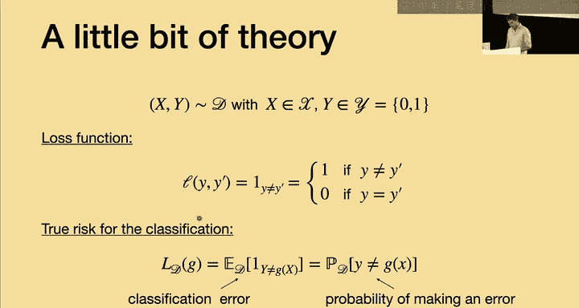

### 一个重要的理论联系

一个有趣的理论结果是：如果一个回归函数 `f(x)` 能够很好地近似条件期望 `E[Y|X=x]`（即均方误差很小），那么由它通过阈值法导出的分类器，其分类错误率也会被限定在一个较小的范围内。但这**不意味着**所有回归方法都适合做分类，它只说明均方误差很小是分类效果好的一个充分条件，而非必要条件。

## 总结 🎓

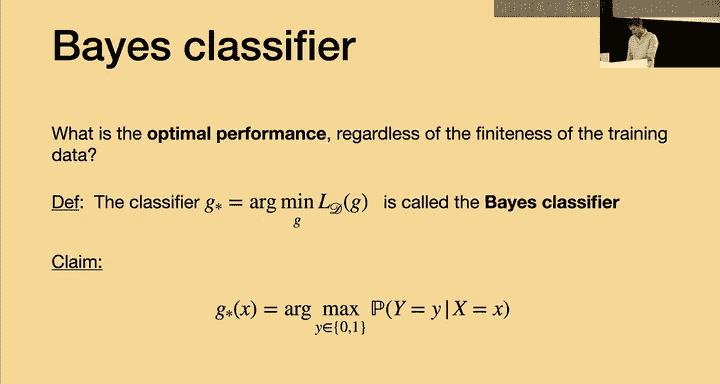

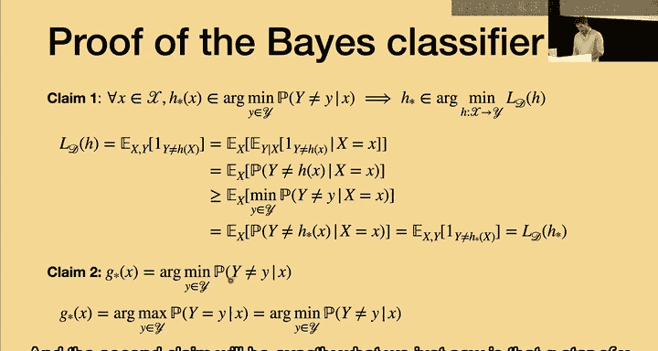

本节课中我们一起学习了：
1.  **分类问题的定义**：输出为离散类别的监督学习任务。
2.  **直接使用回归方法的缺陷**：包括概率解释不清、对不平衡数据敏感、损失函数不匹配等。
3.  **几种基础分类方法**：
    *   **最近邻法**：基于局部相似性，简单但预测慢，高维效果差。
    *   **线性分类器与最大间隔**：寻找一个分离超平面，最大间隔原则提供了鲁棒性。
    *   **特征变换**：通过将数据映射到高维空间来实现非线性分类。
4.  **分类的理论基础**：0-1损失函数、真实风险（错误率）以及理论上限——贝叶斯最优分类器。

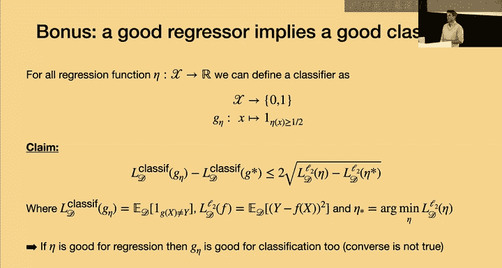

这只是分类学习的入门。在接下来的课程中，我们将深入探讨逻辑回归、支持向量机、决策树等具体算法，并分析它们的理论性质与实践应用。